# 2 DOME General Overview

DOME is an **ecosystem of federated instances of marketplaces sharing a curated digital catalogue of trusted cloud, edge and AI services**.

The concept is described in the following figure.

<figure>
    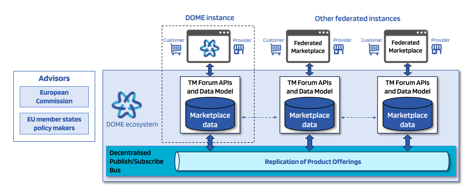
    <figcaption>Figure 2.1 - High-level overview of DOME architecture</figcaption>
</figure>

Each of the federated marketplaces in the DOME ecosystem will be operated by an independent entity, and all the instances share a common catalogue by using a decentralised replication mechanism to securely synchronise the marketplace data managed in each instance.

One of the marketplace instances in the ecosystem is special, in the sense that it is operated by the DOME Operator, a legal entity in charge of the governance of the DOME ecosystem. Except for some governance features assumed by the DOME Operator, at the technical level all instances share some characteristics described below, and the system tries to reduce to the minimum the need for centralisation.

Thanks to the common open standards adopted by the DOME ecosystem for the Trust Framework and the use of eIDAS digital signatures and data models for the description of digital service offerings and its certifications, the participants in the ecosystem can replicate the catalogue information in a trusted and scalable way, without relying in any centralised catalogue instance.

The replication mechanism is based on a Decentralised Publish/Subscribe Bus, where participants can publish events for new or modified Product Offerings, and other participants can subscribe to those events (or a subset of them) to perform the synchronisation of the new data with its own instance, if needed.

Each marketplace instance can have its own users (both Providers and Customers of services) and manage the relationship with them directly, while at the same time leveraging the mechanisms provided by DOME (like for payments) to provide additional benefits to their users.

The following figure completes the previous one with the Trust Framework, which is the base for all trusted properties of the system. DOME adopts the same APIs as the ones defined in EBSI, so all the applications and subsystems using the Trust Framework can work on top of any compatible implementation (including, of course, the EBSI blockchain network itself). The main components of the Trust Framework are:

- The Trusted Participants list is a decentralised list with the identities of the organisations in the DOME ecosystem. It is very important to note that only public information is stored there, and specifically no PII (Personally identifiable information) is managed.

- The Trusted Issuers list contains the identities of the organisations that can issue Verifiable Credentials that are accepted by DOME. The list also has the types of Verifiable Credentials that those trusted organisations can issue. This list includes only the organisations that are not already included in some external Trust Framework, like the eIDAS or Gaia-X Trust Frameworks.

- The Trusted Schemas list contains the list of schemas (data models) of Verifiable Credentials used in the DOME ecosystem (like the LEARCredential, which is used to enable employees of the participating organisations to login in the DOME Marketplace).

- The Trusted Events component is used for registering and publishing the events and logs which are at the base of the replication of the Product Offerings. It is important to note that the actual data is stored outside of the Trusted Events component, and that this component includes essentially the evidence (metadata with hashes and signatures) which is required for the trusted implementation of the replication of data.

| 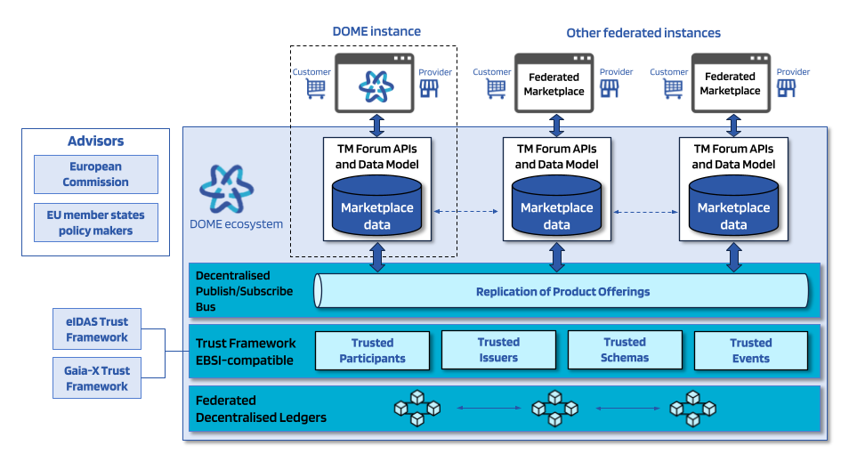 |
|----|
| *Figure 2.2 - High-level overview of DOME architecture (2)* |

The Trust Framework of DOME is implemented on top of a federation of blockchain networks which are operated independently of DOME. The blockchain networks used must comply with the EU values and regulation, and in the near future it may include the EBSI blockchain network (whenever it enters into production).

The following subsections elaborate on the roles that organisations can play with respect to DOME as well as some details of the technical architecture.

## 2.1 Overview of roles in DOME

Six different roles can be played by organisations involved in the ecosystem created around DOME as illustrated in Figure 2.3: **cloud and edge service providers**, **marketplace providers**, **customers**, **operators of the DOME technical infrastructure**, **third parties capable of integrating and offering their services complementing those implemented in the DOME technical infrastructure**, and **members of governance and supervisory bodies**.

The following subsections will introduce the mentioned roles. Governance and Supervision bodies will be described when tackling Objective \#10.

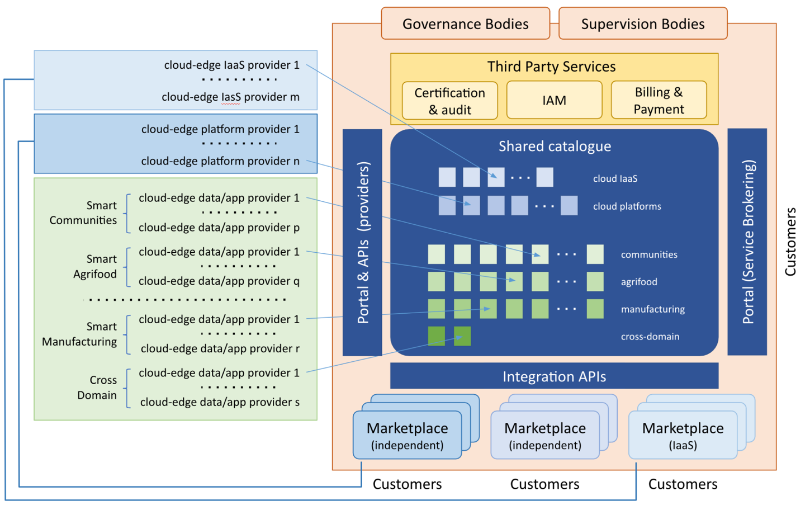

*Figure 2.3 - High-level vision of DOME architecture, operating model and roles*

### 2.1.1 Cloud and edge service providers 

Cloud and edge service providers (IaaS, platform and app/data service providers) are organisations (public institutions or private companies) that offer service products that can be consumed by customers, such as other organisations or individuals. They access the DOME provider portal where they can register and manage the description of specifications and offerings linked to their products. Product Specifications and Product Offerings associated (see section 2.2.1 Basic Information Model) with a given service from a service provider are stored in the Shared Service Catalogue that is the central part of DOME. A Product comprises a number of Services and supporting Resources (e.g., an Air Quality monitoring product for a given City may consist of an application offered as a Service from the Cloud and a number of computing resources on the Cloud plus a number of IoT devices for monitoring air quality deployed in the field).

The description of each Product Specification and Product Offering will be provided in a standard-based format prescribed in DOME. The description of a Product Specification will comprise information like the unique identifier of the product, its name, version, associated documentation, description of software services implementing the product functionality, description of resources required for execution of such software services (e.g., computing capacity, including disk storage, to be provisioned for serving each customer, or devices to be deployed on the edge), status within the lifecycle of the product (under testing, validated, active, obsolete, retired, …), etc. On the other hand, the description of a Product Offering will comprise an unique identifier, a reference to the specification of the product being offered, lifecycle status, terms and conditions associated to its use, pricing model, associated agreements (e.g., list of Service Level Agreements that users can choose from), target market segment, kind of marketplaces through which the product can be offered, etc. Both, Product Specifications and Product Offering descriptions, will comprise a number of labels issued by certification agencies in connection with the service offered that certifies compliance with defined EU regulations or rules established by supervision authorities (e.g., GDPR regulations, established regulations for specific sectors like health, energy, finance, regulations for cloud services to be established in the EU Cloud Rulebook, …), relevant standards (e.g., standards for interoperability) or best practices (e.g., Open Source Security Foundation Best Practices).

Cloud and edge data/app service providers could receive **Product Orders** from end customers directly from the DOME order management system or from marketplaces federated in DOME which have incorporated the data/app services as part of their catalogue (see description of the role of Federated Marketplaces below). Similarly, providers may receive payments through third-party payment service providers that have integrated their services directly with DOME, but they can receive such payments also from the payment services implemented by the federated marketplaces through which service orders were issued.

Through specific pages for providers of the DOME portal, cloud and edge IaaS, Platform and data/app service providers can also monitor the evolution of instances of their services for particular end users and generate different kinds of reports. In order to be able to access these specific pages for providers under the DOME portal, each cloud and edge IaaS, Platform and data/app service provider has to be registered in the eIDAS service (See objective \#2).

### 2.1.2 Federated Marketplaces

As illustrated in figure 1, different kind of marketplaces can be federated to DOME:

- **Marketplace connected to an IaaS provider**, which comprises a catalogue of cloud and edge data/app services which customers can pick and then easily deploy on top of the computing infrastructure supported by the given IaaS provider

- **Marketplace connected to a Platform provider** which comprises a catalogue of cloud and edge data/app services which customers can pick and easily activate, and will run integrated with the rest of data/app services already running for the customer on top of the provided Platform.

- **Independent Marketplace**, which comprises a catalogue of cloud and edge data/app services which are not tied to any particular IaaS or Platform provider

Examples of Marketplace connected to Platform providers would be marketplaces connected to specific application domains, like Smart Cities or a Smart Farming, or marketplaces connected to specific technology platforms, like a Spark-based platform for development of AI apps, or a Grafana-based platform for development of dashboard apps. In the case of a marketplace connected to a specific Smart City platform, the catalogue may comprise apps for Smart Parking, Smart Air Monitoring or Smart Waste Management, for example. Note that each data/app service may be hosted on a different IaaS cloud or servers and it does not need to be the same where the Platform is hosted. In the case of a Smart Farming Platform, the catalogue may comprise apps for Smart Field Watering, Smart Pesticide Spreading or Smart Silos Management. Similarly, a marketplace connected to a Spark-based platform may comprise applications for predictive maintenance of vehicles, or Weather predictions. Some of the data/app services can be provided by the Platform provider (e.g., Integrated Command and Control system in connection with Smart City Platforms, or Smart Farm Management Information System in connection with Smart Farming Platforms). Some of them may be already active by default for all customers, otherwise may require acquisition through the marketplace.

Note that a given cloud/edge service may be visible in multiple marketplaces. On the other hand, a given marketplace may only comprise a subset of the cloud and edge services listed in the DOME shared catalogue (e.g., the Marketplace connected to a concrete Smart City platform will only include data/app services relevant for cities).

Note that cloud and edge data/app services will always be visible and could be procured through DOME. However, federated marketplaces will typically bring a personalised user experience to their target customers, and also a different implementation of their own rating, billing and payment processes, even though they may rely on payment and billing services offered by third parties through DOME.

### 2.1.3 Customers

European public and private customers looking for trusted cloud and edge services will interact with DOME following one of the two following paths:

- In a very first step, accessing the DOME portal and leveraging service brokering functions of the DOME technical infrastructure to discover IaaS or platform providers which, together with their associated marketplaces can bring to them the best personalised experience. Afterwards, interacting directly through the marketplace associated with the IaaS and platform of their choice, picking the concrete cloud and edge data/app services offerings that are published through the marketplace catalogue which therefore can be seamlessly integrated with their selected IaaS/Platform to support processes of their organisation.

- Accessing the DOME portal to find cloud and edge services directly, placing and managing orders of selected services via DOME, and conducting payments via payment systems which are supported directly by the service provider or are offered by third parties connected to DOME and accepted by the selected service provider.

While the second path will be feasible, it is envisaged that the first path will be more optimal, since the consumer will benefit from a more rich and comprehensive service and user experience that IaaS/Platform providers can offer (see more in connection to Objective \#4).

### 2.1.4 Operators of the DOME technical infrastructure

During the execution of the project, a number of companies of the consortium will act as operators of the DOME technical infrastructure, ensuring the proper functioning of DOME, including security aspects. Along the duration of the project a revenue-based business model will be defined to ensure long-term sustainability of DOME evolution and operations. Such business model may imply creation of an independent company, institution or association by the operators (see description of Objective \#9).

### 2.1.5 Third parties integrating and offering complementary services 

DOME will provide means for integration of Third-party services, namely:

- Services from certification and audit agencies which will help to validate the reliability, security, and sovereignty of certain cloud services by checking/verifying their compliance with predetermined market-wide certifications (see more in description of Objective \#6).

- IAM service providers offering services aligned with open standards for IAM adopted in DOME (see more in description of Objective \#2), bringing participants the ability to securely manage identities and access to specific cloud and edge data/app services.

- Billing and Payment service providers working as gateways that rely on transaction logs registered in the federated blockchain network infrastructure underlying DOME to provide secure, transparent and trustful billing to consumers and payment to providers.

For all these three kinds of third-party services, the marketplace represents a new source of revenue, as it gives them access to a new market (the cloud and edge service providers and the customers). On the other hand, they represent potential sources of revenue for securing the sustainability of DOME.

Integration of third party IAM providers will not be required for DOME to function since DOME will already provide an implementation of the IAM framework since its very first version, with open source components that the different parties (providers, consumers, marketplaces) may integrate in their runtime environments. However, integration with third party IAM service providers that implement the same standards will be supported. On the other hand, Billing and Payment Service providers will not be required for procuring data/app services through federated marketplaces since they will typically integrate their own billing and payment systems. Integration with third party Billing and Payment service providers will be useful when data/app service providers opt for activating procurement directly through DOME. For these reasons, the ability for third party IAM, Billing and Payment service providers to integrate their services with DOME will be incorporated as one of its functions.

### 2.1.6 Members of governance and supervisory bodies

Last but not least, DOME will define suitable governance and supervisory bodies that will oversee development of the ecosystem around DOME ensuring fulfilment of its objectives (see more details in connection to objective \#10). These bodies will incorporate not only initial consortium members and representatives of relevant stakeholders including the EC and representatives of member states but will be open to the addition of new members (e.g., providers of marketplaces federated with DOME after the projects starts).

## 2.2 Overall technical approach

### 2.2.1 Basic Information Model

**DOME relies on a subset of TM Forum Open API recommendations** with regards to the definition of its underlying information model as well as the implementation of APIs that support marketplace federation and the generation of logs during the lifecycle of cloud and edge services and service offerings.

Following TM Forum recommendations, DOME supports the concept of **Product (Offering) Catalog** which is a collection of **Product Offerings** published by Providers through a set of specific Distribution Channels (e.g., federated marketplaces or DOME itself) and targeted to Market Segments[^1]. Here, we use the term **Product** to align with the terminology used in TM Forum recommendations which refers to the particular instantiation for a Customer of a set of related Services (e.g., a set of software services offered through a RESTful API on a particular endpoint) and required Resources (e.g., the concrete devices that had to be deployed on the consumer premises or storage and VM capacity that needed to be allocated in the cloud to support execution of software services associated to the Product). A **Product** complies with a given **Product Specification** which in turn refers to the **Service Specifications** and **Resource Specifications** that Services and Resources realising the Product have to comply with.

Product instances as well as the associated services and resources instances are registered in the **Product, Service and Resource Inventory** when they are instantiated.

When a Customer wishes to get a Product instance materialised, it has to issue a **Product Order**. Only when that Product Order has been successfully completed, a Product instance gets materialised for the Customer. That Product instance is bound to a contract between the Customer and the Provider of the associated Product Offering.

A Product Offering comprises elements such as a reference to the corresponding Product Specification, the agreements that govern usage of the served product, a productOfferingPrice, the marketSegment it is targeted to, channels through which it can be offered, and other aspects which characterise the products created when the Product Offering is procured. Note that there may be one or more Product Offerings around the same Product Specification (e.g., associated with different prices or targeted to different market segments).

Each time a Resource or Service associated with a Product is used, a **Usage** Log is created, which typically is used to calculate how much can be charged to Customers and paid to Providers.

The described information model is represented in the following figure:

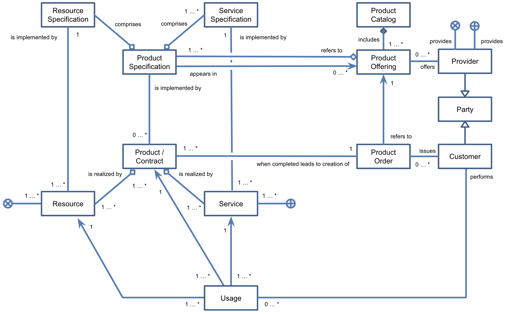

*Figure 2.4 - TM Forum information model applied in DOME*

### 2.2.2 DOME Shared Catalogue and Transactions Ledger (Distributed Persistence Layer)

At the heart of the technical architecture of DOME is the **DOME Distributed Persistence Layer** which manages storage of, and access to, information associated with:

- the Shared Catalogue of Product Specifications (including the specifications of associated services and supporting resources) and Product Offerings defined by cloud and edge service providers

- Product Orders and Product instances along their lifecycle, as well as information about actual Usage of Products

The DOME Distributed Persistence Layer will be implemented on top of a number of interconnected national blockchains (starting with Alastria and HashNet) compatible with the European Blockchain Service Infrastructure (EBSI) when not directly EBSI. As illustrated in Figure 2.5, each cloud and edge service provider, federated marketplace, and the DOME Portal backend itself implements an access node to the DOME Distributed Persistence Layer that supports the standard TM Forum APIs defined for the implementation of Marketplace functions.

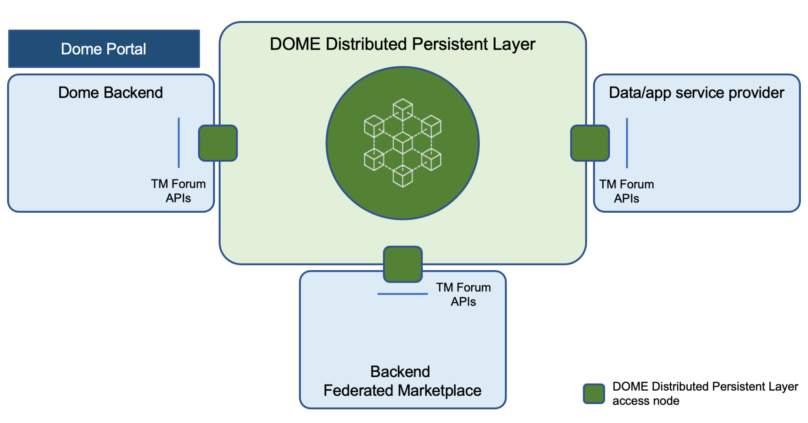

*Figure 2.5 - High-level architecture of the DOME Distributed Persistence Layer*

When a Product Offering is created through the DOME Portal, for example, information about it has to be stored in the DOME Distributed Persistence Layer. This is achieved by invoking the specific operation for creating a Product Offering entity of the TM Forum Catalog Management API (TMF620 recommendation) that the Distributed Persistence Layer access node implemented in the DOME Portal backend supports. Part of this information is stored in the blockchain and, consequently, becomes replicated in all other nodes connected to the DOME Distributed Persistence Layer while the rest of the information will be stored “off-chain” within the access node, which will typically also store a local copy of the information stored in the blockchain to support local queries in a more efficient manner. During the first phases of the DOME project, a decision will be made about what part of the information will be stored in the blockchain and what part of information will be stored only “off-chain”. In any case, any access node will be able to access information stored “off-chain” based on information stored in the blockchain, provided it owns the necessary credentials that grant them access to the nodes where such “off-chain” data is stored.

Aligned with Gaia-X specifications, the description of Product Specifications and Product Offerings will be represented in the form of Verifiable Credentials/Presentations (VC/VP) compliant with W3C standard specifications[^2], some of which will take the form of labelled certifications (verifiable credentials issued by certification and audit agencies). These VC/VPs are stored in the DOME Distributed Persistence Layer.

The DOME Distributed Persistence Layer brings transparency and trust to all participants since all transactions linked to the creation of Product Specifications, Product Offerings, Product Orders and Product Instances as well as their evolution over time or the generation of Usage Logs will be stored in a blockchain. This allows, for example, cloud data/app service providers to audit when their services have been procured and through which marketplace (any of the federated ones or directly DOME). Similarly, it will allow a given marketplace provider to audit when a given data/app service that was procured through its marketplace has been used. Last but not least, Usage Logs can be used by third party Charging/Billing/Payment gateways integrated with DOME which may be offered to cloud and edge service providers which do not want to implement a charging/billing/payment system on their own. They can also be used to generate verifiable credentials regarding operations of a service provider which can later be used as “passport” in front of investors or funding agencies.

## 2.3 Journey of DOME users

### 2.3.1 Service providers journey

Figure 2.6 describes the journey that cloud and edge service providers will go through when interacting with DOME.

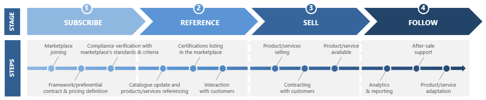

*Figure 2.6 - Service providers' journey in DOME*

Next, we explain each of the stages[^3], providing some details about what goes on within each stage from a technical perspective:

- Stage 1 - Subscribe

> The ‘subscription’ stage comprises all the steps followed by any given cloud and edge service provider since it joins DOME until it publishes its Product Offerings. This consists of three steps that the provider performs via DOME (either through APIs or the Portal) – 1) registration as a cloud/edge service (product) provider, 2) registration of the specifications of products it offers (defined as combination of services and associated resources) as well as definition of the basic characteristics of product offerings around registered product specifications like market segments the offering is targeted to (useful later on to fine tune discovery services), sales channels through which the offering will be visible (e.g., type of federated marketplaces in addition to DOME), or terms and conditions, including information about the different pricing models supported, and 3) verification of the compliance with DOME’s basic standards and criteria.
>
> All these steps will imply registration and management of information linked to entities described in the information model previously described in Figure 2 using TM Forum APIs that the DOME Distributed Persistence Layer supports. As an example, registration of a given cloud/edge service provider would mean creation of a Party playing the role of Provider using the TM Forum Party Management API (TMF632 recommendation). Similarly, registration of Product Specifications and Product Offerings will be performed using the TM Forum Product Catalog Management API (TMF620 recommendation) which in turn will rely on the the TM Forum Service Catalog Management API (TMF633 recommendation) and the TM Forum Resource Catalog Management API (TMF634 recommendation) since products are made out of the combination of services and supporting resources. Cloud and edge service providers can perform these operations programmatically using the TM Forum APIs that their access nodes to the DOME Distributed Persistence Layer support or via the DOME Portal (whose backend, on the other hand, uses TM Forum APIs supported by the DOME Distributed Persistence Layer). Compliance verification of a given Product Specification or Product Offering will imply the transition of their status (one of the attributes these kinds of entities export) into “active” status.
>
> An IaaS or Platform service provider that has implemented a marketplace connected to its services also relies on the TM Forum Party Management, Product Catalog Management, Service Catalog Management and Resource Catalog Management APIs (TMF632, TMF620, TMF633 and TMF634 recommendations) that their access nodes to the DOME Persistent Layer offer in order to register data/app service providers, as well as corresponding Product Specifications and Product Offerings through their marketplaces instead of directly through DOME. This is why we say that these marketplaces connected to IaaS or Platform service providers are federated to DOME: no matter how a data/app service provider registers, directly or through a federated marketplace, its Product Specifications or Product Offerings will end up registered in the DOME Share Catalogue (part of the DOME Distributed Persistence Layer).
>
> As mentioned before, part of the information describing Parties (cloud and edge service providers), Products and Product Offerings will take the form of Verifiable Credentials (VCs). Verification of some of these VCs will be required for a Party, Product or Product offering to be registered successfully in the DOME Persistent Layer, and therefore become visible through the DOME portal or any of the federated marketplace portals. This way, DOME provides guarantees to end customers that Parties, Products and Product Offerings that are offered through the DOME portal or the portal of any of its federated marketplaces are curated and will meet certain regulations and characteristics. Note that verification of a given credential will imply verification that the issuer of the credential is in the list of Trusted Issuers of Verifiable Credentials that DOME will rely on (and will be stored in the blockchain).
>
> Cloud and edge service providers get notified when information relevant to them is stored in the DOME Persistent Layer. Such notifications are received through their access nodes to the DOME Persistence Layer. Thus, for example, when a specific data/app service provider registers a given product offering (associated with a given product specification defined as combination of services and resources) in DOME, it will be offered the possibility of registering the product offering just in DOME or in DOME as well as any of the marketplaces connected to IaaS or Platform service providers federated with DOME. In the latter case, these IaaS or Platform service providers will receive a notification through the access node to the DOME Persistent Layer they implement. This way, a provider has only to register a data/app service once in DOME and get visible through the catalogue of all federated marketplaces it allows to work as sales channels. Note that additional compliance verification may be performed at the level of each of the federated marketplaces. For example, support of a NGSI-LD interface by the data/app service being registered may be verified by marketplaces associated with Platform services that are based on FIWARE.
>
> Figure 2.7 illustrates interactions that take place during the Subscribe stage.
>
> 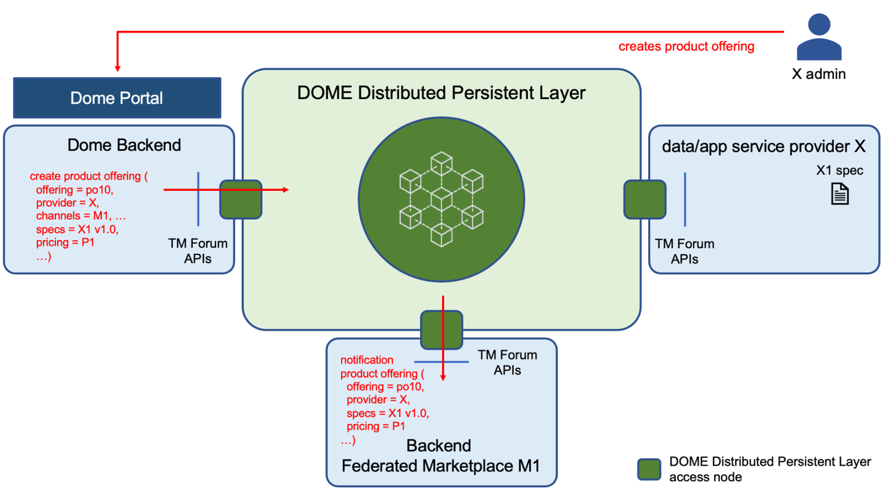

*Figure 2.7 - interactions among components during subscribe stage*

- Stage 2 - Reference

> Once a Product Offering becomes “active” it becomes visible to other users of DOME (typically end customers as well as IaaS and Platform service providers in the case of data/app services, since they may be interested to incorporate those data/app services in their respective catalogues). The provider of the Product Offering may establish visibility rules that determine who can get access to the offering.
>
> Cloud and edge service providers may refer to web pages of the DOME portal describing their product offerings once incorporated in the DOME Catalog. This way being able to promote them in front of potential customers.
>
> A Cloud and edge service provider is able to update characteristics of its Product Offerings as well as corresponding Product Specifications (or specifications of associated services and resources). Those updates can be formulated through TM Forum APIs supported by the access nodes to the DOME Distributed Persistence Layer or via the DOME portal. These updates will not only get registered in the DOME Product Catalog (becoming then visible through the DOME Portal to other direct users) but will be propagated to federated marketplaces in which the given Product Offerings / Specifications that got updated were also registered. This propagation will take place through notifications that federated marketplaces will receive through the access nodes to the DOME Distributed Persistence Layer they implement.
>
> Through search and browsing capabilities that the DOME Portal will implement, customers will be able to easily find the specific product they are looking for. In its most basic format, the DOME portal will allow customers to launch product offerings and product specifications searches, leveraging category filters and tagging functions, some tags connected to Verifiable Credentials (VCs) describing them. These functions will also be accessible via API enabling integration of more sophisticated customer applications.
>
> Beyond basic search functions, DOME will implement more advanced features with the goal of connecting consumers with relevant services as quickly as possible. Among the other features, it will be possible to implement a search algorithm which would match customer search queries with keywords from relevant product listings. Even more advanced search functions may leverage additional information (such as product ratings or click-through rates) to prioritise/rank the results of search queries and improve the customer experience. Finally, search algorithms could also be specific to the customer’s sector to provide results that take into account the customer’s particularities.
>
> Figure 2.8 illustrates interactions that take place during the Reference stage.
>
> 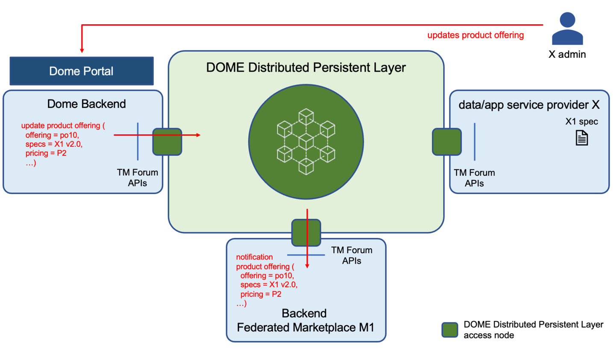

*Figure 2.8 - interactions among components during reference stage*

- Stage 3 - Sell

> There are two ways in which a given Product offered by a cloud/edge service provider can be procured: either directly through DOME or through marketplaces associated with IaaS or Platform service providers where the corresponding Product Offering has also been registered. When a given customer discovers a cloud/edge service Product Offering it is interested in, both possibilities are offered.
>
> In the first case, procurement may be performed either via the DOME Portal or programmatically. In both cases, the creation of a Product Order will be ultimately requested using the TM Forum Product Ordering Management API (TMF622 recommendation) that the Distributed Persistence Layer access node implemented in the DOME Portal backend supports.
>
> In the second case, typically associated with procurement of data/app services, the customer will be redirected to the marketplace of its choice, through which the procurement process will be handled. At a given moment, the creation of a Product Order will be performed via invocation of the TM Forum Product Ordering API supported by the DOME Distributed Persistence Layer access node linked to the selected marketplace. Note that this Product Order will also become visible not only in the federated marketplace but also at the DOME Portal.
>
> In any of the two cases, a Product Order is created within the DOME Distributed Persistence Layer and the given cloud/edge provider will receive a notification about creation of the Product Order it should handle. This notification will be received through their corresponding DOME Distributed Persistence Layer access node.
>
> Note that many customers will end up consuming services through the portals of federated marketplaces the DOME portal will guide them to. That’s why these portals are expected to provide a better tailored user experience (UX). However, the federation of marketplaces with DOME will mean that all relevant transactions will be registered in the DOME Distributed Persistence Layer and therefore become visible at the DOME Portal, this way ensuring transparency and giving higher trust to both customers and data/app service providers.
>
> Figure 2.9 illustrates interactions that take place during Product Ordering.
>
> 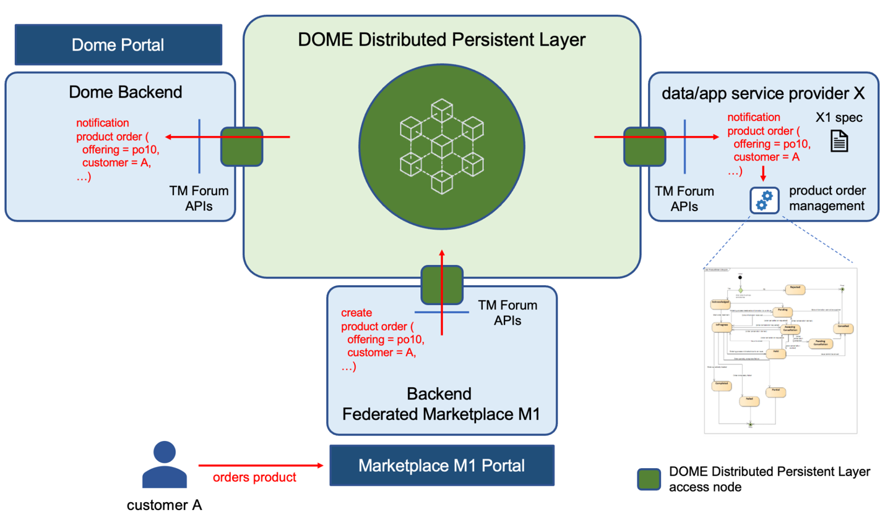

*Figure 2.9 - interactions among components during Product Ordering*

> Figure 2.10 illustrates the different states a Product Order will go through since it is issued by a given customer and it gets completed. Such states will be reflected as values of the attribute “state” that any Product Order will support. The defined lifecycle complies with TM Forum specifications but will be revised based on feedback from first deployment and pilots of DOME.
>
> 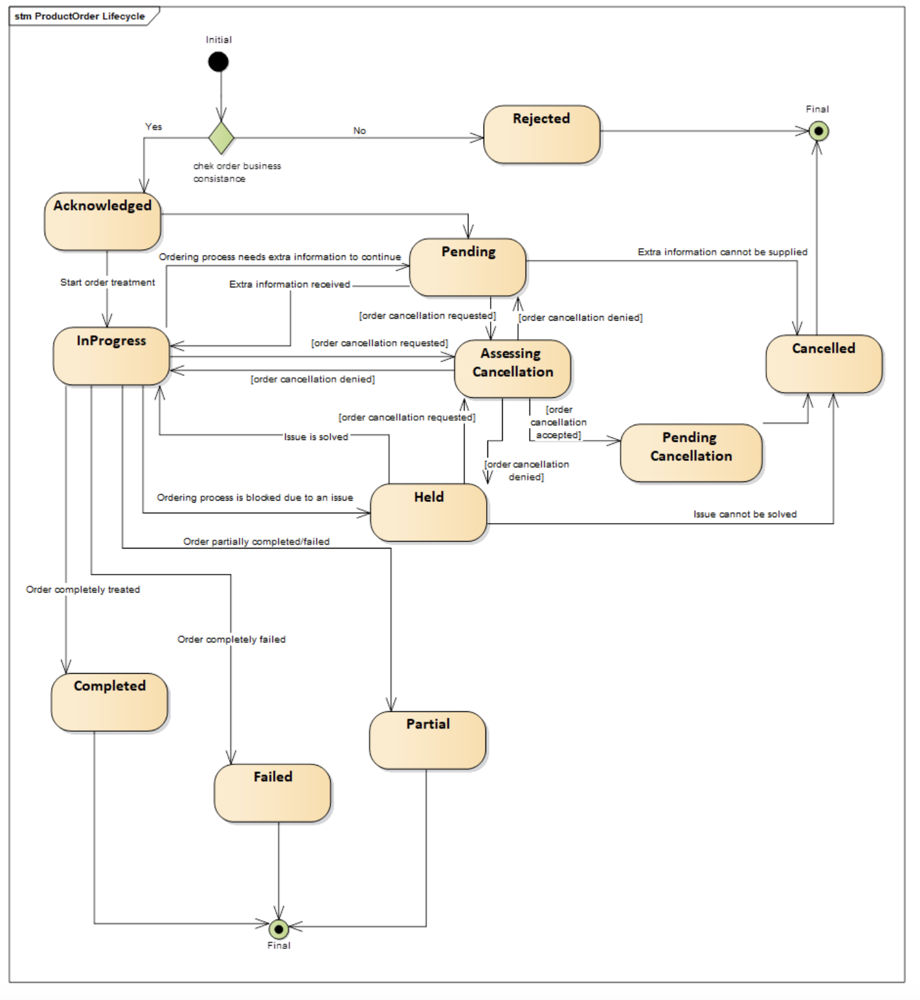

*Figure 2.10 - Lifecycle of Product Orders*

> Once a Product Order is completed, a contract between the customer and the service provider is established so that terms and conditions defined in the Product Offering start to apply. As a result, the customer becomes a Trusted Issuer of Verifiable Credentials relevant to the product business logic (see section on “Trust Anchor and Decentralized Identity and Access Management (IAM) Framework” below). The service provider will then create a Product instance using the TM Forum Product Inventory Management API (TMF637 recommendation) that its access node to the DOME Distributed Persistence Layer supports. As a result, the Product instance will become visible to the customer, either through the DOME portal or the federated marketplace through which the originating Product Order was issued.
>
> Figure 2.11 illustrates the different states a Product instance will go through since it is created, right after the originating Product Order was completed, until it is terminated. Such states will be reflected as values of the attribute “state” that any Product instance will support. The defined lifecycle complies with TM Forum specifications but will be revised based on feedback from first deployment and pilots of DOME.
>
> 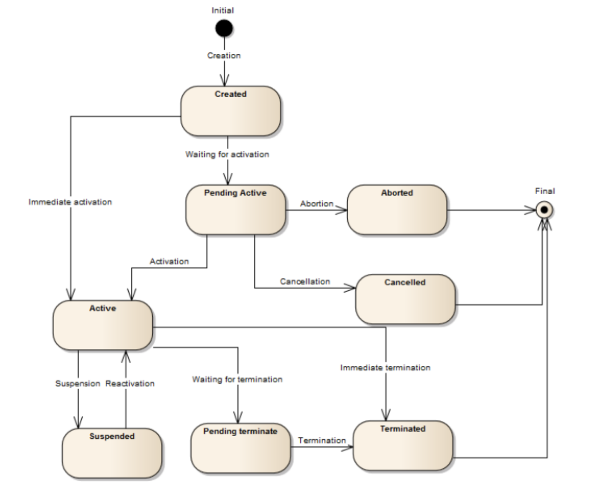

*Figure 2.11 - Lifecycle of a Product (instance)*

> Note that the creation of a Product instance does not necessarily mean that its component services and required resources get automatically provisioned and activated. There may exist a period from the time at which a Product is created until it actually can be used by the customer that ordered it. This is for example the case in connection to products which require deployment of resources in the field (e.g., an app for air quality monitoring which requires deployment of several IoT devices in the field). It is also the case when manual configuration and/or integration testing with products from third parties is required. Once everything is ready for actual usage, the state of the Product becomes “Active”. This will be the point at which access to the service will be permitted, or logs for the initial charging will be generated in connection to one-payment or subscription fee pricing models. It will also be the point at which Usage logs will start to be generated, bringing the basis for the monitoring of services as well as the support to pay-per-use pricing models.
>
> Cloud and edge service providers registered in DOME will commit to register Usage logs in the DOME Distributed Persistence Layer, using the TM Forum Usage Management API (TMF635 recommendation) that its access node to the DOME Distributed Persistence Layer supports. Those Usage logs will ultimately be recorded in the blockchain associated with the DOME Distributed Persistence Layer but multiple logs will be condensed into a block for performance reasons.
>
> Figure 2.12 illustrates interactions that will take place during the lifecycle of a Product instance, particularly at the time of its creation as the result of completing a Product Order by a particular customer, and its activation for that customer.
>
> 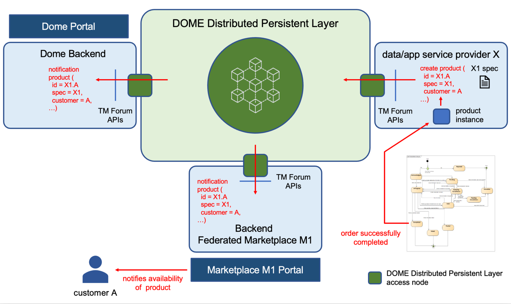

*Figure 2.12 - Interactions during the lifecycle of Product instances*

- Stage 4 - Follow

> Once providers have sold their service, they will need to be able to monitor consumption, provide after-sale support and leverage the experience to innovate and continuously strengthen their service offering.
>
> Reporting and analytics features will be offered via the DOME Portal that providers and customers can consume. Notably, the marketplace can provide users the option to personalise their reports or to export data to outside platforms via connectors and APIs. Since relevant information for fueling these reporting and analytic tools is accessible through the DOME Distributed Persistence Layer, more advanced versions can be offered as Third-Party services that get access to the APIs that the DOME Distributed Persistence Layer offers.
>
> Note that customers will mostly end up consuming services through the portals of federated marketplaces the DOME portal will guide them to. These portals are expected to incorporate their own reporting and analytic functions meeting the needs of customers (particularly to support the different stages of their journey).

Some of the cloud or edge data services registered in DOME may bring access to static data or near real-time data resources available through RESTful APIs (e.g., IoT data). DOME will integrate data publication functions enabling the exposure of such data resources in compliance with DCAT specifications defined by W3C and DCAT-AP recommendation by the EC. This way, data resources linked to data services offered through DOME can be harvested through external Data Publication platforms (e.g., the European Data Portal).

### 2.3.2 Customers journey

Figure 2.13 describes the journey that consumers of cloud and edge services offered through DOME will go through when interacting with DOME.

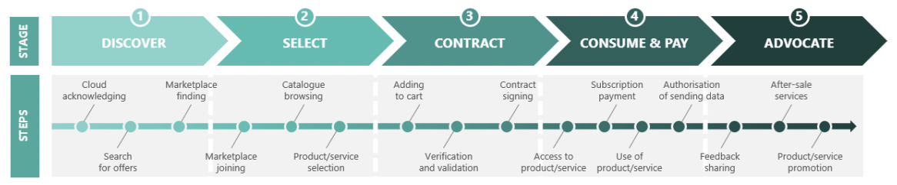

*Figure 2.13 - Costumers journey in DOME*[^4]

Those customers who approach the DOME ecosystem for the first time or wish to check other marketplaces different than the one they are already using, will connect to the DOME portal searching for offerings. They may end selecting and contracting individual data/app cloud or edge services directly through DOME which may require use of third-party payment services integrated with DOME. However, in other cases they will look for the marketplaces, connected or not to an IaaS, Platform provider or Individual Marketplace Provider that may better solve their overall needs. When a customer selects a given marketplace then they will further interact with its corresponding portal, which will typically mean they will enjoy a more personalised user experience through that portal interface, including the payment of services. Note that, despite further interactions will then be bilateral with the marketplace, DOME will bring trust to the relationships established between customers and app/data cloud and edge services, because both can audit transactions as they are logged in the DOME Distributed Persistence Layer. Satisfied customers will become the best ambassadors of DOME and federated marketplaces.
