# 3 DOME Trust and IAM Framework

DOME brings a decentralised Trust and Identity and Access Management (IAM) framework to enable the trusted operation with the system without requiring a central entity intermediating in all interactions.

The Trust framework ensures that the information published on DOME is trustful. It defines and enforces a set of rules that actors in the DOME ecosystem (data/app service providers, federated marketplace providers, end customers) agree to follow. By following them, all organisations can use their digital identities and characterise services in a consistent and trustful manner. This lowers the barriers for organisations to complete transactions or share information with other organisations.

The IAM framework, on the other hand, enables actors in the DOME ecosystem to authenticate into DOME services (i.e., the DOME Portal, federated marketplace portals or TM Forum APIs implemented on top of the DOME Persistence Layer) and help to manage proper access to those services based on their profiles. This IAM framework relies on Verifiable Credentials/Verifiable Presentations and leverages the Trust framework to provide an efficient, scalable, and decentralised IAM that participants can use. The Trust and IAM framework implemented in DOME is not only for managing authentication and authorization in the interaction with the DOME services, but it is also available for data/app services which may use it for managing the interactions between them and their users.

## 3.1 Trust Framework

The Trust framework addresses the following issues:

- **ID Binding**: How to verify that a given identifier corresponds to a valid legal identity of an entity in the real world?

- **Proof of participation**: How to verify that the entity is trusted because it is a subscribed participant in a given ecosystem (e.g., the DOME ecosystem)?

- **Proof of Issuing Authority**: How to check that the credentials presented by a participant have been issued by another entity that can be considered a Trusted Issuer of that type of credentials? This enables the verifier to put the right level of trust in the facts attested by the Verifiable Credentials presented by a participant.

These concepts are elaborated in the next sections.

### 3.1.1 ID Binding

At the root of any trust framework there is the requirement to verify the identity of an entity in the real world and the assignment of some identifier that can be used later in representation of the real entity in the online processes. This association between an identifier (including some metadata) and the real identity of an entity is what we call **ID Binding**.

Please note that, at this level, ID Binding states only who the entity is in the real world, not any additional properties that may be interesting for other purposes. For example, ID Binding establishes that the entity is a business operating in the EU, but it does not say what products it sells or the characteristics of the product, or the markets in which it operates, or in which data spaces it participates.

Many ecosystems assign a proprietary identifier to entities when they are onboarded in the ecosystem, creating silos of identifiers, and making the interoperability across ecosystems very difficult.

In DOME we are limiting the ecosystem to those entities that can operate in the EU. Or more precisely, those entities that can engage in electronic transactions in the internal market of the EU by using advanced or qualified electronic signatures/seals, as defined in the eIDAS regulation. In practice, this means that in order to participate in DOME the entities should be able to obtain a digital certificate from any Trust Service Provider (TSP) listed in a Member State national Trusted List (eIDAS articles 22.1 and 22.4).

In addition, in the first phase of implementation of DOME we require that the entities that participate directly in the ecosystem be legal entities, so the certificates that enable onboarding in DOME are those issued either to legal persons or to natural persons who are legal representatives of legal persons. Under eIDAS, when a transaction requires a qualified electronic seal from a legal person, a qualified electronic signature from the authorised representative of the legal person is equally acceptable.

In DOME we rely on identifiers already used in those digital certificates issued by a TSP. The combination of digital certificates issued by TSPs and Verifiable Credentials contributes to the legal validity and interoperability of the cross-border data-related transactions in the European Union facilitating the cross-border validation of eSignatures, eSeals, and more. Essentially, Verifiable Credentials and Presentations (including those listed as characteristics of Product Specifications and Offerings) used in the ecosystem will be signed using digital certificates, replacing the “traditional” [<u>signed PDFs</u>](https://ec.europa.eu/digital-building-blocks/wikis/display/DIGITAL/Standards+and+specifications) with a more efficient format that is machine-readable and machine-processable, with the same level of legal assurance.

Some of the characteristics and advantages of using this type of ID Binding are described below.

#### 3.1.1.1 Cross-border use of mutually recognised electronic identification means

We propose that during onboarding of a new DOME user, eIDAS advanced or qualified signatures and seals are accepted.

The [<u>Regulation on electronic identification and trust services</u>](https://eur-lex.europa.eu/legal-content/EN/TXT/?uri=uriserv:OJ.L_.2014.257.01.0073.01.ENG) for electronic transactions in the internal market (**eIDAS Regulation**) states that in order to contribute to their general cross-border use, it should be possible to use trust services as evidence in legal proceedings in all Member States. DOME is fully aligned with the objectives of the eIDAS regulation, specifically Article 17 of the eIDAS Regulation, where it is said that Member States should encourage the private sector to voluntarily use electronic identification means under a notified scheme for identification purposes when needed for online services or electronic transactions. The possibility to use such electronic identification enables the private sector to rely on electronic identification and authentication already largely used in many Member States at least for public services and to make it easier for businesses and citizens to access their online services across borders.

In this way, interoperability of Verifiable Credentials across the public and the private sector can be achieved in large Digital Ecosystems (e.g., Data Spaces) across the EU.

Article 22 of the [<u>Regulation on electronic identification and trust services</u>](https://eur-lex.europa.eu/legal-content/EN/TXT/?uri=uriserv:OJ.L_.2014.257.01.0073.01.ENG) for electronic transactions in the internal market (eIDAS Regulation), obliges Member States to establish, maintain and publish trusted lists. These lists should include information related to the qualified trust service providers for which they are responsible, and information related to the qualified trust services provided by them.

In order to contribute to their general cross-border use, it should be possible to use trust services as evidence in legal proceedings in all Member States.

In practice, each Member State publishes its Trusted List, and the Commission publishes the List Of Trusted Lists (LOTL). There are different ways to access the lists, but one which is machine-processable (XML) is located at [<u>https://ec.europa.eu/tools/lotl/eu-lotl.xml</u>](https://ec.europa.eu/tools/lotl/eu-lotl.xml) which contains the addresses of each of the Trusted Lists published by each Member State. This is represented in the following figure.

> 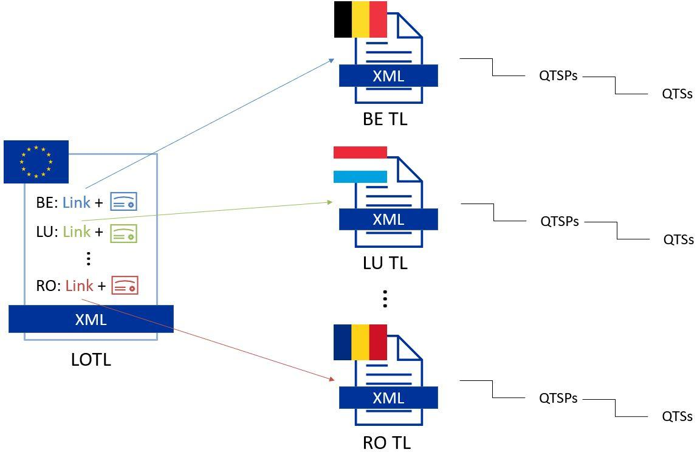

We propose to use an integrated, easy and performant way to perform ID Binding based on the digital certificates provided by the EU TSPs, including transparent access to the consolidated list of TSPs when applications in the Data Space must perform ID Binding (typically during onboarding and verification of signatures of credentials).

#### 3.1.1.2 ID Binding and the Verifiable Credential

In DOME we use a special type of Verifiable Credential intended specifically for authentication and that we will call VerifiableID to distinguish it from the other types of Verifiable Credentials that are also used in DOME for other purposes. When a participant sends online a VerifiableID, in addition to the ID Binding problem described in the previous section, we have to make sure that the credential has been sent by an entity authorised to do so and not by an impostor. This is called ID Binding of the credential. Later in this document we describe a simple approach to perform this using widely used public key cryptography and leveraging on the trust already provided by the digital certificates used in the ID Binding described in the previous section.

Although the process will be described in detail later in the document, we anticipate here the essential characteristics of the credential.

We assume that the issuer of the Verifiable Credential has an eIDAS certificate (we will use this term for a digital certificate or seal issued by a TSP in the EU Trusted List), and that the issuer is a participant in the relevant ecosystem, e.g., DOME ecosystem or Data Space considered (the concept of participation is elaborated in the next section).

The credential will be signed with the eIDAS certificate, using the [<u>Digital Signature Service (DSS)</u>](https://ec.europa.eu/digital-building-blocks/wikis/display/DIGITAL/Digital+Signature+Service+-++DSS) which is a Building Block endorsed by the European Commission to ensure that the digital services are interoperable and EU-compliant. Additionally, DOME will use the standard protocols for remote signature creation defined in \[[<u>ETSI TS 119 432 - Electronic Signatures and Infrastructures (ESI); Protocols for remote digital signature creation</u>](https://www.etsi.org/deliver/etsi_ts/119400_119499/119432/01.02.01_60/ts_119432v010201p.pdf)\], which is based on the specifications from the [<u>Cloud Signature Consortium</u>](https://cloudsignatureconsortium.org/).

In this scenario, the subject of the credential (either a natural or juridical person) wants to receive a credential from the issuer. The credential is an attestation of something that the issuer knows about the subject. That means that there should be a previous close relationship between the issuer and the subject and there is a pre-existing trusted identification mechanism that the issuer uses for everything related to the subject. It could be physical (e.g., the student going to the secretary of the University to request the credential) or electronic (e.g., the student using the “traditional” identification mechanisms for accessing the University online services).

In this context, the approach for issuing verifiable credentials is the following:

1.  The subject authenticates to the issuer with whatever mechanism has been used during the previous relationship. In the example of the diploma, the student uses whatever identification mechanism was provided by the University when the student enrolled in the studies.

2.  Once an authenticated session exists, the subject generates a pair of public-private keys and sends the public key to the issuer, keeping the private key private (that’s the meaning of its name, obviously). The actual mechanism uses a digital signature of a challenge to ensure that the subject controls the private key associated with the public key sent to the issuer.

3.  The issuer creates a credential with the relevant attestations and includes also the public key received from the subject as an additional attestation.

4.  The issuer digitally signs the credential with its eIDAS certificate and makes the credential available to the subject. The specific mechanism to “send” the credential to the subject can be diverse. Given that there is a previous relationship, the credential could be sent inside the authenticated session during which the verifiable credential was being requested and it is generated. Alternatively, it could be made available in the “electronic office space” of the subject, or sent encrypted via email, or even printed in physical media and sent via mail, if required. The Verifiable Credential is essentially a file with data in JSON (or JSON-LD) format and digitally signed by the issuer. However, the mechanism for issuance that will be used in DOME is [<u>OpenID for Verifiable Credential Issuance</u>](https://openid.net/specs/openid-4-verifiable-credential-issuance-1_0.html), as specified in [<u>The European Digital Identity Wallet Architecture and Reference Framework</u>](https://digital-strategy.ec.europa.eu/en/library/european-digital-identity-wallet-architecture-and-reference-framework).

With this mechanism, the receiver of the credential can have the same level of trust in the “normal” attested attributes inside the credential and in the public key inside the credential.

The holder of the credential can prove control of that credential by signing challenges from the verifier using the private key associated with the public key that is inside the credential. This way, the credential can be used for both identification and authentication.

#### 3.1.1.3 About identifiers for legal persons

In DOME we use W3C Verifiable Credentials with DIDs as identifiers. A DID is a simple text string consisting of three parts: **1)** the did URI scheme identifier which is the word “did”, **2)** the identifier for the DID method which specifies the mechanism used for resolving a DID, and **3)** the identifier specific to that DID method.

As mentioned before, when using eIDAS digital certificates for identity binding, it does not make sense to “invent” identifiers or to promote the usage of different DID methods that are not well integrated with eIDAS certificates and that generate identifiers which are not in general legally recognised in the EU for economic transactions (e.g., that can be used in electronic invoices across the EU).

In general, an ecosystem may accept one or more DID methods and their associated DID resolution mechanisms (e.g., [<u>did:web</u>](https://github.com/w3c-ccg/did-method-web), [<u>did:peer</u>](https://identity.foundation/peer-did-method-spec/index.html), etc.). For Legal Persons, we propose that the main method used is [<u>did:elsi (ETSI Legal person Semantic Identifier Method Specification)</u>](https://alastria.github.io/did-method-elsi/), which uses as identifiers the same identifiers that are already embedded in the eIDAS certificates that conform to the relevant ETSI standards. The main concepts of the did:elsi method are described below.

ETSI EN 319 412-3 V1.2.1 (2020-07) **“Electronic Signatures and Infrastructures (ESI); Certificate Profiles; Part 3: Certificate profile for certificates issued to legal persons”** states:

> *“The subject field shall include at least the following attributes as specified in Recommendation ITU-T X.520:*

- *countryName*

- *organizationName*

- ***organizationIdentifier** and*

- *commonName”*

And regarding the *organizationIdentifier* attribute it says:

> *The organizationIdentifier attribute shall contain an identification of the subject organization different from the organization name. Certificates may include one or more semantics identifiers as specified in clause 5 of ETSI EN 319 412-1 \[i.4\].*

And the document referenced, ETSI EN 319 412-1 V1.4.2 (2020-07) “**Electronic Signatures and Infrastructures (ESI); Certificate Profiles; Part 1: Overview and common data structures**” states:

> *When the legal person semantics identifier is included, any present **organizationIdentifier** attribute in the subject field shall contain information using the following structure in the presented order:*

- *3 character legal person identity type reference*

- *2 character ISO 3166 \[2\] country code*

- *hyphen-minus "-" (0x2D (ASCII), U+002D (UTF-8)) and*

- *identifier (according to country and identity type reference)*

> *The three initial characters shall have one of the following defined values:*

1)  *"VAT" for identification based on a national value added tax identification number.*

2)  *"NTR" for identification based on an identifier from a national trade register.*

3)  *"PSD" for identification based on the national authorization number of a payment service provider under Payments Services Directive (EU) 2015/2366 \[i.13\]. This shall use the extended structure as defined in ETSI TS 119 495 \[3\], clause 5.2.1.*

4)  *"LEI" for a global Legal Entity Identifier as specified in ISO 17442 \[4\]. The 2 character ISO 3166 \[2\] country code shall be set to 'XG'.*

5)  *Two characters according to local definition within the specified country and name registration authority, identifying a national scheme that is considered appropriate for national and European level, followed by the character ":" (colon).*

> *Other initial character sequences are reserved for future amendments of the present document. In case "VAT" legal person identity type reference is used in combination with the "EU" transnational country code, the identifier value should comply with Council Directive 2006/112/EC \[i.12\], article 215.*

That means that any eIDAS digital certificate issued by TSPs to legal persons compliant with the ETSI standards including an organizationIdentifier attribute can be used to trivially derive a DID from the ETSI standard identifier by applying the following rule:

***did:elsi:organizationIdentifier***

Some examples of DIDs are:

- **Gaia-X**: did:elsi:VATBE-0762747721

- **International Data Spaces**: did:elsi:VATDE-325984196

- **Alastria**: did:elsi:VATES-G87936159

- **IN2**: did:elsi:VATES-B60645900

- **Digitel TS**: did:elsi:VATES-B47447560

- **FIWARE Foundation**: did:elsi:VATDE-309937516

- **TNO**: did:elsi:LEIXG-724500AZSGBRY55MNS59

Where:

- “did” is the W3C did uri scheme.

- “elsi” stands for **E**TSI **L**egal **S**emantic **I**dentifier, which is the acronym for the name for this type of identifier used in the ETSI documents.

- “organizationIdentifier” is the exact identifier specified in the ETSI standard, and that can evolve with the standard to support any future requirement.

Proving the control of an ELSI DID can be done using the associated digital certificate: including the certificate with any signature can do that. By the way, this means that any existing digital signature of any type of document (not only Verifiable Credentials) is already compliant with this DID method specification, just by making the corresponding translation

In other words: **any legal person can have a standard eIDAS certificate with an automatically associated DID identifier complying with the ELSI did method specification. There is no need to invent new identifiers or have a central entity in a Data Space assign identifiers to participants.**

#### 3.1.1.4 About identifiers for natural persons

In principle, we could use the same approach for natural persons as for legal persons. The ETSI standards referenced above also cover natural persons, and they define a “Natural Person Semantic Identifier”.

However, legal persons are completely different to natural persons, especially from the point of view of privacy (look at the GDPR to see some differences). It is for those privacy reasons that we propose a different approach to the identifiers of natural persons participating in a sharing ecosystem like a Data Space. In particular, DIDs for natural persons should never be registered in any shared database, including the Verifiable Registry described in the standard W3C Verifiable Credentials ecosystem.

For this reason, DOME uses did:key for natural persons.

#### 3.1.1.5 Disclaimer

The designed and planned architecture, protocol steps, message structures described by the current specification are based on current status of available documents related to eIDAS2 and the EUDIW (European Digital Identity Wallet) such as ARF (Architecture and Reference Framework, https://github.com/eu-digital-identity-wallet/eudi-doc-architecture-and-reference-framework/releases) and ETSI specifications and reports.

As the development of ARF and ETSI specifications is still in progress the DOME project shall be able to re-factor its solution - on different levels - in case of need.

- The level of communication flows: The DOME project aims at an online communication flow where both Relying Party and User are online, but based on ARF other cases shall be supported in the future as well, even full offline cases where both Relying Party and User are offline entities. The partly offline case is important to support managing e.g. ID documents, national eID cards on the side of the User, therefore it will be important to governments of Member States.

- The level of form factor: The DOME project aims to support a server-side backend wallet with a web application interface, called PWA (Progressive Web Application). Beyond this "web application" form factor also "mobile application" and "secure application on PC" are listed in ARF. Of course, "mobile application" can be also operated with an embedded WebView but for full offline scenarios it should have a standalone AppView as well.

- The level of Verifiable Credentials transmission: The DOME project aims to support OIDC4VCI and OID4VP as it is required by ARF, but these standards contain some alternative configurations and optional attributes and it is not clear whether all these would be supported in the future by the wallet reference implementation or not (e.g. "Pre-Authorized Code Flow" or "Authorization Code Flow", "scope" parameter or "authorization_details" parameter in "Authorization Request", "proof" element or standard JWS for storing signature, "kid" element or self-descriptive "x5c" element to reference public keys in Verifiable Credentials).

- The level of Verifiable Credentials data structure: The DOME project aims to support JSON-based data structures of OIDC4VCI, OID4VP as it is required by ARF, but also SD-JWT is required as well and selective disclosure of attributes shall be supported. Beyond JSON-based signed attributes of eIDAS 2.0 also transition from (or maintaining current) eIDAS 1.0-compliant data structures shall be supported. The current eIDAS 1.0-compliant data structures cover XML-based SAML Assertions or standard IETF RFC 5755 attributes certificates or CMS/PKCS#7-based ICAO Doc 9303 signed attributes in passport ID documents.

- The level of identifiers assigned to natural or legal persons: The DOME project aims to use partly internal identifiers for onboarding/registering natural persons and legal persons in different roles. In general, eIDAS 1.0-compliant systems support such processes (e.g. onboarding/registering User at an SP/RP such as a bank) based on government-assigned identifiers. Some of the attributes shall be supported in cross-border scenarios as well (8 natural person attributes, 10 legal person attributes and 2 for legal person representative natural person). The DOME project would support DID (W3C Decentralized Identifiers) and *organizationIdentifier* (ETSI EN 319 412) but eIDAS 1.0 requires to manage others as well (e.g. for legal persons beyond classic VAT Registration Number or Tax Reference also LEI, EORI, SEED, SIC and D-2012-17-EUIdentifier are defined).

- The level of signature creation: The DOME project aims to support JSON-based CSC (Cloud Signature Consortium) specification to access and use private keys to create advanced or qualified electronic signatures. This layer specifies the interface of a keystore (e.g. Cloud-HSM as server-side keystore and national eID cards or other PKI smart cards as client-side keystores) but the specification of a signature creation service - which shall be used by an EDIW - is on a higher level. This interface is described by ETSI TS 119 432 and it allows the use of both plain-old XML-based OASIS DSS-X standard and a newly defined extension to JSON-based CSC protocol.

### 3.1.2 Proof of participation

When verifying a Verifiable Credential/Presentation, we must address the following:

1.  How do we determine whether or not we know that the **issuer** of the Verifiable Credential is a **participant** in the ecosystem where we are also participants (e.g., organisations onboarded in DOME)?

2.  How do we determine whether or not we know that the **subject** of the Verifiable Credential is a **participant** in the concrete ecosystem where we are also participants (e.g., organisations onboarded in DOME)?

We propose to use a **Trusted Participant Registry** including the identities and associated metadata of all legal persons participating in the concrete ecosystem. In this document, and when there is no possibility of confusion, we will use the terms Trusted Participants Registry and Trusted Participants List as equivalent. The literature is not (yet) fully consistent and using the term List is closer to the eIDAS terminology, but there are many places where the term Registry is used. The Trusted Participant Registry is updated during the onboarding process of an entity and is managed by one or more collaborating trusted participants in the concrete ecosystem. Please note that this list is different from the EU Trusted List with the identities of TSPs authorised to issue digital certificates/seals in the EU.

There are different ways to implement the Trusted Participant Registry but in any case, the users of the Trusted Participant Registry should not be aware of the technology used to implement it. The users of the Trusted Participant Registry just use an API to query the registry on verification, and the maintainers use a different API to register and update the registry.

This way, it is completely possible to use a mix of centralised and decentralised technology without the users noticing it. Or to migrate transparently from one technology to another depending on the requirements of the specific ecosystem.

Having said that, DOME will use a federated set of interoperable DLT networks for the maintenance of the Trusted Participant Registry, providing a decentralised, hyper-replicated, efficient and resilient mechanism for querying the registry. Anyone can create a replica of the information using centralised systems if they wish.

The API is based on the one defined by [<u>EBSI for Trusted Issuers Registry</u>](https://api-pilot.ebsi.eu/docs/apis/trusted-issuers-registry/latest#/) of different types. For example:

> ***GET /participants*** and ***GET /participants/{did}***

to get the list of participants or to check a given participant DID, respectively.

There are several other APIs to retrieve attributes/metadata associated with the participants, and APIs to maintain the list, used by the entity or entities responsible for the list. The full specification is later in this document.

We will follow this principle:

> *If something we need is already in EBSI, just use it. Otherwise define it trying to be as consistent as possible with EBSI, unless there is no chance to do so.*

### 3.1.3 Proof of Issuing Authority

Given that anyone can have access to the technology needed to create Verifiable Credentials and anybody can issue credentials and digitally sign them with their eIDAS digital certificate, the problem is how a verifier knows that the Verifiable Credentials received from the subject have been issued by an entity which is entitled or authorised to issue that type of credential in the context of DOME.

#### 3.1.3.1 Trusted Issuers Registries

The primary mechanism to solve this problem is the use of **Trusted Issuers Registries** (there may be several registries, one per domain or type of credential). In this document, and when there is no possibility of confusion, we will use the terms Trusted Issuers Registry and Trusted Issuers List as equivalent. The literature is not (yet) fully consistent and using the term List is closer to the eIDAS terminology, but there are many places where the term Registry is used. As long as the meaning is clear, we will use both interchangeably.

A Trusted Issuers Registry is a register of trusted public entities which can issue Verifiable Credentials belonging to a given domain or of a given type. In general, an entity must be first in the Trusted Participant List before it appears in a given Trusted Issuers Registry. In some ecosystems, the governance model of the ecosystem may allow participants to issue credentials of some type, without having to be included in a specific Trusted Issuers Registry. In this case, the governance model is effectively defining the Trusted Participants List as being also a Trusted Issuers Registry. However, in order to be general enough in the rest of this document we assume that the Trusted Participant List is different from the one or more Trusted Issuers Registries defined in the ecosystem.

A Trusted Issuers Registry includes the identifiers, public keys for verification of signatures and their accreditations in the form of Verifiable Credentials/Presentations from third parties, enabling the entity to issue credentials of a given type. All information in the registry is validated and signed by trusted legal entities of the corresponding domain (Conformity Assessment Bodies and third-party auditors).

Using Trusted Issuers Registries is the simplest mechanism, both for the verification of credentials and for the management of trusted issuers. However, in very complex ecosystems with many entities issuing credentials of different types, the management of Trusted Issuers Registries can be difficult to scale. For those ecosystems we can use the combination of Trusted Issuers Registries with the “chaining” of the signatures of Verifiable Credentials, like the certificate chaining used with traditional X.509 digital certificates:

- At the root of the trust hierarchy there is one or more Trusted Issuers Registries as described above, containing the primary trusted entities in the ecosystem.

- The entities in those Trusted Issuers Registries can issue special Verifiable Credentials to other entities, authorising them to be also Trusted Issuers, even if they are not included in a Trusted Issuers Registry. The signature of the special Verifiable Credential attests that the subject of the credential is explicitly authorised by the signer to issue a given type of credentials (usually a subtype of the parent type, but not necessarily; the specific rules have to be defined in the corresponding governance model for the domain/ecosystem). This mechanism can also be used recursively by those Trusted Issuers not in Trusted Lists if we need several levels in the hierarchy, though usually two or three layers (including the root Trusted Issuers Registry) should be enough to handle large ecosystems.

There is a trade-off in choosing one mechanism or the other. Having all Trusted Issuers in one or more Trusted Issuers Registries makes verification very simple: the verifier of a credential just checks once in the Trusted Issuers Registry corresponding to the type of certificate. Checking a credential using the chained mechanism is more complex: the verifier has to check the chain of signatures for the relevant Verifiable Credentials until it reaches an issuer which is in a Trusted Issuers Registry for the domain (or if no issuer is in any Trusted Issuers Registry, then the Verifiable Credential should be rejected).

Using only Trusted Issuers Registries makes it easier to know at a given point the whole set of Trusted issuers in the whole ecosystem (or on the domain covered by a given Trusted Issuers Registry). This is very difficult to know with the chained mechanism.

In a given implementation, the mechanisms can be combined and are not exclusive or all-or-nothing in an ecosystem. Depending on the requirements/complexity of a domain in an ecosystem, one domain can use just Trusted Issuers Registries while another domain can use a chained mechanism. It is even possible to start with only a Trusted Issuers Registry and transition seamlessly to the chained mechanism if the domain complexity grows beyond some limit, decided by the governance rules of the domain.

#### 3.1.3.2 The List of Trusted Lists (LOTL)

In a complex ecosystem like DOME there will probably be more than one Trusted Issuers List, each list specialised in some business, organisational or technical domain with its own set of specific Verifiable Credentials and with possibly different governance models for updating the information in each list.

Having different specialised Trusted Lists is good for decentralisation of the ecosystem, as each domain or subdomain represented by a list can be managed by the entity or entities which are responsible for the Trust Anchors in the lists.

However, it complicates the verification process of Verifiable Credentials, especially when an entity requires a combination of several credentials of different types in order to implement a given business process. The Verifier then has to know the location of different lists that are required to locate the different signers of the credentials.

One way to simplify the process is to implement a directory of lists, or using terminology coming from eIDAS, a “List Of Trusted Lists” like [<u>the one operated by the European Commission pointing to the trusted lists of all Member States</u>](https://digital-strategy.ec.europa.eu/en/policies/eu-trusted-lists).

In a similar way, DOME will make publicly available (that is, not restricted for reading) a List Of Trusted Lists (LOTL), pointing to all the Trusted Issuers Lists recognised in the ecosystem. This list will be available in a signed or sealed form suitable for automated processing and will include required information and metadata to be useful to verifiers.

The LOTL will be registered in the federated DLT platforms in DOME, and in this way it is automatically hyper-replicated in a trusted way to all the entities participating in the ecosystem that run a DLT node in any of the federated DLT networks.

## 3.2 Onboarding of DOME participants

The description of the onboarding process is divided into two distinct phases:

1.  Identification and verification of future participants when they sign up with DOME

2.  Registration of those new participants in the

    1.  Trusted Participant List associated with DOME participants

    2.  Trusted Issuers Registry for registering them as trusted issuers of verifiable credentials meaningful for the DOME business logic (e.g., app/provider, customers, federated marketplace)

The Trusted Participant List and Trusted Issuers Registry are replicated across the supporting federated DLTs, using the federated trust framework mechanisms described later in the document.

We describe below each of the two phases.

### 3.2.1 Identification and Verification of future participants

This phase refers to a process which precedes entering into a business relationship with a new participant, which has to be a legal person (at this moment we do not address onboarding of natural persons).

In general, the onboarding process is one of the less digitised and more diverse, with different implementations depending on the sector of activity and local regulation. Even within the same sector the actual implementation of onboarding processes for different companies can vary considerably.

Onboarding of participants in an ecosystem may also present differences depending on the specific ecosystem. This chapter presents an approach based on eIDAS digital certificates that can facilitate in the EU area a **fully digital and automated cross-border onboarding process and compliance with KYC** (Know Your Customer) requirements.

Onboarding of a new participant in the ecosystem is a critical activity and proper identification of the new participant at this stage affects very much to the level of trust of the whole onboarding process and so the level of trust that all the other participants in the ecosystem can place on the identity of the new participant. The objective in DOME is to provide a reasonable balance between convenience and level of legal certainty and security of the electronic transactions involved in the onboarding process.

To facilitate the descriptions later in this document, we reproduce here some relevant definitions taken from the eIDAS Regulation:

**‘Electronic identification’** means the process of using person identification data in electronic form uniquely representing either a natural or legal person, or a natural person representing a legal person.

**‘Person identification data’** means a set of data enabling the identity of a natural or legal person, or a natural person representing a legal person to be established.

**‘Authentication’** means an electronic process that enables the electronic identification of a natural or legal person, or the origin and integrity of data in electronic form to be confirmed.

**‘Relying party’** means a natural or legal person that relies upon an electronic identification or a trust service;

The onboarding process presented in this chapter is just one of the possible options that can be implemented, but it should be the main one supported in the EU region given its advantages.

#### 3.2.1.1 Legal basis

The eIDAS Regulation (EU) 910/2014 (hereafter denoted as eIDAS) is a major step towards building the EU Digital Single Market (DSM) as it provides a predictable regulatory environment for the cross-border recognition of electronic identification (eID) and electronic trust services by TSPs. eIDAS may facilitate to meet the legal obligations, concerning security, know-your-customer, strong authentication of parties and interoperability.

For the purposes of this chapter, this phase of the onboarding process consists of the following logical phases (which can be combined in a single step when performing them in a digital way):

- **Application**. Pre-on-boarding phase, addressing the act of applying to become a participant. In this phase, the applicant provides the required identity and KYC attributes for verification and collection.

- **Verification**. The verification phase determines whether the expected requirements and mechanisms used to perform verification of attributes are met. It can be divided into 3 steps:

  - Authenticity check of documents, to determine that the document can be considered a trustworthy source of information such as for identity attributes.

  - Identity check of the applicant, by comparison of the bearer of the document against the owner of the document.

  - Anti-fraud check, to determine that the document is not used in fraud-related activities and it belongs to a living person or existing legal entity; and that the applicant is not involved in fraud activities, not under sanctions or considered a PEP ([<u>Politically Exposed Person</u>](https://en.wikipedia.org/wiki/Politically_exposed_person)).

Depending on the sector of activity and its legal and regulatory requirements, a complete onboarding process requires the following common due diligence measures:

- **Identification of legal person** on the basis of documents and data submitted; and verification of the submitted information on the basis of information obtained from a reliable and independent source;

- **Identification and verification of the legal representative** and the right of representation;

- **Identification of the beneficial owner**, based on information provided for onboarding or obtained from another reliable and independent source; and

- Obtaining information on the **purpose and nature of the business relationship or transaction**.

In this chapter we focus only on the identification of the legal person and on the identification and verification of the legal representative, and assume that once this is done the remaining documentation can be provided and verified in a trusted, digital and automated way to complete all remaining required steps in the specific onboarding process for the ecosystem.

In DOME the main mechanism to provide those documents is to submit them in the form of Verifiable Credentials since this makes the process much easier and reduces manual work and possible error: the onboarding entity can check if the corresponding credentials have been signed by trusted issuers.

**Types of digital certificates in the EU**

The relevant types of certificates for the onboarding process are issued to natural persons, legal persons and natural persons representing a legal person (as described in article 3(1) of eIDAS for the case of representation).

Based on the regulation, some TSPs in the EU provide several types of digital certificates for digital signature/seals:

- **Natural Person** certificate for electronic signatures

- **Legal Person** certificate for electronic seals

- **Natural Person as Legal Entity Representative** certificate for electronic signatures

<table style="width:96%;">
<colgroup>
<col style="width: 96%" />
</colgroup>
<thead>
<tr>
<th>
<strong>Note: electronic signature vs. electronic seals</strong><a href="#fn1" class="footnote-ref" id="fnref1" role="doc-noteref">1</a>

<em><strong>Electronic signature</strong>: An electronic signature is a data in electronic form which is attached to or logically associated with other data in electronic form and which is used by the signatory to sign, <strong>where the signatory is a natural person</strong>.</em>

<em>Like its handwritten counterpart in the offline world, an electronic signature can be used, for instance, to electronically indicate that the signatory has written the document, agreed with the content of the document, or that the signatory was present as a witness.</em>

<em><strong>Electronic seal</strong>: An electronic seal is a data in electronic form, which is attached to or logically associated with other data in electronic form to ensure the latter’s origin and integrity, <strong>where the creator of a seal is a legal person</strong> (unlike the electronic signature that is issued by a natural person).</em>

<em>In this purpose, electronic seals might serve as evidence that an electronic document was issued by a legal person, ensuring certainty of the document’s origin and integrity. Nevertheless, across the European Union, <strong>when a transaction requires a qualified electronic seal from a legal person, a qualified electronic signature from the authorized representative of the legal person is equally acceptable</strong>.</em>
</th>
</tr>
</thead>
<tbody>
</tbody>
</table>
<section id="footnotes" class="footnotes footnotes-end-of-document" role="doc-endnotes">

<ol>
<li id="fn1">
Source: European Commission eSignature FAQ (<a href="https://ec.europa.eu/digital-building-blocks/wikis/display/DIGITAL/eSignature+FAQ"><u>https://ec.europa.eu/digital-building-blocks/wikis/display/DIGITAL/eSignature+FAQ</u></a>)<a href="#fnref1" class="footnote-back" role="doc-backlink">↩︎</a>
</li>
</ol>
</section>

**Some terminology**

Not all Member States implement at this moment the certificate for a Natural Person as Legal Entity Representative, but the onboarding process described below takes advantage of it when it is available for a participant initiating the onboarding.

In this way, the onboarding process is prepared for the future, because given that there are different cases of representation, the eIDAS Technical subgroup has been requested by the eIDAS Cooperation Network to amend the technical specifications to include all the cases of representation (see: NATURAL AND LEGAL PERSON REPRESENTATIVE from eIDAS SAML Attribute Profile V1.2., 31 August 2019). It is expected that in the near future most TSPs will start issuing those digital certificates that simplify and streamline enormously the onboarding processes, not just for this specific use case but for any type of use case in the economy.

To facilitate the explanation below, we will use the following terminology:

- **NP**: the Natural Person with a *certificate for electronic signature*.

- **LE**: the Legal Entity that is being onboarded, with a *certificate for electronic seal*.

- **LER**: the Natural Person as Legal Entity Representative with a *certificate for electronic signature* when acting as legal representative of a legal entity.

The above concepts have a one-to-one relationship with the legal entities in eIDAS. However, we need a little bit more flexibility with respect to the person/employee that can initiate and drive the onboarding process in the ecosystem. Even in a big company there are not many employees that have the power of legal representation. We define here an additional concept that is being used already in many other contexts:

- **LEAR:** Legal Entity Appointed Representative, a natural person that has been nominated (appointed) by a legal representative to act on behalf of the organisation to perform a limited set of processes, in our case the onboarding process (and maybe some additional tasks).

Instead of using traditional digital certificates, we require that the LEAR receives a special type of Verifiable Credential called **LEARCredential** with proof that the person has the power to represent the legal person in some limited capacity. This credential is described later in this document.

This concept of LEAR is very similar to the equivalent one for how organisations interact with the European Commission to perform certain tasks on behalf of their organisation, as part of its participation in EU funded grants, procurements and prizes that are managed via the EU Funding & Tenders Portal. To illustrate further, see below the description of LEAR from the Commission.

<table style="width:96%;">
<colgroup>
<col style="width: 96%" />
</colgroup>
<thead>
<tr>
<th style="text-align: left;">
<strong>LEAR appointment and validation</strong><a href="#fn1" class="footnote-ref" id="fnref1" role="doc-noteref">1</a>

<em>Parallel to the validation of your organisation, you will be requested by the Central Validation Service to appoint your Legal Entity Appointed Representative (LEAR).</em>

<em>This must be done <strong>by a legal representative</strong> of your organisation with the necessary legal authority to commit the organisation for this type of decisions (e.g. typically CEOs, rectors, Director-Generals, etc. always in accordance with the statutes of your organisation).</em>

<em>The LEAR role, which can be performed by <strong>any member of the organisation</strong> (typically from the central administration), is key. They are formally nominated to manage your organisation's use of the Portal and thus bear the final responsibility for all your actions in the Portal. Once validated, they will be responsible for:</em>

<ul>
<li>
<em>keeping an overview of all the proposals/projects/contracts your organisation is involved in</em>
</li>
<li>
<em>managing all the legal and financial information about your organisation</em>
</li>
<li>
<em>managing the access rights at organisation-level (and read-only access at project-level)</em>
</li>
<li>
<em>appointing the persons which will be able to electronically sign grants/contracts (Legal Signatories — LSIGNs) and cost claims/invoices (Financial Signatories — FSIGNs).</em>
</li>
</ul></th>
</tr>
</thead>
<tbody>
</tbody>
</table>
<section id="footnotes" class="footnotes footnotes-end-of-document" role="doc-endnotes">

<ol>
<li id="fn1">
Source: European Commission (<a href="https://webgate.ec.europa.eu/funding-tenders-opportunities/display/OM/LEAR+appointment+and+validation"><u>https://webgate.ec.europa.eu/funding-tenders-opportunities/display/OM/LEAR+appointment+and+validation</u></a>)<a href="#fnref1" class="footnote-back" role="doc-backlink">↩︎</a>
</li>
</ol>
</section>

We have to make a detailed definition of the LEAR responsibilities in our context, and specify that instead of a signed PDF we require a signed Verifiable Credential with the proper content.

#### 3.2.1.2 The LEARCredential

The objective of the onboarding process in an ecosystem is to identify and register a legal entity as a new participant. However, in most cases the process is initiated and driven by a natural person.

To provide higher legal certainty and higher security, the onboarding process requires that **the natural person driving the process should be either a legal representative of the participant or a natural person that has been delegated by a legal representative** at least the powers required to perform the onboarding process on behalf of the legal entity.

The onboarding process is based on a special type of Verifiable Credential that we will call LEARCredential, given its purpose. We require that the user driving the process is a LEAR **holding and controlling** a LEARCredential.

The LEARCredential can be generated in different ways:

1.  Using the LE certificate. The person controlling the LE certificate issues a Verifiable Credential to a natural person which typically is an employee of a department in charge of managing the onboarding processes and the relationship with a given ecosystem. The Verifiable Credential includes a description of the actual powers that are being delegated (the required ones have to be defined by the ecosystem). The Verifiable Credential is sealed with the digital certificate of the LE. This VC is then called a LEARCredential and the person controlling it can use it to authenticate in the onboarding process and act as LEAR.

2.  Using the LER certificate. The main difference with the above is that in this case the Verifiable Credential is signed with a LER certificate. This tends to be easier, especially in big companies because there are normally more than one LER depending on the company structure. As a special case, the LER can issue a LEARCredential to herself and then become a LEAR. This can be used when the LER wants to be the one performing the onboarding process.

3.  Using a trusted entity before onboarding. When neither LE nor LER digital certificates are already available in the company, a TSP or other trusted entity accepted by the ecosystem could generate and sign the Verifiable Credential directly, instead of generating a LER certificate.

> The main difference with the previous scenarios is that the LEARCredential is signed by a trusted entity and that it has to be involved before the onboarding process starts, making the process somewhat more cumbersome and less self-service.
>
> In any case, the LEARCredential replaces its analog counterpart with a more efficient, machine-interpretable version. Following the example of the LEARCredential for the Funding & tender portal of the EC, the LEARCredential would replace the natural language letter that has to be signed: [<u>LEAR APPOINTMENT LETTER</u>](https://ec.europa.eu/info/funding-tenders/opportunities/docs/2021-2027/common/temp-form/lev/lear-appointment-letter-and-lear-roles-and-duties_en.pdf).
>
> The major problem here is to what level the natural language description of the roles and duties of the LEAR and delegation of those will be described in a formal language, versus simply embedding a secure pointer to somewhere where the actual natural language description is stored. This is an important subject for access control.

#### 3.2.1.3 The identification and verification phase

The onboarding service of a Data Space can act as a Relying Party and use the LEARCredential and the mechanisms for Identification and Authorisation described in this document to properly identify the legal person involved, the natural person performing the onboarding and that the natural person has the powers of representation.

This can be done fully automatically and without requiring a previous relationship among the new participant and the onboarding service, enabling self-onboarding.

Once this step is performed, the LEAR can provide additional documents (ideally as Verifiable Credentials) to complete the onboarding process or perform other required validations.

### [3.2.2 Registration of new participants in the Trusted Lists](https://drive.google.com/open?id=1emhfSZ15ApU5kAktVcUGuh50Zm4AHKJH)

After the legal entity has got the **LEARCredential**, the entity must be added to the **Trusted Participant List** stored in the federated DLT networks of DOME. For this purpose, it is good to have a publicly permissioned DLT as it is closer to regulatory compliance than a public non-permissioned one and still has the advantages of hyper-replication, decentralisation, immutability, no single points of failure and no vendor lock-out. Furthermore, it is more scalable and energy efficient.

The modification of this list must be access controlled. For that purpose a similar approach to the one followed by the **Trusted Issuers** of credentials can be followed. This approach can benefit from following a similar model than the one described in [<u>EBSI’s proposal for issuer’s accreditations</u>](https://ec.europa.eu/digital-building-blocks/wikis/display/EBSIDOC/Issuers+trust+model+-+Accreditation+of+Issuers) but with a simplified approach, not issuing Accreditations and directly registering information to the relevant Trusted Registry. Furthermore, it is not required to follow a chain approach for now since it overcomplicates the solution. In that scenario our problem is converted to a mere Proof of Issuing Authority problem to be solved. The DOME Operator is the one that can modify these registries . The following figure illustrates the general approach described previously.

## 3.3 Authentication and Authorization with Verifiable Credentials

### 3.3.1 Introduction

In a typical B2B ecosystem, the agreements between a product/service provider and the consumer are formalised among legal persons (also known in this document as 'organisations').

However, when interacting in the context of execution of the agreement, typically other entities are acting on behalf of the legal persons both for the consumer organisation and for the service provider organisation.

For example, an employee of the consumer organisation may start, on behalf of his employer, an interaction with the provider organisation to perform a process needed for the procurement and provision of a service. In this case, the provider organisation should authenticate the natural person and apply appropriate access control policies to ensure that the natural person is really entitled by the consumer organisation to perform the intended process.

Another example is when a device, server machine or a service controlled by the consumer organisation interacts with a service provider in an automated way (“controlled” means in this context that the device, machine or service is operating under the responsibility of the legal person). Before allowing the entity to access protected resources, the provider organisation should authenticate the entity and apply appropriate access control policies to ensure that the entity is really entitled by the consumer organisation to perform the intended process.

In the context of authentication and access management, the legal person acting as consumer organisation will be named Participant. The digital representation of an entity acting on behalf of a Participant is referred to as a Principal. In Human-to-Machine (H2M) scenarios, the Principal is a natural person (typically an employee or contractor), while in Machine-to-Machine (M2M) scenarios the Principal can be a device, an application or any other automated entity without legal personality under eIDAS. However, when the context is clear and we need to refer to eIDAS legal terms, we will use the term user (defined in the Glossary) to denote a natural or legal person, or a natural person representing a legal person using a wallet to authenticate.

The legal entity acting as service provider and performing authentication and access management will be called Relying Party.

We describe here a mechanism to use Verifiable Credentials to perform Authentication and Access Control leveraging the eIDAS trust framework and using advanced or qualified signatures and seals to provide a high level of legal certainty and especially enjoying the presumption of non-repudiation provided by those eIDAS signatures.

| We focus here on legal persons and natural persons or machines acting on behalf of the legal person with its authorisation. The identification and authentication of natural persons acting on their own (citizens) is out of scope (except when acting as representatives of the legal person, see below). Whenever eIDAS2 and the EUDIW (European Digital Identity Wallet) are ready, we will support that mechanism for identification and access control. |
|----|

The mechanism described here allows a Relying Party receiving a Verifiable Credential from a principal engaging in an authentication process to perform the following verifications:

- [**<u>Authentication</u>**](https://alastria.github.io/did-method-elsi/authn.html#160.Authentication)

  - **Non-tampering**. The Relying Party can verify that the credential was not tampered with since it was generated, thanks to the digital signature of the credential.

  - **Binding the Principal with the subject inside the credential**. The Relying Party can verify that the principal presenting the credential is the same principal identified as the subject inside the credential by using the cryptographic material inside the credential that was embedded in a secure and private way during the credential issuance process. See section [<u>Authentication requires a VerifiableID</u>](https://alastria.github.io/did-method-elsi/authn.html#verifiableid) for more details.  
    The degree of trust in this verification depends on the degree of trust that the Relying Party puts on the processes that the Participant uses to issue the credentials.  
    However, as described below, the usage of eIDAS signatures to sign the credential makes the Participant legally liable for any problems in the binding of the identities of the holder and subject of the credential. Specifically, compliance to the eIDAS specifications and regulation for electronic seals and signatures provides **presumption of non-repudiation and the burden of proof in the courts rests on the Participant, not on the Relying Party**.  
    This is important because it provides the incentives in the proper places: the Participant is incentivised to create the credential in the proper way, and the Relying Party is incentivised to perform its due diligence in verifying the credential. By using the eIDAS signatures, no party has to assume the burden if the technical validity of the signature is disputed in court. Only the contents of the credential can be under discussion. See section [<u>Signature of the Verifiable Credentials</u>](https://alastria.github.io/did-method-elsi/authn.html#signature_benefits) for more details.

> In the proposal of this document, the verification is enabled by embedding inside the credential a public key corresponding to a private key that was generated by the principal during the issuance process. See below for the details, including an optional mechanism by embedding an existing eIDAS certificate issued by a QTSP when the principal is a natural person or a legal person (different from the Participant).

- **Binding of issuer with a real-world identity**. The Relying Party can verify that the credential was issued by somebody controlling a private key associated with a given real-world identity.  
  The verification is enabled because the Verifiable Credential is sealed with an eIDAS qualified certificate for electronic seals issued to the Participant by an EU Qualified Trusted Services Provider (QTSP), and the signature of the credential is an advanced or qualified electronic signature using the format JAdES (JSON Advanced Electronic Signature) as defined in the eIDAS regulation.  
  Of course, we also support electronic signatures with qualified certificates for electronic signatures issued by QTSPs to **natural persons acting as representatives of legal persons**.  
  This verification ensures that an organisation with a real-world legal identity under the eIDAS Trust Framework has signed the credential being presented by a natural person identified as the subject of the credential.  
  This verification **does not say anything about whether the organisation is a participant** in a given Data Space or not. See next point for such verification.

- **Verify that the real-world identity is a Participan**t. The Relying Party, using the unique identifier associated to the eIDAS certificate used to sign the credential, can check if the issuer of the credential is a participant in a given Data Space by looking for that unique identifier in the Trusted Participant List managed by that Data Space.  
  This unique number is the unique organizationIdentifier inside the certificates for legal persons and certificates for natural persons acting as representatives of legal persons, defined in [<u>ETSI EN 319 412-3 V1.2.1 (2020-07) - Electronic Signatures and Infrastructures (ESI); Certificate Profiles; Part 3: Certificate profile for certificates issued to legal persons</u>](https://www.etsi.org/deliver/etsi_en/319400_319499/31941203/01.02.01_60/en_31941203v010201p.pdf).  
  Any legal person that can already engage in electronic transactions in the internal market has an eIDAS certificate including such an unique identifier, which is used in all types of legally-binding signatures like invoices, contracts, etc.  
  We assume here that the onboarding process of each Data Space / Ecosystem does not invent a new "local-only" identifier but uses the one that is already valid for electronic transactions in the internal market. Or at least, that the global eIDAS unique identifier is associated with whatever private identifier is invented by the Data Space.  
  We assume that the eIDAS unique identifier is used during onboarding to update a given Trusted Participant List with the identity of the new participant. That identity is composed of the unique identifier in the eIDAS framework and any additional attributes that may be relevant for the ecosystem. See below for the structure of the unique eIDAS identifier.

<!-- -->

- [**<u>Access Control</u>**](https://alastria.github.io/did-method-elsi/authn.html#194.Access_Control)

  - **Binding the Participant to the delegated powers to the Principal**. The Relying Party can verify that the legal person (the Participant) or a representative of the legal person (in eIDAS terms) has delegated a specific set of powers to the subject identified inside the credential (who is the same person holding and presenting the credential, as described above in 'authentication').  
    This is enabled because the credential includes a **set of claims that states in a formal language the delegated powers**, and the credential has been sealed/signed using an eIDAS certificate using the eIDAS advanced/qualified electronic signature format, described in more detail later in this document.  
    Alternatively, the credential can include a pointer to an external document (which could be another credential) describing in detail the delegated powers.  
    Thanks to the usage of eIDAS signatures, the credential is effectively a legal document with the same legal validity as any other document in any format supported by the eIDAS signature scheme. The Relying Party can verify (and prove in court if needed) with a high level of legal certainty that the legal person issuing the credential (the Participant) has declared that the holder/subject of the credential has the powers stated inside the credential (or linked by the credential).  
    Actually, the entity identified as a subject in the credential, and that is receiving the delegated powers, is not restricted to be a natural person and can be of different types. Anything that can be expressed in paper or PDF format can be also expressed in the Verifiable Credential format. For example, it can be an employee, a customer or a machine or device under the responsibility of the legal person signing the credential.

  - **The Relying Party can use the claims mentioned above, expressed as a formal language (e.g. ODRL), to perform access control.** The specific mechanism is not yet detailed in this document.  
    For example, the credential can just specify the role(s) of the entity identified in the credential (e.g. 'Finance Administrator') and the Relying Party can evaluate a set of arbitrarily complex policy rules associated with the role(s) for access control.  
    Alternatively, the credential could specify more complex rules which the Relying Party can combine if needed with additional policy rules to make the final decision.

To achieve all of the above, we define specific types of Verifiable Credentials with a format and a mechanism which specify:

1.  a way to sign the credentials;

2.  a way to bind the identity of the holder of a credential to the identity of the subject inside the credential;

3.  and a way to embed authorisation information in the credential describing the powers that the legal entity has delegated to the subject inside the credential.

The mechanisms described here can be used to generate credentials to employees, contractors, customers and even to machines and devices acting on behalf of an organisation. The schema is identical, except the issuance process is probably a little bit different and the roles and duties embedded in the credentials have different legal implications (but always in line with the legal framework, for example with the Consumer Protection Directive).

#### 3.3.1.1 Signature of the Verifiable Credentials

We use qualified certificates for electronic seals provided by eIDAS Qualified Trust Services Providers (QTSPs) to seal credentials with advanced electronic seals (AdESeal) or with qualified electronic seals (QESeal) with the JSON Advanced Electronic Signature format (JAdES).

We also use qualified certificates for electronic signatures issued by a QTSP to authorised representatives of the legal person, to sign credentials with advanced electronic signatures (AdES) or with qualified electronic signatures (QES) with the JSON Advanced Electronic Signature format (JAdES).

This mechanism for sealing/signing the Verifiable Credentials has the following properties:

- **Provides high assurance of the identity of the creator of the credential.  **
  The seals/signatures provide **high assurance of the identity of the creator of the seal**. For example, it will be difficult for a malicious user to get a qualified seal certificate in the name of a company, because the QTSP will be responsible to check that such a seal is issued to the persons representing the company and not to unauthorised persons.

  **Enables authorised representatives of the legal person to act on behalf of the legal person.  **
  The mechanism provides **high legal predictability**, including for the qualified electronic signature the benefits of its **legal equivalence to handwritten signatures**.  
  As stated by the eIDAS Regulation, when a transaction requires a qualified electronic seal from a legal person, a qualified electronic signature from the authorised representative of the legal person should be equally acceptable.  
  It is possible to certify elements that are bound to the signatory such as a title (e.g. Director), a link with its employer, etc. Because the QTSP is trusted for verifying the information it certifies, the Relying Party can get a high level of confidence in such information conveyed with the signature through the signatory's certificate.  
  In this way, the Relying Party receiving Verifiable Credentials can have the same legal certainty than with any other document in other formats (e.g. PDF) signed with AdES or QES signatures or with handwritten signatures (in the case of QES).

  **Provides a high level of legal certainty and interoperability.  **
  Any basic signature benefits from the non-discrimination rule, which means that a Court in an EU Member State cannot reject it automatically as being invalid simply because they are in electronic form.  
  However, their dependability is lower than that of an AdES/AdESeal or QES/QESeal because the signatory may be required to prove the security of the technology being used if the validity of the signature is disputed before a court. This requires significant costs and efforts that could be avoided with relative ease by opting for the more established and standardised advanced and qualified signature solutions. It may also be the case that the relying parties have no applications or tools to validate such signature, when not based on standards; in such a scenario, the signature may be legally valid and technologically robust, but of limited use (see \[[ENISA-QES](https://alastria.github.io/did-method-elsi/authn.html#bib-enisa-qes)\] and \[[ENISA-QSEAL](https://alastria.github.io/did-method-elsi/authn.html#bib-enisa-qseal)\]).  
  For these interoperability reasons, QES/QESeal that are based on recognised EU standards are preferable unless the parties operate purely in a local context where the acceptance and usability of the chosen signature solution is sufficiently certain.  
  Beyond the technical interoperability, the eIDAS Regulation also ensures the international recognition of electronic signatures, and not limited to the EU.

#### 3.3.1.2 A taxonomy of Verifiable Credentials

The objectives defined in the introduction can be achieved in different ways. We define here an approach that standardises the detailed mechanisms so it can be adopted easily by anyone who wants to obtain the associated benefits. If the approach is adopted in an ecosystem, it provides a high level of interoperability among the participants in the ecosystem, reducing also the risks associated with mistakes in the implementation.

To describe precisely the approach, we define a taxonomy of the relevant classes of Verifiable Credentials that we need.

For the purpose of this discussion we use a diagram derived from the taxonomy [<u>defined in EBSI</u>](https://hub.ebsi.eu/get-started/design/data-model):

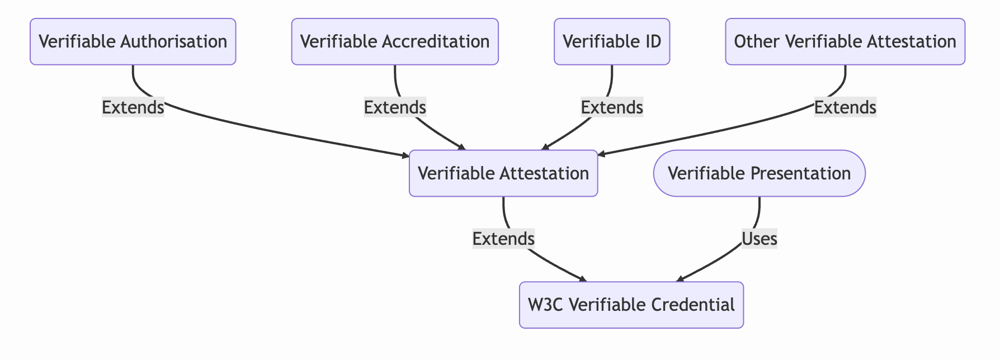

*Figure 3.1 - Classes of credentials*

The sections below refer to this diagram for each type of credential discussed.

#### 3.3.1.3 Authentication requires a VerifiableID

Not all types of Verifiable Credentials can be used as a mechanism for online authentication, because the Relying Party (the entity receiving the Verifiable Credential in an authentication process) needs to bind the identity of the user sending the credential to the claims attested about the subject inside the credential.

For example, in the case of a Diploma as a Verifiable Credential (a Verifiable Diploma), the credential is a Verifiable Attestation which indicates that the subject has certain skills or has achieved certain learning outcomes through formal or non-formal learning context. However, as in the case with normal diplomas in paper of PDF format, this credential can be presented by anyone that holds the credential. In other words, the credential binds the identity of the subject with the claims inside the credential, but does not bind the identity of the holder of the credential with the identity of the subject of the credential, which requires a special mechanism in the issuance process.

Most Verifiable Credentials will be issued as Verifiable Attestations, acting as efficient machine-processable and verifiable equivalent to their analog counterparts. Their purpose is to attest some attributes about the subject of the credential and not act as a mechanism for online authentication.

Instead, **a VerifiableID is a special form of a Verifiable Credential that a natural or legal person can use in an electronic identification process as evidence of whom he/she/it is** (comparable with a passport, physical IDcard, driving licence, social security card, member-card…).

VerifiableIDs can be of different types and be issued by different entities with different levels of assurance (in eIDAS terminology). They are issued with the purpose of serving as authentication mechanisms in online processes. In the near future, VerifiableIDs of the highest level of assurance (LoA High) will be issued to citizens and businesses by their governments under eIDAS2.

We describe in this document a way to issue VerifiableID credentials and how a Relying Party can perform authentication by accepting that credential.

#### 3.3.1.4 Access Control requires a Verifiable Authorisation

Once the user is authenticated, the system should make a decision to grant or reject an access request to a protected resource from an already authenticated subject, based on what the subject is authorised to access.

Let's take the example of when a Service Provider signs an agreement with a Service Consumer organisation (a legal person), and the Service Provider wants to allow access to some services to employees of the Consumer organisation under the conditions of the agreement.

In most cases, granting access is not an all-or-nothing decision. In general, the agreement between the Service Provider and Service Consumer specifies that only a subset of the employees of the Consumer organisation can access the services, and even in that subset not all employees have the same powers when accessing the services. For example, some employees have access to the administration of the service, some can perform some create/update/delete operations in a subset of the services, and some employees can only have read access to a subset of the services.

To allow this granularity in an authentication and access control process, in general the entity willing to perform an action on a protected resource has to present (in a Verifiable Presentation) a VerifiableID and possibly one or more additional Verifiable Attestations.

At least one of the credentials should include claims identifying the employee (or any other subject) and a formal description of the concrete powers that have been delegated by the legal representative of the organisation, enabling the determination by the Service Provider whether the user is entitled to access a service and the operations that the user can perform on that service.

We define later a standard mechanism and format for a Verifiable Credential that enables this functionality in a simple, secure and with high degree of legal certainty compatible with eIDAS.

Such a credential is called a Verifiable Authorization, represented in the figure above.

#### 3.3.1.5 Combining VerifiableID and Verifiable Authorisation in the LEARCredential

In many use cases, it is possible to simplify the authentication and access control by combining in a single credential both a VerifiableID (for authentication) and a Verifiable Authorisation (for access control).

The resulting credential is called LEARCredential and it is very useful when the holder/subject wants to use decentralised IAM mechanisms implemented by Relying Parties which are federated in a decentralised way using a common Trust Anchor Framework.

The concept of LEARCredential is described in the diagram above.

The user will authenticate using a special type of Verifiable Credential called LEARCredential.

To achieve a high level of legal certainty under eIDAS, the LEARCredential is:

- signed or sealed with an eIDAS certificate which is either:

  - a **certificate for electronic seals** issued to a legal person by a Qualified Trust Service Provider (QTSP) , or

  - a **certificate for electronic signatures**, issued to a **legal representative of the legal person** by a QTSP

- signed using the **JSON Advanced Electronic Signature** format described in [<u>ETSI TS 119 182-1 V1.1.1 (2021-03) - Electronic Signatures and Infrastructures (ESI); JAdES digital signatures; Part 1: Building blocks and JAdES baseline signatures</u>](https://www.etsi.org/deliver/etsi_ts/119100_119199/11918201/01.01.01_60/ts_11918201v010101p.pdf)

The LEARCredential includes claims identifying the user and a description of the concrete powers that have been delegated by the legal representative of the organisation.

By signing/sealing the credential with an eIDAS certificate, the legal representative attests that the powers described in the credential have been delegated to the user (maybe under some conditions, also described in the credential).

In this way, the LEARCredential has the same legal status as any other document in other formats (e.g., PDF) signed in an eIDAS-compliant way, but with the efficiency provided by the Verifiable Credential format.

In addition, the LEARCredential includes cryptographic material that allows the user to **employ the credential as an online authentication mechanism**, by proving that the holder of the credential is the same user identified in the subject of the credential.

Any Verifier that trusts the eIDAS Trust Framework will be able to verify that:

- **The user presenting the LEARCredential is the same as the one identified in the subject of the credential**

- **A legal representative of the organisation has attested that the user has the powers described in the credential**

This enables the user presenting the LEARCredential to start the process and to provide any additional required documentation, preferably as additional Verifiable Credentials to enable automatic verification of compliance with the process requirements (including Gaia-X credentials issued by the Compliance Service of Gaia-X).

Both types of eIDAS certificates mentioned above are an electronic attestation **that links electronic seal/signature validation data to a legal person and confirms the name of that person**. This way, the certificate, usually linked to the sealed/signed document, can be used to verify the identity of the creator of the seal/signature and whether the document has been sealed/signed using the corresponding private key.

Before issuing a certificate like the above, the QTSP performs validations against Authentic Sources to authenticate the identity of the organisation:

- The data concerning the business name or corporate name of the organisation.

- The data relating to the constitution and legal status of the subscriber.

- The data concerning the extent and validity of the powers of representation of the applicant.

- The data concerning the tax identification code of the organisation or equivalent code used in the country to whose legislation the subscriber is subject.

The person controlling the above certificates will appoint a legal entity representative by generating and signing a Verifiable Credential which:

- Includes identification data of an employee of the organisation

- Includes claims stating the delegation of specific powers to perform a set of specific processes on behalf of the organisation

- Includes a public key where the corresponding private key is controlled by the employee, enabling him to prove that he is the holder of the credential when it is being used in an authentication process like the ones used as examples in this document.

The LEARCredential uses the did:elsi method for the identifiers of legal persons involved in the process, to facilitate the DID resolution and linkage with the eIDAS certificates. The did:elsi method is specified in [<u>DID ETSI Legal person Semantic Identifier Method Specification (did:elsi)</u>](https://alastria.github.io/did-method-elsi/).

The high-level view of an example process is described in the following diagram, when a COO (Chief Operating Officer) appoints an employee to perform some processes (this is an example instance of a LEARCredential):

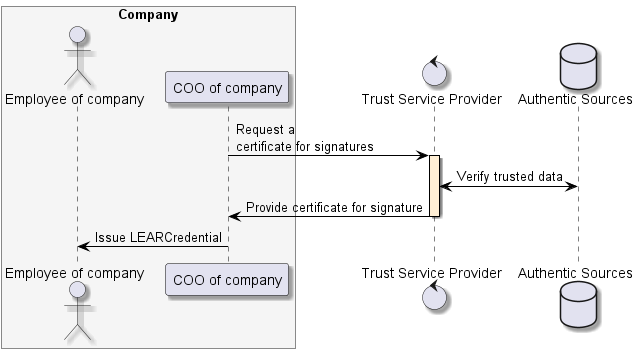

*Figure 3.2 - High level view of issuance of LEARCredential*

#### 3.3.1.6 The LEARCredential for some identification processes

**Any entity can issue VerifiableIDs**, though the acceptance by Relying Parties can not be ensured because it is the Relying Party the only one deciding if it trusts on the issuer and its process for generating the VerifiableID.

DOME will make use of the future eIDAS2 VerifiableIDs when they are available and when they make sense in the context of DOME. But DOME defines some specific types of VerifiableIDs that are derived from eIDAS certificates for signatures/seals using the regulated standards for signatures, achieving a level of assurance that provides an acceptable level of legal certainty and reduced risk of repudiation.

An example is the LEARCredential described in a section above, which has the same level of legal certainty as any document signed with the same certificates (like a contract or an invoice).

Similarly, a Product provider (e.g. GoodAir) who decides to use the DOME Trust and IAM framework or a compatible one for managing access to associated services by customers of their products will typically define specific types of VerifiableIDs if the standard ones in DOME or the existing and widely accepted ones are not suitable for the provider. In general, if a provider can use an existing and already used VerifiableID then it will facilitate potential customers access to its product because issuers of the VerifiableID do not have to modify or adapt their existing issuing processes.

### 3.3.2 The LEARCredential through an example

In this section we describe in detail the LEARCredential and for illustrative purposes we use example attributes from a fictitious ecosystem whose participants are described in Appendix [<u>Example scenario: Participants in the ecosystem</u>](https://alastria.github.io/did-method-elsi/authnplain.xhtml#participants).

In this example the LEARCredential will be generated using the eIDAS certificate of the COO of the organisation that will be issuing the credential.

The credential will be generated with an application that the COO will use as Issuer of the LEARCredential and that allows the employee to receive the credential using his credential wallet, using \[[<u>OpenID.VCI</u>](https://alastria.github.io/did-method-elsi/authnplain.xhtml#bib-openid.vci)\] to achieve compliance with the EUDI Wallet ARF.

This application enables the COO to attest the information required to create the LEARCredential, specifying the employee information and the specific type of LEARCredential. In general, there may be different instances of LEARCredentials for different purposes. One employee can have more than one LEARCredential, each having a different delegation of powers for different environments.

The specific detailed use case here is the issuance of a LEARCredential to an employee to enable that employee to perform the onboarding process in an ecosystem. But exactly the same process with different attested attributes can be used by any organisation to issue credentials that can be accepted by other organisations for authentication and access control to any protected resources that they manage.

The essential components of a LEARCredential are the following:

- **Claims identifying the employee**

- **DID of the employee to enable authentication**

- **Claims identifying the legal representative**

- **The roles and duties of the LEAR**

- **Advanced/Qualified signature of the credential**

These concepts are elaborated in the following sections.

#### 3.3.2.1 Claims identifying the employee

These are claims identifying the subject of the credential, the person who will act as LEAR. Each ecosystem can define their own depending on their specific requirements.

In addition, each organisation can specify their own for enabling access to its products/services. However, it is recommended to use a set of claims that are agreed upon by all participants in the ecosystem unless there are specific requirements for not doing so. This includes not only the amount of claims but also their syntax and semantics.

For our example, we use the same that are used for accessing the European Commission portal. The claims in the credential are the digital equivalent of their analog counterparts, displayed here for illustration.

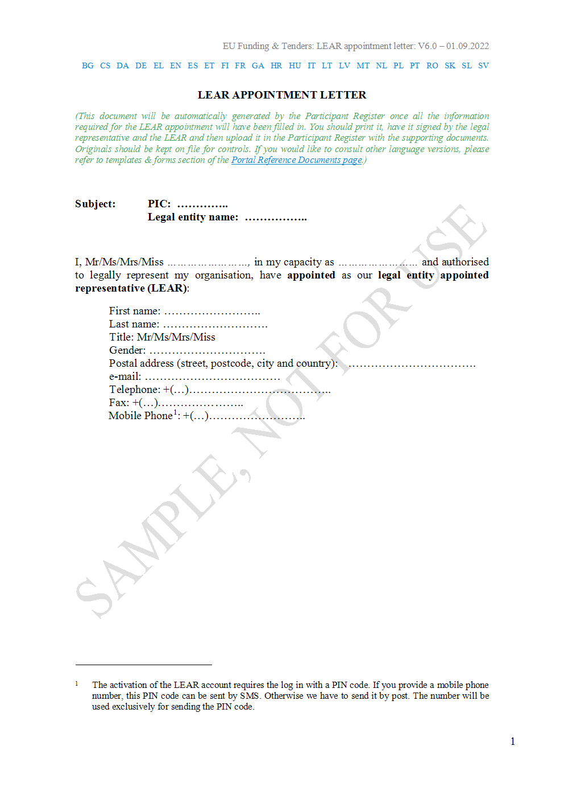

*Figure 3.3 - LEAR subject identification data.*

From the above form we can derive the following claims using the example data:

<table style="width:96%;">
<colgroup>
<col style="width: 96%" />
</colgroup>
<thead>
<tr>
<th style="text-align: left;">
<mark>{</mark>

<mark>"title": "Mr.",</mark>

<mark>"first_name": "John",</mark>

<mark>"last_name": "Doe",</mark>

<mark>"gender": "M",</mark>

<mark>"postal_address": "",</mark>

<mark>"email": "johndoe@goodair.com",</mark>

<mark>"telephone": "",</mark>

<mark>"fax": "",</mark>

<mark>"mobile_phone": "+34787426623"</mark>

<mark>}</mark>
</th>
</tr>
</thead>
<tbody>
</tbody>
</table>

#### 3.3.2.2 DID of the employee

In this example we use the did:key method for the DID of the employee, which provides a very high level of privacy and given the way the LEARCredential is generated it supports the verification of the chain of responsibility with a proper level of guarantee.

If the highest levels of assurance and legal compliance is desired and the employee has an eIDAS certificate for signatures (in this case a personal one, not one like the COO), we could use the did:elsi method for identification of the employee. However, the organisation (GoodAir in our example) should make sure that the employee is aware of and agrees to the possible privacy implications of doing so, given the personal details leaked from the eIDAS certificate.

Those personal details are exactly the same as if the employee signs any document with a digital certificate, but care should be taken by the organisation because in this case the signature would be done "on behalf of" his employer and not as an individual personal action.

Even though this is not unique to the did:elsi method, this also implies that the onboarding service has to handle those personal details in the same way as if it would be accepting any other document signed with a certificate for signatures, and ensure compliance with GDPR. This is "business as usual" when using digital signatures, but we want to make sure that this is taken care of when implementing the authentication and access control mechanisms described here.

In this example we assume the usage of the did:key method for the employee to protect his privacy as much as possible.

This DID for the employee is an additional claim to the ones presented above, using the id field in the credentialSubject object.

Using this DID method has an additional advantage: the DID identifier corresponds to a keypair that is generated during the LEARCredential issuance process, where the private key is generated by the wallet of the employee and it is always under his control.

This private key controlled by the employee can be used to sign challenges from Relying Parties that receive the credential to prove that the person sending the credential is the same person that is identified in the credentialSubject object of the LEARCredential.

It is this property that makes this credential a VerifiableID that can be used for online authentication.

An example DID for the employee could be:

<table style="width:96%;">
<colgroup>
<col style="width: 96%" />
</colgroup>
<thead>
<tr>
<th style="text-align: left;">
<mark>{</mark>

<mark>"id": "did:key:z6MkhaXgBZDvotDkL5257faiztiGiC2QtKLGpbnnEGta2doK"</mark>

<mark>}</mark>
</th>
</tr>
</thead>
<tbody>
</tbody>
</table>

In this example, the signatures performed with the private key can not be JAdES-compliant (\[[ETSI-JADES](https://alastria.github.io/did-method-elsi/authnplain.xhtml#bib-etsi-jades)\]), but if the LEARCredential is attached to any other credential that is signed with this private key, then they can be traced up to the eIDAS certificate of the COO and so the chain of responsibility can be determined..

With the DID for the employee, the set of claims identifying him would be then:

<table style="width:96%;">
<colgroup>
<col style="width: 96%" />
</colgroup>
<thead>
<tr>
<th style="text-align: left;">
<mark>{</mark>

<mark>"id": "did:key:z6MkhaXgBZDvotDkL5257faiztiGiC2QtKLGpbnnEGta2doK",</mark>

<mark>"title": "Mr.",</mark>

<mark>"first_name": "John",</mark>

<mark>"last_name": "Doe",</mark>

<mark>"gender": "M",</mark>

<mark>"postal_address": "",</mark>

<mark>"email": "johndoe@goodair.com",</mark>

<mark>"telephone": "",</mark>

<mark>"fax": "",</mark>

<mark>"mobile_phone": "+34787426623"</mark>

<mark>}</mark>
</th>
</tr>
</thead>
<tbody>
</tbody>
</table>

#### 3.3.2.3 legalRepresentative

This section identifies the natural person (the COO) who is a legal representative of the legal person (GoodAir) and that is nominating the employee identified in the credential.

<table style="width:96%;">
<colgroup>
<col style="width: 96%" />
</colgroup>
<thead>
<tr>
<th style="text-align: left;">
<mark>"legalRepresentative"</mark>: <mark>{</mark>

<mark>"cn": "56565656V Jesus Ruiz",</mark>

<mark>"serialNumber": "56565656V",</mark>

<mark>"organizationIdentifier": "VATES-12345678",</mark>

<mark>"o": "GoodAir",</mark>

<mark>"c": "ES"</mark>

<mark>}</mark>
</th>
</tr>
</thead>
<tbody>
</tbody>
</table>

<table style="width:96%;">
<colgroup>
<col style="width: 96%" />
</colgroup>
<thead>
<tr>
<th>
<strong><mark>NOTE: Attributes for natural and legal persons</mark></strong>

<mark>The attributes for natural persons and legal persons are derived from the <a href="https://ec.europa.eu/digital-building-blocks/wikis/download/attachments/467109280/eidas_saml_attribute_profile_v1.0_2.pdf?version=1&amp;modificationDate=1639417533738&amp;api=v2"><u>eIDAS SAML Attribute Profile (eIDAS Technical Sub-group, 22 June 2015)</u></a>.</mark>

<mark>All attributes for the eIDAS minimum data sets can be derived from the <a href="https://ec.europa.eu/isa2/solutions/core-vocabularies_en/"><u>ISA Core Vocabulary</u></a> and <a href="https://joinup.ec.europa.eu/collection/semic-support-centre/specifications"><u>https://joinup.ec.europa.eu/collection/semic-support-centre/specifications</u></a>.</mark>

<mark>In the case of natural persons refer to the <a href="https://joinup.ec.europa.eu/asset/core_person/asset_release/core-person-vocabulary"><u>Core Person Vocabulary</u></a> and in the case of legal persons refer to definitions for <a href="https://joinup.ec.europa.eu/asset/core_business/asset_release/core-business-vocabulary"><u>Core Business Vocabulary</u></a>.</mark>
</th>
</tr>
</thead>
<tbody>
</tbody>
</table>

#### 3.3.2.4 rolesAndDuties of the LEAR

The LEARCredential should include a formal description with the roles and duties of the LEAR. This is the digital equivalent to the analog description in our example, which uses natural language:

*Figure 3.4 - LEAR roles and duties.*

| We do not yet have defined the actual mechanism that will be used for describing formally the roles and duties of the LEAR. The way we specify them below is just an example. There is work ongoing to define the detailed mechanism formally (e.g. with ODRL), and it is expected to change. This example is intended only to describe the concepts in detail. |
|----|

The rolesAndDuties object points to an externally hosted object with the roles and duties of the LEAR. This external object can be either a machine-interpretable definition of the roles and duties in the credential, or just an external definition of the roles and duties in natural language. The ideal approach is the first option, expressing the semantics with a proper machine-readable language, because this will allow automatic access control at the granularity of the individual sentences of that expression language. The rolesAndDuties object can also have the definition embedded into it, instead of having a pointer to an external object.

A simplistic implementation of the object inside the credential could be:

<table style="width:96%;">
<colgroup>
<col style="width: 96%" />
</colgroup>
<thead>
<tr>
<th style="text-align: left;">
<mark>"rolesAndDuties"</mark>: <mark>[</mark>

<mark>{</mark>

<mark>"type": "LEARCredential",</mark>

<mark>"id": "https://dome-marketplace.eu/lear/v1/6484994n4r9e990494"</mark>

<mark>}</mark>

<mark>]</mark>
</th>
</tr>
</thead>
<tbody>
</tbody>
</table>

Where the last part of the url can correspond to the hash of the external linked document to ensure that any modification or tampering can be detected. The contents of that object at that url could be:

<table style="width:96%;">
<colgroup>
<col style="width: 96%" />
</colgroup>
<thead>
<tr>
<th style="text-align: left;">
<mark>[</mark>

<mark>{</mark>

<mark>"id": "https://dome-marketplace.eu/lear/v1/6484994n4r9e990494",</mark>

<mark>"target":"https://bae.dome-marketplace.eu/"</mark>

<mark>"roleNames": ["seller", "customer"]</mark>

<mark>}</mark>

<mark>]</mark>
</th>
</tr>
</thead>
<tbody>
</tbody>
</table>

In the above example, we have specified that the roles object referenced in the credential with id: https://dome-marketplace.eu//lear/v1/6484994n4r9e990494 is granting the employee of GoodAir (in our example) to access services in the DOME marketplace (specified with the field target) with the roles seller and customer (which are the roles of the [<u>FIWARE BAE component</u>](https://business-api-ecosystem.readthedocs.io/en/latest/index.html)).

If target is omitted, the roles would apply to any target organisation. If we need to specify more than one target organisation, the array should include as many objects as required.

#### 3.3.2.5 Assembling the pieces together

With the above values for the example, the complete LEARCredential would become something like this:

<table style="width:96%;">
<colgroup>
<col style="width: 96%" />
</colgroup>
<thead>
<tr>
<th style="text-align: left;">
<mark>{</mark>

<mark>"@context": [</mark>

<mark>"https://www.w3.org/ns/credentials/v2",</mark>

<mark>"https://dome-marketplace.eu//2022/credentials/learcredential/v1"</mark>

<mark>],</mark>

<mark>"id": "urn:did:elsi:25159389-8dd17b796ac0",</mark>

<mark>"type": ["VerifiableCredential", "LEARCredential"],</mark>

<mark>"issuer": {</mark>

<mark>"id": "did:elsi:VATES-12345678"</mark>

<mark>},</mark>

<mark>"issuanceDate": "2022-03-22T14:00:00Z",</mark>

<mark>"validFrom": "2022-03-22T14:00:00Z",</mark>

<mark>"expirationDate": "2023-03-22T14:00:00Z",</mark>

<mark>"credentialSubject": {</mark>

<mark>"id": "did:key:z6MkhaXgBZDvotDkL5257faiztiGiC2QtKLGpbnnEGta2doK",</mark>

<mark>"title": "Mr.",</mark>

<mark>"first_name": "John",</mark>

<mark>"last_name": "Doe",</mark>

<mark>"gender": "M",</mark>

<mark>"postal_address": "",</mark>

<mark>"email": "johndoe@goodair.com",</mark>

<mark>"telephone": "",</mark>

<mark>"fax": "",</mark>

<mark>"mobile_phone": "+34787426623",</mark>

<mark>"legalRepresentative": {</mark>

<mark>"cn": "56565656V Jesus Ruiz",</mark>

<mark>"serialNumber": "56565656V",</mark>

<mark>"organizationIdentifier": "VATES-12345678",</mark>

<mark>"o": "GoodAir",</mark>

<mark>"c": "ES"</mark>

<mark>},</mark>

<mark>"rolesAndDuties": [</mark>

<mark>{</mark>

<mark>"type": "LEARCredential",</mark>

<mark>"id": "https://dome-marketplace.eu//lear/v1/6484994n4r9e990494"</mark>

<mark>}</mark>

<mark>]</mark>

<mark>}</mark>

<mark>}</mark>
</th>
</tr>
</thead>
<tbody>
</tbody>
</table>

### 3.3.3 Issuing the LEARCredential

#### 3.3.3.1 Overview

In this example we use what we call a profile of the \[[<u>OpenID.VCI</u>](https://alastria.github.io/did-method-elsi/authnplain.xhtml#bib-openid.vci)\] protocol. The standard is very flexible, and we restrict the different options available in the standard and implement a set of the options with given values that are adequate for our use case, without impacting flexibility in practice.

Here we describe the flows and data structures comprehensively, including relevant excerpts of the OpenID specification in order to freeze a concrete specification for DOME development and enhance interoperability among components developed by different parties. New versions of this document will be made in the future and will evolve gradually to keep it in sync with the latest versions of the OpenID specifications, ensuring that components in DOME are updated in sync and are interoperable among them.

The following figure describes the main components that interact in the issuance of a credential in this profile.

The description of the issuance process is general enough to be used for many types of credentials, but the text includes notes describing the concrete application of the process to the case of the LEARCredential.

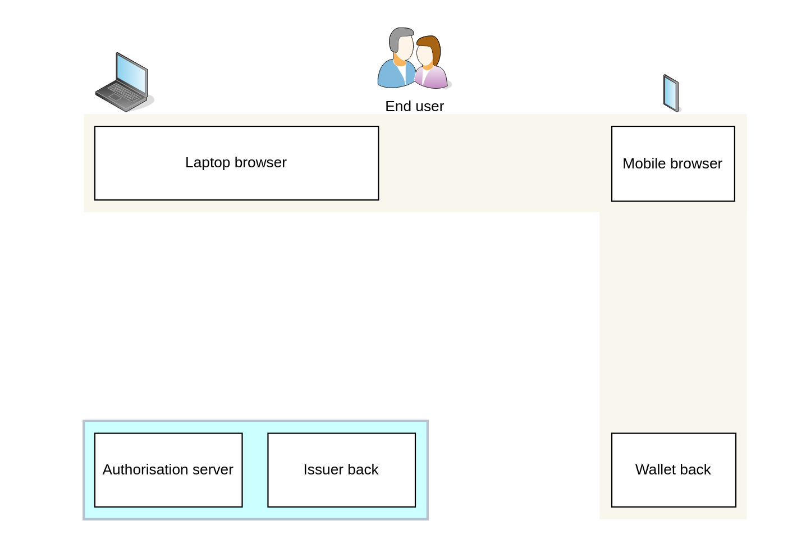

*Figure 3.5 - Overview of participants.*

**End user**

This profile is valid for both natural and juridical persons, but because we are focusing on the issuance of the LEARCredential, in the detailed examples below we assume a natural person as the user.

**Wallet**

The wallet is assumed to be a Web application with a wallet backend, maybe implemented as a PWA so it has some offline capabilities and can be installed in the device, providing a user experience similar to a native application. Private key management and most sensitive operations are performed in a backend server, operated by an entity trusted by the end user. Other profiles can support native and completely offline PWA mobile applications, for end users.

This type of wallet supports natural persons, juridical persons and natural persons who are legal entity representatives of juridical persons. For juridical persons the wallet is usually called an enterprise wallet but we will use here just the term wallet unless the distinction is required.

In this profile we assume that the wallet is not previously registered with the Issuer and that the wallet does not expose public endpoints that are called by the Issuer, even if the wallet has a backend server that could implement those endpoints. That makes the wallet implementations in this profile to be very similar in interactions to a full mobile implementation, making migration to a full mobile implementation easier.

In other words, from the point of view of the Issuer, the wallet in this profile is almost indistinguishable from a full mobile wallet.

**User Laptop**

For clarity of exposition, we assume in this profile that the End User starts the interactions with the Issuer with an internet browser (user agent) in his laptop. However, there is nothing in the interactions which limits those interactions to a laptop form factor and the End User can interact with any internet browser in any device (mobile, tablet, kiosk).

**Issuer**

In this profile we assume that the Issuer is composed of two components:

- **Authorization server**: the backend component implementing the existing authentication/authorization functionalities for the Issuer entity.

- **Issuer backend**: the main server implementing the business logic as a web application and additional backend APIs required for issuance of credentials.

The Issuer backend and the Authorization server could be implemented as a single component in an actual deployment, but we assume here that they are separated to make the profile more general, especially for big entities and also when using Trust Service Providers for cloud signature and credential issuance, for example.

**Authentication of End User and previous Issuer-End User relationship**

We assume that the Issuer and End User have a previous relationship and that the Issuer has performed the KYC required by regulation and needed to be able to issue VerifiableCredentials attesting some attributes about the End User. We assume that there is an existing trusted authentication mechanism (not necessarily related to Verifiable Credentials) that the End User employs to access protected resources from the Issuer. For example, the user is an employee or a customer of the Issuer, or the Issuer is a Local Administration and the End User is a citizen living in that city.

#### 3.3.3.2 Authentication

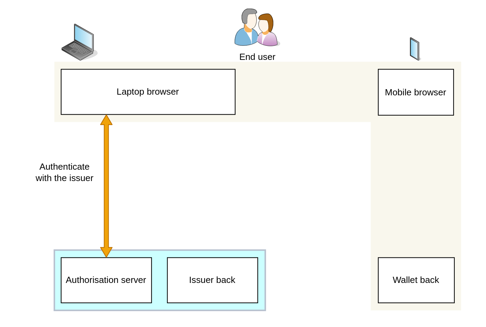

*Figure 3.6 **-** Issuance authentication.*

Before requesting a new credential, the End User has to authenticate with the Issuer with whatever mechanism is already implemented by the Issuer. This profile does not require that it is based on OIDC, Verifiable Credentials or any other specific mechanism.

The level of assurance (LoA) of this authentication mechanism is one of the factors that will determine the confidence that the Verifiers can have on the credentials received by them from a given Issuer.

<table style="width:96%;">
<colgroup>
<col style="width: 96%" />
</colgroup>
<thead>
<tr>
<th>
<strong><mark>NOTE: LEARCredential</mark></strong>

<mark>In the case of the LEARCredential, the End User (John Doe) is an employee of GoodAir and in order to receive the credential John first has to authenticate into the company systems using whatever mechanism GoodAir uses for employee authentication.</mark>

<mark>Being a modern company, GoodAir uses Verifiable Credentials IAM but this is not a requirement for the issuance of the LEARCredential.</mark>
</th>
</tr>
</thead>
<tbody>
</tbody>
</table>

#### 3.3.3.3 Credential Offer

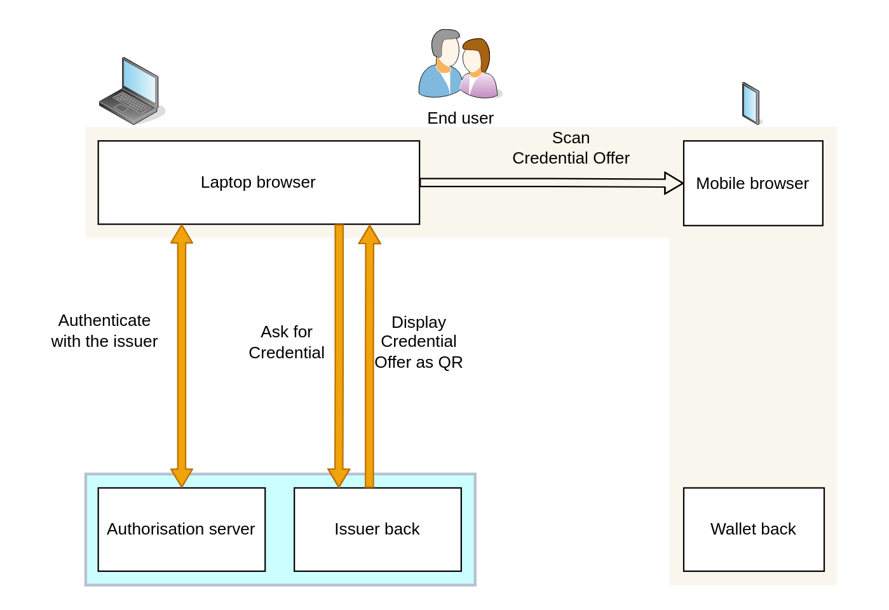

*Figure 3.7 **-** Credential offer.*

In this profile the wallet does not have to implement the Credential Offer Endpoint described in section 4 of \[[OpenID.VCI](https://alastria.github.io/did-method-elsi/authnplain.xhtml#bib-openid.vci)\].

Instead, the Credential Issuer renders a QR code containing a reference to the Credential Offer that can be scanned by the End-User using a Wallet, as described in section 4.1 of \[[OpenID.VCI](https://alastria.github.io/did-method-elsi/authnplain.xhtml#bib-openid.vci)\].

According to the spec, the Credential Offer object is a JSON object containing the Credential Offer parameters and can be sent by value or by reference. To avoid problems with the size of the QR travelling in the URL, this profile requires that the QR contains the credential_offer_uri, which is a URL using the https scheme referencing a resource containing a JSON object with the Credential Offer parameters. The credential_offer_uri endpoint should be implemented by the Issuer backend.

##### 3.3.3.3.1 Credential Offer Parameters

This profile restricts the options available in section 4.1.1 of \[[OpenID.VCI](https://alastria.github.io/did-method-elsi/authnplain.xhtml#bib-openid.vci)\]. The profile defines a Credential Offer object containing the following parameters:

- credential_issuer: *REQUIRED*. The URL of the Credential Issuer that will be used by the Wallet to obtain one or more Credentials.

- credentials: *REQUIRED*. A JSON array, where every entry is a JSON string. To achieve interoperability faster, this profile defines a global Trusted Credential Schemas List where well-known credential schemas are defined, in addition to the individual credentials that each Issuer can define themselves. The string value *MUST* be one of the id values in one of the objects in the credentials_supported metadata parameter of the Trusted Credential Schemas List (described later), or one of the id values in one of the objects in the credentials_supported Credential Issuer metadata parameter provided by the Credential Issuer. When processing, the Wallet *MUST* resolve this string value to the respective object. The credentials defined in the global Trusted Credential Schema List have precedence over the ones defined by the Credential Issuer.

<table style="width:96%;">
<colgroup>
<col style="width: 96%" />
</colgroup>
<thead>
<tr>
<th><blockquote>

<strong><mark>NOTE: LEARCredential</mark></strong>

<mark>The only credential being offered in our case is the LEARCredential, so this is the credential schema that should be specified here. The LEARCredential is a credential known globally to the DOME ecosystem, so its schema should be published and be available in the Trusted Credential Schemas List.</mark>

</blockquote></th>
</tr>
</thead>
<tbody>
</tbody>
</table>

- grants: *REQUIRED*. A JSON object indicating to the Wallet the Grant Type pre-authorized_code. This grant is represented by a key and an object, where the key is urn:ietf:params:oauth:grant-type:pre-authorized_code. In this profile the credential issuance flow requires initial authentication of the End User by the Credential Issuer, so the Pre-Authorized Code Flow achieves a good level of security and we do not need the more general Authorization Code Flow.  
  In other scenarios like when the wallet is a native mobile application and the user interacts with the Issuer exclusively with the mobile (without the laptop), then the Authorization Code Flow has to be used. This can be described in detail in a different profile.

The grant object contains the following values:

- pre-authorized_code: *REQUIRED*. The code representing the Credential Issuer's authorization for the Wallet to obtain Credentials of a certain type. This code *MUST* be short lived and single-use. This parameter value *MUST* be included in the subsequent Token Request with the Pre-Authorized Code Flow.

- user_pin_required: *REQUIRED*. The \[[OpenID.VCI](https://alastria.github.io/did-method-elsi/authnplain.xhtml#bib-openid.vci)\] standard says it is *RECOMMENDED*, but this profile specifies the user pin to achieve a greater level of security. This field is a boolean value specifying whether the Credential Issuer expects presentation of a user PIN along with the Token Request in a Pre-Authorized Code Flow. The default is false. This PIN is intended to bind the Pre-Authorized Code to a certain transaction in order to prevent replay of this code by an attacker that, for example, scanned the QR code while standing behind the legit user. It is *RECOMMENDED* to send a PIN via a separate channel. The PIN value *MUST* be sent in the user_pin parameter with the respective Token Request.

The following non-normative example shows a Credential Offer object where the Credential Issuer offers the issuance of one Credential ("LEARCredential"):

<table style="width:96%;">
<colgroup>
<col style="width: 96%" />
</colgroup>
<thead>
<tr>
<th style="text-align: left;">
<mark>{</mark>

<mark>"credential_issuer": "https://www.goodair.com",</mark>

<mark>"credentials": [</mark>

<mark>"LEARCredential"</mark>

<mark>],</mark>

<mark>"grants": {</mark>

<mark>"urn:ietf:params:oauth:grant-type:pre-authorized_code": {</mark>

<mark>"pre-authorized_code": "asju68jgtyk9ikkew",</mark>

<mark>"user_pin_required": <strong>true</strong></mark>

<mark>}</mark>

<mark>}</mark>

<mark>}</mark>
</th>
</tr>
</thead>
<tbody>
</tbody>
</table>

##### 3.3.3.3.2 Contents of the QR code

Below is a non-normative example of the Credential Offer displayed by the Credential Issuer as a QR code when the Credential Offer is passed by reference, as required in this profile:

<table style="width:96%;">
<colgroup>
<col style="width: 96%" />
</colgroup>
<thead>
<tr>
<th style="text-align: left;">
<mark>https://www.goodair.com/credential-offer?</mark>

<mark>credential_offer_uri<strong>=</strong>https%3A%2F%2Fserver%2Eexample%2Ecom%2Fcredential-offer%2F5j349k3e3n23j</mark>
</th>
</tr>
</thead>
<tbody>
</tbody>
</table>

Which in plain text would be:

<table style="width:96%;">
<colgroup>
<col style="width: 96%" />
</colgroup>
<thead>
<tr>
<th style="text-align: left;">
<mark>https://www.goodair.com/credential-offer?</mark>

<mark>credential_offer_uri<strong>=</strong>https://www.goodair.com/credential-offer/5j349k3e3n23j</mark>
</th>
</tr>
</thead>
<tbody>
</tbody>
</table>

To increase security, the Issuer *MUST* make sure that every Credential Offer URI is unique for all credential offers created. This is the purpose of the nonce (5j349k3e3n23j) at the end of the url in the example. Issuers can implement whatever mechanism they wish, as far as it is transparent to the wallet.

#### 3.3.3.4 Credential Issuer Metadata

The Wallet backend retrieves the Credential Issuer's configuration using the Credential Issuer Identifier that was received in the Credential Offer.

A Credential Issuer is identified in this context by a case sensitive URL using the https scheme that contains scheme, host and, optionally, port number and path components, but no query or fragment components. No DID is used in this context.

Credential Issuers *MUST* make a JSON document available at the path formed by concatenating the string /.well-known/openid-credential-issuer to the Credential Issuer Identifier. If the Credential Issuer value contains a path component, any terminating / *MUST* be removed before appending /.well-known/openid-credential-issuer.

openid-credential-issuer *MUST* point to a JSON document compliant with this specification and *MUST* be returned using the application/json content type.

The retrieval of the Credential Issuer configuration is illustrated below.

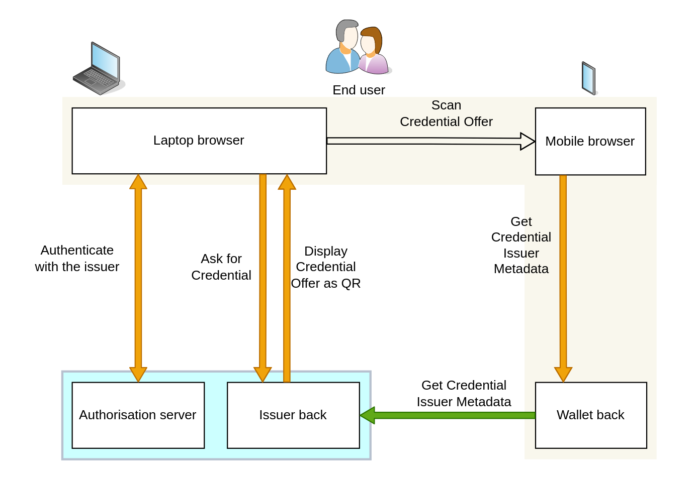

*Figure 3.8 - Issuer metadata.*

##### 3.3.3.4.1 Credential Issuer Metadata Parameters

The object contained in openid-credential-issuer contains the following:

- credential_issuer: *REQUIRED*. The Credential Issuer's identifier.

- credential_endpoint: *REQUIRED*. URL of the Credential Issuer's Credential Endpoint. This URL *MUST* use the https scheme and *MAY* contain port, path and query parameter components.

- credentials_supported: *REQUIRED*. A JSON array containing a list of JSON objects, each of them representing metadata about a separate credential type that the Credential Issuer can issue. The JSON objects in the array *MUST* conform to the structure of the section.

This profile does not make use of the following parameters:

- authorization_server parameter, because it uses the pre-authorized_code Grant type.

- batch_credential_endpoint parameter. It indicates that the Credential Issuer does not support the Batch Credential Endpoint.

- display parameter.

#### 3.3.3.5 OAuth 2.0 Authorization Server Metadata

This specification also defines a new OAuth 2.0 Authorization Server metadata \[[RFC8414](https://alastria.github.io/did-method-elsi/authnplain.xhtml#bib-rfc8414)\] parameter to publish whether the AS that the Credential Issuer relies on for authorization, supports anonymous Token Requests with the Pre-authorized Grant Type. It is defined as follows:

- pre-authorized_grant_anonymous_access_supported: *OPTIONAL*. A JSON Boolean indicating whether the issuer accepts a Token Request with a Pre-Authorized Code but without a client id. The default is false.

#### 3.3.3.6 Access Token

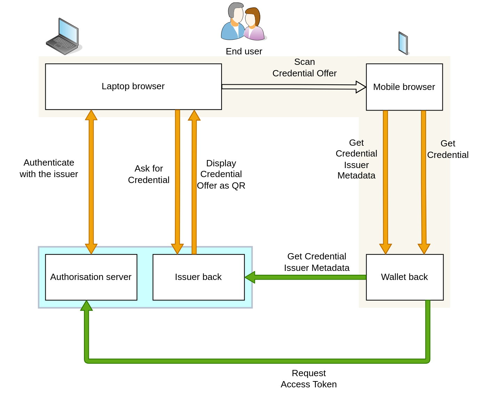

*Figure 3.9 - Access Token.*

The Wallet invokes the Token Endpoint implemented by the Authorization Server, which issues an Access Token and, optionally, a Refresh Token in exchange for the Pre-authorized Code that the wallet obtained in the Credential Offer.

##### 3.3.3.6.1 Token Request

After the wallet receives the Credential Issuer Metadata, a Token Request is made as defined in Section 4.1.3 of \[[RFC6749](https://alastria.github.io/did-method-elsi/authnplain.xhtml#bib-rfc6749)\].

The following are the extension parameters to the Token Request used in a Pre-Authorized Code Flow as used in this profile:

- pre-authorized_code: *REQUIRED*. The code representing the authorization to obtain Credentials of a certain type.

- user_pin: *OPTIONAL*. String value containing a user PIN. This value *MUST* be present if user_pin_required was set to true in the Credential Offer. The string value *MUST* consist of a maximum of 8 numeric characters (the numbers 0 - 9).

In this profile the Wallet does not have to authenticate when using the Token Endpoint, because we are using the Pre-Authorized Code Grant Type, given the level of trust between the Issuer and the End User and that authentication was already performed at the beginning of the flow.

Below is a non-normative example of a Token Request:

<table style="width:96%;">
<colgroup>
<col style="width: 96%" />
</colgroup>
<thead>
<tr>
<th style="text-align: left;">
<mark><strong>POST</strong> /token <strong>HTTP/</strong>1.1</mark>

<mark>Host<strong>:</strong> server.example.com</mark>

<mark>Content-Type<strong>:</strong> application/x-www-form-urlencoded</mark>

<mark>grant_type=urn%3Aietf%3Aparams%3Aoauth%3Agrant-type%3Apre-authorized_code</mark>

<mark>&amp;pre-authorized_code=SplxlOBeZQQYbYS6WxSbIA</mark>

<mark>&amp;user_pin=493536</mark>
</th>
</tr>
</thead>
<tbody>
</tbody>
</table>

##### 3.3.3.6.2 Successful Token Response

Token Responses are made as defined in \[[RFC6749](https://alastria.github.io/did-method-elsi/authnplain.xhtml#bib-rfc6749)\].

In addition to the response parameters defined in \[[RFC6749](https://alastria.github.io/did-method-elsi/authnplain.xhtml#bib-rfc6749)\], the Authorization Server returns the following parameters:

- c_nonce: *REQUIRED*. JSON string containing a nonce to be used to create a proof of possession of key material when requesting a Credential. The Wallet *MUST* use this nonce value for its subsequent credential requests until the Credential Issuer provides a fresh nonce.

- c_nonce_expires_in: *REQUIRED*. JSON integer denoting the lifetime in seconds of the c_nonce.

Below is a non-normative example of a Token Response:

<table style="width:96%;">
<colgroup>
<col style="width: 96%" />
</colgroup>
<thead>
<tr>
<th style="text-align: left;">
<mark><strong>HTTP/</strong>1.1 200 <strong>OK</strong></mark>

<mark>Content-Type<strong>:</strong> application/json</mark>

<mark>Cache-Control<strong>:</strong> no-store</mark>

<mark>{</mark>

<mark>"access_token": "eyJhbGciOiJSUzI1NiIsInR5cCI6Ikp..sHQ",</mark>

<mark>"token_type": "bearer",</mark>

<mark>"expires_in": 86400,</mark>

<mark>"c_nonce": "tZignsnFbp",</mark>

<mark>"c_nonce_expires_in": 86400</mark>

<mark>}</mark>
</th>
</tr>
</thead>
<tbody>
</tbody>
</table>

##### 3.3.3.6.3 Token Error Response

If the Token Request is invalid or unauthorised, the Authorization Server constructs the error response as defined in section 6.3 of \[[OpenID.VCI](https://alastria.github.io/did-method-elsi/authnplain.xhtml#bib-openid.vci)\].

#### 3.3.3.7 Request and receive Credential

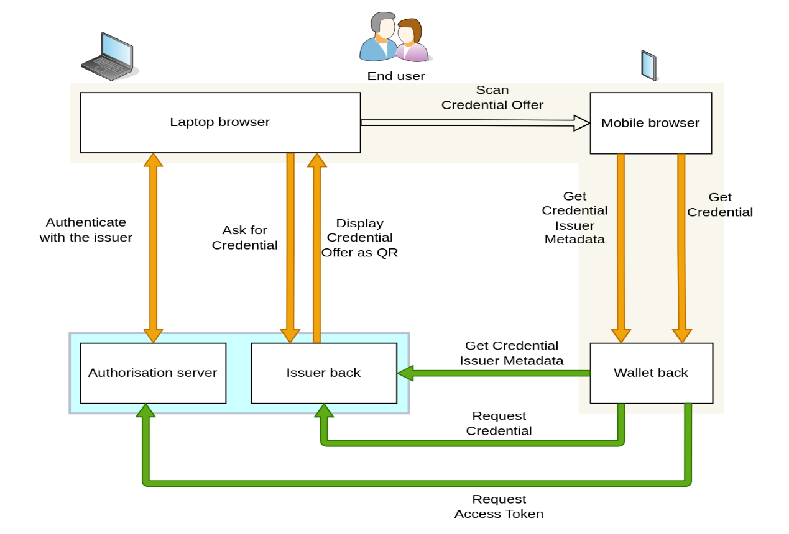

*Figure 3.10 - Request and receive Credential.*

The Wallet backend invokes the Credential Endpoint, which issues a Credential as approved by the End-User upon presentation of a valid Access Token representing this approval.

Communication with the Credential Endpoint MUST utilise TLS.

The client can request issuance of a Credential of a certain type multiple times, e.g., to associate the Credential with different public keys/Decentralised Identifiers (DIDs) or to refresh a certain Credential.

If the Access Token is valid for requesting issuance of multiple Credentials, it is at the client's discretion to decide the order in which to request issuance of multiple Credentials requested in the Authorization Request.

##### 3.3.3.7.1 Binding the Issued Credential to the identifier of the End-User possessing that Credential

The Issued Credential MUST be cryptographically bound to the identifier of the End-User who possesses the Credential. Cryptographic binding allows the Verifier to verify during the presentation of a Credential that the End-User presenting a Credential is the same End-User to whom that Credential was issued.

The Wallet has to provide proof of control alongside key material using the mechanism described below.

##### 3.3.3.7.2 Credential Request

The Wallet backend makes a Credential Request to the Credential Endpoint by sending the following parameters in the entity-body of an HTTP POST request using the application/json media type.

- format: *REQUIRED*. This profile uses the Credential format identifier jwt_vc_json.

- proof: *OPTIONAL*. JSON object containing proof of possession of the key material the issued Credential shall be bound to. The specification envisions use of different types of proofs for different cryptographic schemes. The proof object *MUST* contain a proof_type claim of type JSON string denoting the concrete proof type. This type determines the further claims in the proof object and its respective processing rules. Proof types are defined in Section [<u>2.3.7.2.1</u> <u>Proof Type</u>](https://alastria.github.io/did-method-elsi/authnplain.xhtml#proof_type).

The proof element *MUST* incorporate a c_nonce value generated by the Credential Issuer and the Credential Issuer Identifier (audience) to allow the Credential Issuer to detect replay. The way that data is incorporated depends on the proof type. In a JWT, for example, the c_nonce is conveyed in the nonce claim whereas the audience is conveyed in the aud claim. In a Linked Data proof, for example, the c_nonce is included as the challenge element in the proof object and the Credential Issuer (the intended audience) is included as the domain element.

###### 3.3.3.7.2.1 Proof Type

This specification defines only one value for proof_type:

jwt: objects of this type contain a single jwt element with a JWS \[[RFC7515](https://alastria.github.io/did-method-elsi/authnplain.xhtml#bib-rfc7515)\] as proof of possession. The JWT *MUST* contain the following elements:

- in the JOSE Header,

  - typ: *REQUIRED*. *MUST* be openid4vci-proof+jwt, which explicitly types the proof JWT as recommended in Section 3.11 of \[[RFC8725](https://alastria.github.io/did-method-elsi/authnplain.xhtml#bib-rfc8725)\].

  - alg: *REQUIRED*. A digital signature algorithm identifier such as per IANA "JSON Web Signature and Encryption Algorithms" registry. *MUST NOT* be none or an identifier for a symmetric algorithm (MAC).

  - kid: *REQUIRED*. JOSE Header containing the key ID. The Credential will be bound to a DID, so the kid refers to a DID URL which identifies a particular key in the DID Document that the Credential will be bound to.

- in the JWT body,

  - aud: *REQUIRED* (string). The value of this claim *MUST* be the Credential Issuer URL of the Credential Issuer.

  - iat: *REQUIRED* (number). The value of this claim *MUST* be the time at which the proof was issued using the syntax defined in \[[RFC7519](https://alastria.github.io/did-method-elsi/authnplain.xhtml#bib-rfc7519)\].

  - nonce: *REQUIRED* (string). The value type of this claim *MUST* be a string, where the value is the c_nonce provided by the Credential Issuer.

The Credential Issuer *MUST* validate that the proof is actually signed by a key identified in the JOSE Header.

Below is a non-normative example of a proof parameter (dots in the middle of jwt for display purposes only), for the example of issuing a LEARCredential:

<table style="width:96%;">
<colgroup>
<col style="width: 96%" />
</colgroup>
<thead>
<tr>
<th style="text-align: left;">
<mark>{</mark>

<mark>"proof_type": "jwt",</mark>

<mark>"jwt": "eyJraWQiOiJkaWQ6ZXhhb....aZKPxgihac0aW9EkL1nOzM"</mark>

<mark>}</mark>
</th>
</tr>
</thead>
<tbody>
</tbody>
</table>

where the JWT looks like this:

<table style="width:96%;">
<colgroup>
<col style="width: 96%" />
</colgroup>
<thead>
<tr>
<th style="text-align: left;">
<mark>{</mark>

<mark>"typ": "openid4vci-proof+jwt",</mark>

<mark>"alg": "ES256",</mark>

<mark>"kid":"did:key:z6MkhaXgBZDvotDkL5257faiztiGiC2QtKLGpbnnEGta2doK"</mark>

<mark>}</mark>

<mark>{</mark>

<mark>"iss": "s6BhdRkqt3",</mark>

<mark>"aud": "https://www.goodair.com",</mark>

<mark>"iat": 1659145924,</mark>

<mark>"nonce": "tZignsnFbp"</mark>

<mark>}</mark>
</th>
</tr>
</thead>
<tbody>
</tbody>
</table>

In the example of a LEARCredential, the wallet generates a pair of public/private keys and a did:key identifier which is univocally related to the public key. This is the reason why the kid field above is exactly the DID identifier under this DID method. The did:key method is very simple and achieves a very high degree of privacy, allowing the creation of many different identifiers which can be one-use only if so desired.

The did:key method is perfect for the requirements of our usage of the LEARCredential. Any other suitable DID method can be used if it is required, but this is out of scope for this profile.

##### 3.3.3.7.3 Credential Response

This profile restricts Credential Response to be Synchronous and Deferred response is not used. The Credential Issuer *MUST* be able to immediately issue a requested Credential and send it to the Client.

The following claims are used in the Credential Response:

- format: *REQUIRED*. JSON string denoting the format of the issued Credential. This profile uses the format identifier jwt_vc_json.

- credential: *REQUIRED*. Contains issued Credential. *MUST* be a JSON string.

- c_nonce: *OPTIONAL*. JSON string containing a nonce to be used to create a proof of possession of key material when requesting a Credential. When received, the Wallet *MUST* use this nonce value for its subsequent credential requests until the Credential Issuer provides a fresh nonce.

- c_nonce_expires_in: *OPTIONAL*. JSON integer denoting the lifetime in seconds of the c_nonce.

Below is a non-normative example of a Credential Response:

<table style="width:96%;">
<colgroup>
<col style="width: 96%" />
</colgroup>
<thead>
<tr>
<th style="text-align: left;">
<mark><strong>HTTP/</strong>1.1 200 <strong>OK</strong></mark>

<mark>Content-Type<strong>:</strong> application/json</mark>

<mark>Cache-Control<strong>:</strong> no-store</mark>

<mark>{</mark>

<mark>"format": "jwt_vc_json",</mark>

<mark>"credential" : "LUpixVCWJk0eOt4CXQe1NXK....WZwmhmn9OQp6YxX0a2L",</mark>

<mark>"c_nonce": "fGFF7UkhLa",</mark>

<mark>"c_nonce_expires_in": 86400</mark>

<mark>}</mark>
</th>
</tr>
</thead>
<tbody>
</tbody>
</table>

##### 3.3.3.7.4 Credential Error Response

When the Credential Request is invalid or unauthorised, the Credential Issuer constructs the error response as defined in section 7.3.1 of OIDCVCI.

##### 3.3.3.7.5 Credential Issuer Provided Nonce

Upon receiving a Credential Request, the Credential Issuer MUST require the Wallet to send a proof of possession of the key material it wants a Credential to be bound to. This proof MUST incorporate a nonce generated by the Credential Issuer. The Credential Issuer will provide the client with a nonce in an error response to any Credential Request not including such a proof or including an invalid proof.

Below is a non-normative example of a Credential Response with the Credential Issuer requesting a Wallet to provide in a subsequent Credential Request a proof that is bound to a c_nonce:

<table style="width:96%;">
<colgroup>
<col style="width: 96%" />
</colgroup>
<thead>
<tr>
<th style="text-align: left;">
<mark><strong>HTTP/</strong>1.1 400 <strong>Bad Request</strong></mark>

<mark>Content-Type<strong>:</strong> application/json</mark>

<mark>Cache-Control<strong>:</strong> no-store</mark>

<mark>{</mark>

<mark>"error": "invalid_or_missing_proof",</mark>

<mark>"error_description":</mark>

<mark>"Credential Issuer requires proof to be bound to a Credential Issuer provided nonce.",</mark>

<mark>"c_nonce": "8YE9hCnyV2",</mark>

<mark>"c_nonce_expires_in": 86400</mark>

<mark>}</mark>
</th>
</tr>
</thead>
<tbody>
</tbody>
</table>

### 3.3.4 Authenticating with Verifiable Credentials

#### 3.3.4.1 Overview

Authentication requires a special type of Verifiable Credential called a VerifiableID. For the examples illustrating the mechanism we will use a LEARCredential, which is at the same time a VerifiableID and a Verifiable Authorization.

For the explanation we will use the following figure which is based on [<u>NIST Special Publication 800-178: A Comparison of Attribute Based Access Control (ABAC) Standards for Data Service Applications</u>](https://nvlpubs.nist.gov/nistpubs/SpecialPublications/NIST.SP.800-178.pdf) which describes a reference architecture with necessary functional components to achieve authentication and enforcement of the authorization policies. The authorization process depends on four layers of functionality: **Enforcement**, **Decision**, **Access Control Data**, and **Administration**.

The diagram uses the logical concepts also used in the XACML reference architecture, but the description is agnostic to the actual policy language used in a concrete implementation.

In this description we assume that the user is a natural person who wants to access a protected resource. However, the architecture supports machine-to-machine (M2M) interactions. The differences will be described in the description when they are relevant.

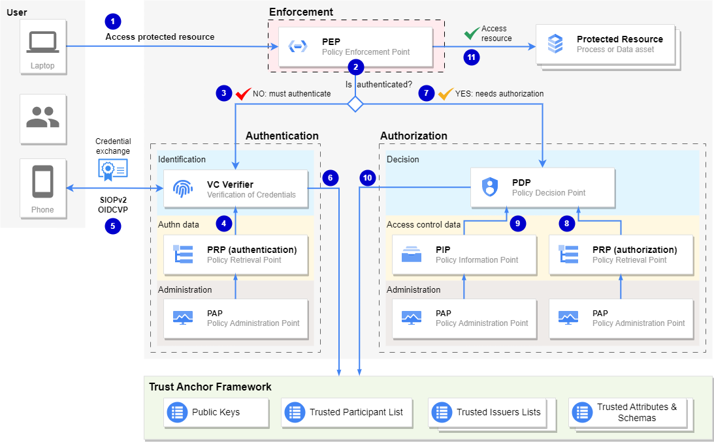

*Figure 3.11 - Architecture overview*

The high level flow is the following:

- [**<u>1</u>**](https://alastria.github.io/did-method-elsi/authnplain.xhtml#983.1) The user sends a request to access a protected resource managed by the Relying Party.

  [**<u>2</u>**](https://alastria.github.io/did-method-elsi/authnplain.xhtml#985.2) Every request to a protected resource is intercepted by the PEP (Policy Enforcement Point). The PEP is normally implemented as a reverse proxy or API gateway, so all calls to protected resources entering the organisation are intercepted and forwarded only if they are accepted. If the request does not come with authentication information, there are several high level scenarios which are possible:

  - If the user is a machine using an API, the request is rejected with an error. The caller is responsible for authenticating before retrying, which can be done using the metadata about the Relying Party available at the standard OpenID endpoints.

  - If the user is a natural person using a browser for navigating the portal of the Relying Party, the typical approach is to redirect the browser to the authentication component using an HTTP Status of 302. The redirection includes enough information so the authentication component can send back the user to the original request if the user completes authentication successfully.

  Alternatively, the request can include authentication information which has been obtained before via an authentication process. If this is the case, the PEP goes directly into the authentication phase, described later in section [<u>Access control with Verifiable Credentials</u>](https://alastria.github.io/did-method-elsi/authnplain.xhtml#accesscontrol).

  [**<u>3</u>**](https://alastria.github.io/did-method-elsi/authnplain.xhtml#994.3) The user is redirected to the authentication component. As mentioned before, alternatively the authentication component can be accessed directly by the user before trying to access the protected resource. This would be the expected behaviour of a user who knows that authentication is required. The mechanism described here supports all possible scenarios both for natural persons and machines.  
  An example flow with a natural person would be: The user navigates first to a general Login page in the portal of the Relying Party and authenticates. After authentication the portal presents a collection of services that the user can access. The user selects one of the services/operations and the Relying Party executes the operation if the user is authorised to do so.

  [**<u>4</u>**](https://alastria.github.io/did-method-elsi/authnplain.xhtml#998.4) The Verifiable Credentials verifier component of the Relying Party retrieves the credentials that are required for authentication. If the user has been redirected when trying to access a protected resource, the redirection provides information about the operation and protected resource that was trying to access, so there may be more credentials required than just a VerifiableID.

  If the user accessed the Login page directly, the VC Verifier component does not have information about the resource that the user intends to access, so it can request just a VerifiableID.

  [**<u>5</u>**](https://alastria.github.io/did-method-elsi/authnplain.xhtml#1002.5) The VC Verifier component of the Relying Party and the Wallet of the user engage in a Verifiable Presentation Exchange flow, where the result is that the VC Verifier receives a VerifiableID and possibly additional Verifiable Credentials as determined in step 4.

  [**<u>6</u>**](https://alastria.github.io/did-method-elsi/authnplain.xhtml#1004.6) The authorization mechanism uses the Trust Framework to query different Trusted Lists that are needed to evaluate the policy rules applicable to the request and compute a decision.

> The Trust Framework is composed of one or more Trusted Lists where each list is specialised in some specific domain of trust. For example, the Trust Framework contains Trusted Lists with the schema definitions used for the well-known types of Verifiable Credentials in the ecosystem. In this way, if the Verifiable Registry used for the Trust Framework is based on a DLT network (or several federated networks), the schemas can be published in a trusted and resilient manner reducing the risk of malicious tampering and keeping a record of the history of modifications.  
> But the most interesting Trusted Lists in the Trust Framework are the Trusted Issuers Lists, which provide the mechanism to efficiently and securely verify that the issuer of a given credential is a Trusted Issuer of that type of credentials.  
> It has to be noticed that even though most Trusted Issuer Lists are global (used by all participants in the ecosystem) and have essentially public information, there may be some specialised lists that are private to one or more organisations and specialised in some specific requirement.
>
> In this way, there may be some lists that are specific to the products that one organisation provides to other participants in the ecosystem. For example, there may be a Trusted Issuer List private to one organisation which is updated with the identity of a participant when that participant acquires access to some product provided by that organisation.  
> For example, this "product-specific" Trusted Issuer List is queried when performing authorization if the related policy rules specify that the issuer of the Verifiable Credential received in the request should have acquired the product that the request is trying to access.
>
> However, as mentioned before, the set of "internal" and "external" Trusted Lists to query is not hardcoded but it depends on the specific policy rules that should be applied to the request when computing the decision to grant access or not.  
> In this way, the system provides a great deal of flexibility on how access control is performed.  
> For simplicity, the diagram below shows the query of the Trusted Issuer Lists as a single interaction to a single box, but the actual interactions can be very complex if required. In addition, the diagram does not specify whether the list is "private" or "global".

The following sections elaborate in more detail in each of the interactions.

#### 3.3.4.2 Starting the OpenID for Verifiable Presentations flow

In this section we assume that the user tries to access a protected resource and that the user is not authenticated. The flow when the user is already authenticated is the same, just skipping the authentication phase (steps 1 to 6).

The authentication process starts an OpenID for Verifiable Presentations flow combined with the Self-Issued OP v2 specification \[[<u>OpenID.SIOP2</u>](https://alastria.github.io/did-method-elsi/authnplain.xhtml#bib-openid.siop2)\], where the VC Verifier component of the portal plays the role of a Relying Party (RP in Open ID Connect terminology) and the wallet of the user is a Self-Issued IdP.

In this step, the Verifier has to send an Authorization Request to the wallet. But as a Self-Issued OP may be running locally as a native application or PWA), the RP may not have a network-addressable endpoint to communicate directly with the OP. We have to leverage the implicit flow of OpenID Connect to communicate with such locally-running Ops, as described in \[[<u>OpenID.SIOP2</u>](https://alastria.github.io/did-method-elsi/authnplain.xhtml#bib-openid.siop2)\].

We use a QR code to start the process and allow the wallet to receive the Authorization Request from the Verifier, and respond with an Authorization Response, sent to the Verifier in the body of an HTTP POST request.

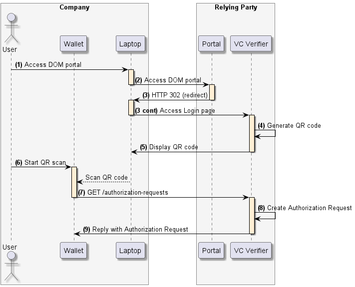

*Figure 3.12 - Starting the authentication phase*

- [**<u>1</u>**](https://alastria.github.io/did-method-elsi/authnplain.xhtml#1049.1) The user (GoodAir employee) uses his Laptop browser to access the DOME portal to perform the onboarding process.  
  We assume in this scenario a cross-device interaction, that is, the user accesses the portal services with a PC browser, but authentication is performed with a mobile using Verifiable Credentials, as in typical 2-factor authentication.

  [**<u>2</u>**](https://alastria.github.io/did-method-elsi/authnplain.xhtml#1054.2) The browser sends a request to the Packet Delivery portal server.

  [**<u>3</u>**](https://alastria.github.io/did-method-elsi/authnplain.xhtml#1058.3) The portal redirects the user to the login page of the Verifier component of DOME Onboarding. The page shows a button labelled “Login with Verifiable Credentials” or something similar.

  [**<u>4</u>**](https://alastria.github.io/did-method-elsi/authnplain.xhtml#1061.4) The Verifier generates a QR code, containing inside the URL of the /authentication-requests endpoint of the Verifier component which will be used to start the \[[OpenID.VP](https://alastria.github.io/did-method-elsi/authnplain.xhtml#bib-openid.vp)\] process.  
  A QR code is used because a Self-Issued OP may be running locally as a native application or PWA, the RP may not have a network-addressable endpoint to communicate directly with the OP. We have to leverage the implicit flow of OpenID Connect to communicate with such locally-running Ops, as described in \[[OpenID.SIOP2](https://alastria.github.io/did-method-elsi/authnplain.xhtml#bib-openid.siop2)\].

<table style="width:96%;">
<colgroup>
<col style="width: 96%" />
</colgroup>
<thead>
<tr>
<th style="text-align: left;"><blockquote>

<mark>https://verifier.dome-marketplace.eu/authorization-requests?state<strong>=</strong>af0ifjsldkj</mark>

</blockquote></th>
</tr>
</thead>
<tbody>
</tbody>
</table>

*[**<u>5</u>**](https://alastria.github.io/did-method-elsi/authnplain.xhtml#1068.5) The QR code is displayed in the user browser with instructions to scan it and go to the URL inside it.*

*  
*

*Figure 3.13 - QR code with the example Authorization Request endpoint inside*

- 

[**<u>6</u>**](https://alastria.github.io/did-method-elsi/authnplain.xhtml#1077.6) The user scans the QR with his wallet and tells the wallet to go to the URL in the QR.

[**<u>7</u>**](https://alastria.github.io/did-method-elsi/authnplain.xhtml#1082.7) After confirmation by the user, the wallet performs a GET /authentication-requests to the endpoint that was inside the QR code. The reply to the GET request is an Authorization Request

[**<u>8</u>**](https://alastria.github.io/did-method-elsi/authnplain.xhtml#1086.8) The VC Verifier creates a SIOP Authentication Request. The parameters comprising a request for verifiable presentations are described in detail in the next section

[**<u>9</u>**](https://alastria.github.io/did-method-elsi/authnplain.xhtml#1089.9) The Verifier replies to the wallet with the Authorization Request

#### 3.3.4.3 Generating the Authorization Request

The Authorization Request travels in the response body of the HTTP GET request performed in the previous point, as a JWT signed by the DOME onboarding service, using the eIDAS certificate for seals that corresponds to the legal person operating the service and with the JAdES signature format.

The parameters comprising a request for verifiable presentations are given in section 5 of \[[<u>OpenID.VP</u>](https://alastria.github.io/did-method-elsi/authnplain.xhtml#bib-openid.vp)\] and in section 10.1 of \[[<u>OpenID.SIOP2</u>](https://alastria.github.io/did-method-elsi/authnplain.xhtml#bib-openid.siop2)\] and are reproduced here with the particularities of this use case, in particular taking into account that this is a cross-device interaction:

- [**<u>response_type</u>**](https://alastria.github.io/did-method-elsi/authnplain.xhtml#1100.response_type) (*REQUIRED*). Must be vp_token. This parameter is defined in \[[RFC6749](https://alastria.github.io/did-method-elsi/authnplain.xhtml#bib-rfc6749)\]. The possible values are determined by the response type registry established by \[[RFC6749](https://alastria.github.io/did-method-elsi/authnplain.xhtml#bib-rfc6749)\]. The \[[OpenID.VP](https://alastria.github.io/did-method-elsi/authnplain.xhtml#bib-openid.vp)\] specification introduces the response type vp_token. This response type asks the Wallet to return only a VP Token in the Authorization Response, which is what we want in our case.

- [**<u>scope</u>**](https://alastria.github.io/did-method-elsi/authnplain.xhtml#1102.scope) (*REQUIRED*). This parameter is defined in \[[RFC6749](https://alastria.github.io/did-method-elsi/authnplain.xhtml#bib-rfc6749)\] which allows it to be used by verifiers to request presentation of credentials by utilizing a pre-defined scope value designating the type of credential. See section [<u>Request Scope</u>](https://alastria.github.io/did-method-elsi/authnplain.xhtml#request_scope) for more details. We use in this instance the value dome.credentials.presentation.LEARCredential which means that the RP (DOME onboarding service) is asking the SIOP (user wallet) to send a credential of type LEARCredential.

- [**<u>response_mode</u>**](https://alastria.github.io/did-method-elsi/authnplain.xhtml#1104.response_mode) *REQUIRED*. *MUST* be direct_post. As this is a cross-device scenario, this response mode is used to instruct the Self-Issued OP to deliver the result of the authentication process to a certain endpoint using the HTTP POST method. This endpoint to which the SIOP shall deliver the authentication result is conveyed in the parameter redirect_uri described below.

- [**<u>redirect_uri</u>**](https://alastria.github.io/did-method-elsi/authnplain.xhtml#1106.redirect_uri) (*REQUIRED*). *MUST* be a valid RP endpoint. The Authentication Response is sent to this endpoint using POST and encoding application/json).

- [**<u>client_id</u>**](https://alastria.github.io/did-method-elsi/authnplain.xhtml#1108.client_id) *REQUIRED*. *MUST* be the DID of the RP (DOM onboarding entity) so it can be resolved by the SIOP and checked against a Trusted List, or rejected if it does not pass validation. This provides a high level of assurance to the SIOP that the RP is really who it claims.

- [**<u>client_id_scheme</u>**](https://alastria.github.io/did-method-elsi/authnplain.xhtml#1110.client_id_scheme) *REQUIRED*. *MUST* have the value did. This value indicates that the Client Identifier is a DID defined in \[[DID-Core](https://alastria.github.io/did-method-elsi/authnplain.xhtml#bib-did-core)\]. The request *MUST* be signed with a private key associated with the DID. To obtain the corresponding private key, the Wallet *MUST* use DID Resolution defined by the DID method used by the Verifier. For most DID methods and since the associated DID Document may include multiple public keys, a particular public key used to sign the request in question *MUST* be identified by the kid in the JOSE Header. However, in our case the Verifier uses did:elsi and so the request *MUST* be signed with the eIDAS certificate according to the \[[ETSI-JADES](https://alastria.github.io/did-method-elsi/authnplain.xhtml#bib-etsi-jades)\] format, which defines the mechanism to identify the public key.  
  All Verifier metadata other than the public key *MUST* be obtained from the client_metadata or the client_metadata_uri parameter as defined in Section 5 of \[[OpenID.VP](https://alastria.github.io/did-method-elsi/authnplain.xhtml#bib-openid.vp)\].

- [**<u>nonce</u>**](https://alastria.github.io/did-method-elsi/authnplain.xhtml#1114.nonce) *REQUIRED*. This parameter follows the definition given in \[[OpenID.Core](https://alastria.github.io/did-method-elsi/authnplain.xhtml#bib-openid.core)\]. It is used to securely bind the verifiable presentation(s) provided by the wallet (SIOP) to the particular transaction managed by the RP.

- [**<u>state</u>**](https://alastria.github.io/did-method-elsi/authnplain.xhtml#1116.state) *REQUIRED*. Used by the portal component of DOM onboarding to associate the start of an authentication session with the end of that session when the RP Verifier component notifies to the portal.

- [**<u>presentation_definition</u>**](https://alastria.github.io/did-method-elsi/authnplain.xhtml#1118.presentation_definition) CONDITIONAL. A string containing a presentation_definition JSON object as defined in Section 4 of \[[DIF.PresentationExchange](https://alastria.github.io/did-method-elsi/authnplain.xhtml#bib-dif.presentationexchange)\]. We do not use this parameter because scope already specifies the credential type.

- [**<u>presentation_definition_uri</u>**](https://alastria.github.io/did-method-elsi/authnplain.xhtml#1120.presentation_definition_uri) CONDITIONAL. A string containing a URL pointing to a resource where a presentation_definition JSON object as defined in Section 4 of \[[DIF.PresentationExchange](https://alastria.github.io/did-method-elsi/authnplain.xhtml#bib-dif.presentationexchange)\] can be retrieved. We do not use this parameter because scope already specifies the credential type.

Note: A request *MUST* contain either a presentation_definition or a presentation_definition_uri or a single scope value representing a presentation definition, those three ways to request credential presentation are mutually exclusive. We use here the scope mechanism, which is simpler and fits our use case.

This is an example request object using the definitions above:

<table style="width:96%;">
<colgroup>
<col style="width: 96%" />
</colgroup>
<thead>
<tr>
<th style="text-align: left;">
<mark>openid://?</mark>

<mark>scope<strong>=</strong>dome.credentials.presentation.LEARCredential&amp;</mark>

<mark>response_type<strong>=</strong>vp_token&amp;</mark>

<mark>response_mode<strong>=</strong>direct_post&amp;</mark>

<mark>client_id<strong>=</strong>did:elsi:VATFR-99999999&amp;</mark>

<mark>redirect_uri<strong>=</strong>https://verifier.dome-marketplace.eu/api/authentication_response&amp;</mark>

<mark>state<strong>=</strong>af0ifjsldkj&amp;</mark>

<mark>nonce<strong>=</strong>n-0S6_WzA2Mj</mark>
</th>
</tr>
</thead>
<tbody>
</tbody>
</table>

(URL encoding removed, line breaks and leading spaces added for readability).

As mentioned above, the Authentication Request is returned to the wallet in the reply body of the GET request, as a JWT in JWS form \[[RFC7515](https://alastria.github.io/did-method-elsi/authnplain.xhtml#bib-rfc7515)\]), signed with an eIDAS certificate of the DOM onboarding legal person.

This is an example of the unencoded contents of the payload of the JWT:

<table style="width:96%;">
<colgroup>
<col style="width: 96%" />
</colgroup>
<thead>
<tr>
<th style="text-align: left;">
<mark>{</mark>

<mark>"iss": "did:elsi:VATFR-99999999", <em>// Should correspond with the client_id in the AR</em></mark>

<mark>"sub": "did:elsi:VATFR-99999999", <em>// Should correspond with the client_id in the AR</em></mark>

<mark>"aud": "https://self-issued.me/v2", <em>// As specified in section 5.5 of OIDC4VP</em></mark>

<mark>"iat": 1667194901,</mark>

<mark>"exp": 1667194961, <em>// To avoid replays, here it expires in 60 secs</em></mark>

<mark>"auth_request": "openid://?scope=...&amp;amp;response_type=vp_token&amp;amp;...",</mark>

<mark>}</mark>
</th>
</tr>
</thead>
<tbody>
</tbody>
</table>

Where the claims iss and sub *MUST* be the DID of the RP (in this case DOME onboarding) and *MUST* correspond exactly with the client_id parameter in the Authorization Request. The claim auth_request contains the Authentication Request as a string. The expiration time in claim exp avoids replays and can be very short because it is used by the Wallet just on reception of the Authentication Request. The expiration time should be enough for the user to review the Authorization Request, decide the credential(s) to send to the RP and instruct the Wallet to send the Authorization Reply to the RP.

#### 3.3.4.4 Verification of the Authorization Request

Before sending the Authentication Response, the wallet should verify that the Authorization Request is correct. The most important verifications are described here:

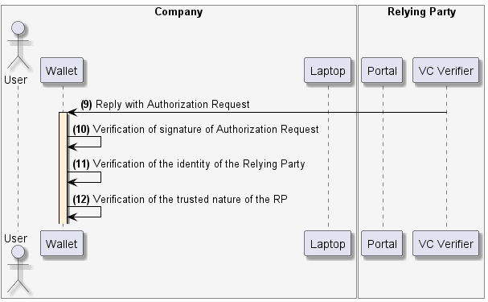

*Figure 3.14 - Starting the authentication phase*

- [**<u>10</u>**](https://alastria.github.io/did-method-elsi/authnplain.xhtml#1176.10) Verification of the signature. As mentioned in the previous section, the Authorization Request is received as a JWT signed by the DOME onboarding service, using the eIDAS certificate for seals that corresponds to the legal person operating the service. This allows the wallet to verify that the signature corresponds to a real-world entity.

  [**<u>11</u>**](https://alastria.github.io/did-method-elsi/authnplain.xhtml#1179.11) Verification that the DID in the client_id field of the Authorization Request corresponds to the entity that signed the Authorization Request. This is easy in our case because we use the did:elsi method.

  [**<u>12</u>**](https://alastria.github.io/did-method-elsi/authnplain.xhtml#1182.12) Verification that the entity identified in the client_id field of the Authorization Request is a trusted entity belonging to the ecosystem, by resolving the DID in the client_id field.  
  The actual mechanism may vary depending on the DID method used and the ecosystem where the client wants to onboard.  
  If the Relying Party is a well known entity (like the DOME onboarding service in the case of DOME), it is easy to verify that the DID corresponds to the Relying Party.  
  In most other cases, for example when the Relying Party is a participant in the ecosystem, we assume that the ecosystem provides a Trusted Participants Registry with an API compatible with the EBSI Trusted Issuers Registry, and that the participants registry is managed in a trusted way by the onboarding service (meaning that the Wallet user trusts on the onboarding service, in the same way as all other participants).

  In this case, to check if the DID is a participant on the ecosystem, the wallet sends a GET /api/did/v1/identifiers/{did-to-verify} request to the endpoint of one of several trusted servers implementing the functionality to query the Trusted Participant Registry, where {did-to-verify} is the actual DID the Wallet wants to check (in our example it would be did:elsi:VATFR-99999999, corresponding to the RP) . The API returns a JSON document as a DID Document. The DID Document (as per W3C) contains relevant information about the entity owner of the DID. It contains its Public Key, used to verify the digital signature of the entity. It also contains the status of the entity in the ecosystem. It is extensible and can contain any public information which may be relevant for the use case. The API must be operated by a trusted entity for the Wallet user. There may be as many servers implementing the API as needed and operated by different entities. At least one of those trusted entities has to be configured in the Wallet of the user, to facilitate the use of the wallet.

#### 3.3.4.5 Creating and sending the Authorization Response

Once the Authorization Request has been validated, the Wallet creates an Authorization Response to be posted in the redirect_uri specified by the RP in the Authorization Request. For completeness, we describe in the following figure the complete process from reception of Authorization Request until sending the Authorization Response.

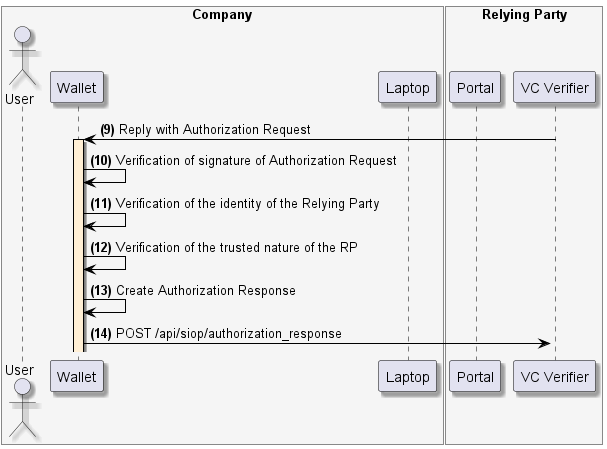

*Figure 3.15 - Starting the authentication phase*

- [**<u>13</u>**](https://alastria.github.io/did-method-elsi/authnplain.xhtml#1216.13) The wallet creates an Authorization Response to be posted in the redirect_uri specified by GoodAir in the Authorization Request that was sent to the wallet. The contents of the Authorization Response are described below.  
  The response is constructed as defined in section 6.1 of \[[OpenID.VP](https://alastria.github.io/did-method-elsi/authnplain.xhtml#bib-openid.vp)\]. In particular, because the Authorization Request included only vp_token as the response_type, the VP Token is provided directly in the Authorization Response and a separate id_token is not needed.  
  The contents of the Authorization Response in our specific use case are:

<table style="width:96%;">
<colgroup>
<col style="width: 96%" />
</colgroup>
<thead>
<tr>
<th style="text-align: left;">
<mark>presentation_submission<strong>=</strong>[see definition below]</mark>

<blockquote>

<mark>&amp;vp_token<strong>=</strong>[see definition below]</mark>

</blockquote></th>
</tr>
</thead>
<tbody>
</tbody>
</table>

-   
  The content of the presentation_submission parameter in the above Authorization Response is:

<table style="width:96%;">
<colgroup>
<col style="width: 96%" />
</colgroup>
<thead>
<tr>
<th style="text-align: left;">
<mark>{</mark>

<mark>"definition_id": "OnboardingPresentationDefinition",</mark>

<mark>"id": "OnboardingPresentationSubmission",</mark>

<mark>"descriptor_map": [</mark>

<mark>{</mark>

<mark>"id": "id_credential",</mark>

<mark>"path": "$",</mark>

<mark>"format": "ldp_vp",</mark>

<mark>"path_nested": {</mark>

<mark>"format": "ldp_vc",</mark>

<mark>"path": "$.verifiableCredential[0]"</mark>

<mark>}</mark>

<mark>}</mark>

<mark>]</mark>

<blockquote>

<mark>}</mark>

</blockquote></th>
</tr>
</thead>
<tbody>
</tbody>
</table>

-   
  Which complies with \[[DIF.PresentationExchange](https://alastria.github.io/did-method-elsi/authnplain.xhtml#bib-dif.presentationexchange)\] and refers to the Verifiable Presentation in the vp_token parameter provided in the same response. In our example, the Verifiable Presentation includes the LEARCredential that was described in the previous sections.

  [**<u>14</u>**](https://alastria.github.io/did-method-elsi/authnplain.xhtml#1248.14) The wallet sends the Authorization Response to the endpoint received in the redirect_uri parameter of the Authorization Request, sending an HTTP POST request using the encoding application/x-www-form-urlencoded.

<table style="width:96%;">
<colgroup>
<col style="width: 96%" />
</colgroup>
<thead>
<tr>
<th style="text-align: left;">
<mark><strong>POST</strong> /api/siop/authorization_response <strong>HTTP/</strong>1.1</mark>

<mark>Host<strong>:</strong> verifier.dome-onboarding.org</mark>

<mark>Content-Type<strong>:</strong> application/x-www-form-urlencoded</mark>

<mark>presentation_submission=[see definition below]</mark>

<blockquote>

<mark>&amp;vp_token=[see definition below]</mark>

</blockquote></th>
</tr>
</thead>
<tbody>
</tbody>
</table>

#### 3.3.4.6 Authenticating the user with the LEARCredential

We should remember that inside the LEARCredential the credentialSubject object has an id field with value did:key:z6MkhaXgBZDvotDkL5257faiztiGiC2QtKLGpbnnEGta2doK which is the DID of the user. It was generated during the creation of the LEARCredential, and the Relying Party should trust that the credential was generated in the proper way binding cryptographically the DID with the LEARCredential, as described in a previous section. It is the same trust that should be put in the generation of any other signed document, like a contract or invoice.

The process of verifying the Authorization Response and authenticating the user with the LEARCredential is the following:

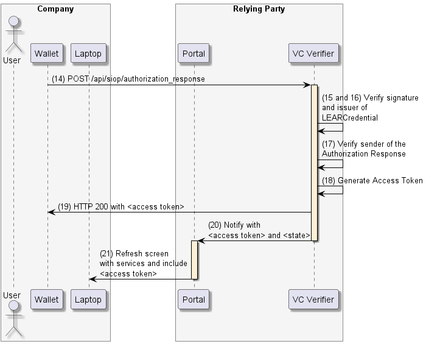

*Figure 3.16 - Starting the authentication phase*

- [**<u>15 and 16</u>**](https://alastria.github.io/did-method-elsi/authnplain.xhtml#1279.15_and_16) The Verifier receives the Authorization Request and has to perform verifications, the standard ones being defined in \[[DIF.PresentationExchange](https://alastria.github.io/did-method-elsi/authnplain.xhtml#bib-dif.presentationexchange)\]. In order to verify that the Verifiable Credential has been issued by a trusted entity, the Relying Party has to verify:

  - That the DID of the entity which is the issuer of the VC is a trusted entity.

  - That the VC was signed by that participant.

  Both verifications can be done by performing DID resolution, checking that the resulting DID Document contains the public key corresponding to the one specified in the Verifiable Credential, and by verifying the digital signature of the credential against that public key.  
  In our case the LEARCredential was issued using the did:elsi method, so resolution is very simple and is specified in \[[DID-ELSI](https://alastria.github.io/did-method-elsi/authnplain.xhtml#bib-did-elsi)\].

  [**<u>17</u>**](https://alastria.github.io/did-method-elsi/authnplain.xhtml#1290.17) After verifying the credential, the Relying Party can also verify that the Verifiable Presentation including the Verifiable Credential is sent by the user and not by a malicious agent. To do so, it uses the public key associated to the did:key identifier id field inside the credentialSubject structure. That public key is cryptographically bound to the customer DID during the onboarding process that GoodAir performed with its employee.

  [**<u>18</u>**](https://alastria.github.io/did-method-elsi/authnplain.xhtml#1293.18) The Verifier creates an Access Token for the user so it can be used later for access services provided by the Relying Party (in the case of onboarding, those services would be the ones related to the onboarding process implemented by the Onboarding portal). The Access Token is generated in JWT format and signed by the VC Verifier. The access token is intended for use as a bearer token over HTTP \[[RFC2616](https://alastria.github.io/did-method-elsi/authnplain.xhtml#bib-rfc2616)\] using Transport Layer Security (TLS) \[[RFC5246](https://alastria.github.io/did-method-elsi/authnplain.xhtml#bib-rfc5246)\] to access protected resources, and it should use the JWT Profile profile described in \[[RFC9068](https://alastria.github.io/did-method-elsi/authnplain.xhtml#bib-rfc9068)\].  
  For our use case, the payload of the JWT access token looks like:

<table style="width:96%;">
<colgroup>
<col style="width: 96%" />
</colgroup>
<thead>
<tr>
<th>
<mark>{</mark>

<mark>"iss": "did:elsi:VATFR-99999999",</mark>

<mark>"sub": "did:key:z6MkhaXgBZDvotDkL5257faiztiGiC2QtKLGpbnnEGta2doK",</mark>

<mark>"aud": "https://dome-marketplace.eu/onboarding",</mark>

<mark>"exp": 1639528912,</mark>

<mark>"iat": 1618354090,</mark>

<mark>"jti" : "dbe39bf3a3ba4238a513f51d6e1691c4",</mark>

<mark>"client_id": "did:elsi:VATFR-99999999",</mark>

<mark>"scope": "vp_token",</mark>

<mark>"verifiableCredential": ["the VC that was received inside the Verifiable Presentation"]</mark>

<blockquote>

<mark>}</mark>

</blockquote></th>
</tr>
</thead>
<tbody>
</tbody>
</table>

-   
  Where, according to \[[RFC9068](https://alastria.github.io/did-method-elsi/authnplain.xhtml#bib-rfc9068)\]:

  - iss and client_id have the same value because the access token has been generated by the Verifier component of the DOME onboarding service, acting as the DOME legal person.

  - sub identifies the user (employee of GoodAir acting as LEAR of the company) using the DID inside the Verifiable Credential received

  - aud identifies the RS (Resource Server) component in Packet Delivery. In this case we assume that it is internal and does not have a DID assigned, so we use the URI of the component.

  - kid in the header identifies the key that is used to sign the JWT and which must be configured up-front and known by the RS (Resource Server.

  - scope has the same value as the equivalent scope parameter in the initial Authorization Request.

  - verifiableCredential contains the Verifiable Credential that was received, specifically the value of the first element of the field verifiableCredential of the Verifiable Presentation.

  [**<u>19</u>**](https://alastria.github.io/did-method-elsi/authnplain.xhtml#1326.19) The Verifier sends a successful response to the POST request from the wallet. The wallet receives the response to the POST indicating the success or failure of the process. The Verifier continues processing because the web portal of Packet Delivery has to be refreshed with the services that this specific user can access, based on the information received in the Verifiable Credential and the access control policies implemented by the DOME portal.

  [**<u>20</u>**](https://alastria.github.io/did-method-elsi/authnplain.xhtml#1329.20) The Verifier notifies the DOME portal to refresh the login page so it can present the services to the user. The notification includes the following:

  - The state nonce that was generated by the portal when it generated the QR code. The portal uses the state nonce to know what login session is being notified.

  - The access token generated before.

  The notification is a simple POST request with both parameters in the body:

<table style="width:96%;">
<colgroup>
<col style="width: 96%" />
</colgroup>
<thead>
<tr>
<th>
<mark><strong>POST</strong> /api/notify <strong>HTTP/</strong>1.1</mark>

<mark>Host<strong>:</strong> dome-marketplace.eu</mark>

<mark>Content-Type<strong>:</strong> application/x-www-form-urlencoded</mark>

<mark>access_token=[the access token]</mark>

<blockquote>

<mark>&amp;state=af0ifjsldkj</mark>

</blockquote></th>
</tr>
</thead>
<tbody>
</tbody>
</table>

-   
  The portal component replies immediately and continues processing.

  [**<u>21</u>**](https://alastria.github.io/did-method-elsi/authnplain.xhtml#1349.21) The portal of the Relying Party refreshes the screen and displays the services available to users, sending the Access Token to the browser of the user. The Access Token will be sent back by the browser to the portal whenever the user tries to access a protected resource of the portal, and so access control can be performed using the data inside the token, in the same way as with any other access token in other authentication mechanisms.

### 3.3.5 Access control with Verifiable Credentials

#### 3.3.5.1 Overview

This section assumes that authentication has already been performed and that the Relying Party receives a request to a protected resource, with a proper access token inside the request. If the request does not come with an access token, the request is rejected immediately (or the user is redirected to the Authentication service of the Relying Party, depending on the use case).

The Access Control mechanism described here is the same independently of whether the request comes from a user or a machine, so the M2M use case is supported without any modification. In the following description we will use the term user interchangeably for both the user as a natural person or the user as a machine.

However, the assumption is that all machines have an identity (they are assigned an identifier), and that they are acting on behalf of a legally valid identity in the sense of eIDAS2. In other words, we require that the identities of users and machines can be cryptographically bound to the real-world identity of either a natural person or a legal person in a way that provides legal certainty to the Relying Party regarding the chain of responsibility.

If the user is a natural person using the portal of the Relying Party, the request to the protected resource will come from the browser that the user employs to navigate the portal, and the access token will be included automatically by the browser in every request that is sent to the Relying Party, for example when the user clicks a button or fills a form.

If the user is a server or device, it is assumed that it has obtained an access token previously as the result of an authentication process described above. The server or device is responsible for including the access token in every request that is sent to the Relying Party to access a protected resource.

If the portal of the Relying Party is an onboarding process (e.g., the portal of the DOME Onboarding service), the protected resource could be the onboarding service itself, or a service to upload additional information for a partially completed onboarding process.

If the portal is a Marketplace and the organisation using the portal wants to offer products in it, these services could be to register the organisation as a Seller, or to create a Product specification and offering.

If the portal is the Marketplace and the organisation wants to contract products in it, these services could be to register the organisation as a Customer, or to launch a procurement order of a product.

The same mechanism can be used by any participant in the ecosystem, if they want to use an advanced IAM mechanism which is aligned with the EU strategy on digital identity based on Verifiable Credential and eIDAS2.

For the explanation we will use the following figure which is based on [<u>NIST Special Publication 800-178: A Comparison of Attribute Based Access Control (ABAC) Standards for Data Service Applications</u>](https://nvlpubs.nist.gov/nistpubs/SpecialPublications/NIST.SP.800-178.pdf) which describes a reference architecture with necessary functional components to achieve enforcement of the authorization policies. The authorization process depends on four layers of functionality: **Enforcement**, **Decision**, **Access Control Data**, and **Administration**.

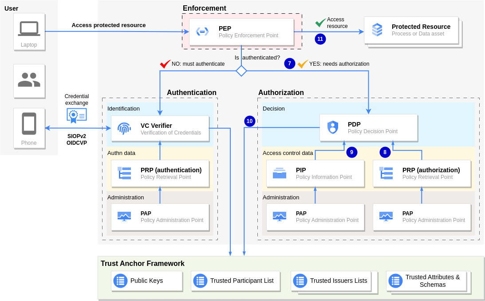

*Figure 3.17 - High level Authentication logical architecture*

#### 3.3.5.2 Determine the Authorization Policies which apply to the request

Every request to a protected resource is intercepted by the PEP , and to know if the request should be authorised or not, the PEP asks the PDP (Policy Decision Point) for a decision. The PDP needs to know what are the policy rules that should be applied to the request, and it uses the PRP (Policy Retrieval Point) to retrieve those policies.

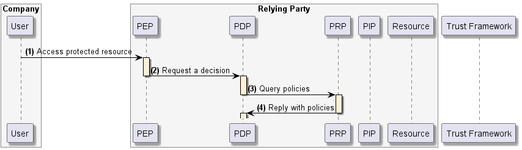

*Figure 3.18 - Determine the Authorization Policies*

- [**<u>1</u>**](https://alastria.github.io/did-method-elsi/authnplain.xhtml#1401.1) The user (natural person or machine) sends a request to access a protected resource, and the PEP (Policy Enforcement Point) component intercepts the call. The PEP is normally implemented as a reverse proxy or API gateway, so all calls to protected resources entering the organisation are intercepted and forwarded if they are accepted.

  [**<u>2</u>**](https://alastria.github.io/did-method-elsi/authnplain.xhtml#1404.2) If the request is not authenticated it is rejected with an error. Depending on the use case, the error returned can contain additional information that enables the user agent to be redirected to perform authentication.

  After inspecting the request, the PEP requests a decision from the PDP passing a series of attributes. In general, the request from the PEP to the PDP consists of **subject** attributes (typically for the user who issued the request), **resource** attributes (the resource for which access is sought), **action** attributes (the operations to be performed on the resource), and **environment** attributes.

  Some of the above attributes are obtained by the PEP from the original request received from the user. For example, the HTTP verb (GET, POST, PUT, PATCH, DELETE) and the URL and possibly the body of the request provide action attributes. Specifically, in the case of an NGSI-LD request those attributes are formally specified in the NGSI-LD standard.  
  The subject attributes most relevant for access control are located in the access token received with the request. In particular, the access token includes the Verifiable Credentials that were employed for authentication, and the claims in those credentials can be used to evaluate access control policies. This includes (but is not limited to) the roles object that may be included in the VerifiableID credential used for authentication.  
  An example access token would be:

<table style="width:96%;">
<colgroup>
<col style="width: 96%" />
</colgroup>
<thead>
<tr>
<th style="text-align: left;">
<mark>{</mark>

<mark>"token_type": "Bearer",</mark>

<mark>"expires_in": 3600,</mark>

<mark>"access_token": "ewogICJhbGciOiAiR...ERBIgogIH0KfQ"</mark>

<blockquote>

<mark>}</mark>

</blockquote></th>
</tr>
</thead>
<tbody>
</tbody>
</table>

-   
  Decoding the access_token field we could see a Verifiable Presentation including the LEARCredential that the user presented when authenticating:

<table style="width:96%;">
<colgroup>
<col style="width: 96%" />
</colgroup>
<thead>
<tr>
<th style="text-align: left;">
<mark>{</mark>

<mark>"@context": [</mark>

<mark>"https://www.w3.org/ns/credentials/v2",</mark>

<mark>"https://dome-marketplace.eu/2022/credentials/learcredential/v1"</mark>

<mark>],</mark>

<mark>"id": "urn:did:elsi:25159389-8dd17b796ac0",</mark>

<mark>"type": ["VerifiableCredential", "LEARCredential"],</mark>

<mark>"issuer": {</mark>

<mark>"id": "did:elsi:VATES-12345678"</mark>

<mark>},</mark>

<mark>"issuanceDate": "2022-03-22T14:00:00Z",</mark>

<mark>"validFrom": "2022-03-22T14:00:00Z",</mark>

<mark>"expirationDate": "2023-03-22T14:00:00Z",</mark>

<mark>"credentialSubject": {</mark>

<mark>"id": "did:key:z6MkhaXgBZDvotDkL5257faiztiGiC2QtKLGpbnnEGta2doK",</mark>

<mark>"title": "Mr.",</mark>

<mark>"first_name": "John",</mark>

<mark>"last_name": "Doe",</mark>

<mark>"gender": "M",</mark>

<mark>"postal_address": "",</mark>

<mark>"email": "johndoe@goodair.com",</mark>

<mark>"telephone": "",</mark>

<mark>"fax": "",</mark>

<mark>"mobile_phone": "+34787426623",</mark>

<mark>"legalRepresentative": {</mark>

<mark>"cn": "56565656V Jesus Ruiz",</mark>

<mark>"serialNumber": "56565656V",</mark>

<mark>"organizationIdentifier": "VATES-12345678",</mark>

<mark>"o": "GoodAir",</mark>

<mark>"c": "ES"</mark>

<mark>},</mark>

<mark>"rolesAndDuties": [</mark>

<mark>{</mark>

<mark>"type": "LEARCredential",</mark>

<mark>"id": "https://dome-marketplace.eu//lear/v1/6484994n4r9e990494"</mark>

<mark>}</mark>

<mark>]</mark>

<mark>}</mark>

<blockquote>

<mark>}</mark>

</blockquote></th>
</tr>
</thead>
<tbody>
</tbody>
</table>

-   
  Environmental attributes, which depend on the availability of system sensors that can detect and report values, are somewhat different from subject and resource attributes, which are administratively created. Environmental attributes are not properties of the subject or resources, but are measurable characteristics that pertain to the operational or situational context in which access requests occur. These environmental characteristics are subject and resource independent, and may include the current time, day of the week, or threat level.

  The PDP computes decisions to permit or deny subject requests to perform actions on resources. In computing a decision, the PDP queries policies stored in a PRP .

  If the attributes of the request are not sufficient for rule and policy evaluation, the PDP may need to search the PIP for additional attributes. The PIP is shown as one logical store, but in fact may comprise multiple physical stores of different types.  
  In addition to the PIP, the PDP uses one or more Trusted Issuers Lists (to check if the issuer of the credential is included in them as a trusted issuer of that type of credential), and also the Authorization Registry (AR), which can check for finer granularity authorisation records which may be very dynamic in nature (e.g. if some resource usage by employees and machines owned by the issuer have exceeded some quota this month).

  The actual Trusted Issuers Lists that the PDP needs to check is determined by the policy rules retrieved from the PRP. Those policy rules also determine the additional queries performed to the PIP data stores.

  The set of information and data stored in the PIP and PRP comprise the access control data and collectively define the current authorization state, which the PDP will use to compute its decision.

  [**<u>3</u>**](https://alastria.github.io/did-method-elsi/authnplain.xhtml#1479.3) The PDP asks the PRP for the policy rules applicable to this request. The policy rules may be specified using different policy languages, like ODRL, XACML or Rego. It is very difficult to make the interface between the PDP and the PRP completely transparent and independent from the concrete policy language used in an implementation. However, the PDP can be modularised in order to minimise the dependency and reduce the cost of migration to other policy language in the future.

  [**<u>4</u>**](https://alastria.github.io/did-method-elsi/authnplain.xhtml#1482.4) The PDP receives the policy rules to apply for the current request.

#### 3.3.5.3 Determine which Trusted Issuer Lists should be queried

After retrieving the policies from the PRP, the PDP determines what are the attributes needed by the policy rules to perform its evaluation. Some of those attributes can be determined from the request received (e.g., claims inside the Verifiable Credential(s) in the access token). But in general, the policy rules require additional attributes that have to be retrieved from other sources.

The two logical sources of those attributes are the PIP and the Trusted Issuers Lists in the Trust Anchor Framework.

The concept of the PIP is the same as in the standard XACML logical architecture, essentially enabling the PDP to retrieve environmental attributes required for policy evaluation.

In our approach using Verifiable Credentials for authentication and authorization, we use a Trust Framework to determine if the credentials received in the request are issued by authorised issuers of those credentials.

The PDP does not have hardcoded the actual Trusted Lists to query, but they are determined dynamically from the policies retrieved from the PRP. In simple use cases there may be one or two lists to query which are the same for all requests. But the mechanism described here can cater for very complex scenarios where the lists may be different depending on the requests and also from the dynamic environmental information retrieved from the PIP.

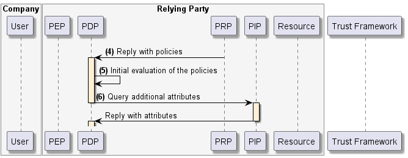

*Figure 3.19 - Determine Trusted Issuer Lists to query*

- [**<u>4</u>**](https://alastria.github.io/did-method-elsi/authnplain.xhtml#1511.4) The PDP receives the policy rules to apply for the current request.

  [**<u>5</u>**](https://alastria.github.io/did-method-elsi/authnplain.xhtml#1514.5) The PDP performs an initial evaluation of the policy rules and if the attributes of the request are not sufficient for rule and policy evaluation, it determines the PIP stores to query, and also the set of Trusted Issuers Lists to query. The concrete Trusted Lists to query are dynamic and depend on the specific policies associated with the request.

  [**<u>6</u>**](https://alastria.github.io/did-method-elsi/authnplain.xhtml#1518.6) Based on the policies and the attributes of the request, the PDP queries the PIP for additional attributes needed for the policy evaluation.  
  Now that the PDP has the policy rules to apply and the attributes from the request and the ones retrieved from the PIP, the PDP can determine the actual Trusted Lists that have to be queried in order to be able to evaluate the policies.

#### 3.3.5.4 Query the Trusted Issuer Lists

The authorization mechanism uses the Trust Framework to query different Trusted Lists that are needed to evaluate the policy rules applicable to the request and compute a decision.

The Trust Framework is composed of one or more Trusted Lists where each list is specialised in some specific domain of trust.

For example, the Trust Framework contains Trusted Lists with the schema definitions used for the well-known types of Verifiable Credentials in the ecosystem. In this way, if the Verifiable Registry used for the Trust Framework is based on a DLT network (or several federated networks), the schemas can be published in a trusted and resilient manner reducing the risk of malicious tampering and keeping a record of the history of modifications.

But the most interesting Trusted Lists in the Trust Framework are the Trusted Issuers Lists, which provide the mechanism to efficiently and securely verify that the issuer of a given credential is a Trusted Issuer of that type of credentials.

It has to be noticed that even though most Trusted Issuer Lists are global (used by all participants in the ecosystem) and have essentially public information, there may be some specialised lists that are private to one or more organisations and specialised in some specific requirement.

In this way, there may be some lists that are specific to the products that one organisation provides to other participants in the ecosystem. For example, there may be a Trusted Issuer List private to one organisation which is updated with the identity of a participant when that participant acquires access to some product provided by that organisation.

For example, this "product-specific" Trusted Issuer List is queried when performing authorization if the related policy rules specify that the issuer of the Verifiable Credential received in the request should have acquired the product that the request is trying to access.

However, as mentioned before, the set of "internal" and "external" Trusted Lists to query is not hard coded but it depends on the specific policy rules that should be applied to the request when computing the decision to grant access or not.

In this way, the system provides a great deal of flexibility on how access control is performed.

For simplicity, the diagram below shows the query of the Trusted Issuer Lists as a single interaction to a single box, but the actual interactions can be very complex if required. In addition, the diagram does not specify whether the list is "private" or "global".

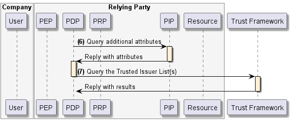

*Figure 3.20 - Query the Trusted Issuer Lists*

- [**<u>6</u>**](https://alastria.github.io/did-method-elsi/authnplain.xhtml#1562.6) Based on the policies and the attributes of the request, the PDP queries the PIP for additional attributes needed for the policy evaluation.

  [**<u>7</u>**](https://alastria.github.io/did-method-elsi/authnplain.xhtml#1566.7) Based on the policies and the attributes of the request, the PDP queries one or more Trusted Issuer Lists to check that the credentials received comply with the requirements specified in the policies.

#### 3.3.5.5 Compute the decision and allow (or not) access

Once the PDP has all the attributes required for policy evaluation, it computes a decision and returns that decision to the PEP which will enforce it.

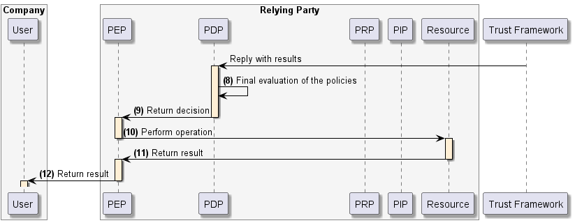

*Figure 3.21 - Compute the decision*

- [**<u>8</u>**](https://alastria.github.io/did-method-elsi/authnplain.xhtml#1589.8) The PDP performs a final evaluation of the policy rules, taking into consideration the attributes received from the PEP, the attributes received from the PIP, and the Trusted Issuers Lists queried. After the evaluation the PDP computes a decision, either to accept or to reject the request.

  [**<u>9</u>**](https://alastria.github.io/did-method-elsi/authnplain.xhtml#1592.9) The PDP returns the decision to the PEP, which will enforce it.

  [**<u>10</u>**](https://alastria.github.io/did-method-elsi/authnplain.xhtml#1595.10) If the decision from the PDP is to reject the request, the PEP returns an error to the user. Otherwise, it forwards the original request to the Resource for execution.

  [**<u>11</u>**](https://alastria.github.io/did-method-elsi/authnplain.xhtml#1598.11) The resource executes the request and returns the result.

  [**<u>12</u>**](https://alastria.github.io/did-method-elsi/authnplain.xhtml#1601.12) The PEP returns the result to the user.

#### 3.3.5.6 Summary of the authorization process

The following diagram combines all the steps in a single one to provide an overall view of the authorization process.

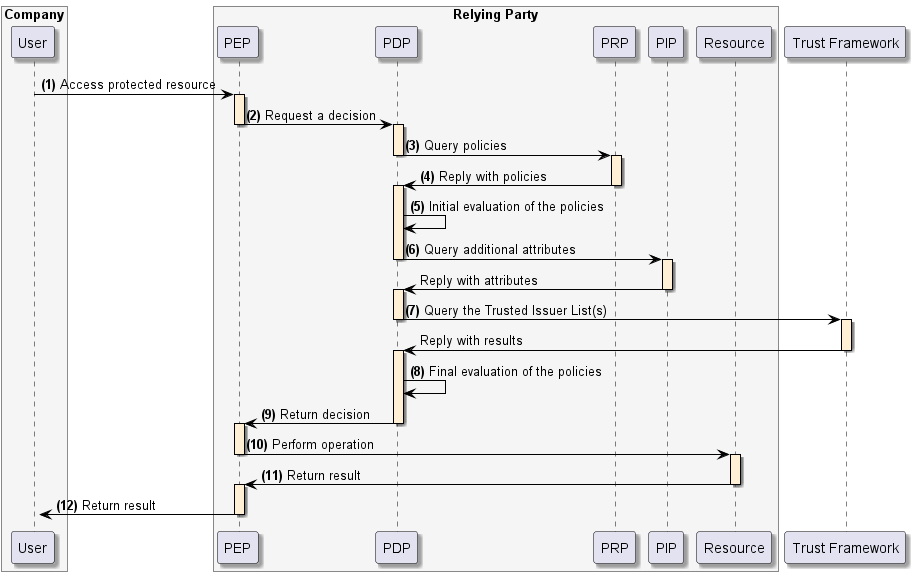

*Figure 3.22 - Summary of the Authorization process*

## 3.4 Detailed workflows illustrating interactions among components based on a reference use case

### 3.4.1 Access to DOME functions by DOME users

#### 3.4.1.1 Explaining the Reference Use Case 

Here we introduce the actors of the reference use case we are going to have. The main actors are marked in yellow in the following diagram.

RealTruth is a Trust Service Provider operating under the eIDAS Trust Framework, which issues a certificate for seals to the company GoodAir. GoodAir is a business that provides some services using an Air Quality application operated by GoodAir.

RealTruth also provides a certificate for signatures to the COO of the GoodAir company, so the COO can use the certificate to sign documents on behalf of GoodAir (like contracts, invoices, financial reports, ...) in a way that is compliant with eIDAS.

The COO of GoodAir will issue a verifiable credential of type LEARCredential to an employee of GoodAir, signing the credential with his certificate for signatures.

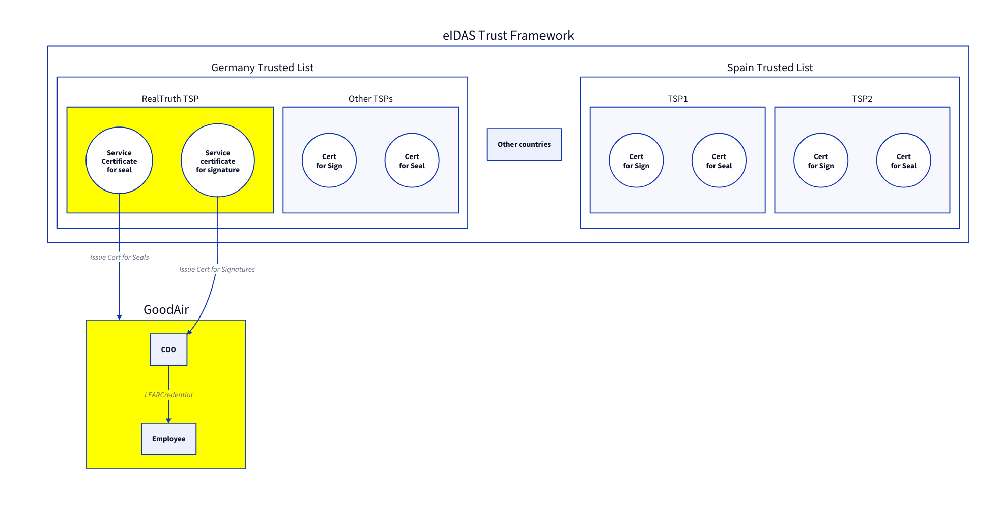

*Figure 3.23 - SmartCityDS: an instance of a Data Space for Smart Cities*

##### 3.4.1.1.2 GoodAir: the company that will perform the onboarding process

The new participant is a business providing an Air Quality Monitoring application as a service. The business is called GoodAir and it operates the application, which receives data from a set of sensors that may or may not be the property of GoodAir. The sensors must have received a certification to be able to operate and send data to the GoodAir application.

The company is registered in the tax agency and business registry of Spain with VAT number VATES-12345678

##### 3.4.1.1.3 Jesus Ruiz: COO (Chief Operating Officer) of GoodAir

The GoodAir company is small and the only person that can sign contracts on behalf of the company is the COO (Chief Operating Officer). The COO is a legal representative of the company and she is registered as so in the business registry of Spain.

The COO has a certificate for electronic signatures issued by one of the TSPs in Spain enabling the COO to perform electronic qualified signatures as legal representative of GoodAir, instead of doing them manually.

The X.509 certificate of the COO has the following contents in the Subject field (the example below is derived from a real certificate but with the identifiers modified to be an example):

cn=56565656V Jesus Ruiz

serialNumber=56565656V

givenName=Jesus

sn=Ruiz

2.5.4.97=VATES-12345678

o=GoodAir

c=ES

2.5.4.13=Notary:Juan Lopez/Protocol Num:7172/Date:07-06-2021

The above set of fields bind the legal identity of the COO with the identity of the business:

- serialNumber is the unique number recognized by the Spanish Government for Spanish citizens (called NIF).

- 2.5.4.97 is the [<u>official OID for</u> <u>organizationIdentifier</u>](https://oidref.com/2.5.4.97). The contents of this field in the example certificate is the unique identifier for the legal person GoodAir.

Before issuing a certificate like the above, the TSP has to perform some validations to ensure that in the official source of truth (the business registry of Spain in this case) there is already registered information that states that the COO has indeed powers to act on behalf of GoodAir as a legal representative.

##### 3.4.1.1.4 RealTruth: a TSP (Trust Service Provider)

RealTruth is an EU TSP, which appears in the TL (Trusted List) maintained by the [<u>German Government</u>](https://tl.bundesnetzagentur.de/TL-DE.XML).

RealTruth is a TSP based in Germany but operates in most of the countries of the EU and so being able to provide Trust Services across many countries, including Spain.

As all TSPs in the TLs of the Member States, its entry in the TL includes one or more "Services" entries which describe the Trust Services provided by the TSP.

A TSP can have one Service issuing certificates for signatures, another service issuing certificates for seals, another service for timestamping, etc.

The regulator approves or suspends each service from a TSP individually, and the services are the root anchor for a given trust environment.

In our case, the entry for RealTruth in the TL includes a \<TSPService\> entry, and inside it the \<ServiceDigitalIdentity\> entry includes a DER-encoded certificate specifying the digital identity of the root anchor for that trust domain. The certificate for the Service has in the Subject field:

2.5.4.97 = VATDE-170173453

CN = DRV QC 11 MA CA 2017ca

OU = QC 11 Mitarbeiter CA

O = Deutsche Rentenversicherung Westfalen

C = DE

Which in the organizationIdentifier field (OID 2.5.4.97) specifies the unique organisation identifier assigned by the German regulatory authority to the TSP: VATDE-170173453.

RealTruth provides Legal Person Representative Certificates which are qualified in accordance with Regulation (EU) No. 910/2014 of the European Parliament and of the Council of 23 July 2014 on electronic identification and trust services for electronic transactions in the internal market.

The certification policies of RealTruth includes the following sentences:

The Registration Authority must verify the following information in order to authenticate the identity of the organisation:

- The data concerning the business name or corporate name of the organisation.

- The data relating to the constitution and legal status of the subscriber.

- **The data concerning the extent and validity of the powers of representation of the applicant.**

- The data concerning the tax identification code of the organisation or equivalent code used in the country to whose legislation the subscriber is subject.

The TSP (RealTruth in this case) performs the verifications against Authentic Sources.

Authentic Sources are the public or private repositories or systems recognised or required by law containing attributes about a natural or legal person.

Authentic Sources in scope of Annex VI of the \[eIDAS2\] legislative proposal are sources for attributes on address, age, gender, civil status, family composition, nationality, education and training qualifications titles and licences, professional qualifications titles and licences, public permits and licences, financial and company data.

Authentic Sources in scope of Annex VI are required to provide interfaces to Qualified Electronic Attestation of Attributes (QEAA) Providers to verify the authenticity of the above attributes, either directly or via designated intermediaries recognised at national level.

Authentic Sources may also issue (Q)EAA-s themselves if they meet the requirements of the eIDAS Regulation. It is up to the Member States to define terms and conditions for the provisioning of these services, but according to the minimum technical specifications, standards, and procedures applicable to the verification procedures for qualified electronic attestations of attributes.

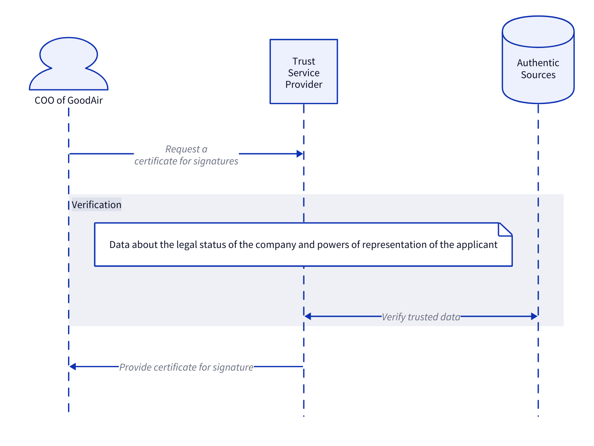

In accordance to the policies, RealTruth made those validations when issuing the certificate to the COO, in such a way that the Relying Parties verifying the certificate can have a high level of trust in the assertion that the natural person identified in the certificate (with Spanish ID of 56565656V) is a legal representative of the GoodAir company (organizationIdentifier VATES-12345678).

##### 3.4.1.1.5 John Doe: an administrative employee of GoodAir

This is an employee of the central administration department of GoodAir, who is going to be formally nominated to manage the onboarding process of GoodAir in the Data Space and some other operations in the Data Space once GoodAir is onboarded. In particular, this employee is going to be nominated as a LEAR.

As its name implies, the LEAR has to be nominated by a **legal representative** of the GoodAir organisation with the necessary legal authority to commit the organisation for this type of decision. In our case, the COO of GoodAir will nominate John Doe as the LEAR of GoodAir, delegating to him the capabilities to perform onboarding in the SmartCityDS and some other associated tasks. That means that John Doe will not be empowered to perform other actions like onboarding on other Data Spaces or signing contracts or invoices on behalf of GoodAir.

To perform the nomination, the COO of GoodAir (a legal representative of GoodAir) will issue a special credential to John Doe and will sign the credential with his certificate for signatures as legal representative of GoodAir. The details are described later in this document.

#### 3.4.1.2 Onboarding of organisations in DOME

This is an example of an onboarding process performed with the LEARCredential using the did:elsi method. The example is fully described in [<u>Appendix I: example of onboarding of organisations in DOME</u>](https://docs.google.com/document/d/12SPDoDzfxofweDJxYnhpRurfm95_zLmw3jOkKbypiMg/edit#heading=h.xp5iya).

### 3.4.2 Use of the DOME Trust and IAM framework by data/app service providers (Use case: Air Quality)

#### 3.4.2.1 Description of roles of the Air Quality Monitoring app

Roles connected: admin, citizens

Depending on the role, different permissions apply, and therefore different actions can be performed. Example:

- A citizen can check the temperature in the park, statistics of consumption of energy, park, etc.

- An admin can register additional sensors

- Registered sensors are the only ones able to inject measures

#### 3.4.2.2 Acquisition of rights to use Air Quality Monitoring app by customer means that customer becomes Trusted issuer of that app specific VCs

The process of acquiring access to the air quality monitoring service is displayed. It is performed by employees of organisations that want to become trusted issuers for this service.

1.  The employee accesses DOME, in order to login.

2.  The employee is displayed a list of Identity Providers for selecting the desired Identity Provider for login. The employee gets forwarded to a page for selecting the desired Identity Provider for login. One of the login options is “Verifiable Credentials” or something similar.

3.  The employee selects the “Verifiable Credentials” login method, which causes the Marketplace portal to generate a QR containing the URL of the /authentication-requests endpoint of the Marketplace server.

4.  The employee scans the QR with her mobile and the mobile calls the /authentication-requests endpoint.

5.  This starts an OID4VP (OpenID for Verifiable Presentations) authentication flow, where the Marketplace plays the role of OpenID Relying Party and the employee’s wallet acts as the OpenID Credential Holder. In OID4VP, the Marketplace generates a Presentation Request Object, encoded as a signed JWT, specifying the required credentials and verification parameters. **OID4VP** provides a standardised and secure mechanism for requesting verifiable presentations, fully aligned with current EU interoperability profiles and the EUDI Wallet architecture..

> The Authentication Request travels in the response to the HTTP GET request performed in the previous point, as a JWT signed by the marketplace. The decoded contents of the JWT may be:

<table style="width:90%;">
<colgroup>
<col style="width: 90%" />
</colgroup>
<thead>
<tr>
<th style="text-align: left;">openid://? 
scope=openid 
&amp;response_type=vp_token 
&amp;response_mode=post 
&amp;client_id=did:elsi:EU.EORI.NLMARKETPLA 
&amp;redirect_uri=https://marketplace.dome.org/siop_sessions 
&amp;claims=... 
&amp;registration={ 
"subject_syntax_types_supported": ["did:key", 
"urn:ietf:params:oauth:jwk-thumbprint"] 
} 
&amp;nonce=n-0S6_WzA2Mj</th>
</tr>
</thead>
<tbody>
</tbody>
</table>

> The employee’s wallet receives the Presentation Request and performs an **OID4VP presentation flow**, constructing a Verifiable Presentation and returning it to the Marketplace via the redirect_uri using the standard OID4VP **vp_token** and **presentation_submission** parameters. The wallet signs the response following the OID4VP specification, ensuring cryptographic holder binding and standard-compliant response formatting.

6.  In this step the employee verifies that the Marketplace is a trusted entity belonging to the ecosystem, by resolving the DID of the Marketplace which is received in the **client_id** parameter of the Authentication Request.

> To resolve a DID, the wallet sends a GET request to the **/api/did/v1/identifiers/did:elsi:EU.EORI.NLMARKETPLA** endpoint of one of several trusted servers implementing the Universal Resolver functionality. The Universal Resolver includes a DLT node, and there may be as many as needed. Its mission is to resolve DIDs using the DLT and return the associated DID Document. The DID Document (as per W3C) contains relevant information about the entity owner of the DID. It contains its Public Key, used to verify the digital signature of the entity. It also contains the status of the entity in the Data Space ecosystem. It is extensible and can contain any public information which may be relevant for the use case. The Universal Resolver server must be operated by a trusted entity for the customer. There may be as many nodes as needed operated by different entities. At least one of those trusted entities has to be configured in the wallet of the employee.

7.  The wallet receives the DID Document of Marketplace, with trusted information about the entity, including the Public Key associated with the Private Key that Marketplace uses to digitally sign tokens. For example:

<table style="width:98%;">
<colgroup>
<col style="width: 98%" />
</colgroup>
<thead>
<tr>
<th style="text-align: left;">{ 
"payload": { 
"@context": [ 
"https://www.w3.org/ns/did/v1", 
"https://w3id.org/security/v1" 
], 
"id": "did:elsi:EU.EORI.NLMARKETPLA", 
"verificationMethod": [ 
{ 
"id": "did:elsi:EU.EORI.NLMARKETPLA#key-verification", 
"type": "JwsVerificationKey2020", 
"controller": "did:elsi:EU.EORI.NLMARKETPLA", 
"publicKeyJwk": { 
"kid": "key-verification", 
"kty": "EC", 
"crv": "secp256k1", 
"x": "V8XptJkb5wplYkExcTF4nkyYVp7t5H5d5C4UPqCCM9c", 
"y": "kn3nSPxIIvd9iaG0N4v14ceuo8E4PcLXhhGeDzCE7VM" 
} 
} 
], 
"service": [ 
{ 
"id": "did:elsi:EU.EORI.NLMARKETPLA#info", 
"type": "EntityCommercialInfo", 
"serviceEndpoint": "https://marketplace.dome.org/info", 
"name": "DOME" 
}, 
{ 
"id": "did:elsi:EU.EORI.NLMARKETPLA#sms", 
"type": "SecureMessagingService", 
"serviceEndpoint": "https://marketplace.fiware.io/api/sms" 
} 
], 
"anchors": [ 
{ 
"id": "redt.alastria", 
"resolution": "UniversalResolver", 
"domain": "marketplace.dataspace", 
"ethereumAddress": "0xbcB9b29eeb28f36fd84f1CfF98C3F1887D831d78" 
} 
], 
"created": "2021-11-14T13:02:37Z", 
"updated": "2021-11-14T13:02:37Z" 
} 
}</th>
</tr>
</thead>
<tbody>
</tbody>
</table>

8.  The DID Document includes one or more public keys inside the “verificationMethod” array. The keys are identified by the “id” field in each element of the array. The employee wallet uses the **kid** field that was received in the Authentication Request (in the protected header of the JWT) to select the corresponding Public Key and verify the signature of the JWT. It also verifies that the top-level “**id**” field in the DID Document ("did:elsi:EU.EORI.NLMARKETPLA") is equal to the **client_id** parameter of the Authentication Request.

9.  The employee wallet creates an Authentication Response to be posted in the **redirect_uri** specified by Marketplace in step 5. The contents of the Authentication Response are described below.

10. The wallet sends the OID4VP presentation response to the endpoint specified in the redirect_uri parameter of the Presentation Request, using an HTTP POST with application/x-www-form-urlencoded encoding.

<table style="width:90%;">
<colgroup>
<col style="width: 90%" />
</colgroup>
<thead>
<tr>
<th style="text-align: left;">POST /siop_sessions HTTP/1.1 
Host: marketplace.dome.org 
Content-Type: application/x-www-form-urlencoded 
 
vp_token=eyJ0 ... NiJ9.eyJ1c ... I6IjIifX0.DeWt4Qu ... ZXso 
&amp;state=af0ifjsldkj</th>
</tr>
</thead>
<tbody>
</tbody>
</table>

> The **sub** claim is *did:peer:99ab5bca41bb45b78d242a46f0157b7d* which is the DID of the user and for privacy reasons it is **not registered in any DLT or centralised repository**. It must be the same as the DID included in the Verifiable Credential that was issued by the company/organisation when onboarding the employee and which travels in the authentication response.
>
> The **vp_token** includes the Verifiable Presentation, which can be in two formats: **jwt_vp** (JWT encoded) or **ldp_vp** (JSON-LD encoded). The following example is using the JWT encoding:

<table style="width:98%;">
<colgroup>
<col style="width: 98%" />
</colgroup>
<thead>
<tr>
<th style="text-align: left;">{ 
"format":"jwt_vp", 
"presentation": 
"eyJhbGciOiJSUzI1NiIsInR5cCI6IkpXVCIsImtpZCI6ImRpZDpleGFtcGxlOmFiZmUxM2Y3MTIxMjA0 
MzFjMjc2ZTEyZWNhYiNrZXlzLTEifQ.eyJzdWIiOiJkaWQ6ZXhhbXBsZTplYmZlYjFmNzEyZWJjNmYxY 
zI3NmUxMmVjMjEiLCJqdGkiOiJodHRwOi8vZXhhbXBsZS5lZHUvY3JlZGVudGlhbHMvMzczMiIsImlzc 
yI6Imh0dHBzOi8vZXhhbXBsZS5jb20va2V5cy9mb28uandrIiwibmJmIjoxNTQxNDkzNzI0LCJpYXQiO 
jE1NDE0OTM3MjQsImV4cCI6MTU3MzAyOTcyMywibm9uY2UiOiI2NjAhNjM0NUZTZXIiLCJ2YyI6eyJAY 
29udGV4dCI6WyJodHRwczovL3d3dy53My5vcmcvMjAxOC9jcmVkZW50aWFscy92MSIsImh0dHBzOi8vd 
3d3LnczLm9yZy8yMDE4L2NyZWRlbnRpYWxzL2V4YW1wbGVzL3YxIl0sInR5cGUiOlsiVmVyaWZpYWJsZ 
UNyZWRlbnRpYWwiLCJVbml2ZXJzaXR5RGVncmVlQ3JlZGVudGlhbCJdLCJjcmVkZW50aWFsU3ViamVjd 
CI6eyJkZWdyZWUiOnsidHlwZSI6IkJhY2hlbG9yRGVncmVlIiwibmFtZSI6IjxzcGFuIGxhbmc9J2ZyL 
UNBJz5CYWNjYWxhdXLDqWF0IGVuIG11c2lxdWVzIG51bcOpcmlxdWVzPC9zcGFuPiJ9fX19.KLJo5GAy 
BND3LDTn9H7FQokEsUEi8jKwXhGvoN3JtRa51xrNDgXDb0cq1UTYB-rK4Ft9YVmR1NI_ZOF8oGc_7wAp 
8PHbF2HaWodQIoOBxxT-4WNqAxft7ET6lkH-4S6Ux3rSGAmczMohEEf8eCeN-jC8WekdPl6zKZQj0YPB 
1rx6X0-xlFBs7cl6Wt8rfBP_tZ9YgVWrQmUWypSioc0MUyiphmyEbLZagTyPlUyflGlEdqrZAv6eSe6R 
txJy6M1-lD7a5HTzanYTWBPAUHDZGyGKXdJw-W_x0IWChBzI8t3kpG253fg6V3tPgHeKXE94fz_QpYfg 
--7kLsyBAfQGbg" 
}</th>
</tr>
</thead>
<tbody>
</tbody>
</table>

> Which decoded could be:

<table style="width:98%;">
<colgroup>
<col style="width: 98%" />
</colgroup>
<thead>
<tr>
<th style="text-align: left;">{ 
"@context": ["https://www.w3.org/2018/credentials/v1"], 
"type": ["VerifiablePresentation"], 
"verifiableCredential": [ 
{ 
"@context": [ 
"https://www.w3.org/ns/credentials/v2", 
"https://happypets.fiware.io/2022/credentials/employee/v1" 
], 
"id": "https://happypets.fiware.io/credentials/25159389-8dd17b796ac0", 
"type": ["VerifiableCredential", "EmployeeCredential"], 
"issuer": { 
"id": "did:elsi:EU.EORI.NLHAPPYPETS" 
}, 
"issuanceDate": "2022-03-22T14:00:00Z", 
"validFrom": "2022-03-22T14:00:00Z", 
"expirationDate": "2023-03-22T14:00:00Z", 
"credentialSubject": { 
"id": "did:peer:99ab5bca41bb45b78d242a46f0157b7d", 
"verificationMethod": [ 
{ 
"id": "did:peer:99ab5bca41bb45b78d242a46f0157b7d#key1", 
"type": "JwsVerificationKey2020", 
"controller": "did:peer:99ab5bca41bb45b78d242a46f0157b7d", 
"publicKeyJwk": { 
"kid": "key1", 
"kty": "EC", 
"crv": "P-256", 
"x": "lJtvoA5_XptBvcfcrvtGCvXd9bLymmfBSSdNJf5mogo", 
"y": "fSc4gZX2R3QKKfHvS3m2vGSVSN8Xc04qsquyfEM55Z0" 
} 
} 
], 
"roles": [ 
{ 
"target": "did:elsi:EU.EORI.NLPACKETDEL", 
"names": ["P.Create"] 
} 
], 
"name": "Jane Doe", 
"given_name": "Jane", 
"family_name": "Doe", 
"preferred_username": "j.doe", 
"email": "janedoe@packetdelivery.com" 
} 
} 
] 
}</th>
</tr>
</thead>
<tbody>
</tbody>
</table>

11. Marketplace uses its own DLT node or the one from a trusted entity implementing the Universal Resolver functionality to resolve the DID of the employee’s company, which is inside the Verifiable Credential received in the Verifiable Presentation. This DID can be found in the “issuer” field of the “verifiableCredential” structure above.

> Resolution is performed sending a GET request to the Universal Resolver: **/api/did/v1/identifiers/did:elsi:EU.EORI.NLHAPPYPETS** Marketplace could use a Universal Resolver operated by a different entity, but this would reduce the level of trust compared to using its own server directly connected to the DLT network.

1.  Marketplace receives the DID Document of the employee’s company with trusted information about the company, including the Public Key associated with the Private Key that the company used to digitally sign the Verifiable Credential that the employee has just sent inside a Verifiable Presentation as part of the authentication flow. **Using the Public Key and the DID inside the DID Document, it can verify the signature of the Verifiable Credential and that the company is a trusted entity in the ecosystem and that it is active.**

2.  The above is just for verification of the Verifiable Credential. In addition, Marketplace can also verify that the Verifiable Presentation including the Verifiable Credential is sent by the employee and not by a malicious agent. To do so, it uses the Public Key of the employee in the “verificationMethod” of the “credentialSubject” structure. That public key is cryptographically bound to the employee DID during the onboarding process that the company performed with its employee.

3.  Once all verifications have been performed, Marketplace creates an Access Token for the employee so she can use it to access services in the Marketplace server in the future.

4.  The wallet receives the access token and saves it temporarily to be able to request services from Marketplace.

5.  The wallet displays a success message to the employee.

6.  The Marketplace server refreshes the page (it was the login page before) and displays the services available to the employee.

At this point the employee is logged in on DOME. The user is now able to use the services available to her.

At this moment, DOME knows the following:

- That the employee’s company belongs to the Data Space and can issue credentials of the type EmployeeCredential because it is included in the corresponding Trusted Issuers Registry and is active, because this info is in the DID Document retrieved in step 13. Maintenance of this information is performed by the Trust Anchor entity (or entities) responsible for the Trusted Issuers Registry.

- That the employee’s company says that the user is one of its employees. This info is inside the Verifiable Credential that is digitally signed by the company.

From this point on, DOME can display to the user the services available to her and execute them if the user is entitled to do so. DOME can use all the claims inside the credential to perform RBAC/ABAC access control and policy enforcement.

Now, when acquiring access to the air quality monitoring service, DOME will create the necessary access policies (or roles) at the Authorization Registry of the service provider, stating that the employee’s company is allowed to issue credentials of the TODO type. The Authorization Registry implements Policy Administration Point (PAP) and Policy Management Point (PMP) functionalities.

It is out of scope for this document to describe the actual policy language and how access to the registry is performed.

For No Cheaper, the process is exactly the same as for the acquisition process for Happy Pets, except that the entities involved are No Cheaper Ltd and its employees, and that the basic offering is acquired. We do not provide a detailed flow to avoid repetition.

#### 3.4.2.3 Operations by Admin as well as End users and implication in access

The process of accessing the air quality monitoring service is explained. In general, in the end the process allows access to an NGSI-LD service (based on a FIWARE Context Broker) based on the given access rights. This can be, e.g., retrieving entities (the air quality data) of this context broker or registering new sensors.

The following gives a detailed description of the process of accessing the service, when using Verifiable Credentials.

1.  The user accesses the air quality monitoring company portal or starts the Air Quality Monitoring company app in its smartphone, to login.

2.  The user gets forwarded to a page for selecting the desired Identity Provider for login. One of the login options is “Verifiable Credentials” or something similar.

3.  The user selects the “Verifiable Credentials” login method, which causes the air quality monitoring company portal to generate a QR containing the URL of the /authentication-requests endpoint of the Air quality monitoring company IDP.

4.  The user scans the QR with his mobile and the mobile calls the /authentication-requests endpoint.

5.  The authentication flow now follows the OID4VP (OpenID for Verifiable Presentations) protocol. In this model, the Air Quality Monitoring company IDP acts as the OpenID Relying Party (RP), while the user’s mobile wallet acts as the OpenID Credential Holder responsible for generating Verifiable Presentations. The Air Quality Monitoring IDP generates an OID4VP Presentation Request Object, encoded as a signed JWT, specifying the required credential types, formats, and verification parameters according to the OID4VP 1.0 specification.

> The Authentication Request travels in the response to the HTTP GET request performed in the previous point, as a JWT signed by Packet Delivery company. An example of the Presentation Request encoded as a signed JWT may conceptually look like:

<table style="width:100%;">
<colgroup>
<col style="width: 99%" />
</colgroup>
<thead>
<tr>
<th style="text-align: left;">openid://? 
client_id=did:elsi:EU.EORI.NLPACKETDEL 
&amp;redirect_uri=https%3A%2F%2Fidp-pdc.fiware.io%2Fsiop_sessions 
&amp;scope=openid%20profile 
&amp;state=af0ifjsldkj 
&amp;nonce=n-0S6_WzA2Mj</th>
</tr>
</thead>
<tbody>
</tbody>
</table>

6.  The user’s wallet receives the Presentation Request and produces an OID4VP Verifiable Presentation, returning it as a vp_token together with a presentation_submission descriptor. The response is posted to the redirect_uri defined by the Air Quality Monitoring IDP using the method mandated by OID4VP.In this step the user verifies that the Air Quality Monitoring company is a trusted entity belonging to the ecosystem, by resolving the DID of the Air Quality Monitoring company which is received in the **client_id** parameter of the Authentication Request.

> To resolve a DID, the wallet sends a GET request to the **/api/did/v1/identifiers/did:elsi:EU.EORI.NLPACKETDEL** endpoint of one of several trusted servers implementing the Universal Resolver functionality. The Universal Resolver includes a DLT node, and there may be as many as needed. Its mission is to resolve DIDs using the DLT and return the associated DID Document. The DID Document (as per W3C) contains relevant information about the entity owner of the DID. It contains its Public Key, used to verify the digital signature of the entity. It also contains the status of the entity in the Data Space ecosystem. It is extensible and can contain any public information which may be relevant for the use case. The Universal Resolver server must be operated by a trusted entity for the user. There may be as many nodes as needed operated by different entities. At least one of those trusted entities has to be configured in the wallet of the user.

7.  The wallet receives the DID Document of the Air Quality Monitoring company, with trusted information about the company, including the Public Key associated with the Private Key that Packet Delivery company uses to digitally sign tokens. For example:

<table style="width:98%;">
<colgroup>
<col style="width: 98%" />
</colgroup>
<thead>
<tr>
<th style="text-align: left;">{ 
"payload": { 
"@context": [ 
"https://www.w3.org/ns/did/v1", 
"https://w3id.org/security/v1" 
], 
"id": "did:elsi:EU.EORI.NLPACKETDEL", 
"verificationMethod": [ 
{ 
"id": "did:elsi:EU.EORI.NLPACKETDEL#key-verification", 
"type": "JwsVerificationKey2020", 
"controller": "did:elsi:EU.EORI.NLPACKETDEL", 
"publicKeyJwk": { 
"kid": "key-verification", 
"kty": "EC", 
"crv": "secp256k1", 
"x": "V8XptJkb5wplYkExcTF4nkyYVp7t5H5d5C4UPqCCM9c", 
"y": "kn3nSPxIIvd9iaG0N4v14ceuo8E4PcLXhhGeDzCE7VM" 
} 
} 
], 
"service": [ 
{ 
"id": "did:elsi:EU.EORI.NLPACKETDEL#info", 
"type": "EntityCommercialInfo", 
"serviceEndpoint": "https://packetdelivery.com/info", 
"name": "Packet Delivery co." 
}, 
{ 
"id": "did:elsi:EU.EORI.NLPACKETDEL#sms", 
"type": "SecureMessagingService", 
"serviceEndpoint": "https://packetdelivery.com/api" 
} 
], 
"anchors": [ 
{ 
"id": "redt.alastria", 
"resolution": "UniversalResolver", 
"domain": "packetdelivery.ala", 
"ethereumAddress": "0xbcB9b29eeb28f36fd84f1CfF98C3F1887D831d78" 
} 
], 
"created": "2021-11-14T13:02:37Z", 
"updated": "2021-11-14T13:02:37Z" 
} 
}</th>
</tr>
</thead>
<tbody>
</tbody>
</table>

8.  The DID Document includes one or more public keys inside the “verificationMethod” array. The keys are identified by the “id” field in each element of the array. The user wallet uses the kid field that was received in the Authentication Request (in the protected header of the JWT) to select the corresponding Public Key and verify the signature of the JWT. It also verifies that the top-level “id” field in the DID Document ("did:elsi:EU.EORI.NLPACKETDEL") is equal to the **client_id** parameter of the Authentication Request.

9.  The user wallet creates an Authentication Response to be posted in the **redirect_uri** specified by the Air Quality Monitoring company in step 5. The contents of the Authentication Response are described below.

10. The wallet sends the OID4VP presentation response to the endpoint specified in the redirect_uri parameter of the Presentation Request, using an HTTP POST request with application/x-www-form-urlencoded encoding. .

<table style="width:98%;">
<colgroup>
<col style="width: 98%" />
</colgroup>
<thead>
<tr>
<th style="text-align: left;">POST /siop_sessions HTTP/1.1 
Host: client.example.com 
Content-Type: application/x-www-form-urlencoded 
 
vp_token=eyJ0 ... NiJ9.eyJ1c ... I6IjIifX0.DeWt4Qu ... ZXso 
&amp;state=af0ifjsldkj</th>
</tr>
</thead>
<tbody>
</tbody>
</table>

> The **sub-claim** is *did:peer:99ab5bca41bb45b78d242a46f0157b7d* which is the DID of the user and that is not registered in any DLT or centralised repository. It must be the same as the DID included in the VP that was issued by the user\`s company when onboarding her and which travels in the authentication response.
>
> The **vp_token** includes the Verifiable Presentation, which can be in two formats: **jwt_vp** (JWT encoded) or **ldp_vp** (JSON-LD encoded). The following example is using the JWT encoding:

<table style="width:98%;">
<colgroup>
<col style="width: 98%" />
</colgroup>
<thead>
<tr>
<th style="text-align: left;">{ 
"format":"jwt_vp", 
"presentation": 
"eyJhbGciOiJSUzI1NiIsInR5cCI6IkpXVCIsImtpZCI6ImRpZDpleGFtcGxlOmFiZmUxM2Y3MTIxMjA0 
MzFjMjc2ZTEyZWNhYiNrZXlzLTEifQ.eyJzdWIiOiJkaWQ6ZXhhbXBsZTplYmZlYjFmNzEyZWJjNmYxY 
zI3NmUxMmVjMjEiLCJqdGkiOiJodHRwOi8vZXhhbXBsZS5lZHUvY3JlZGVudGlhbHMvMzczMiIsImlzc 
yI6Imh0dHBzOi8vZXhhbXBsZS5jb20va2V5cy9mb28uandrIiwibmJmIjoxNTQxNDkzNzI0LCJpYXQiO 
jE1NDE0OTM3MjQsImV4cCI6MTU3MzAyOTcyMywibm9uY2UiOiI2NjAhNjM0NUZTZXIiLCJ2YyI6eyJAY 
29udGV4dCI6WyJodHRwczovL3d3dy53My5vcmcvMjAxOC9jcmVkZW50aWFscy92MSIsImh0dHBzOi8vd 
3d3LnczLm9yZy8yMDE4L2NyZWRlbnRpYWxzL2V4YW1wbGVzL3YxIl0sInR5cGUiOlsiVmVyaWZpYWJsZ 
UNyZWRlbnRpYWwiLCJVbml2ZXJzaXR5RGVncmVlQ3JlZGVudGlhbCJdLCJjcmVkZW50aWFsU3ViamVjd 
CI6eyJkZWdyZWUiOnsidHlwZSI6IkJhY2hlbG9yRGVncmVlIiwibmFtZSI6IjxzcGFuIGxhbmc9J2ZyL 
UNBJz5CYWNjYWxhdXLDqWF0IGVuIG11c2lxdWVzIG51bcOpcmlxdWVzPC9zcGFuPiJ9fX19.KLJo5GAy 
BND3LDTn9H7FQokEsUEi8jKwXhGvoN3JtRa51xrNDgXDb0cq1UTYB-rK4Ft9YVmR1NI_ZOF8oGc_7wAp 
8PHbF2HaWodQIoOBxxT-4WNqAxft7ET6lkH-4S6Ux3rSGAmczMohEEf8eCeN-jC8WekdPl6zKZQj0YPB 
1rx6X0-xlFBs7cl6Wt8rfBP_tZ9YgVWrQmUWypSioc0MUyiphmyEbLZagTyPlUyflGlEdqrZAv6eSe6R 
txJy6M1-lD7a5HTzanYTWBPAUHDZGyGKXdJw-W_x0IWChBzI8t3kpG253fg6V3tPgHeKXE94fz_QpYfg 
--7kLsyBAfQGbg" 
}</th>
</tr>
</thead>
<tbody>
</tbody>
</table>

> Which decoded could be:

<table style="width:98%;">
<colgroup>
<col style="width: 98%" />
</colgroup>
<thead>
<tr>
<th style="text-align: left;">{ 
"@context": ["https://www.w3.org/2018/credentials/v1"], 
"type": ["VerifiablePresentation"], 
"verifiableCredential": [ 
{ 
"@context": [ 
"https://www.w3.org/ns/credentials/v2", 
"https://happypets.fiware.io/2022/credentials/employee/v1" 
], 
"id": "https://happypets.fiware.io/credentials/25159389-8dd17b796ac0", 
"type": ["VerifiableCredential", "CustomerCredential"], 
"issuer": { 
"id": "did:elsi:EU.EORI.NLHAPPYPETS" 
}, 
"issuanceDate": "2022-03-22T14:00:00Z", 
"validFrom": "2022-03-22T14:00:00Z", 
"expirationDate": "2023-03-22T14:00:00Z", 
"credentialSubject": { 
"id": "did:peer:99ab5bca41bb45b78d242a46f0157b7d", 
"verificationMethod": [ 
{ 
"id": "did:peer:99ab5bca41bb45b78d242a46f0157b7d#key1", 
"type": "JwsVerificationKey2020", 
"controller": "did:peer:99ab5bca41bb45b78d242a46f0157b7d", 
"publicKeyJwk": { 
"kid": "key1", 
"kty": "EC", 
"crv": "P-256", 
"x": "lJtvoA5_XptBvcfcrvtGCvXd9bLymmfBSSdNJf5mogo", 
"y": "fSc4gZX2R3QKKfHvS3m2vGSVSN8Xc04qsquyfEM55Z0" 
} 
} 
], 
"roles": [ 
{ 
"target": "did:elsi:EU.EORI.NLPACKETDEL", 
"names": ["P.Info.gold"] // Or P.Info.standard 
} 
], 
"name": "Jane Doe", 
"given_name": "Jane", 
"family_name": "Doe", 
"preferred_username": "j.doe", 
"email": "janedoe@packetdelivery.com" 
} 
} 
] 
}</th>
</tr>
</thead>
<tbody>
</tbody>
</table>

11. The Air Quality Monitoring company uses its own DLT node implementing the Universal Resolver functionality to resolve the DID of the user’s company, which is inside the Verifiable Credential received in the Verifiable Presentation. This DID can be found in the “issuer” field of the “verifiableCredential” structure above.

> Resolution is performed sending a GET request to the Universal Resolver: **/api/did/v1/identifiers/did:elsi:EU.EORI.NLHAPPYPETS**
>
> The Air Quality Monitoring company could use a Universal Resolver operated by a different entity, but this would reduce the level of trust compared to using its own server directly connected to the DLT network.

12. The Air Quality Monitoring company receives the DID Document of the user’s company with trusted information about the company, including the Public Key associated with the Private Key that the company used to digitally sign the Verifiable Credential that the user has just sent inside a Verifiable Presentation as part of the authentication flow. **Using the Public Key and the DID inside the DID Document, it can verify the signature of the Verifiable Credential and that the user’s company is a trusted entity in the ecosystem.**

13. The above is just for verification of the Verifiable Credential. In addition, the Air Quality Monitoring company can also verify that the Verifiable Presentation including the Verifiable Credential is sent by the user and not by a malicious agent. To do so, it uses the Public Key of the user in the “verificationMethod” of the “credentialSubject” structure. That public key is cryptographically bound to the user DID during the onboarding process that the company performed with the user.

14. Once all verifications have been performed, the Air Quality Monitoring company creates an Access Token for the user so she can use it to access services in the Air Quality Monitoring company in the future.

15. The wallet receives a successful reply to the POST request.

16. The Air Quality Monitoring company proxy notifies the Air Quality Monitoring portal that the user is successfully authenticated, and the portal can display the services available to that user. The browser of the user receives the Access Token created by Air Quality Monitoring to enable it to request services without going through the previous authentication process. The Access Token is a standard OAuth access token that includes the information that Air Quality Monitoring requires for accessing its services.

> At this point the user is logged in on the Air Quality Monitoring company portal/app and is presented with the possible services provided, e.g., to retrieve current air quality data.
>
> At this moment, the Air Quality Monitoring company knows the following:

- The user’s company is a participant in the Data Space and that it is a Trusted Issuer of EmployeeCredentials because this info is in the DID Document retrieved in step 13. Maintenance of this information is performed by the Trusted Anchor entity(or entities) managing the Trusted Participants List and Trusted Issuers Registry.

- The user’s company says that the user is a customer. This info is inside the Verifiable Credential that is digitally signed by the company.

- The category of the user (and associated policies) with regards to the services offered by the Air Quality Monitoring company. This information is also in the Verifiable Credential presented by the user.

17. The user is presented with the possible services provided by the Air Quality Monitoring company.

18. The user requests to retrieve the current temperature in the park in the Air Quality Monitoring portal/app.

19. The Air Quality Monitoring company portal/app sends a request to Air Quality Monitoring proxy (API gateway + PEP), in order to get the temperature measurement entity in the park. The request contains the Access Token generated in step 15, with information about the authorisation registry to retrieve policies from.

<table style="width:93%;">
<colgroup>
<col style="width: 93%" />
</colgroup>
<thead>
<tr>
<th style="text-align: left;">&gt; Authorization: Bearer IIeD...NIQ // Bearer JWT 
&gt; Content-Type: application/json 
 
PATCH https://umbrella.fiware.io/ngsi-ld/v1/entities/urn:ngsi-ld:DELIVERYORDER:001/attrs/pta 
 
&gt; Payload 
{ 
"value": "&lt;new PTA&gt;", 
"type": "Property" 
} 
Decoded Bearer JWT payload: 
{ 
"iss": "EU.EORI.NLHAPPYPETS", // Issuer: Happy Pets 
"sub": "419404e1-07ce-4d80-9e8a-eca94vde0003de", // User pseudonym 
"jti": "d8a7fd7465754a4a9117ee28f5b7fb60", 
"iat": 1591966224, 
"exp": 1591966254, 
"aud": "EU.EORI.NLHAPPYPETS", 
"authorisationRegistry": { // AR to retrieve policies from 
"url": "https://ar.packetdelivery.com", 
"identifier": "EU.EORI.NLHAPPYPETS", 
"delegation_endpoint": "https://ar.packetdelivery.com/delegation", 
} 
}</th>
</tr>
</thead>
<tbody>
</tbody>
</table>

20. The Air Quality Monitoring company proxy received the request of step 19 for reading the current temperature measurement entity at the park. The Access Token received from the user ensures that she was assigned the delegation evidence with a policy for reading the temperature entity for this specific location (called issuance at **user level**). Furthermore, since in this scenario the required user policy was issued by a 3rd party (the user’s company), the proxy has to check whether the user’s company itself is allowed to delegate this policy. In general, the rule would be that the proxy needs to check the existence of valid policies through the chain of issuers, until itself (in this case the Air Quality Monitoring company) is the issuer. In this scenario, the proxy will check policies at two different levels: issued at **organisational level** (from the Air Quality Monitoring company to the user’s company) and issued at **user level** (from the user’s company to the user. The Verifiable Credential takes care of the user level policies.

> At first, the Air Quality Monitoring company proxy validates the JWT which is part of the authorization header of the PATCH request.

21. In order to check whether the user’s company is allowed to delegate the policy to its users, the proxy will check at the Air Quality Monitoring company Authorisation Registry whether this policy exists. The proxy sends a request to the [<u>/delegation</u>](https://dev.ishareworks.org/delegation/endpoint.html) endpoint of the Air Quality Monitoring company Authorization Registry.

22. The proxy receives the delegation evidence policy issued from the Air Quality Monitoring company to the user’s company.

23. Having received the delegation information from the Air Quality Monitoring company Authorization Registry, the proxy (or more precisely, the PDP) can now evaluate whether the contained **organisational policy** allows for reading the temperature, and therefore whether the user’s company is allowed to delegate the access to its users. If the proxy received a valid policy, access would be granted on an **organisational level**.

> If the requested delegation evidence can not be found or the returned policy contains the Deny rule, the request for reading the temperature would be denied by the Air Quality Monitoring company proxy and an error would be returned to the Air Quality Monitoring company portal/app, also presented to the user. The following steps would be omitted.

24. As described in the previous steps, the PDP evaluated that reading the temperature of a temperature measurement entity at a specific location is granted, both on **organisational level** and **user level**. As a result, the request for reading the temperature is forwarded by the Air Quality Monitoring company proxy to the Air Quality Monitoring company Context Broker which holds the information of the temperature measurement entities. The Context Broker returns a successful response containing the requested information. The Context Broker response is returned to the Air Quality Monitoring company portal, in response to the request of step 26.

25. The temperature value is presented to the user.

### 3.4.3 Use of the DOME Trust and IAM framework by data/app service providers (Use Case: Packet Delivery)

The use case implements a scenario where a data service provider offers a service on DOME, so that service consuming parties can acquire access to this offering. Furthermore, these consuming parties can delegate the access to the acquired service offering to their users (e.g., customers).

In this use case, the provider is a packet delivery company, supporting creation and management of packet delivery orders and offering a service to view and change specific attributes of a packet delivery order. The consuming parties will be different retailers providing shop systems to their customers. These retailers will acquire access to services of the packet delivery company through DOME, and delegate the access to its customers.

In the use case, several parties are involved, each hosting its own infrastructure. Namely:

- Marketplace: DOME as public marketplace for creating service offerings and acquiring access to them

- Trust Anchor: fulfils the role of a scheme administrator which holds information about each participating party (including a global UID called EORI) and allows it to check for the admittance of each party.

- Packet Delivery Company: Provider which offers a service for retrieving and updating data of packet delivery orders

- Happy Pets: Premium pets retailer. Additionally there are two human actors involved: Happy Pets employee (actor working on behalf of Happy Pets company) and Happy Pets Customer (Customer of the pets shop system)

- No Cheaper: Retailer offering products at big discounts. Additionally there are two human actors: No Cheaper employee (actor working on behalf of No Cheaper company) and No Cheaper Customer (Customer of the No Cheaper shop system)

The following figure depicts the overall architecture of the reference use case. The packet delivery company and the shop system provider each have their own identity provider and authorization registry. In addition, the packet delivery company hosts a portal which allows users to view and modify attributes of packet delivery orders. The order entities are stored in an instance of the Context Broker. Read and write access to the packet delivery order entities is controlled by a PEP Proxy and PDP according to the described roles in section 3.4.3.1 Parties involved.

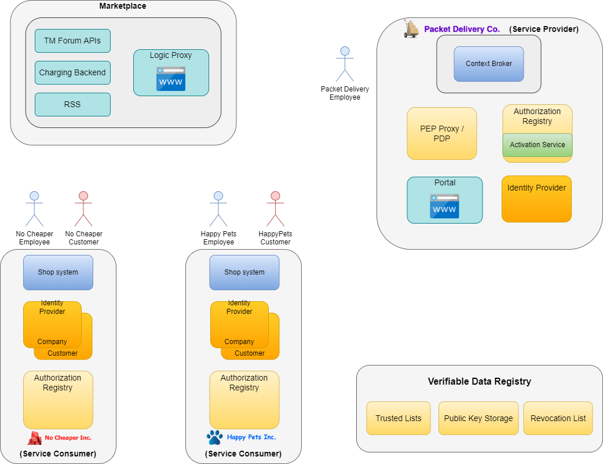

*Figure 3.25 - Overall architecture*

#### 3.4.3.1 Parties involved

##### 3.4.3.1.1 Data Service Provider: Packet Delivery Company

Packet Delivery Company (PacketDelivery for short) is a parcel service provider delivering packets all over the world. It offers two kind of Packet Delivery services:

- A “Standard Packet Delivery'' service for which the customer simply is given the opportunity to specify the issuer (sender) of the packet, the address, date and time at which the packet to be delivered is ready for collection, and the name and address of the destinee to whom the package has to be delivered. When the PacketDelivery receives a packet delivery order from a given customer, it returns the target date at which the packet is planned to be delivered. Under defined terms and conditions (e.g., there are no problems with customs, addresses are valid, etc), it commits to deliver the packet in 48 hours within the same country and 5-6 days if it requires international shipping. However, customers are not allowed to adjust the concrete date of delivery (e.g., delaying it to a more suitable date) nor fine-tune the concrete time of delivery within the selected date of delivery.

- A “Gold Packet Delivery” service for which the customer enjoys all the benefits of the “Standard Packet Delivery” but also is allowed to adjust the concrete address of delivery, date of delivery within an offered period, as well as concrete time of delivery within the selected date of delivery, provided such adjustments are feasible (e.g., are requested enough time in advance and do not imply additional costs).

PacketDelivery offers its services electronically to different retailers, bringing them access to its Packet Delivery Info system (P.Info) via a REST API in order to allow them to issue packet delivery orders, trace location of orders and allow their customers to perform requests for adjustments on address, date and time of planned delivery when their clients are entitled to.

This is implemented because the P.Info system offers access to data about DELIVERYORDER entities through a Context Broker using NGSI-LD. A DELIVERYORDER is an entity with attributes like:

- issuer

- pickingAddress

- pickingDate

- pickingTime

- destinee

- deliveryAddress

- PDA (planned date of arrival)

- PTA (planned time of arrival)

- EDA (expected date of arrival)

- ETA (expected time of arrival)

PacketDelivery has defined two roles “P.Info.standard” and “P.Info.gold” for the P.Info system based on which the operations that can be requested on the above attributes through the Context Broker service it publishes have been defined. To simplify the description of the scenario, we will focus on attributes deliveryAddress, PDA and PTA since we could assume that the other ones will be assigned values at the time an order is created, will be always readable but will not be able to be changed by users with the defined roles. In that sense, the following policies apply for the defined roles regarding modification of these three attributes (deliveryAddress, PDA, PTA) once an order has been created:

<table style="width:94%;">
<colgroup>
<col style="width: 28%" />
<col style="width: 29%" />
<col style="width: 36%" />
</colgroup>
<thead>
<tr>
<th style="text-align: center;"><strong>Path:</strong></th>
<th colspan="2" style="text-align: center;"><strong>Verb</strong></th>
</tr>
<tr>
<th><strong>/ngsi-ld/v1/entities/{entityID}/attrs/{attrName}</strong></th>
<th style="text-align: center;"><strong>GET</strong></th>
<th style="text-align: center;"><strong>PATCH</strong></th>
</tr>
<tr>
<th style="text-align: left;">deliveryAddress</th>
<th style="text-align: left;">P.Info.standard/gold</th>
<th style="text-align: left;">P.Info.gold</th>
</tr>
<tr>
<th style="text-align: left;">EDA</th>
<th style="text-align: left;">P.Info.standard/gold</th>
<th style="text-align: left;">---</th>
</tr>
<tr>
<th style="text-align: left;">ETA</th>
<th style="text-align: left;">P.Info.standard/gold</th>
<th style="text-align: left;">---</th>
</tr>
<tr>
<th style="text-align: left;">PDA</th>
<th style="text-align: left;">P.Info.standard/gold</th>
<th style="text-align: left;">P.Info.gold</th>
</tr>
<tr>
<th style="text-align: left;">PTA</th>
<th style="text-align: left;">P.Info.standard/gold</th>
<th style="text-align: left;">P.Info.gold</th>
</tr>
</thead>
<tbody>
</tbody>
</table>

Note that orders will be created using POST but with a different path (/ngsi-ld/v1/entities/). For issuing such requests an additional role “P.Create” is defined which will be assigned to the retailers Happy Pets and No Cheaper only.

PacketDelivery has decided to publish two different Packet Delivery offerings targeted to potential retailers and other kind of companies:

- Basic Delivery: which allows the company which acquires the offer to provide just a Standard Packet Delivery Services to its customers

- Premium Delivery: which allows the company which acquires the offer to provide Standard and Gold Delivery Services to its customers

Both have different pricing assigned.

Note that PacketDelivery should not know about the identity of users of applications of any Retailer company. It simply should be able, when it receives a request, to a) recognize that such request comes from a user linked to an application that belongs to a Retailer company that acquired one of its offerings in the Marketplace, b) find out what is the role within the P.Info application that such user has been assigned by the given Retailer company (i.e., either “P.Info.standard” or “P.Info.gold”), and c) check that such a role is a role that the given Retailer company could assign, considering the offering in the Marketplace it had acquired. After such steps, PacketDelivery will simply check whether a user with the given role can perform the operation requested.

An application created by organization NoCheaper, no matter if it defines users whom it assigns role “P.Info.gold” to, is unable to successfully change the value of the PTA attribute of a given order because it has acquired the Standard Packet Delivery service which does not allow to change those values.

##### 3.4.3.1.2 Data Service Consumer: Happy Pets Inc.

HappyPets Inc. (HappyPets for short) is a company that sells products for pets. It will acquire the “Premium Packet Delivery” offering on DOME. This will allow it to offer, in turn, standard and gold delivery services to its customers through the store application of HappyPets (HappyPetsStore). In addition, there may be certain employees within its own organisation, namely supervisors and agents in the phone help-desk service it offers, who may change the deliveryAddress, PDA and PTA of a given order using an internal application (HappyPetsBackOffice).

When a customer signs up in the HappyPetsStore, it can act as “regular” customer or “prime” customer (paying an annual fee). “Regular” customers are provided the standard packet delivery services while “prime” customers are provided the gold packet delivery service. This means they are assigned the “P.Info.standard” role and the “P.Info.gold” role within the HappyPetsStore application, respectively.

On the other hand, different employees are given different roles within the HappyPetsBackOffice application, so certain employees with supervisor roles at physical shops or agents at the central help-desk also have the “P.Info.gold” role assigned.

The Happy Pets employee:

- Acquires the offering “Premium Packet Delivery” at DOME

The Happy Pets Customer:

- Signs up at the shop system of Happy Pets and gets assigned the “prime customer” role

  - For simplicity, we will assume that there is already a Happy Pets customer which already registered as “prime customer”

- Makes an order on the shop system, which results in the creation of a packet delivery order

  - For simplicity, we will assume that there is already a delivery order for this customer at the Packet Delivery company system

- Successfully changes the PTA of the order via the packet delivery company portal

  - We will describe later in this document the detailed process to perform this operation

##### 3.4.3.1.3 Data Service Consumer: No Cheaper Ltd.

NoCheaper Ltd (NoCheaper for short) is a company that sells products of any kind at rather big discounts. It will acquire the “Basic Packet Delivery” offering from the Packet Delivery Service company in the Marketplace.

The No Cheaper employee:

- Acquires the offering “Basic Packet Delivery” at DOME

The No Cheaper Customer:

- Signs up at the No Cheaper shop system and gets assigned the “standard customer” role

  - For simplicity, we will assume that there is already a No Cheaper customer which already registered as “standard customer”

- Makes an order on the shop system, which results in the creation of a packet delivery order

  - For simplicity, we will assume that there is already a delivery order for this customer at the Packet Delivery company system

- When trying to change the PTA of the order via the packet delivery company portal, it is denied

- It can be also shown that this request will get denied, even when the No Cheaper employee is assigning the “Prime Customer” role to the No Cheaper customer in its own Identity Provider system

##### 3.4.3.1.4 Trust Anchor Framework

The system uses Verifiable Credentials and participants are identified via DIDs (described in “Decentralized Identifiers (DIDs) v1.0”). In order to enable an efficient and decentralised verification of the credentials and identities of participants, a DLT-based Trust Framework has to be implemented to avoid central entities intermediation in all authentication flows.

The trust framework is basically composed of two things:

1.  A list of the identities of trusted organisations stored in the DLT, together with associated information for each entity.

2.  A process to add, modify and delete the trusted entities, implementing a concrete governance model.

The trust framework is designed to be largely decentralised and represents the trust relationships in the real world. Here we describe a possible approach to implementing a DLT-based trust framework which is very decentralised and at the same time simple, secure and robust.

The identities of the legal persons involved in the ecosystem are registered in a common directory implemented in the DLT following a hierarchical scheme very similar to the DNS (Domain Name Service) schema in the Internet.

Essentially, once an entity is registered in the system, it is completely autonomous for adding other entities that are managed as child entities.

In this way, trust is delegated according to a well defined, transparent, auditable and public scheme. Any participant can get trusted information about the current trust structure of the ecosystem and also the events that led the system to the current situation. For example, what entity registered another entity, when it was done and what attributes were assigned to the child entity by the parent entity.

The scheme is flexible enough to implement as many levels as required by the actual governance model of the ecosystem. In very simple cases, it can have just two levels, where there is only one entity registering all other participants in the ecosystem.

In general, the system can be made very decentralised. However, there is one centralised element: the root of trust at the top of the hierarchy should be a trusted entity (or federation of entities) in the ecosystem that is the one responsible for bootstrapping the system. Depending on the concrete governance framework of the ecosystem, this may be the only mission of the root entity, possibly including the monitoring and oversight of the ecosystem. Typically it should be a regulatory body, a public administration or a neutral organisation which is accepted as fully trusted by all participants in the ecosystem.

The approach for a single DLT network is described in the following figure (the scheme is easily extensible to different DLT networks where we want to establish trust across them so entities in one network can interact with entities in another network in a trusted way.

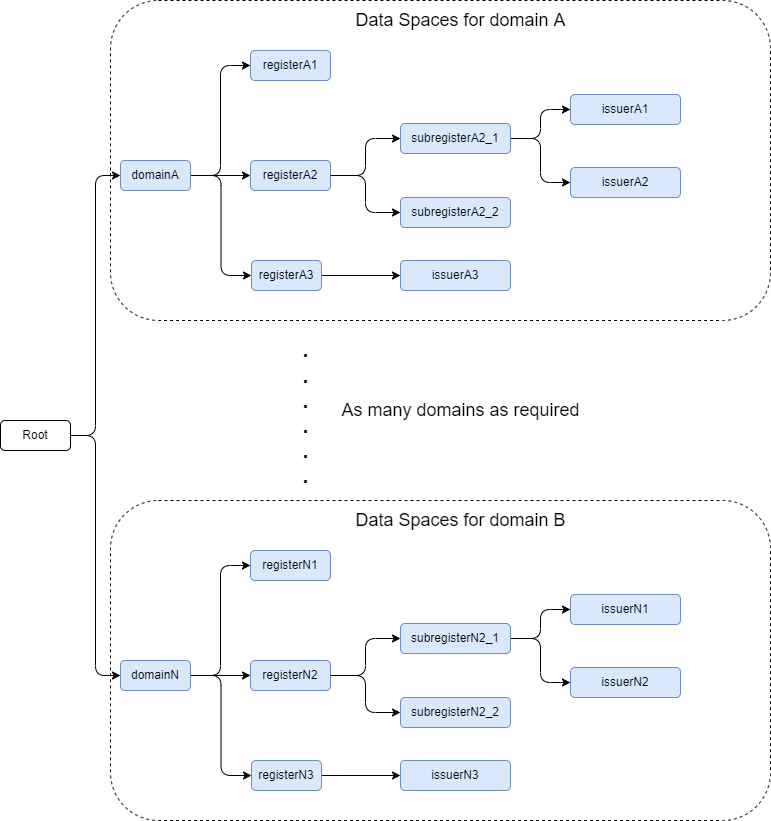

As can be seen in the figure, the Trust Framework in a given DLT is not really a flat list, but a hierarchical structure, implemented as a Smart Contract:

- There is a special organisation (or set of organisations) which is at the root of the hierarchy. This entity is called the Trusted Registration Authority (TRA) in EBSI, or Trusted Anchors in other contexts. We will use the term Trusted Anchors in the following description. The essential characteristic is that this is the most trusted entity/entities in the ecosystem.

- This root entity is responsible for registering the identities of some other trusted entities. For example, in a country with several regions with autonomous competencies to manage universities, the Ministry of Education could register in the DLT the identities of the regional institutions which are responsible for managing the universities in each of their regions.

- Once this is done, each of the regional institutions can register the identities of dependent entities, like universities.

- The hierarchy can have several levels. For example, a university can be big and have several organisational units with some autonomy, maybe distributed geographically. It can create sub-identities and register them as child nodes in the DLT.

#### 3.4.3.2 Verifiable Credentials in the ecosystem

In this section we describe the different types of credentials that are needed for the functionalities in the ecosystem.

##### 3.4.3.2.1 Employee of Packet Delivery

Packet Delivery issues credentials to some of its employees, so they can access DOME, either to create offerings or to purchase offerings.

This credential is used by an employee of Packet Delivery to prove to a third party that she is entitled to use some services provided by the third party on behalf of the employed company (Packet Delivery in this case). In other words, the credential is used as a mechanism for Packet Delivery to delegate its access control rights to one or more of its employees.

The essential characteristics of such credential are:

- Nobody has tampered with its contents since it was issued, because the credential is digitally signed by the issuer, Packet Delivery.

- Proves that the issuer is Packet Delivery, because the public key that verifies the signature of the credential is cryptographically associated with the real-world identity of Packet Delivery registered in the Trust Framework.

- Optionally, it can prove that the credential was issued no later than a given time, because the credential was registered (timestamped) in the DLT when it was issued. The term “notarisation” is commonly used for this action, but it is wrong, because the term is coming from anglo-saxon cultures where notaries are very different from the latin-germanic notary functions in the EU and many other countries in the world. We will use the term “timestamping”.

Please note that the date of timestamping can be greater than the date in the field “Issued at” included inside the credential. For example, the credential is created and signed at one time, but timestamped the next day (maybe to batch the operation with other credentials). The real requirement is that nobody can create a credential and timestamp as if it happened in the past. In other words, nobody can create credentials from the past. The verifiers have to check that the field inside the credential “Issued at” is not later than the timestamp (at least by a small leeway to account for clock synchronisation differences).

Also note that many credentials may not require timestamping, avoiding the overhead of the registration process. It all depends on the type of credential, the intended usage of the credential and the level of risk assumed. The employee credential discussed here is one example of credential that does not require timestamping with the same level of risk. The only thing that the verifier requires is that the holder can prove that at the time of usage of the credential (eg., login), the credential was issued by the employer (Packet Delivery in our case). Obviously, this does not require timestamping, because if the employee can present a credential when performing login, she can do so only if the credential was issued before.

From the above description we can derive the following trust properties for a verifier receiving a credential:

- The level of trust in the identity of the issuer of the credential depends on the level of trust of the verifier in the onboarding process implemented in the Trust Framework. The onboarding process associates the public key of the issuer with its real identity.

- The level of trust in the claims inside the credential depends on the level of trust that the verifier has with the issuer entity. For example, Packet Delivery could issue employee credentials to people who are not real employees. However, if this is the case the verifier has a strong non-repudiable mechanism to prove to third-parties (e.g., a court) that the issuer stated wrong facts.

From the above it follows that Packet Delivery can issue employee credentials which include some employee data (name, surname, etc.) and the verifier can have a given level of trust on those claims.

But this just proves that Packet Delivery attests that the data inside the credential (called claims) is true. It does not say anything about whether the person presenting the credential online is the same that is referred to in the claims. In other words, the person sending the employee credential to the verifier could be a different person from the employee.

This is the reason why the credential includes a public key as one of the claims associated with the employee (inside the “credentialSubject” object.

That public key corresponds to a private key that was generated in the employee device (PC or mobile) during the process of credential issuance. The process is explained in more detail later, but essentially:

- The employee generates a pair of public/private keys and sends the public key to the employer via an authenticated and encrypted channel (e.g., HTTPS). This channel can be the usual mechanism that employees use to connect to enterprise applications.

- The employer generates a credential with some employee data and includes the public key.

- The employer signs the credential and sends it to the employee using the same authenticated channel.

Below we present an example employee credential issued by Packet Delivery.

<table style="width:94%;">
<colgroup>
<col style="width: 94%" />
</colgroup>
<thead>
<tr>
<th style="text-align: left;">// Credential issued by PacketDelivery to its employees, providing access to 
// Marketplace, either to create offerings or to purchase offerings. 
{ 
"@context": [ 
"https://www.w3.org/ns/credentials/v2", 
"https://marketplace.fiware.io/2022/credentials/employee/v1" 
], 
"id": "https://pdc.fiware.io/credentials/6e14b8b8-87fa0014fe2a", 
"type": ["VerifiableCredential", "EmployeeCredential"], 
"issuer": { 
"id": "did:elsi:EU.EORI.NLPACKETDEL" 
}, 
"issuanceDate": "2022-03-22T14:00:00Z", 
"validFrom": "2022-03-22T14:00:00Z", 
"expirationDate": "2023-03-22T14:00:00Z", 
"credentialSubject": { 
"id": "did:peer:99ab5bca41bb45b78d242a46f0157b7d", 
"verificationMethod": [ 
{ 
"id": "did:peer:99ab5bca41bb45b78d242a46f0157b7d#key1", 
"type": "JwsVerificationKey2020", 
"controller": "did:peer:99ab5bca41bb45b78d242a46f0157b7d", 
"publicKeyJwk": { 
"kid": "key1", 
"kty": "EC", 
"crv": "P-256", 
"x": "lJtvoA5_XptBvcfcrvtGCvXd9bLymmfBSSdNJf5mogo", 
"y": "fSc4gZX2R3QKKfHvS3m2vGSVSN8Xc04qsquyfEM55Z0" 
} 
} 
], 
"roles": [ 
{ 
"target": "did:elsi:EU.EORI.NLMARKETPLA", 
"names": ["seller", "buyer"] 
} 
], 
"name": "Jane Doe", 
"given_name": "Jane", 
"family_name": "Doe", 
"preferred_username": "j.doe", 
"email": "janedoe@packetdelivery.com" 
} 
}</th>
</tr>
</thead>
<tbody>
</tbody>
</table>

The structure of the above credential can be visualized as follows:

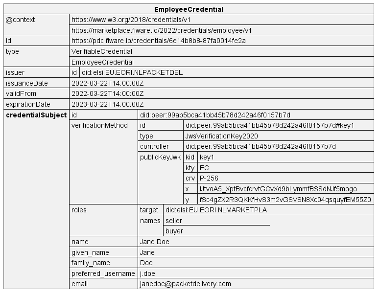

The credential is of type “EmployeeCredential” and to enable access to DOME the roles embedded in it can be “buyer”, “seller” or both. The URL in the “@context” field points to the marketplace (https://pdc.fiware.io/2022/credentials/employee/v1), which defines the general requirements for an Employee Credential. However, participants in the ecosystem can extend it and of course use the roles and role names that they need for their own purposes.

The “credentialSubject” section in the credential has the following objects:

- “id”, specified as a DID. For privacy reasons and given that this is a natural person, the DID used is the Peer Method as specified in the W3C [<u>Peer DID Method Specification</u>](https://identity.foundation/peer-did-method-spec/index.html). The method can be used independent of any central source of truth, and is intended to be cheap, fast, scalable, and secure. It is suitable for most private relationships between people, organisations, and things.

- “verificationMethod”, which is a standard W3C VC object that specifies the Public Key associated with the DID of the employee. The binding between the DID of the employee and the Public Key was performed at the moment of credential issuance by Packet delivery.

- “roles” is an array with one or more role specifications. Each specification defines a potential target entity that will receive the credential, and one or more names of roles defined by that target entity.

  - “target” is the DID of the entity that will receive the credential.

  - “names” is an array with one or more roles that the target entity recognizes and that will be used by the target entity to apply its own access control policies. In the example, we have used both “buyer” and “seller” roles as defined by the Marketplace. Other entities can define their own roles for their specific purposes. Names are made unique in the ecosystem thanks to the target property.

- The rest of the fields in the credential have the usual meaning in the standard W3C Verifiable Credential Data Model.

The “id” field at the top level is the identification of the credential, which can be used for revocation if that functionality is required. The basic requirements for the “id” field are that:

- It is unique in the scope where it is going to be used

- It is based on a cryptographically secure random number generator and so is difficult to “guess” by a potential attacker who could try to revoke a given credential. Using such Ids reduces the probability of an attacker guessing the id to the same level than an attacker guessing a private key,

- It is not related in any way with the personal data included in the credential, to minimise the risk of correlation

A UUID Version 4 complies with all those requirements but other schemas can be used.

##### 3.4.3.2.2 Employee of Happy Pets (or No Cheaper)

The employee credential issued by Happy Pets and No Cheaper companies to its employees are virtually identical to the employee credential from Packet Delivery described above. The main difference is the set of roles assigned to the employee and specified in the “roles” claim.

<table style="width:95%;">
<colgroup>
<col style="width: 95%" />
</colgroup>
<thead>
<tr>
<th style="text-align: left;">// Credential issued by HappyPets to its employees, providing access 
// to order creation in PacketDelivery. 
{ 
"@context": [ 
"https://www.w3.org/ns/credentials/v2", 
"https://happypets.fiware.io/2022/credentials/employee/v1" 
], 
"id": "https://happypets.fiware.io/credentials/25159389-8dd17b796ac0", 
"type": ["VerifiableCredential", "EmployeeCredential"], 
"issuer": { 
"id": "did:elsi:EU.EORI.NLHAPPYPETS" 
}, 
"issuanceDate": "2022-03-22T14:00:00Z", 
"validFrom": "2022-03-22T14:00:00Z", 
"expirationDate": "2023-03-22T14:00:00Z", 
"credentialSubject": { 
"id": "did:peer:99ab5bca41bb45b78d242a46f0157b7d", 
"verificationMethod": [ 
{ 
"id": "did:peer:99ab5bca41bb45b78d242a46f0157b7d#key1", 
"type": "JwsVerificationKey2020", 
"controller": "did:peer:99ab5bca41bb45b78d242a46f0157b7d", 
"publicKeyJwk": { 
"kid": "key1", 
"kty": "EC", 
"crv": "P-256", 
"x": "lJtvoA5_XptBvcfcrvtGCvXd9bLymmfBSSdNJf5mogo", 
"y": "fSc4gZX2R3QKKfHvS3m2vGSVSN8Xc04qsquyfEM55Z0" 
} 
} 
], 
"roles": [ 
{ 
"target": "did:elsi:EU.EORI.NLPACKETDEL", 
"names": ["P.Create"] 
} 
], 
"name": "Jane Doe", 
"given_name": "Jane", 
"family_name": "Doe", 
"preferred_username": "j.doe", 
"email": "janedoe@packetdelivery.com" 
} 
}</th>
</tr>
</thead>
<tbody>
</tbody>
</table>

##### 3.4.3.2.3 Customer of Happy Pets (or No Cheaper)

This credential is used by Happy Pets to delegate access control to customers that want access to services provided by Packet Delivery and that were purchased by Happy Pets in the past.

It follows the same model as with employee credentials except that:

- The credential should be issued by Happy Pets to customers using a secure and authenticated channel created as part of a previous customer onboarding process (KYC).

- The role included in the credential corresponds to the type of customer, with the role name defined and understood by the service provider, in this case Packet Delivery.

<table style="width:97%;">
<colgroup>
<col style="width: 96%" />
</colgroup>
<thead>
<tr>
<th style="text-align: left;">// Credential issued by HappyPets to a customer, 
// providing access to Gold services at PacketDelivery. 
{ 
"@context": [ 
"https://www.w3.org/2018/credentials/v1", 
"https://happypets.fiware.io/2022/credentials/employee/v1" 
], 
"id": "https://happypets.fiware.io/credentials/25159389-8dd17b796ac0", 
"type": ["VerifiableCredential", "CustomerCredential"], 
"issuer": { 
"id": "did:elsi:EU.EORI.NLHAPPYPETS" 
}, 
"issuanceDate": "2022-03-22T14:00:00Z", 
"validFrom": "2022-03-22T14:00:00Z", 
"expirationDate": "2023-03-22T14:00:00Z", 
"credentialSubject": { 
"id": "did:peer:99ab5bca41bb45b78d242a46f0157b7d", 
"verificationMethod": [ 
{ 
"id": "did:peer:99ab5bca41bb45b78d242a46f0157b7d#key1", 
"type": "JwsVerificationKey2020", 
"controller": "did:peer:99ab5bca41bb45b78d242a46f0157b7d", 
"publicKeyJwk": { 
"kid": "key1", 
"kty": "EC", 
"crv": "P-256", 
"x": "lJtvoA5_XptBvcfcrvtGCvXd9bLymmfBSSdNJf5mogo", 
"y": "fSc4gZX2R3QKKfHvS3m2vGSVSN8Xc04qsquyfEM55Z0" 
} 
} 
], 
"roles": [ 
{ 
"target": "did:elsi:EU.EORI.NLPACKETDEL", 
"names": ["P.Info.gold"] // Or P.Info.standard 
} 
], 
"name": "Jane Doe", 
"given_name": "Jane", 
"family_name": "Doe", 
"preferred_username": "j.doe", 
"email": "janedoe@packetdelivery.com" 
} 
}</th>
</tr>
</thead>
<tbody>
</tbody>
</table>

##### 3.4.3.2.4 Role-based access

As can be seen in the above credentials, they contain claims specifying roles. The roles are not defined by the issuer of the credential, but by the provider (i.e.: the relying party) that is going to receive the credential and perform authentication and authorization.

The provider defines a role having a certain name, and this role is mapped to a certain policy set representing the policies that the provider wants to enforce. An offering on the marketplace then just represents a certain role (or several roles). When acquiring access to an offering on the marketplace, these roles then get issued to the acquiring organisation within the Authorisation Registry of the provider. Furthermore, the acquiring organisation then can just assign these roles to their users by embedding the roles inside the Verifiable Credential issued to its users. When accessing the service, it is up to the PEP proxy/PDP component of the provider to obtain the set of attribute-based policies that belong to the assigned roles and to perform the evaluation of granting access based on the NGSI-LD request.

It is out of scope for this document to describe the actual policy language and engine used to perform the enforcement (ODRL, Rego, etc).

#### 3.4.3.3 Detailed workflows

##### 3.4.3.3.1 Create Offering

We now describe the process of creating an offer. In the reference use case, Packet Delivery needs to perform it twice for creating the offerings for “Basic Delivery” and “Premium Delivery”, providing a different set of offering information. The process will be performed by an employee of the Packet Delivery company.

When using the OID4VP presentation flow with Verifiable Credentials, DOME does not need to query any additional entity in the ecosystem to verify the credential. All the required information is already contained in the Verifiable Credential presented by the employee and in the Decentralised Verifiable Registry (implemented in our case using a DLT network), accessed via the Universal Resolver.

In other words, the flows are essentially peer-to-peer and do not require any centralised IdP to be queried, providing an efficient, scalable, private and resilient framework.

The following gives a detailed description of the offer creation process. Figure 3.26a presents the different interactions in an architectural overview, whereas Figure 3.26b shows a detailed sequence diagram of the whole process.

In the following, a description is given for each of the sequence steps.

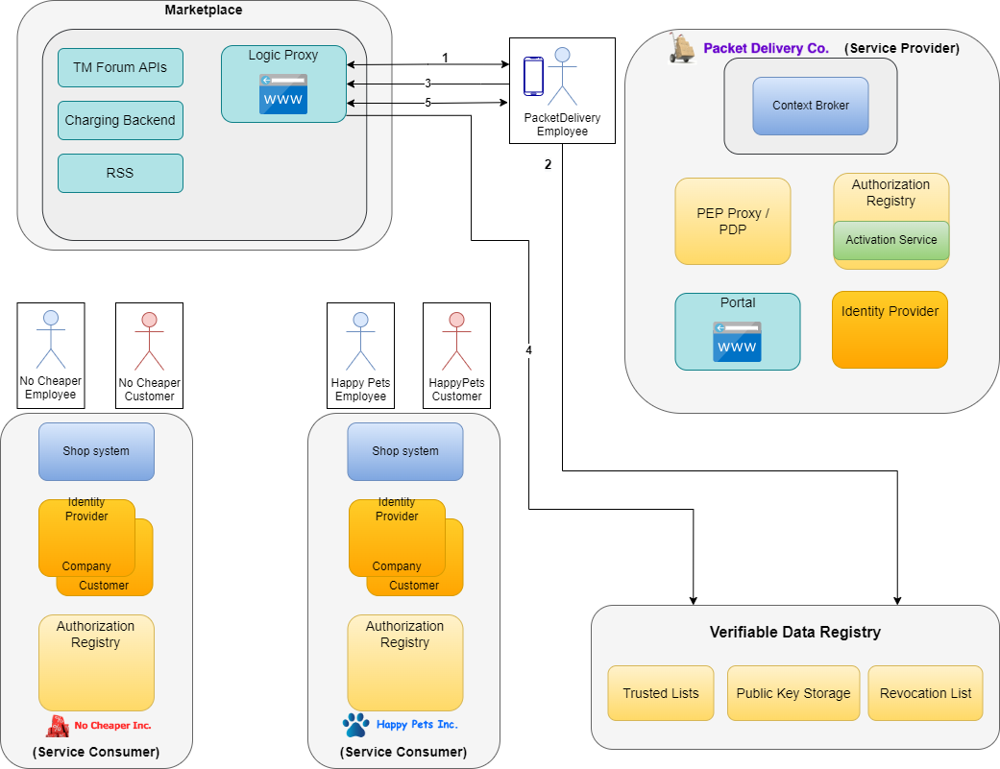

*Figure 3.26a - Architecture diagram for step “[<u>Create Offering</u>](https://drive.google.com/file/d/1205HoNBTueOZFFAkpLRHO9xoY8zOk8a5/view?usp=sharing)”*

[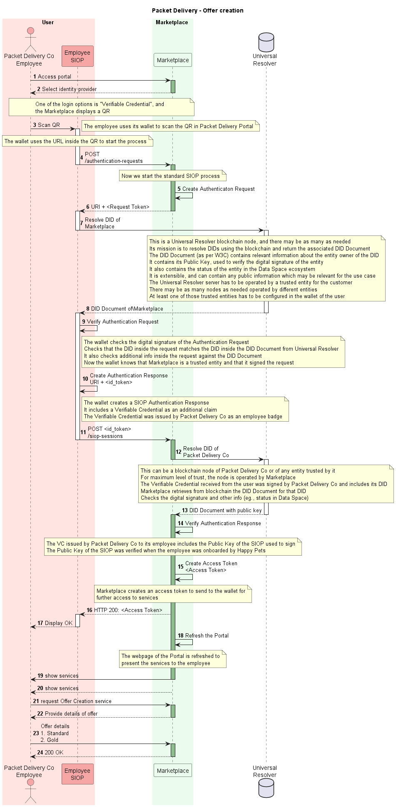](https://drive.google.com/file/d/12UwBrR2kB4h5IzLXQvWjmV9nJiRfVhCg/view?usp=sharing)

*Figure 3.26b - Sequence diagram for step “Create Offering”*

1.  A Packet Delivery employee accesses the Marketplace portal (DOME), in order to login.

2.  The Marketplace portal displays a list of Identity Providers for selecting the desired Identity Provider for login. One of the login options is “Login with Verifiable Credentials”.

3.  Packet Delivery Co employee selects the “Verifiable Credentials” login method, which causes the Marketplace portal to generate a QR containing the URL of the /authentication-requests endpoint of the Marketplace server.

4.  The employee scans the QR with her mobile and the mobile calls the /authentication-requests endpoint.

5.  This starts an OID4VP (OpenID for Verifiable Presentations) flow, where the Marketplace acts as the OpenID Relying Party (RP) and the mobile device of the employee acts as the OID4VP Credential Holder. The Marketplace generates an OID4VP Presentation Request Object, encoded as a signed JWT. This Presentation Request specifies which Verifiable Credentials are required, the expected credential format, and the presentation constraints (e.g., mandatory claims), following the OpenID4VP 1.0 specification**.**

> The Authentication Request travels in the response to the HTTP GET request performed in the previous point, as a JWT signed by Marketplace. The decoded contents of the JWT may be:

<table style="width:93%;">
<colgroup>
<col style="width: 92%" />
</colgroup>
<thead>
<tr>
<th style="text-align: left;">
openid://?client_id=did:elsi:EU.EORI.NLMARKETPLA

&amp;redirect_uri=https://marketplace.dome.org/siop_sessions

&amp;nonce=n-0S6_WzA2Mj

&amp;state=af0ifjsldkj

&amp;presentation_definition=...
</th>
</tr>
</thead>
<tbody>
</tbody>
</table>

> The employee’s wallet receives the Presentation Request and constructs an OID4VP Verifiable Presentation, returning it to the Marketplace using the required vp_token and presentation_submission fields defined by the OID4VP 1.0 specification..

6.  In this step the employee verifies that the Marketplace is a trusted entity belonging to the ecosystem, by resolving the DID of the Marketplace which is received in the **client_id** parameter of the Authentication Request.

> To resolve a DID, the wallet sends a GET request to the **/api/did/v1/identifiers/did:elsi:EU.EORI.NLMARKETPLA** endpoint of one of several trusted servers implementing the Universal Resolver functionality. The Universal Resolver includes a DLT node, and there may be as many as needed. Its mission is to resolve DIDs using the DLT and return the associated DID Document. The DID Document (as per W3C) contains relevant information about the entity owner of the DID. It contains its Public Key, used to verify the digital signature of the entity. It also contains the status of the entity in the Data Space ecosystem. It is extensible and can contain any public information which may be relevant for the use case. The Universal Resolver server must be operated by a trusted entity for the customer. There may be as many nodes as needed operated by different entities. At least one of those trusted entities has to be configured in the wallet of the employee.

7.  The wallet receives the DID Document of Marketplace, with trusted information about the entity, including the Public Key associated with the Private Key that Marketplace uses to digitally sign tokens. For example:

<table style="width:90%;">
<colgroup>
<col style="width: 90%" />
</colgroup>
<thead>
<tr>
<th style="text-align: left;">{ 
"payload": { 
"@context": [ 
"https://www.w3.org/ns/did/v1", 
"https://w3id.org/security/v1" 
], 
"id": "did:elsi:EU.EORI.NLMARKETPLA", 
"verificationMethod": [ 
{ 
"id": "did:elsi:EU.EORI.NLMARKETPLA#key-verification", 
"type": "JwsVerificationKey2020", 
"controller": "did:elsi:EU.EORI.NLMARKETPLA", 
"publicKeyJwk": { 
"kid": "key-verification", 
"kty": "EC", 
"crv": "secp256k1", 
"x": "V8XptJkb5wplYkExcTF4nkyYVp7t5H5d5C4UPqCCM9c", 
"y": "kn3nSPxIIvd9iaG0N4v14ceuo8E4PcLXhhGeDzCE7VM" 
} 
} 
], 
"service": [ 
{ 
"id": "did:elsi:EU.EORI.NLMARKETPLA#info", 
"type": "EntityCommercialInfo", 
"serviceEndpoint": "https://marketplace.fiware.io/info", 
"name": "Packet Delivery co." 
}, 
{ 
"id": "did:elsi:EU.EORI.NLMARKETPLA#sms", 
"type": "SecureMessagingService", 
"serviceEndpoint": "https://marketplace.fiware.io/api/sms" 
} 
], 
"anchors": [ 
{ 
"id": "redt.alastria", 
"resolution": "UniversalResolver", 
"domain": "marketplace.dataspace", 
"ethereumAddress": "0xbcB9b29eeb28f36fd84f1CfF98C3F1887D831d78" 
} 
], 
"created": "2021-11-14T13:02:37Z", 
"updated": "2021-11-14T13:02:37Z" 
} 
}</th>
</tr>
</thead>
<tbody>
</tbody>
</table>

8.  The DID Document includes one or more public keys inside the “verificationMethod” array. The keys are identified by the “id” field in each element of the array. The employee wallet uses the **kid** field that was received in the Authentication Request (in the protected header of the JWT) to select the corresponding Public Key and verify the signature of the JWT. It also verifies that the top-level “**id**” field in the DID Document ("did:elsi:EU.EORI.NLMARKETPLA") is equal to the **client_id** parameter of the Authentication Request.

9.  The employee wallet creates an Authentication Response to be posted in the **redirect_uri** specified by Marketplace in step 5. The contents of the Authentication Response are described below.

10. The Wallet sends the OID4VP Response to the endpoint indicated in the redirect_uri parameter using an HTTP POST request with application/x-www-form-urlencoded encoding. The response contains an ID Token (used only to carry protocol parameters such as sub, aud, and nonce) and a Verifiable Presentation (vp_token) as defined in OpenID for Verifiable Presentations.

<table style="width:90%;">
<colgroup>
<col style="width: 90%" />
</colgroup>
<thead>
<tr>
<th style="text-align: left;">
POST /siop_sessions HTTP/1.1

Host: marketplace.dome.org

Content-Type: application/x-www-form-urlencoded

id_token=eyJ0 ... NiJ9.eyJ1c ... I6IjIifX0.DeWt4Qu ... ZXso

&amp;vp_token=...

&amp;state=af0ifjsldkj
</th>
</tr>
</thead>
<tbody>
</tbody>
</table>

> The decoded **id_token** would be:

<table style="width:90%;">
<colgroup>
<col style="width: 90%" />
</colgroup>
<thead>
<tr>
<th style="text-align: left;">{ 
"iss": "https://self-issued.me/v2", 
"aud": "did:elsi:EU.EORI.NLMARKETPLA", 
"iat": 1615910538, 
"exp": 1615911138, 
"sub": "did:peer:99ab5bca41bb45b78d242a46f0157b7d", 
"auth_time": 1615910535, 
"nonce": "n-0S6_WzA2Mj" 
}</th>
</tr>
</thead>
<tbody>
</tbody>
</table>

> The **sub** claim is *did:peer:99ab5bca41bb45b78d242a46f0157b7d* which is the DID of the user and for privacy reasons it is not registered in any DLT or centralized repository. It must be the same as the DID included in the Verifiable Credential that was issued by the Packet Delivery company when onboarding the employee and which travels in the authentication response.
>
> The **vp_token** includes the Verifiable Presentation, which can be in two formats: **jwt_vp** (JWT encoded) or **ldp_vp** (JSON-LD encoded). The following example is using the JWT encoding:

<table style="width:98%;">
<colgroup>
<col style="width: 98%" />
</colgroup>
<thead>
<tr>
<th style="text-align: left;">{ 
"format": "jwt_vp", 
"presentation": 
"eyJhbGciOiJSUzI1NiIsInR5cCI6IkpXVCIsImtpZCI6ImRpZDpleGFtcGxlOmFiZmUxM2Y3MTIxMjA0 
MzFjMjc2ZTEyZWNhYiNrZXlzLTEifQ.eyJzdWIiOiJkaWQ6ZXhhbXBsZTplYmZlYjFmNzEyZWJjNmYxY 
zI3NmUxMmVjMjEiLCJqdGkiOiJodHRwOi8vZXhhbXBsZS5lZHUvY3JlZGVudGlhbHMvMzczMiIsImlzc 
yI6Imh0dHBzOi8vZXhhbXBsZS5jb20va2V5cy9mb28uandrIiwibmJmIjoxNTQxNDkzNzI0LCJpYXQiO 
jE1NDE0OTM3MjQsImV4cCI6MTU3MzAyOTcyMywibm9uY2UiOiI2NjAhNjM0NUZTZXIiLCJ2YyI6eyJAY 
29udGV4dCI6WyJodHRwczovL3d3dy53My5vcmcvMjAxOC9jcmVkZW50aWFscy92MSIsImh0dHBzOi8vd 
3d3LnczLm9yZy8yMDE4L2NyZWRlbnRpYWxzL2V4YW1wbGVzL3YxIl0sInR5cGUiOlsiVmVyaWZpYWJsZ 
UNyZWRlbnRpYWwiLCJVbml2ZXJzaXR5RGVncmVlQ3JlZGVudGlhbCJdLCJjcmVkZW50aWFsU3ViamVjd 
CI6eyJkZWdyZWUiOnsidHlwZSI6IkJhY2hlbG9yRGVncmVlIiwibmFtZSI6IjxzcGFuIGxhbmc9J2ZyL 
UNBJz5CYWNjYWxhdXLDqWF0IGVuIG11c2lxdWVzIG51bcOpcmlxdWVzPC9zcGFuPiJ9fX19.KLJo5GAy 
BND3LDTn9H7FQokEsUEi8jKwXhGvoN3JtRa51xrNDgXDb0cq1UTYB-rK4Ft9YVmR1NI_ZOF8oGc_7wAp 
8PHbF2HaWodQIoOBxxT-4WNqAxft7ET6lkH-4S6Ux3rSGAmczMohEEf8eCeN-jC8WekdPl6zKZQj0YPB 
1rx6X0-xlFBs7cl6Wt8rfBP_tZ9YgVWrQmUWypSioc0MUyiphmyEbLZagTyPlUyflGlEdqrZAv6eSe6R 
txJy6M1-lD7a5HTzanYTWBPAUHDZGyGKXdJw-W_x0IWChBzI8t3kpG253fg6V3tPgHeKXE94fz_QpYfg 
--7kLsyBAfQGbg" 
}</th>
</tr>
</thead>
<tbody>
</tbody>
</table>

> Which decoded would be:

<table style="width:94%;">
<colgroup>
<col style="width: 94%" />
</colgroup>
<thead>
<tr>
<th style="text-align: left;">{ 
"@context": ["https://www.w3.org/2018/credentials/v1"], 
"type": ["VerifiablePresentation"], 
"verifiableCredential": [ 
{ 
"@context": [ 
"https://www.w3.org/ns/credentials/v2", 
"https://marketplace.dome.org/2022/credentials/employee/v1" 
], 
"id": "https://pdc.fiware.io/credentials/6e14b8b8-87fa0014fe2a", 
"type": ["VerifiableCredential", "EmployeeCredential"], 
"issuer": { 
"id": "did:elsi:EU.EORI.NLPACKETDEL" 
}, 
"issuanceDate": "2022-03-22T14:00:00Z", 
"validFrom": "2022-03-22T14:00:00Z", 
"expirationDate": "2023-03-22T14:00:00Z", 
"credentialSubject": { 
"id": "did:peer:99ab5bca41bb45b78d242a46f0157b7d", 
"verificationMethod": [ 
{ 
"id": "did:peer:99ab5bca41bb45b78d242a46f0157b7d#key1", 
"type": "JwsVerificationKey2020", 
"controller": "did:peer:99ab5bca41bb45b78d242a46f0157b7d", 
"publicKeyJwk": { 
"kid": "key1", 
"kty": "EC", 
"crv": "P-256", 
"x": "lJtvoA5_XptBvcfcrvtGCvXd9bLymmfBSSdNJf5mogo", 
"y": "fSc4gZX2R3QKKfHvS3m2vGSVSN8Xc04qsquyfEM55Z0" 
} 
} 
], 
"roles": [ 
{ 
"target": "did:elsi:EU.EORI.NLMARKETPLA", 
"names": ["seller", "buyer"] 
} 
], 
"name": "Jane Doe", 
"given_name": "Jane", 
"family_name": "Doe", 
"preferred_username": "j.doe", 
"email": "janedoe@packetdelivery.com" 
} 
} 
] 
}</th>
</tr>
</thead>
<tbody>
</tbody>
</table>

11. Marketplace uses its own DLT node or the one from a trusted entity implementing the Universal Resolver functionality to resolve the DID of Packet Delivery Co, which is inside the Verifiable Credential received in the Verifiable Presentation. This DID can be found in the “issuer” field of the “verifiableCredential” structure above.

> Resolution is performed sending a GET request to the Universal Resolver: **/api/did/v1/identifiers/did:elsi:EU.EORI.NLPACKETDEL**
>
> Marketplace could use a Universal Resolver operated by a different entity, but this would reduce the level of trust compared to using its own server directly connected to the DLT network.

12. Marketplace receives the DID Document of Packet Delivery Co with trusted information about the company, including the Public Key associated with the Private Key that Packet Delivery Co used to digitally sign the Verifiable Credential that the employee has just sent inside a Verifiable Presentation as part of the authentication flow. **Using the Public Key and the DID inside the DID Document, it can verify the signature of the Verifiable Credential and that Packet Delivery Co is a trusted entity in the ecosystem and that it is active.**

13. The above is just for verification of the Verifiable Credential. In addition, Marketplace can also verify that the Verifiable Presentation including the Verifiable Credential is sent by the employee and not by a malicious agent. To do so, it uses the Public Key of the employee in the “verificationMethod” of the “credentialSubject” structure. That public key is cryptographically bound to the employee DID during the onboarding process that Packet Delivery Co performed with its employee.

14. Once all verifications have been performed, Marketplace creates an Access Token for the employee so she can use it to access services in the Marketplace server in the future.

15. The wallet receives the access token and saves it temporarily to be able to request services from Marketplace.

16. The wallet displays a success message to the employee.

17. The Marketplace server refreshes the page (it was the login page before) and displays the services available to the employee of Packet Delivery Co.

At this point the Packet Delivery Co employee is logged in on the Marketplace application. The user is now able to create catalogues, products and offerings.

At this moment, the Marketplace knows the following:

- That Packet Delivery Co belongs to the Data Space and can issue credentials of the type EmployeeCredential because it is included in the Trusted Issuers Registry and is active, because this info is in the DID Document retrieved in step 13.

- That Packet Delivery Co says that the user is one of its employees. This info is inside the Verifiable Credential that is digitally signed by Packet Delivery Co.

From this point on, the Marketplace can display to the user the services available to her and execute them if the user is entitled to do so. The Marketplace can use all the claims inside the credential to perform RBAC/ABAC access control and policy enforcement.

##### 3.4.3.3.2 Acquisition of rights / Activation

The process of acquiring access to the packet delivery service is displayed. It is performed by employees of both parties separately, Happy Pets and No Cheaper, where the former one acquires access to the “Premium Delivery” offering and the latter acquires the “Basic Delivery” offering.

In the following we describe the authentication process for employees of Happy Pets and No Cheaper, which is similar to the one described above for the employee of Packet Delivery.

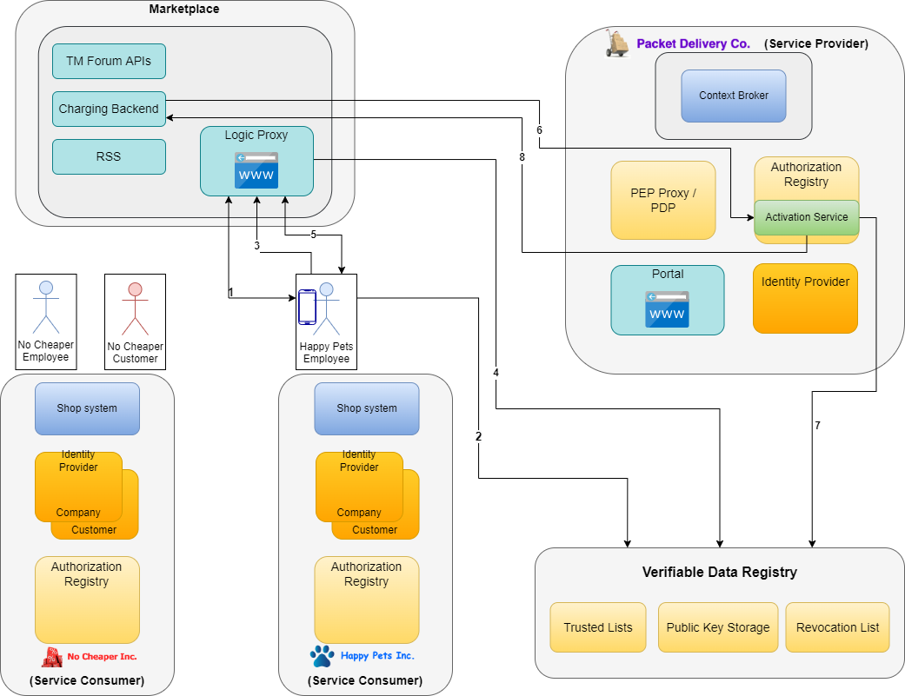

*Figure 3.27 - Sequence diagram for step “[<u>Acquisition of Rights / Activation</u>](https://drive.google.com/file/d/125wlGdoi3jyxHCZWtY3wL6KjEk9UtZxp/view?usp=sharing)”*

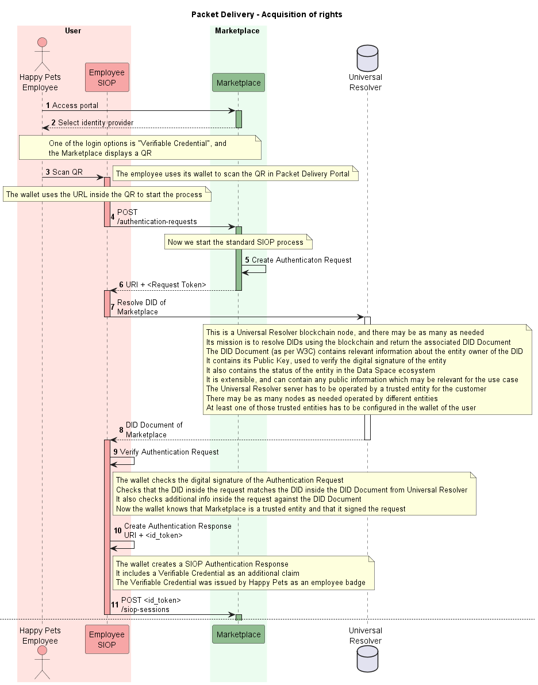

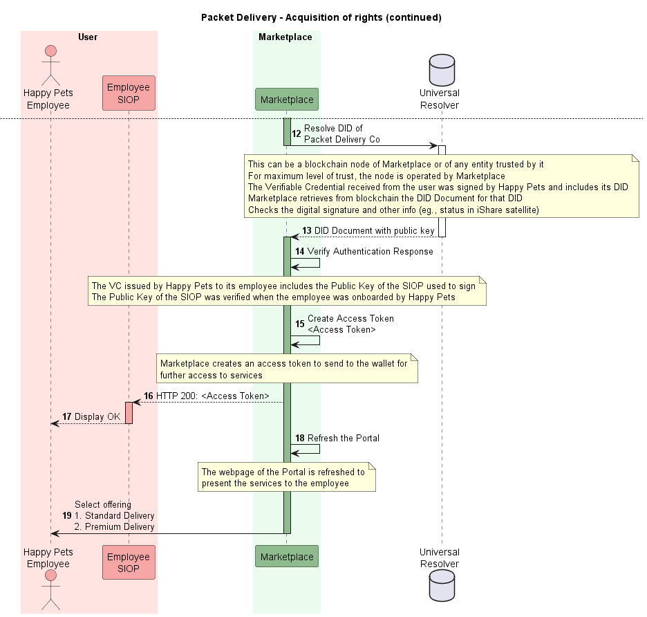

*Figure 3.28 - Sequence diagram for step “Acquisition of Rights / Activation”*

1.  The Happy Pets employee accesses the Marketplace portal (DOME), in order to login.

2.  The Happy Pets employee is displayed a list of Identity Providers for selecting the desired Identity Provider for login. Happy Pets employee gets forwarded to a page for selecting the desired Identity Provider for login. One of the login options is “Verifiable Credentials” or something similar.

3.  The Happy Pets employee selects the “Verifiable Credentials” login method, which causes the Marketplace portal to generate a QR containing the URL of the /authentication-requests endpoint of the Marketplace server.

4.  The employee scans the QR with her mobile and the mobile calls the /authentication-requests endpoint.

5.  This starts a standard OID4VP (OpenID for Verifiable Presentations) flow, where the Marketplace acts as the Relying Party (Verifier) and the employee’s Wallet acts as the Holder of the Verifiable Credentials. In this step, the Marketplace creates a Presentation Request following OID4VP 1.0. Since the Wallet may run locally as a mobile native app or PWA—without a network-addressable callback endpoint—the Marketplace uses the response_mode=post mechanism defined in OID4VP to allow the Wallet to deliver the Verifiable Presentation back to the Marketplace..

> The Authentication Request travels in the response to the HTTP GET request performed in the previous point, as a JWT signed by Packet Delivery company. The decoded contents of the JWT may be:

<table style="width:89%;">
<colgroup>
<col style="width: 89%" />
</colgroup>
<thead>
<tr>
<th>openid://? 
scope=openid 
&amp;response_type=id_token 
&amp;response_mode=post 
&amp;client_id=did:elsi:EU.EORI.NLMARKETPLA 
&amp;redirect_uri=https://marketplace.dome.org/siop_sessions 
&amp;claims=... 
&amp;registration={ 
"subject_syntax_types_supported": ["did:key", 
"urn:ietf:params:oauth:jwk-thumbprint"] 
} 
&amp;nonce=n-0S6_WzA2Mj</th>
</tr>
</thead>
<tbody>
</tbody>
</table>

> The Presentation Request is returned to the employee’s Wallet, which processes it according to OID4VP 1.0. The Wallet evaluates the requested claims and prepares a corresponding Verifiable Presentation that satisfies the Marketplace requirements. The OID4VP flow uses the response_mode=post mechanism, which instructs the Wallet to deliver the OID4VP Response (containing an id_token and vp_token) to the redirect_uri provided by the Marketplace. The endpoint to which the Wallet must deliver the OID4VP Response is defined in the standard redirect_uri parameter.

6.  In this step the employee verifies that the Marketplace is a trusted entity belonging to the ecosystem, by resolving the DID of the Marketplace which is received in the **client_id** parameter of the Authentication Request.

> To resolve a DID, the wallet sends a GET request to the **/api/did/v1/identifiers/did:elsi:EU.EORI.NLMARKETPLA** endpoint of one of several trusted servers implementing the Universal Resolver functionality. The Universal Resolver includes a DLT node, and there may be as many as needed. Its mission is to resolve DIDs using the DLT and return the associated DID Document. The DID Document (as per W3C) contains relevant information about the entity owner of the DID. It contains its Public Key, used to verify the digital signature of the entity. It also contains the status of the entity in the Data Space ecosystem. It is extensible and can contain any public information which may be relevant for the use case. The Universal Resolver server must be operated by a trusted entity for the customer. There may be as many nodes as needed operated by different entities. At least one of those trusted entities has to be configured in the wallet of the employee.

7.  The wallet receives the DID Document of Marketplace, with trusted information about the entity, including the Public Key associated with the Private Key that Marketplace uses to digitally sign tokens. For example:

<table style="width:86%;">
<colgroup>
<col style="width: 85%" />
</colgroup>
<thead>
<tr>
<th>{ 
"payload": { 
"@context": [ 
"https://www.w3.org/ns/did/v1", 
"https://w3id.org/security/v1" 
], 
"id": "did:elsi:EU.EORI.NLMARKETPLA", 
"verificationMethod": [ 
{ 
"id": "did:elsi:EU.EORI.NLMARKETPLA#key-verification", 
"type": "JwsVerificationKey2020", 
"controller": "did:elsi:EU.EORI.NLMARKETPLA", 
"publicKeyJwk": { 
"kid": "key-verification", 
"kty": "EC", 
"crv": "secp256k1", 
"x": "V8XptJkb5wplYkExcTF4nkyYVp7t5H5d5C4UPqCCM9c", 
"y": "kn3nSPxIIvd9iaG0N4v14ceuo8E4PcLXhhGeDzCE7VM" 
} 
} 
], 
"service": [ 
{ 
"id": "did:elsi:EU.EORI.NLMARKETPLA#info", 
"type": "EntityCommercialInfo", 
"serviceEndpoint": "https://marketplace.dome.org/info", 
"name": "Packet Delivery co." 
}, 
{ 
"id": "did:elsi:EU.EORI.NLMARKETPLA#sms", 
"type": "SecureMessagingService", 
"serviceEndpoint": "https://marketplace.fiware.io/api/sms" 
} 
], 
"anchors": [ 
{ 
"id": "redt.alastria", 
"resolution": "UniversalResolver", 
"domain": "marketplace.dataspace", 
"ethereumAddress": "0xbcB9b29eeb28f36fd84f1CfF98C3F1887D831d78" 
} 
], 
"created": "2021-11-14T13:02:37Z", 
"updated": "2021-11-14T13:02:37Z" 
} 
}</th>
</tr>
</thead>
<tbody>
</tbody>
</table>

8.  The DID Document includes one or more public keys inside the “verificationMethod” array. The keys are identified by the “id” field in each element of the array. The employee wallet uses the **kid** field that was received in the Authentication Request (in the protected header of the JWT) to select the corresponding Public Key and verify the signature of the JWT. It also verifies that the top-level “**id**” field in the DID Document ("did:elsi:EU.EORI.NLMARKETPLA") is equal to the **client_id** parameter of the Authentication Request.

9.  The employee wallet creates an Authentication Response to be posted in the **redirect_uri** specified by Marketplace in step 5. The contents of the Authentication Response are described below.

10. The Wallet sends the OID4VP Response to the endpoint indicated in the redirect_uri parameter using an HTTP POST request with application/x-www-form-urlencoded encoding. The response contains an ID Token (used only as a protocol artefact carrying parameters such as sub, aud, and nonce) and a Verifiable Presentation token (vp_token) as defined in the OpenID for Verifiable Presentations (OID4VP 1.0) specification.

<table style="width:88%;">
<colgroup>
<col style="width: 87%" />
</colgroup>
<thead>
<tr>
<th>POST /siop_sessions HTTP/1.1 
Host: marketplace.dome.org 
Content-Type: application/x-www-form-urlencoded 
 
id_token=eyJ0 ... NiJ9.eyJ1c ... I6IjIifX0.DeWt4Qu ... ZXso 
&amp;vp_token=... 
&amp;state=af0ifjsldkj</th>
</tr>
</thead>
<tbody>
</tbody>
</table>

> The decoded **id_token** would be:

<table style="width:89%;">
<colgroup>
<col style="width: 89%" />
</colgroup>
<thead>
<tr>
<th>{ 
"iss":"https://self-issued.me/v2", 
"aud":"did:elsi:EU.EORI.NLMARKETPLA", 
"iat":1615910538, 
"exp":1615911138, 
"sub":"did:peer:99ab5bca41bb45b78d242a46f0157b7d", 
"auth_time":1615910535, 
"nonce":"n-0S6_WzA2Mj", 
}</th>
</tr>
</thead>
<tbody>
</tbody>
</table>

> The **sub** claim is *did:peer:99ab5bca41bb45b78d242a46f0157b7d* which is the DID of the user and for privacy reasons it is **not registered in any DLT or centralised repository**. It must be the same as the DID included in the Verifiable Credential that was issued by the Happy Pets company when onboarding the employee and which travels in the authentication response.
>
> The **vp_token** includes the Verifiable Presentation, which can be in two formats: **jwt_vp** (JWT encoded) or **ldp_vp** (JSON-LD encoded). The following example is using the JWT encoding:

<table style="width:90%;">
<colgroup>
<col style="width: 89%" />
</colgroup>
<thead>
<tr>
<th>{ 
"format":"jwt_vp", 
"presentation": 
"eyJhbGciOiJSUzI1NiIsInR5cCI6IkpXVCIsImtpZCI6ImRpZDpleGFtcGxlOmFiZmUxM2Y3MTIxMjA0 
MzFjMjc2ZTEyZWNhYiNrZXlzLTEifQ.eyJzdWIiOiJkaWQ6ZXhhbXBsZTplYmZlYjFmNzEyZWJjNmYxY 
zI3NmUxMmVjMjEiLCJqdGkiOiJodHRwOi8vZXhhbXBsZS5lZHUvY3JlZGVudGlhbHMvMzczMiIsImlzc 
yI6Imh0dHBzOi8vZXhhbXBsZS5jb20va2V5cy9mb28uandrIiwibmJmIjoxNTQxNDkzNzI0LCJpYXQiO 
jE1NDE0OTM3MjQsImV4cCI6MTU3MzAyOTcyMywibm9uY2UiOiI2NjAhNjM0NUZTZXIiLCJ2YyI6eyJAY29udGV4dCI6WyJodHRwczovL3d3dy53My5vcmcvMjAxOC9jcmVkZW50aWFscy92MSIsImh0dHBzOi8vd3d3LnczLm9yZy8yMDE4L2NyZWRlbnRpYWxzL2V4YW1wbGVzL3YxIl0sInR5cGUiOlsiVmVyaWZpYWJsZUNyZWRlbnRpYWwiLCJVbml2ZXJzaXR5RGVncmVlQ3JlZGVudGlhbCJdLCJjcmVkZW50aWFsU3ViamVjdCI6eyJkZWdyZWUiOnsidHlwZSI6IkJhY2hlbG9yRGVncmVlIiwibmFtZSI6IjxzcGFuIGxhbmc9J2ZyLUNBJz5CYWNjYWxhdXLDqWF0IGVuIG11c2lxdWVzIG51bcOpcmlxdWVzPC9zcGFuPiJ9fX19.KLJo5GAy BND3LDTn9H7FQokEsUEi8jKwXhGvoN3JtRa51xrNDgXDb0cq1UTYB-rK4Ft9YVmR1NI_ZOF8oGc_7wAp8PHbF2HaWodQIoOBxxT-4WNqAxft7ET6lkH-4S6Ux3rSGAmczMohEEf8eCeN-jC8WekdPl6zKZQj0YPB1rx6X0-xlFBs7cl6Wt8rfBP_tZ9YgVWrQmUWypSioc0MUyiphmyEbLZagTyPlUyflGlEdqrZAv6eSe6R 
txJy6M1-lD7a5HTzanYTWBPAUHDZGyGKXdJw-W_x0IWChBzI8t3kpG253fg6V3tPgHeKXE94fz_QpYfg 
--7kLsyBAfQGbg" 
}</th>
</tr>
</thead>
<tbody>
</tbody>
</table>

> Which decoded could be:

<table style="width:88%;">
<colgroup>
<col style="width: 87%" />
</colgroup>
<thead>
<tr>
<th>{ 
"@context": ["https://www.w3.org/2018/credentials/v1"], 
"type": ["VerifiablePresentation"], 
"verifiableCredential": [ 
{ 
"@context": [ 
"https://www.w3.org/ns/credentials/v2", 
"https://happypets.fiware.io/2022/credentials/employee/v1" 
], 
"id": "https://happypets.fiware.io/credentials/25159389-8dd17b796ac0", 
"type": ["VerifiableCredential", "EmployeeCredential"], 
"issuer": { 
"id": "did:elsi:EU.EORI.NLHAPPYPETS" 
}, 
"issuanceDate": "2022-03-22T14:00:00Z", 
"validFrom": "2022-03-22T14:00:00Z", 
"expirationDate": "2023-03-22T14:00:00Z", 
"credentialSubject": { 
"id": "did:peer:99ab5bca41bb45b78d242a46f0157b7d", 
"verificationMethod": [ 
{ 
"id": "did:peer:99ab5bca41bb45b78d242a46f0157b7d#key1", 
"type": "JwsVerificationKey2020", 
"controller": "did:peer:99ab5bca41bb45b78d242a46f0157b7d", 
"publicKeyJwk": { 
"kid": "key1", 
"kty": "EC", 
"crv": "P-256", 
"x": "lJtvoA5_XptBvcfcrvtGCvXd9bLymmfBSSdNJf5mogo", 
"y": "fSc4gZX2R3QKKfHvS3m2vGSVSN8Xc04qsquyfEM55Z0" 
} 
} 
], 
"roles": [ 
{ 
"target": "did:elsi:EU.EORI.NLPACKETDEL", 
"names": ["P.Create"] 
} 
], 
"name": "Jane Doe", 
"given_name": "Jane", 
"family_name": "Doe", 
"preferred_username": "j.doe", 
"email": "janedoe@packetdelivery.com" 
} 
} 
] 
}</th>
</tr>
</thead>
<tbody>
</tbody>
</table>

11. Marketplace uses its own DLT node or the one from a trusted entity implementing the Universal Resolver functionality to resolve the DID of Happy Pets, which is inside the Verifiable Credential received in the Verifiable Presentation. This DID can be found in the “issuer” field of the “verifiableCredential” structure above.

> Resolution is performed sending a GET request to the Universal Resolver: **/api/did/v1/identifiers/did:elsi:EU.EORI.NLHAPPYPETS**
>
> Marketplace could use a Universal Resolver operated by a different entity, but this would reduce the level of trust compared to using its own server directly connected to the DLT network.

12. Marketplace receives the DID Document of Happy Pets with trusted information about the company, including the Public Key associated with the Private Key that Happy Pets used to digitally sign the Verifiable Credential that the employee has just sent inside a Verifiable Presentation as part of the authentication flow. **Using the Public Key and the DID inside the DID Document, it can verify the signature of the Verifiable Credential and that Happy Pets is a trusted entity in the ecosystem and that it is active.**

13. The above is just for verification of the Verifiable Credential. In addition, Marketplace can also verify that the Verifiable Presentation including the Verifiable Credential is sent by the employee and not by a malicious agent. To do so, it uses the Public Key of the employee in the “verificationMethod” of the “credentialSubject” structure. That public key is cryptographically bound to the employee DID during the onboarding process that Happy Pets performed with its employee.

14. Once all verifications have been performed, Marketplace creates an Access Token for the employee so she can use it to access services in the Marketplace server in the future.

15. The wallet receives the access token and saves it temporarily to be able to request services from Marketplace.

16. The wallet displays a success message to the employee.

17. The Marketplace server refreshes the page (it was the login page before) and displays the services available to the employee of Packet Delivery Co.

At this point the Happy Pets employee is logged in on DOME. The user is now able to use the services available to her.

At this moment, DOME knows the following:

- Happy Pets belongs to the Data Space and can issue credentials of the type EmployeeCredential because it is included in the corresponding Trusted Issuers Registry and is active, because this info is in the DID Document retrieved in step 13. Maintenance of this information is performed by the Trust Anchor entity (or entities) responsible for the Trusted Issuers Registry.

- Happy Pets says that the user is one of its employees. This info is inside the Verifiable Credential that is digitally signed by Happy Pets.

From this point on, DOME can display to the user the services available to her and execute them if the user is entitled to do so. DOME can use all the claims inside the credential to perform RBAC/ABAC access control and policy enforcement.

Now, when acquiring access to the premium data service offering of Packet Delivery, DOME will create the necessary access policies (or roles) at the Authorization Registry of Packet Delivery, stating that Happy Pets is allowed to issue credentials of the gold customer type. The Authorization Registry implements Policy Administration Point (PAP) and Policy Management Point (PMP) functionalities.

It is out of scope for this document to describe the actual policy language and how access to the registry is performed.

For No Cheaper, the process is exactly the same as for the acquisition process for Happy Pets, except that the entities involved are No Cheaper Ltd and its employees, and that the basic offering is acquired. We do not provide a detailed flow to avoid repetition.

##### 3.4.3.3.3 Access to data service

The process of changing the PTA attribute of a packet delivery order via the packet delivery portal is explained. The process would be similar, when trying to change the PDA or delivery address.

In the following the sequences are shown for the scenario of the Happy Pets customer changing the PTA of the delivery order. In the case of the No Cheaper customer, the sequences would be the same with the only difference being that the request for changing the PTA would be denied.

The following gives a detailed description of the process of changing the PTA attribute by the Happy Pets customer, when using Verifiable Credentials. The numberings in the architectural overview map to the different steps of the sequence diagram.

In the following, a description is given for each of the sequence steps.

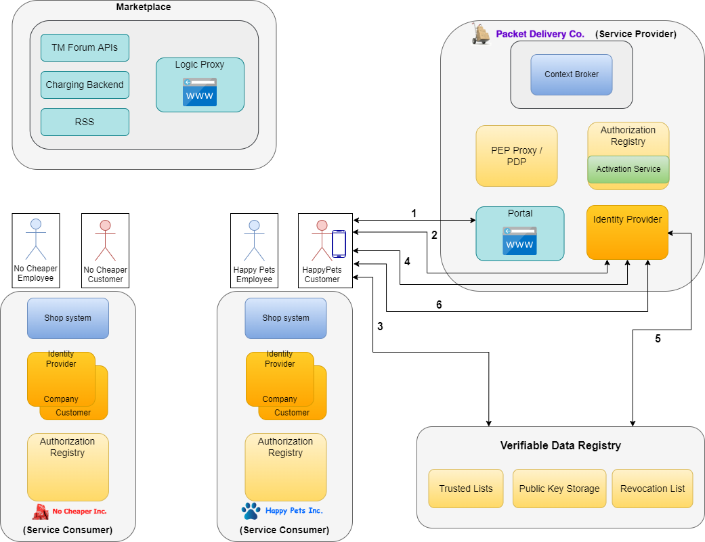

*Figure 3.29 - Architecture diagram for step “Change PTA by Happy Pets customer”*

[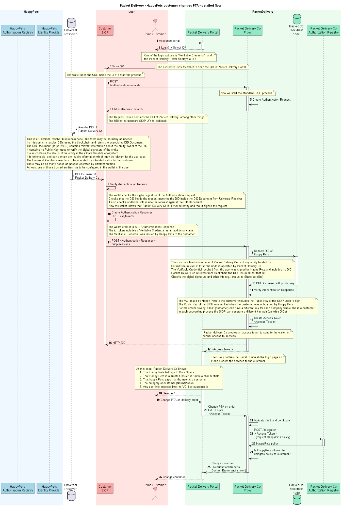](https://drive.google.com/file/d/11fXntLwweSyiyu6A9A2PG1Syxb3ky7st/view?usp=sharing)

*Figure 3.30 - Sequence diagram for step “Change PTA by Happy Pets customer”*

1.  Happy Pets customer accesses the Packet delivery company portal or starts the Packet Delivery company app in its smartphone, to login.

2.  Happy Pets customer gets forwarded to a page for selecting the desired Identity Provider for login. One of the login options is “Verifiable Credentials” or something similar.

3.  Happy Pets customer selects the “Verifiable Credentials” login method, which causes the Packet delivery company portal to generate a QR containing inside the URL of the /authentication-requests endpoint of the Packet Delivery company IDP.

4.  The customer scans the QR with her mobile and the mobile calls the /authentication-requests endpoint.

5.  This starts an OID4VP authentication and presentation flow. Packet Delivery acts as the OpenID Relying Party and sends a Presentation Request Object specifying the credential requirements. This follows OID4VP 1.0. .

> The Authentication Request travels in the response to the HTTP GET request performed in the previous point, as a JWT signed by Packet Delivery company. The decoded contents of the JWT may be:

<table style="width:91%;">
<colgroup>
<col style="width: 91%" />
</colgroup>
<thead>
<tr>
<th>openid://? 
response_type=id_token 
&amp;response_mode=post 
&amp;client_id=did:elsi:EU.EORI.NLPACKETDEL 
&amp;redirect_uri=https%3A%2F%2Fidp-pdc.fiware.io%2Fsiop_sessions 
&amp;scope=openid%20profile 
&amp;state=af0ifjsldkj 
&amp;nonce=n-0S6_WzA2Mj 
&amp;registration=%7B%22subject_syntax_types_supported%22:%5B%22did%22%5D, 
%22id_token_signing_alg_values_supported%22:%5B%22RS256%22%5D%7</th>
</tr>
</thead>
<tbody>
</tbody>
</table>

> The customer wallet processes the Presentation Request and generates an OID4VP-compliant Verifiable Presentation, signed by the wallet and returned as vp_token + presentation_submission to the Packet Delivery redirect_uri.

6.  In this step the customer verifies that the Packet Delivery company is a trusted entity belonging to the ecosystem, by resolving the DID of the Packet Delivery company which is received in the **client_id** parameter of the Authentication Request.

> To resolve a DID, the wallet sends a GET request to the **/api/did/v1/identifiers/did:elsi:EU.EORI.NLPACKETDEL** endpoint of one of several trusted servers implementing the Universal Resolver functionality. The Universal Resolver includes a DLT node, and there may be as many as needed. Its mission is to resolve DIDs using the DLT and return the associated DID Document. The DID Document (as per W3C) contains relevant information about the entity owner of the DID. It contains its Public Key, used to verify the digital signature of the entity. It also contains the status of the entity in the Data Space ecosystem. It is extensible and can contain any public information which may be relevant for the use case. The Universal Resolver server must be operated by a trusted entity for the customer. There may be as many nodes as needed operated by different entities. At least one of those trusted entities has to be configured in the wallet of the user.

7.  The wallet receives the DID Document of Packet Delivery company, with trusted information about the company, including the Public Key associated with the Private Key that Packet Delivery company uses to digitally sign tokens. For example:

<table style="width:96%;">
<colgroup>
<col style="width: 96%" />
</colgroup>
<thead>
<tr>
<th>{ 
"payload": { 
"@context": [ 
"https://www.w3.org/ns/did/v1", 
"https://w3id.org/security/v1" 
], 
"id": "did:elsi:EU.EORI.NLPACKETDEL", 
"verificationMethod": [ 
{ 
"id": "did:elsi:EU.EORI.NLPACKETDEL#key-verification", 
"type": "JwsVerificationKey2020", 
"controller": "did:elsi:EU.EORI.NLPACKETDEL", 
"publicKeyJwk": { 
"kid": "key-verification", 
"kty": "EC", 
"crv": "secp256k1", 
"x": "V8XptJkb5wplYkExcTF4nkyYVp7t5H5d5C4UPqCCM9c", 
"y": "kn3nSPxIIvd9iaG0N4v14ceuo8E4PcLXhhGeDzCE7VM" 
} 
} 
], 
"service": [ 
{ 
"id": "did:elsi:EU.EORI.NLPACKETDEL#info", 
"type": "EntityCommercialInfo", 
"serviceEndpoint": "https://packetdelivery.com/info", 
"name": "Packet Delivery co." 
}, 
{ 
"id": "did:elsi:EU.EORI.NLPACKETDEL#sms", 
"type": "SecureMessagingService", 
"serviceEndpoint": "https://packetdelivery.com/api" 
} 
], 
"anchors": [ 
{ 
"id": "redt.alastria", 
"resolution": "UniversalResolver", 
"domain": "packetdelivery.ala", 
"ethereumAddress": "0xbcB9b29eeb28f36fd84f1CfF98C3F1887D831d78" 
} 
], 
"created": "2021-11-14T13:02:37Z", 
"updated": "2021-11-14T13:02:37Z" 
} 
}</th>
</tr>
</thead>
<tbody>
</tbody>
</table>

8.  The DID Document includes one or more public keys inside the “verificationMethod” array. The keys are identified by the “id” field in each element of the array. The customer wallet uses the kid field that was received in the Authentication Request (in the protected header of the JWT) to select the corresponding Public Key and verify the signature of the JWT. It also verifies that the top-level “id” field in the DID Document ("did:elsi:EU.EORI.NLPACKETDEL") is equal to the **client_id** parameter of the Authentication Request.

9.  The customer wallet creates an Authentication Response to be posted in the **redirect_uri** specified by Packet Delivery company in step 5. The contents of the Authentication Response are described below.

10. The Wallet sends the OID4VP Response to the endpoint indicated in the redirect_uri parameter using an HTTP POST request with application/x-www-form-urlencoded encoding. The response contains an ID Token (used solely as a protocol artefact carrying binding parameters such as sub, aud, and nonce) and a Verifiable Presentation token (vp_token) as defined in the OpenID for Verifiable Presentations (OID4VP 1.0) specification.

<table style="width:89%;">
<colgroup>
<col style="width: 89%" />
</colgroup>
<thead>
<tr>
<th>POST /siop_sessions HTTP/1.1 
Host: client.example.com 
Content-Type: application/x-www-form-urlencoded 
 
id_token=eyJ0 ... NiJ9.eyJ1c ... I6IjIifX0.DeWt4Qu ... ZXso 
&amp;vp_token=... 
&amp;state=af0ifjsldkj</th>
</tr>
</thead>
<tbody>
</tbody>
</table>

> The decoded **id_token** would be:

<table style="width:88%;">
<colgroup>
<col style="width: 87%" />
</colgroup>
<thead>
<tr>
<th>{ 
"iss": "https://self-issued.me/v2", 
"aud": "did:elsi:EU.EORI.NLPACKETDEL", 
"iat": 1615910538, 
"exp": 1615911138, 
"sub": "did:peer:99ab5bca41bb45b78d242a46f0157b7d", 
"auth_time": 1615910535, 
"nonce": "n-0S6_WzA2Mj" 
}</th>
</tr>
</thead>
<tbody>
</tbody>
</table>

> The **sub** claim is *did:peer:99ab5bca41bb45b78d242a46f0157b7d* which is the DID of the user and that is not registered in any DLT or centralized repository. It must be the same as the DID included in the VP that was issued by the Happy Pets company when onboarding the customer and which travels in the authentication response.
>
> The **vp_token** includes the Verifiable Presentation, which can be in two formats: **jwt_vp** (JWT encoded) or **ldp_vp** (JSON-LD encoded). The following example is using the JWT encoding:

<table style="width:98%;">
<colgroup>
<col style="width: 98%" />
</colgroup>
<thead>
<tr>
<th>{ 
"format":"jwt_vp", 
"presentation": 
"eyJhbGciOiJSUzI1NiIsInR5cCI6IkpXVCIsImtpZCI6ImRpZDpleGFtcGxlOmFiZmUxM2Y3MTIxMjA0 
MzFjMjc2ZTEyZWNhYiNrZXlzLTEifQ.eyJzdWIiOiJkaWQ6ZXhhbXBsZTplYmZlYjFmNzEyZWJjNmYxY 
zI3NmUxMmVjMjEiLCJqdGkiOiJodHRwOi8vZXhhbXBsZS5lZHUvY3JlZGVudGlhbHMvMzczMiIsImlzc 
yI6Imh0dHBzOi8vZXhhbXBsZS5jb20va2V5cy9mb28uandrIiwibmJmIjoxNTQxNDkzNzI0LCJpYXQiO 
jE1NDE0OTM3MjQsImV4cCI6MTU3MzAyOTcyMywibm9uY2UiOiI2NjAhNjM0NUZTZXIiLCJ2YyI6eyJAY 
29udGV4dCI6WyJodHRwczovL3d3dy53My5vcmcvMjAxOC9jcmVkZW50aWFscy92MSIsImh0dHBzOi8vd 
3d3LnczLm9yZy8yMDE4L2NyZWRlbnRpYWxzL2V4YW1wbGVzL3YxIl0sInR5cGUiOlsiVmVyaWZpYWJsZ 
UNyZWRlbnRpYWwiLCJVbml2ZXJzaXR5RGVncmVlQ3JlZGVudGlhbCJdLCJjcmVkZW50aWFsU3ViamVjd 
CI6eyJkZWdyZWUiOnsidHlwZSI6IkJhY2hlbG9yRGVncmVlIiwibmFtZSI6IjxzcGFuIGxhbmc9J2ZyL 
UNBJz5CYWNjYWxhdXLDqWF0IGVuIG11c2lxdWVzIG51bcOpcmlxdWVzPC9zcGFuPiJ9fX19.KLJo5GAy 
BND3LDTn9H7FQokEsUEi8jKwXhGvoN3JtRa51xrNDgXDb0cq1UTYB-rK4Ft9YVmR1NI_ZOF8oGc_7wAp 
8PHbF2HaWodQIoOBxxT-4WNqAxft7ET6lkH-4S6Ux3rSGAmczMohEEf8eCeN-jC8WekdPl6zKZQj0YPB 
1rx6X0-xlFBs7cl6Wt8rfBP_tZ9YgVWrQmUWypSioc0MUyiphmyEbLZagTyPlUyflGlEdqrZAv6eSe6R 
txJy6M1-lD7a5HTzanYTWBPAUHDZGyGKXdJw-W_x0IWChBzI8t3kpG253fg6V3tPgHeKXE94fz_QpYfg 
--7kLsyBAfQGbg" 
}</th>
</tr>
</thead>
<tbody>
</tbody>
</table>

> Which decoded could be:

<table style="width:96%;">
<colgroup>
<col style="width: 96%" />
</colgroup>
<thead>
<tr>
<th>{ 
"@context": ["https://www.w3.org/2018/credentials/v1"], 
"type": ["VerifiablePresentation"], 
"verifiableCredential": [ 
{ 
"@context": [ 
"https://www.w3.org/ns/credentials/v2", 
"https://happypets.fiware.io/2022/credentials/employee/v1" 
], 
"id": "https://happypets.fiware.io/credentials/25159389-8dd17b796ac0", 
"type": ["VerifiableCredential", "CustomerCredential"], 
"issuer": { 
"id": "did:elsi:EU.EORI.NLHAPPYPETS" 
}, 
"issuanceDate": "2022-03-22T14:00:00Z", 
"validFrom": "2022-03-22T14:00:00Z", 
"expirationDate": "2023-03-22T14:00:00Z", 
"credentialSubject": { 
"id": "did:peer:99ab5bca41bb45b78d242a46f0157b7d", 
"verificationMethod": [ 
{ 
"id": "did:peer:99ab5bca41bb45b78d242a46f0157b7d#key1", 
"type": "JwsVerificationKey2020", 
"controller": "did:peer:99ab5bca41bb45b78d242a46f0157b7d", 
"publicKeyJwk": { 
"kid": "key1", 
"kty": "EC", 
"crv": "P-256", 
"x": "lJtvoA5_XptBvcfcrvtGCvXd9bLymmfBSSdNJf5mogo", 
"y": "fSc4gZX2R3QKKfHvS3m2vGSVSN8Xc04qsquyfEM55Z0" 
} 
} 
], 
"roles": [ 
{ 
"target": "did:elsi:EU.EORI.NLPACKETDEL", 
"names": ["P.Info.gold"] // Or P.Info.standard 
} 
], 
"name": "Jane Doe", 
"given_name": "Jane", 
"family_name": "Doe", 
"preferred_username": "j.doe", 
"email": "janedoe@packetdelivery.com" 
} 
} 
] 
}</th>
</tr>
</thead>
<tbody>
</tbody>
</table>

11. Packet Delivery company uses its own DLT node implementing the Universal Resolver functionality to resolve the DID of Happy Pets, which is inside the Verifiable Credential received in the Verifiable Presentation. This DID can be found in the “issuer” field of the “verifiableCredential” structure above.

> Resolution is performed sending a GET request to the Universal Resolver: **/api/did/v1/identifiers/did:elsi:EU.EORI.NLHAPPYPETS**
>
> Packet Delivery could use a Universal Resolver operated by a different entity, but this would reduce the level of trust compared to using its own server directly connected to the DLT network.

12. Packet Delivery receives the DID Document of Happy Pets with trusted information about the company, including the Public Key associated to the Private Key that Happy Pets used to digitally sign the Verifiable Credential that the customer has just sent inside a Verifiable Presentation as part of the authentication flow. **Using the Public Key and the DID inside the DID Document, it can verify the signature of the Verifiable Credential and that Happy Pets is a trusted entity in the ecosystem.**

13. The above is just for verification of the Verifiable Credential. In addition, Packet Delivery company can also verify that the Verifiable Presentation including the Verifiable Credential is sent by the customer and not by a malicious agent. To do so, it uses the Public Key of the customer in the “verificationMethod” of the “credentialSubject” structure. That public key is cryptographically bound to the customer DID during the onboarding process that Happy Pets performed with the customer.

14. Once all verifications have been performed, Packet Delivery company creates an Access Token for the customer so she can use it to access services in Packet Delivery company in the future.

15. The wallet receives a successful reply to the POST request.

16. The Packet Delivery company proxy notifies the Packet Delivery portal that the customer is successfully authenticated, and the portal can display the services available to that customer. The browser of the user receives the Access Token created by Packet Delivery to enable it to request services without going through the previous authentication process. The Access Token is a standard OAuth access token that includes the information that Packet Delivery requires for accessing its services.

> At this point the Happy Pets customer is logged in on the Packet Delivery company portal/app and is presented with the possible services provided, including the option to change the PTA of its delivery orders.
>
> At this moment, the Packet Delivery company knows the following:

- Happy Pets is a participant in the Data Space and that it is a Trusted Issuer of EmployeeCredentials because this info is in the DID Document retrieved in step 13. Maintenance of this information is performed by the Trusted Anchor entity(or entities) managing the Trusted Participants List and Trusted Issuers Registry.

- Happy Pets says that the user is a customer. This info is inside the Verifiable Credential that is digitally signed by Happy Pets.

- The category of the customer (and associated policies) with regards to the services offered by Packet Delivery company. This information is also in the Verifiable Credential presented by the customer.

17. The Happy Pets customer is presented with the possible services provided by Packet Delivery, including the option to change the PTA of its delivery orders.

18. Happy Pets customer searches for his packet delivery order and is presented its details. He now requests a change of the PTA of this order on the Packet Delivery company portal/app.

19. Packet Delivery company portal/app sends a request to Packet Delivery company proxy, in order to change the PTA of the delivery order. The request contains the Access Token generated in step 15, with information about the authorisation registry to retrieve policies from.

<table style="width:96%;">
<colgroup>
<col style="width: 96%" />
</colgroup>
<thead>
<tr>
<th style="text-align: left;">&gt; Authorization: Bearer IIeD...NIQ // Bearer JWT 
&gt; Content-Type: application/json 
 
PATCH https://umbrella.fiware.io/ngsi-ld/v1/entities/urn:ngsi-ld:DELIVERYORDER:001/attrs/pta 
 
&gt; Payload 
{ 
"value": "&lt;new PTA&gt;", 
"type": "Property" 
} 
 
Decoded Bearer JWT payload: 
{ 
"iss": "EU.EORI.NLHAPPYPETS", // Issuer: Happy Pets 
"sub": "419404e1-07ce-4d80-9e8a-eca94vde0003de", // Customer pseudonym 
"jti": "d8a7fd7465754a4a9117ee28f5b7fb60", 
"iat": 1591966224, 
"exp": 1591966254, 
"aud": "EU.EORI.NLHAPPYPETS", 
"authorisationRegistry": { // AR to retrieve policies from 
"url": "https://ar.packetdelivery.com", 
"identifier": "EU.EORI.NLHAPPYPETS", 
"delegation_endpoint": "https://ar.packetdelivery.com/delegation", 
} 
}</th>
</tr>
</thead>
<tbody>
</tbody>
</table>

20. Packet Delivery company proxy received the request of step 19 for changing the PTA of a delivery order. The Access Token received from the customer ensures that she was assigned the delegation evidence with a policy for updating the PTA attribute of this specific delivery order (called issuance at **user level**). Furthermore, since in this scenario the required customer policy was issued by a 3rd party (Happy Pets), the proxy has to check whether Happy Pets itself is allowed to delegate this policy. In general, the rule would be that the proxy needs to check the existence of valid policies through the chain of issuers, until itself (in this case the Packet Delivery company) is the issuer. In this scenario, the proxy will check policies at two different levels: issued at **organizational level** (from Packet Delivery company to Happy Pets) and issued at **user level** (from Happy Pets to customer). The Verifiable Credential takes care of the user level policies.

> At first, the Packet Delivery company proxy validates the JWT which is part of the authorization header of the PATCH request.

21. In order to check whether Happy Pets is allowed to delegate the policy to its customers, the proxy will check at the Packet Delivery company Authorisation Registry whether this policy exists. The proxy sends a request to the [<u>/delegation</u>](https://dev.ishareworks.org/delegation/endpoint.html) endpoint of the Packet Delivery company Authorization Registry.

22. The proxy receives the delegation evidence policy issued from Packet Delivery company to Happy Pets.

23. Having received the delegation information from the Packet Delivery company Authorization Registry, the proxy (or more precisely, the PDP) can now evaluate whether the contained **organisational policy** allows for updating the PTA attribute, and therefore whether Happy Pets is allowed to delegate the access to its customers. If the proxy received a valid policy, access would be granted on an **organisational level**.

> If the requested delegation evidence can not be found or the returned policy contains the Deny rule, the change of the PTA would be denied by the Packet Delivery company proxy and an error would be returned to the Packet Delivery company portal/app, also presented to the Happy Pets customer. The following steps would be omitted.

24. As described in the previous steps, the PDP evaluated that a change of the PTA of the specific delivery order is granted, both on **organisational level** and **user level**. As a result, the request for changing the PTA is forwarded by the Packet Delivery company proxy to the Packet Delivery company Context Broker which holds the information of the packet delivery order. The PTA of the packet delivery order is changed and the Context Broker returns a successful response with HTTP code 204. The Context Broker response is returned to the Packet Delivery company portal, in response to the request of step 26.

25. The successful change of the PTA is presented to the Happy Pets customer.

There are some variations of above steps in the scenario of the No Cheaper customer.

Basically the sequence of steps is the same as for Happy Pets. In contrast to Happy Pets, during the acquisition of rights described in [<u>3.5.3.3.2 Acquisition of Rights / Activation</u>](https://docs.google.com/document/d/12SPDoDzfxofweDJxYnhpRurfm95_zLmw3jOkKbypiMg/edit#heading=h.whl27l), No Cheaper is just acquiring the standard service and therefore its customers will only be able to read attributes of delivery orders. This means that at the Packet Delivery authorisation registry, there is only a policy created allowing No Cheaper to only delegate GET access to delivery orders.

This scenario can be split into two cases to demonstrate the denial of access based on the different policies on organisational level and user level.

1.  At No Cheaper Authorisation Registry, a Verifiable Credential is issued to the No Cheaper customer allowing only GET requests to the Packet Delivery service (representing the P.Info.Standard role). When performing the steps for changing the PTA value of a delivery order, as described in the previous section, the process would stop at step 43, where access would be rejected because the No Cheaper customer was not assigned the necessary policy at user level.

2.  At No Cheaper Authorisation Registry, a Verifiable Credential is issued to the No Cheaper customer allowing both GET and PATCH requests to the Packet Delivery service (representing the P.Info.Gold role). When performing the steps for changing the PTA value of a delivery order, as described in the previous section, the process would stop at step 62, where access would be rejected because No Cheaper was not assigned the necessary policy at the Packet Delivery company Authorisation Registry to delegate the premium access to its customers. Therefore access would be rejected at organisational level. This is to show that access would be still rejected, even when the No Cheaper organisation issues access to the premium service to its customers within its own Authorization Registry.

In general, for both cases the request for changing the PTA should be denied. However, it can be shown that the No Cheaper customer is able to view attributes of its delivery orders.

##### 3.4.3.3.4 Issuing tokens for Connectors / application context

In addition to the section described above, tokens (DAT, Dynamic Access Token) for the application context must be issued containing the referencing connectors and their security profile. The details of issuing the tokens have to be described to act as an alternative to the current IDS-DAPS realisation or to include these mechanisms as specified in [<u>IDS-G</u>](https://github.com/International-Data-Spaces-Association/IDS-G/tree/main/Components/IdentityProvider/DAPS).

The DAPS issues the requested DAT, or an error response, as per RFC 6749. The Access Token ("the DAT") itself is a JWS adhering to RFC 9068, which in turn contains JSON-LD encoded data in addition to the standard claims, subject to the following additional constraints:

**Field name** **additional constraints**

@context Must be https:*//w3id.org/idsa/contexts/context.jsonld*

@type Must be ids:DatPayload

securityProfile Must be an instance of the ids:SecurityProfile class

The DAT MUST be signed using a digital signature scheme. It SHOULD be limited to a short time period (Recommendation: 1 hour). The default resource indicator to be used in the DAT includes idsc:IDS_CONNECTORS_ALL, which SHOULD be accepted by all connectors. Future revisions of this document may allow for mechanisms to specify connectors to be listed in the aud claim such as through RFC 8707.

Additional claims may optionally be present. This specification defines the following:

- **referringConnector** An optional URI of the subject. Is used to connect the identifier of the connector with the self-description identifier as defined by the IDS Information Model. A receiving connector can use this information to request more information at a Broker or directly by dereferencing this URI.

- **transportCertsSha256** Contains the public keys of the used transport certificates, hashed using SHA256. The identifying X509 certificate should not be used for the communication encryption. Therefore, the receiving party needs to connect the identity of a connector by relating its hostname (from the communication encryption layer) and the used private/public key pair, with its IDS identity claim of the DAT. The public transportation key must be one of the transportCertsSha256 values. Otherwise, the receiving connector must expect that the requesting connector is using a false identity claim. In general, this claim holds an Array of Strings, but it may optionally hold a single String instead if the Array would have exactly one element.

- **extendedGuarantee** In case a connector fulfils a certain security profile but deviates from a subset of attributes, it can inform the receiving connector about its actual security features. This can only happen if a connector reaches a higher level for a certain security attribute than the actual reached certification asks for. A deviation to lower levels is not possible, as this would directly invalidate the complete certification level. In general, this claim holds an Array of Strings, but it may optionally hold a single String instead if the Array would have exactly one element.

**Example**

The following is an example of a successful response:

200 This is fine

Content-Type: application/json

{

"access_token": "skdj54dkGjnb\[...\]lsl8723ijsdfuzticby_ch",

"scope": "idsc:IDS_CONNECTOR_ATTRIBUTES_ALL",

"token_type": "bearer",

"expires_in": "3600"

}

The decoded DAT, including header and payload is shown below:

{

"typ": "jwt+at",

"kid": "somekid",

"alg": "RS256"

}

.

{

"iss": "https://daps.aisec.fraunhofer.de/v3",

"sub": "DD:CB:FD:0B:93:84:33:01:11:EB:5D:94:94:88:BE:78:7D:57:FC:4A:keyid:CB:8C:C7:B6:85:79:A8:23:A6:CB:15:AB:17:50:2F:E6:65:43:5D:E8",

"nbf": 1516239022,

"iat": 1516239022,

"exp": 1516239032,

"aud": \["idsc:IDS_CONNECTORS_ALL"\],

"scope": "idsc:IDS_CONNECTOR_ATTRIBUTES_ALL",

"@context": "https://w3id.org/idsa/contexts/context.jsonld",

"@type": "ids:DatPayload",

"referringConnector": "http://some-connector-uri.com",

"securityProfile": "idsc:BASE_SECURITY_PROFILE",

"extendedGuarantee": "idsc:USAGE_CONTROL_POLICY_ENFORCEMENT",

"transportCertsSha256": "bacb879575730bb083f283fd5b67a8cb..."

}

.

somesignature
