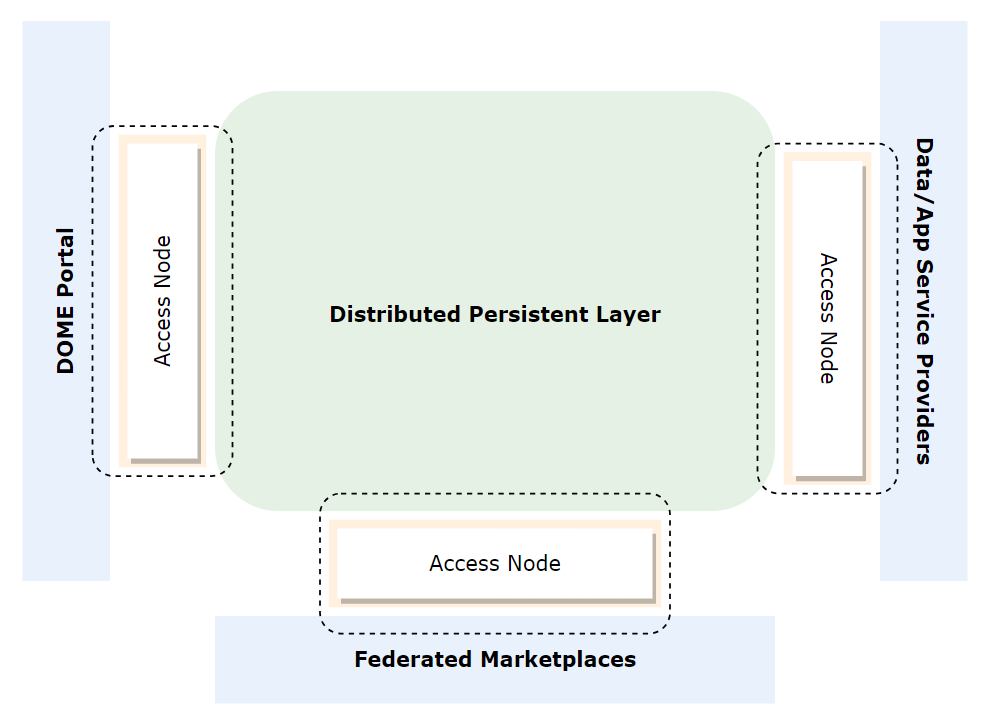
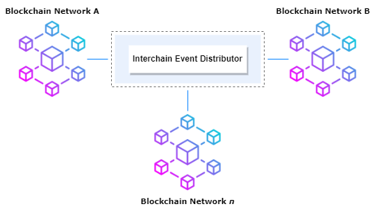
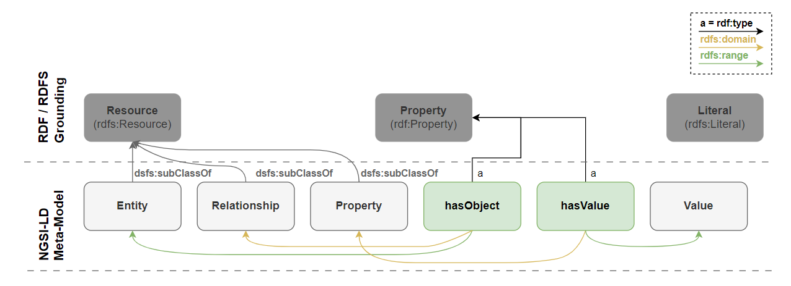
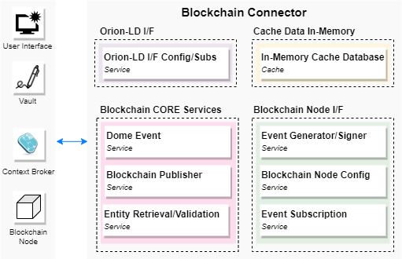
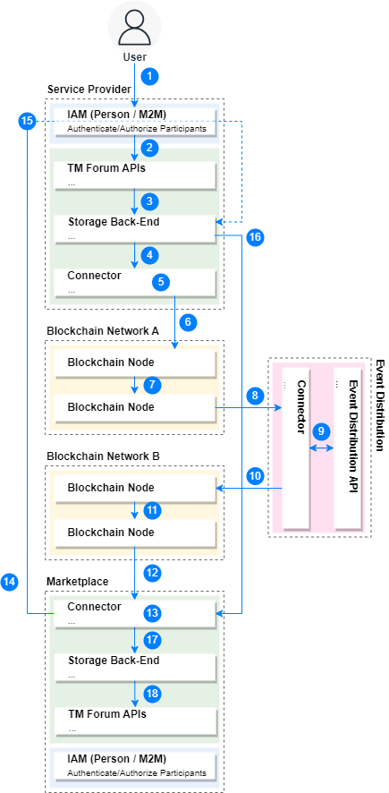
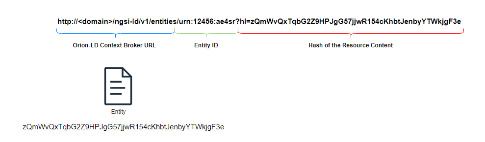

# 4 DOME Marketplace Persistence Layer

## 4.1 Introduction

### 4.1.1 Document Objective

This document aims to provide an overview and an outline of the objectives of the DOME Persistence Layer, focusing on the specific goals and priorities associated with its implementation.

The main goal of the DOME Persistence Layer is to provide the necessary persistence and storage capabilities for the two conceptual components: the Shared Catalog, and the Transaction Ledger.

- The **Shared Catalog** stores descriptions and specifications (Product Specification and Product Offerings) of cloud and edge services in the form of Verifiable Credentials and/or Verifiable Presentations, and other information for the DOME ecosystem consumption.

- The **Transaction Ledger** securely records transactions, including products (the instances of the Product Specifications), Product Orders, and Product Usage.

### 4.1.2 Context and Rationale for Adopting a Decentralised and Federated Data Architecture in the DOME Ecosystem Solution 

In the context of the DOME ecosystem where each Participant has its own solution, the problem of data persistence becomes increasingly complex due to data silos and the lack of integration. To overcome these challenges and unlock the true potential of data within the ecosystem, the adoption of a Decentralised Persistence Layer (DPL) emerges as a highly effective solution.

1.  Breaking Down Data Silos

2.  Ensuring Data Consistency and Integrity

3.  Enhanced Data Visibility and Accessibility

4.  Simplified Data Integration

5.  Robust Security and Compliance

6.  Scalability and Flexibility

However, while a DPL offers significant benefits, it is essential to consider other critical aspects alongside its implementation.

One such aspect is ensuring compliance with data protection regulations, like the General Data Protection Regulation (GDPR). DOME must carefully design the DPL to adhere to privacy and security requirements, enabling proper data handling, consent management, and the ability to enforce data subject rights. In any case, no PII (personally identifiable information) data will ever be stored in a global database or registry like a blockchain. This type of date will always be stored off-chain and with proper management procedures.

Additionally, it's important to recognize that certain data may still reside in off-chain databases or legacy systems. Co-existing with off-chain databases necessitates effective data synchronisation mechanisms to ensure consistency and accuracy across the ecosystem.

## 4.2 Theoretical Foundations

### 4.2.1 Decentralised Persistent Layer

#### 4.2.1.1 Definition

The DPL refers to a technological component or infrastructure that provides persistence and storage capabilities in a decentralised manner. It is designed to store and manage data in a distributed fashion, usually across multiple interconnected networks or blockchains.

The DPL serves as a common layer that decouples data storage and management from individual applications, creating a unified and shared data environment. It facilitates the seamless flow of data, breaking down data silos and enabling efficient data integration and collaboration among various stakeholders.

The main characteristics of a DPL include:

1.  Data Distribution

2.  Data Consistency

3.  Standardised APIs

4.  Security and Access Control

5.  Scalability and Flexibility

#### 4.2.1.2 Decentralization in Data Storage

Decentralisation in Data Storage implies that data is spread across multiple storage locations or nodes (Access Nodes).

This Decentralised Architecture offers several advantages over traditional Centralised Architectures. Implementing the Decentralised Architecture we can provide increased resilience, scalability, security, and data availability.

In the Decentralised Architecture, data is fragmented and distributed across multiple nodes (other Access Nodes instances). Each Access Node in the ecosystem holds a portion of the data, and together they form a distributed network.

The key characteristics of decentralisation in data storage include:

1.  Redundancy and Fault Tolerance

2.  Increased Data Availability

3.  Scalability

4.  Enhanced Security

5.  Data Sovereignty and Privacy

6.  Data Consistency and Integrity

7.  Peer-to-Peer Collaboration

#### 4.2.1.3 Blockchain and Context Broker as a Technology Solution

In the development of the distributed persistence layer for the DOME solution ecosystem, careful consideration was given to selecting the appropriate technology solutions to ensure reliable and efficient data management.

The combination of blockchain technology and the Context Broker emerged as a powerful and synergistic approach to meet the specific requirements of the system. Together, blockchain technology and the Context Broker form a cohesive technology solution for the distributed persistence layer in the DOME ecosystem.

This combination provides a secure, transparent, and scalable infrastructure for storing and managing transactional data on the blockchain while efficiently managing full entity information off-chain.

##### 4.2.1.3.1 Blockchain Technology for Distributed Persistence

Blockchain technology was chosen as a fundamental component of the distributed persistence layer due to its inherent characteristics that align with the goals of decentralisation, immutability, and transparency. Furthermore, it provides a secure and decentralised ledger for recording transactions and events.

One of the key advantages of blockchain is its ability to publish events with partial information. This feature allows the Distributed Persistence Layer to capture and store relevant information about transactions, such as Product Specifications, Product Offerings, Product Orders, and Product Usage data, while maintaining the necessary privacy and security of sensitive information.

The use of blockchain technology ensures the DPL's integrity and immutability of the recorded data because once a transaction is recorded on the blockchain, it becomes tamper-proof and resistant to unauthorised modifications. This property enhances trust among DOME participants and provides a reliable source of truth for auditing and verification purposes.

##### 4.2.1.3.2 Context Broker as an Off-chain Persistence Solution

While blockchain technology offers strong guarantees of data integrity, it may not be suitable for storing large amounts of detailed entity information due to scalability limitations. To address this challenge, the Context Broker is employed as an off-chain persistence solution within the distributed persistence layer.

The Context Broker serves as a complementary component that provides full entity information storage. It allows for the efficient storage and retrieval of detailed information related to entities.

By utilising the Context Broker for off-chain persistence, the distributed persistence layer can ensure efficient storage and access to entity information while benefiting from the scalability and performance advantages it offers. This symbiotic relationship between blockchain technology and the Context Broker enables a balance between data integrity, privacy, and efficient data management.

#### 4.2.1.4 Decentralised Networks

In the digital age, traditional centralised systems have been the norm for many applications, but they come with inherent drawbacks such as single points of failure, limited scalability, and susceptibility to censorship and data breaches. Decentralised networks, on the other hand, offer a revolutionary approach to address these issues. By distributing control, storage, and processing across a network of nodes, decentralised networks offer enhanced security, resilience, and transparency. The document will delve into the technology behind decentralised networks, focusing on key concepts such as Network Nodes and Distributed Storage, Replication and Consensus Mechanisms, and Data Security and Encryption.

##### 4.2.1.4.1 Network Nodes and Distributed Storage

In a decentralised network, Network Nodes play a pivotal role. A network node refers to an individual device or computer that participates in the network and performs various tasks. These tasks can include storing and validating data, processing transactions, maintaining the network's consensus, and propagating information to other nodes.

The distribution of nodes in a decentralised network ensures redundancy and fault tolerance. Unlike traditional centralised systems, where a single server outage can bring down an entire service, decentralised networks can continue working as long as there is a sufficient number of operational nodes. This inherent redundancy makes decentralised networks more robust and resilient to failures or attacks.

Distributed Storage is another fundamental aspect of decentralised networks. Instead of relying on a single central server to store data, decentralised networks distribute data across multiple nodes. This approach, often known as Distributed Ledger Technology (DLT), ensures that data is replicated across various nodes in a secure and transparent manner. Distributed storage mechanisms, such as blockchain, allow all nodes in the network to maintain a synchronised and tamper-resistant copy of the data.

##### 4.2.1.4.2 Replication and Consensus Mechanisms

Replication is a critical aspect of decentralised networks that ensures data redundancy and availability. When data is replicated, it is copied across multiple nodes within the network. This replication process helps prevent data loss, increases data availability, and contributes to the overall fault tolerance of the system.

Consensus mechanisms are essential for maintaining agreement among nodes in a decentralised network. As multiple nodes can participate in the network and propose changes, consensus mechanisms ensure that all nodes reach agreement on the state of the network and the validity of transactions. By achieving consensus, decentralised networks avoid issues like double-spending and data inconsistencies that can arise in distributed environments.

Consensus protocols are fundamental to the functioning of decentralised networks, ensuring agreement among network participants regarding the validity of transactions and the state of the blockchain. Different consensus protocols have been developed, each with its own set of advantages and disadvantages. In this document, we will explore and compare the following consensus protocols: Proof of Work (PoW), Proof of Stake (PoS), Delegated Proof of Stake (DPoS), Improved Finality Byzantine Fault Tolerance (IFBT), Practical Byzantine Fault Tolerance (PFBT), and Quorum-Based Practical Byzantine Fault Tolerance (QFBT).

**Proof of Work (PoW)**

<u>Advantages</u>:

- **Security**: PoW is highly secure due to the resource-intensive nature of mining, making it difficult and costly for attackers to control the network.

- **Decentralisation**: PoW can be decentralised at the beginning, but with time, networks become highly centralised systems because only powerful entities can have the computational power to have an acceptable probability of winning the cryptographic lottery essential for PoW.

<u>Disadvantages</u>:

- **Energy Consumption**: PoW is notorious for its high energy consumption, leading to environmental concerns.

- **Centralization of Mining Power**: Over time, mining has become centralised in the hands of large mining pools, vastly reducing the decentralisation aspect.

**Proof of Stake (PoS)**

<u>Advantages</u>:

- Energy Efficiency: PoS consumes significantly less energy compared to PoW, making it a more sustainable option.

- Decentralisation Incentive: PoS encourages participants to hold and stake their cryptocurrency. It promotes centralisation because it promotes the “rich gets richer” paradigm. Together with PoW, PoS belongs to the family of consensus algorithms known as PoR (Proof of Richness).

<u>Disadvantages</u>:

- **Wealth Concentration**: PoS can lead to wealth concentration, as those with more cryptocurrency have a higher chance of being chosen as validators.

- **Nothing at Stake**: In theory, PoS validators can support multiple forks without suffering consequences, which could lead to potential issues.

**Delegated Proof of Stake (DPoS)**

<u>Advantages</u>:

- **Efficiency**: DPoS is faster and more efficient than PoW and PoS, allowing for quicker transaction confirmation times.

- **Sybil Resistance**: DPoS introduces the concept of voting for delegates, making it harder for attackers to create multiple identities (Sybil attacks).

<u>Disadvantages</u>:

- **Centralization Risk**: DPoS relies on a limited number of elected delegates, which could lead to centralization if the same delegates are continually chosen.

- **Voter Apathy**: Token holders might not actively participate in voting, leading to a concentration of power in the hands of a few participants.

**Improved Finality Byzantine Fault Tolerance (IFBT)**

<u>Advantages</u>:

- **Finality**: IFBT achieves faster finality, ensuring that confirmed transactions cannot be reverted or changed.

- **Low Resource Consumption**: IFBT is more resource-efficient compared to PoW and traditional BFT.

<u>Disadvantages</u>:

- **Limited Scalability**: IFBT may face challenges in scaling to handle a large number of transactions and participants.

- **Network Partitioning**: In case of network partitioning, some nodes might be unable to reach consensus, potentially leading to disruptions.

**Practical Byzantine Fault Tolerance (PFBT)**

<u>Advantages</u>:

- **Finality and Low Latency**: PFBT provides fast transaction finality and low latency for confirming transactions.

- **Fault Tolerance**: PFBT can handle a certain number of faulty nodes while still maintaining consensus.

<u>Disadvantages</u>:

- **Limited Decentralisation**: PFBT might have limitations on the number of participating nodes, potentially impacting decentralisation.

- **Complexity**: Implementing PFBT can be more complex than other consensus protocols.

**Quorum-Based Practical Byzantine Fault Tolerance (QFBT)**

<u>Advantages</u>:

- **Flexible Quorum Selection**: QFBT allows for flexibility in selecting the quorum size and participants, offering adaptability.

- **High Throughput**: QFBT can achieve high throughput, making it suitable for applications with large transaction volumes.

<u>Disadvantages</u>:

- **Quorum Management**: Proper quorum management is essential, as the wrong quorum selection could lead to security vulnerabilities.

- **Synchronisation D**elay: Network synchronisation delays might impact QFBT's performance and efficiency. In any case, it is always much better than PoW or PoS.

| **Consensus Protocol** | **Advantages** | **Disadvantages** |
|----|----|----|
| **Proof of Work (PoW)** | \- Security | \- Energy Consumption |
|  | \- Decentralisation in early stages of the network | \- Centralization of Mining Power as the network matures |
| **Proof of Stake (PoS)** | \- Energy Efficiency | \- Wealth Concentration |
|  | \- Decentralization Incentive (only for entities that can stake). | \- Nothing at Stake |
| **Delegated Proof of Stake (DPoS)** | \- Efficiency | \- Centralization Risk |
|  | \- Sybil Resistance | \- Voter Apathy |
| **Improved Finality Byzantine Fault Tolerance (IFBT)** | \- Finality | \- Limited Scalability |
|  | \- Low Resource Consumption | \- Network Partitioning |
| **Practical Byzantine Fault Tolerance (PFBT)** | \- Finality and Low Latency | \- Limited Decentralisation |
|  | \- Fault Tolerance | \- Complexity |
| **Quorum-Based Practical Byzantine Fault Tolerance (QFBT)** | \- Flexible Quorum Selection | \- Quorum Management |
|  | \- High Throughput | \- Synchronisation Delay |

In conclusion, each consensus protocol has its own strengths and weaknesses, and the choice of which one to use depends on the specific requirements of the decentralised network and the trade-offs that the network developers are willing to make. Factors such as security, energy efficiency, decentralisation, and scalability play crucial roles in determining the most suitable consensus protocol for a given blockchain application.

##### 4.2.1.4.3 Data Security and Encryption

Data security is a paramount concern in decentralised networks. Since data is distributed across multiple nodes, ensuring the confidentiality, integrity, and authenticity of data is essential.

Encryption plays a pivotal role in data security. Data transmitted between nodes and stored on the network is typically encrypted to prevent unauthorised access. Encryption techniques such as public-key cryptography enable secure communication and transactions within the decentralised network.

In addition to encryption, decentralisation contributes to data security by reducing the risk of single points of failure and data breaches. Traditional centralised systems are attractive targets for hackers because compromising a central server could grant access to vast amounts of data. Decentralised networks, on the other hand, require attackers to compromise multiple nodes, making such attacks significantly more challenging and less rewarding.

To maintain data security, decentralised networks often utilise robust authentication and access control mechanisms. Nodes must prove their identity before participating in the network, and permissions are carefully managed to ensure that only authorised nodes can perform specific actions.

## 4.3 Proposed Architecture

### 4.3.1 Overview of the Architecture

Within the Distributed Persistence Layer, a conceptual division is established based on the nature of the data: the **Shared Catalog** and the **Transaction Ledger**.

*Figure 4.1 - Federated entities interconnected through the Distributed Persistence Layer*

Let's delve into each of these concepts and their roles within the Distributed Persistence Layer

1.  **Shared Catalog**

> The Shared Catalog is responsible for storing Product Specifications (including the specifications of associated services and supporting resources), Product Offerings defined by service providers.

2.  **Transaction Ledger**

> The Transaction Ledger is a crucial component of the DOME Persistent Layer. It serves as a record-keeping mechanism for all transactional activities within the DOME environment. That is, Product Orders and Product (instances of Product Specifications) along their lifecycle, as well as information about actual Usage of Products.

In the DOME architecture, both the Shared Catalog and Transaction Ledger are utilised by various participants, including the **DOME Portal Back-End**, **Data/App Service Provider Back-Ends**, and **Federated Marketplace Back-Ends**. These participants access the DOME Persistent Layer through an **Access Node** component.

The Access Node acts as an interface for participants to access the DOME Persistent Layer. It consists of three main components: the **TM Forum APIs** component, the **Storage Back-End** component, and the **Blockchain Connector** component.

- The **TM Forum API** component provides standardised entry points for accessing the DOME Persistent Layer.

- The **Storage Back-End** component serves as the underlying off-chain storage infrastructure.

- The **Blockchain Connector** component facilitates the integration between the participant back-ends and the blockchain, ensuring the synchronisation of relevant data and events.

#### 4.3.1.1 Blockchain Federation Architecture

The DOME Decentralised Persistence Layer will be implemented on top of a number of interconnected national blockchains compatible with the European Blockchain Service Infrastructure (EBSI) when not directly EBSI.

In this architecture, multiple independent blockchain networks are interconnected and communicate with each other through an Interchain Event Distributor component.

At its core, the Blockchain Federation Architecture aims to combine the benefits of multiple blockchain networks while maintaining their autonomy and preserving their individual consensus mechanisms. The DOME Distributed Persistence Layer Architecture achieves this by establishing a network of interconnected blockchain networks.

The key component that enables communication between the federated blockchain networks is the **Interchain Event Distributor (IED).** This component facilitates the seamless exchange of events, transactions, and other relevant data between the participating blockchain networks. By leveraging event-based communication, the DPL architecture ensures timely and efficient synchronisation of information across the federated network.

Each blockchain network within the federation retains its own conceptual architecture, including its unique consensus mechanisms, data storage, and smart contract functionalities. This distributed approach allows for flexibility and scalability, as new blockchain networks can be added to the federation seamlessly.

*Figure 4.2 - Blockchain Federation Architecture*

### 4.3.2 Components of the DOME Decentralised Persistence Layer

#### 4.3.2.1 TM Forum APIs

TM Forum APIs should provide a standardised interface for seamless integration and interoperability across different systems and solutions.

They are a suite of application programming interfaces designed to facilitate the management of services throughout their lifecycle in a collaborative environment involving multiple partners.

These APIs provide a standardised and efficient approach to managing various services, allowing for seamless integration, interoperability, and simplified service management.

By adhering to industry-strength design patterns, the APIs enable rapid implementation and consistent management of services.

Based on representational state transfer (REST), the TM Forum APIs are technology-agnostic, making them applicable to a wide range of digital service scenarios. These scenarios can include B2B interactions, Internet of Things (IoT) deployments, Smart Health applications, Smart Grid solutions, Big Data analytics, Network Function Virtualization (NFV), Next Generation OSS/BSS (Operations Support Systems/Business Support Systems), and more.

These characteristics will be explained in detail in section 5, DOME marketplace features, of this document.

#### 4.3.2.2 Storage Back-End

The data in the origin organisation can be stored in an existing system or in a new one. The only requirement is that the data can be accessed by other organisations in the network using standardised pointers (URIs), APIs, access control and with a data model which is the same for all organisations in the network.

The handling of personal data has significant legal implications, as it involves sensitive information that must be protected to ensure privacy and confidentiality. Personal data is subject to various legal requirements, such as data minimization, consent, and the right to be forgotten, among others. These legal requirements are in place to ensure that personal data is collected and processed in a responsible and ethical manner, and that individuals have control over their personal information. As a result, stringent measures must be put in place to safeguard personal data, as it carries legal, ethical, and moral obligations.

When data is stored, it can be done so by the owner of the data or by a third-party entity that stores it on behalf of the owner. When it comes to personal data, special care must be taken to ensure that the data is stored securely and in compliance with legal regulations. In some cases, users may store their own personal data on their own devices, such as mobile phones or hard disks.

However, a critical situation arises when a legal entity such as a business or government stores and manages personal data of its customers or citizens. Depending on the specific circumstances, this entity may be considered a Data Controller or a Data Processor. In either case, the entity is subject to strict legal requirements under GDPR (General Data Protection Regulation) that govern the handling, storage, and processing of personal data.

Data Controllers have primary responsibility for compliance with GDPR and are obligated to ensure that personal data is collected and processed in a legal and ethical manner. Data Processors, on the other hand, are obligated to process personal data only on behalf of the Data Controller and in compliance with GDPR. Regardless of whether an entity is a Data Controller or a Data Processor, it is subject to the stringent legal requirements set forth by GDPR, and must take all necessary steps to ensure the safety and confidentiality of personal data.

Efficiently storing and transferring large amounts of data can be a complex task compared to smaller amounts of data. While it is challenging to define a precise threshold for what constitutes a “small” or “large” amount of data, generally, small amounts of data can be transferred using a “push” or “dissemination” model, whereas large amounts of data are better transferred using a “pull” or “on-demand” model.

With a push or dissemination model, data is sent to the recipient without any specific request. This model works well for smaller amounts of data since it is quick and straightforward. However, when it comes to larger amounts of data, this model can be inefficient, as it may take a lot of time to transfer and can consume a significant amount of network bandwidth.

On the other hand, the pull or on-demand model is better suited for transferring large amounts of data. In this model, data is only transferred when it is specifically requested by the recipient, reducing the amount of unnecessary data transfer. This model can be more efficient for larger amounts of data, as it allows for more targeted and precise data transfers.

##### 4.3.2.2.1 Standardised interfaces and mechanisms

To ensure seamless interoperability among all members of DOME, it is essential that all participants use the same standard mechanisms and APIs for transferring and accessing data, regardless of the underlying data storage systems used in each organisation. At the technical layer of DOME, several key aspects need to be addressed:

1.  **A safe pointer to the origin data is required**. This will enable data to be tracked and located accurately throughout the system.

2.  **A standard API for data access operations is needed**. This API should be independent of any specific database product or technology, allowing for greater flexibility and interoperability.

3.  **A common metamodel and data representation, such as JSON-LD, should be adopted** to ensure semantic interoperability and data linking.

4.  **A common access control mechanism must be established to restrict data access** to authorised organisations in accordance with a given policy. This could include restrictions based on one-time access, time-based access, or other relevant factors.

Based on this common metamodel and data representation, each use case can build their own specific data models, which will be domain-specific and not described in this document.

To implement these aspects in DOME, it is recommended that each participant uses the same standard mechanisms and APIs for data transfer and access. This will ensure that all data is accessible and transferable between organisations in a seamless and efficient manner, regardless of the underlying storage systems used.

W3C in the paper [<u>A JSON-based Serialization for Linked Data</u>](https://www.w3.org/TR/2014/REC-json-ld-20140116/) defines that JSON-LD is a lightweight syntax used to serialise Linked Data in JSON, allowing interoperability and reuse of existing JSON libraries. It is commonly used in web-based programming environments to build interoperable web services and store Linked Data in JSON-based storage engines.

[<u>CEF Context Broker</u>](https://joinup.ec.europa.eu/collection/connecting-europe-facility-cef/solution/cef-context-broker/about#:~:text=CEF%20Context%20Broker%20is%20an,view%20and%20interpret%20big%20data) Broker is a platform that enables organisations to manage and share real-time data, such as traffic status, air quality, and parking availability. The platform leverages the power of [<u>Linked Data</u>](https://www.w3.org/standards/semanticweb/data) to create consistent models for data coming from different sources, using a standard API and information model. The information model is defined at two levels: the foundation classes, which correspond to the Core Metamodel, and the Cross-Domain Ontology. The [<u>ETSI NGSI-LD API</u>](https://www.etsi.org/deliver/etsi_gs/CIM/001_099/009/01.01.01_60/gs_CIM009v010101p.pdf) is being extended and standardised for use with the CEF Context Broker, providing a common framework for managing and sharing data.

##### 4.3.2.2.2 CEF Context Broker reference implementation.

The ETSI NGSI-LD API can be implemented on top of different storage mechanisms and databases. For DOME a good option is to use the reference Open Source implementation which has been already used in production in different systems, most notably in Smart Cities and currently being expanded to other use cases like Smart Industry. The Orion Context Broker is such an implementation, and this is its [<u>GitHub</u>](https://github.com/FIWARE/context.Orion-LD) link.

The CEF Context Broker API leverages the power of Linked Data to facilitate semantic interoperability of the data exchanges across the different organisations. The core metamodel is described in the following diagram:

*Figure 4.3 - Core metamodel behind the CEF Context Broker*

##### 4.3.2.2.3 Connecting Storage Back-end and Blockchain Connector

In order to distribute events through the Blockchain Network, the Blockchain Connector needs to be informed about changes in the Off-Chain Storage Back-end. Since the Storage Back-end is implemented using an [<u>NGSI-LD</u>](https://www.etsi.org/deliver/etsi_gs/CIM/001_099/009/01.06.01_60/gs_cim009v010601p.pdf) compliant Context Broker, this connection will happen through the “Subscription”-mechanism, as defined in the NGSI-LD specification.

To get notified about changed entities, the Blockchain Connector(s) of each access node initially subscribe to the Context Broker providing the Off-Chain Storage. The subscription will be towards a defined set of Entity-Types (as mandated by NGSI-LD 4.17.). The Entity-Types of interest are defined by the TM Forum -API implementation of the access node and should be provided to the Blockchain Connector through a standard interface.

Once the Connector subscribes successfully, the Context Broker will send all updates to the entities of interest towards the Connector. The connector now has to build the [<u>Change-Event</u>](#the-blockchain-event) and publish it to the Blockchain.

#### 4.3.2.3 Blockchain Connector

The Blockchain Connector is an important component which can be instantiated alone or as part of the Access Node. It enables organisations to connect and communicate with distinct blockchain networks. The DOME project ensures that a connector reference implementation is available, which can be used as part of the access node implementation.

##### 4.3.2.3.1 Main Functionalities of the Blockchain Connector

1.  **Subscribe to New Entities in the Context Broker**

> The Blockchain Connector allows the subscription to new entities that are stored in the Context Broker of the Access Node. This functionality enables real-time monitoring and integration of new data entities into the blockchain network.

2.  **Publish Entities in the Context Broker**

> The Blockchain Connector can publish new entities directly into the Context Broker of the Access Node. This capability ensures seamless integration of data from various sources of the blockchain network to the off-chain system.

3.  **Build Blockchain Events**

> The Blockchain Connector assists in constructing events that are ready to be published in the pre-configured blockchain network. It provides the necessary tools and interfaces to format and structure data into events compatible with the blockchain network's specifications.

4.  **Publishing Events in the Blockchain Network**

> The Blockchain Connector publishes events into the configured blockchain node of the network.

5.  **Subscribing to Events from a Blockchain Network**

> The Blockchain Connector facilitates subscribing to events from a specific blockchain network. It allows DOME participants to receive real-time updates and notifications of events occurring within the ecosystem of blockchain networks.

6.  **Search for Events in the Blockchain Network**

> The Blockchain Connector provides the capability to search for specific events within the blockchain network. Users can query and retrieve relevant events based on defined criteria, enabling efficient data exploration and analysis within the blockchain context.

7.  **Retrieve Entity Data through a Blockchain Event**

> The Blockchain Connector facilitates the retrieval of entity data associated with a specific blockchain event. This functionality involves resolving the blockchain event and making a request to the relevant Context Broker to obtain the referenced entity.

##### 4.3.2.3.2 APIs and Interfaces of the Blockchain connector

To implement these functionalities, the Blockchain Connector includes various APIs and interfaces. These collectively form the foundation of the Blockchain Connector, enabling seamless integration, configuration, event creation, data persistence, and interaction with external systems necessary for its functionalities.

1.  **Context Broker Integration Interface**

> This interface allows seamless integration with the Context Broker, enabling data exchange and interaction between the Blockchain Connector and the Context Broker.

2.  **Context Broker Connection Configuration**

> The Blockchain Connector provides configuration options to establish and configure the connection to the Context Broker. This includes specifying connection details such as URLs and other relevant parameters.

3.  **Blockchain Node Integration Interface**

> The Blockchain Connector offers an interface for integrating with the blockchain node. It facilitates communication and interaction between the Blockchain Connector and the blockchain network.

4.  **Blockchain Node Connection Configuration**

> Similar to the Context Broker connection configuration, the Blockchain Connector provides configuration options to establish and configure the connection to the blockchain node. Users can specify relevant parameters such as the node's URL, authentication credentials, and network-specific configurations.

5.  **In-Memory Cache Service**

> The Blockchain Connector incorporates an in-memory database that allows caching and storage of data. This system ensures efficient and reliable data management within the Connector.

6.  **Data Persistence System Integration Interface**

> This interface enables integration with the data persistence system within the Blockchain Connector. It provides methods and functionalities to interact with the persistence system, such as storing, retrieving, and managing cached data.

7.  **Vault System Integration Interface**

> The Blockchain Connector includes an interface for retrieving secrets from a Vault or other similar and secure system. This allows for signing of blockchain-related transactions or events.

8.  **Vault System Configuration**

> The Connector provides configuration options to establish and configure the connection to the Vault system.

9.  **Event Creation Service**

> The Blockchain Connector implements a service for creating events that are ready to be published in the blockchain network. This service provides methods and functionalities to format and structure data into event objects compatible with the blockchain network's requirements.

10. **Event Verification Service**

> The Blockchain Connector includes an Event Verification API that allows users to verify the authenticity and integrity of events published in the blockchain network. This API provides methods and functionalities to validate event signatures, check event data consistency, and ensure that events have not been tampered with.

11. **Entity Request Service via Event Resolution**

> The Blockchain Connector provides an API for creating requests for entities by resolving events. This API allows users to retrieve relevant entities based on the events published in the blockchain network.

12. **Policy Retrieval Point Integration Interface**

> This function is just implemented by configuration for Interchain Event Distributor. The instances of the Blockchain Connector of the IED component need to implement this feature.
>
> The interface enables integration with the Policy Retrieval Point (PRP), which allows querying distribution policies for blockchain events. It provides functionalities to retrieve and enforce policies related to event distribution through the blockchain networks.

##### 4.3.2.3.3 Considerations about Blockchain Connector

It's important to note that every Access Node is bound to a specific blockchain network. Different blockchain connectors instances cannot coexist within a single Access Node. This ensures that the Access Node and Blockchain Connector, by extension, are tailored to the specific needs of the blockchain network, and can function effectively to facilitate communication and delivery of event logs between the different stakeholders involved.

Only the IED component could instantiate more than one Blockchain Connector, but it is because the IED has a different nature from an Access Node. Both use Blockchain Connectors but for a different purpose.

##### 4.3.2.3.4 Creating blockchain Events

The Blockchain Connector is responsible for generating events that will be published on the blockchain network. An event is a signed JSON in JAdES format with specific attributes added to it. These events do not contain any associated sensitive information but serve as packages of information that reference the data sources. The details regarding the event format and its claims are further explained later in the document.

##### 4.3.2.3.5 Publishing of Event Logs

The publishing of event logs in a blockchain network involves emitting an event from a Smart Contract that has been deployed on the blockchain. Events are essentially messages that indicate that something has happened within the Smart Contract, such as a change in state or an action taken by a DOME participant.

To issue an event, the Smart Contract developer defines the event within the contract code and then calls it within a function using the “emit” keyword.

When an event has been added to the blockchain, any interested DOME participant, like a Marketplace, can access to the event data by querying the blockchain for logs that match with specific criteria. A DOME participant can subscribe to these logs, and blockchain nodes can automatically receive notifications when new events are added to the blockchain.

##### 4.3.2.3.6 Subscribing to Event Logs

Subscribing to Event Logs in a Blockchain network is a process that enables interested parties to receive notifications about specific events that occur within a blockchain network.

All participants can set their own subscriptions using filters, which are criteria used to identify specific events of interest in the network. To enable the subscription to specific types of blockchain events, the Connector utilises the list of topics/categories used in the DOME ecosystem. This list serves as a reference for identifying the available event types that participants can subscribe to.

By allowing participants to set their own subscriptions using filters, the Connector component provides a high degree of flexibility and customization. This allows organizations to tailor their subscriptions to their specific needs and objectives, ensuring that they receive only the relevant information they need to make informed decisions and take appropriate actions.

###### 4.3.2.3.6.1 Setting Up Subscriptions

The process for setting up subscriptions involves the following steps:

1.  **Retrieving the List of Topics/Categories**

> The Connector obtains the comprehensive list of topics or categories used within the DOME ecosystem. These topics represent different event types or classifications within the blockchain network.

2.  **Subscription Setup**

> Based on the participant's selections, the Connector establishes the necessary subscriptions to the corresponding blockchain events. It sets up filters using the chosen topics or categories as criteria to identify and filter the relevant events within the network.

##### 4.3.2.3.7 Retrieving data of the origin Storage Back-End from resolving a blockchain event

This is the most important part of data federation because it is responsible for retrieving data stored in the source Storage Back-End based on the information received in the blockchain event. However, it does more than just executing the request. During the information retrieval process, it also includes functions such as:

- Event validation.

- Requesting the resources associated with the event.

- Adding access credentials to request the resources.

- Validation of the received entity/resource.

#### 4.3.2.4 Blockchain Abstraction Interface

This component aims to abstract the underlying functioning of the blockchain nodes of the federated blockchain networks of DOME to enable transparent interaction with them from the rest of DOME components.

For that to happen this interface has the following endpoints and configuration mechanisms:

- Configuration of node RPC address, private key of account to publish events from and the hash of the organization ID generating the events as environment variables. Users of this interface can either use a node in a federated/delegated way (through the approved providers in DOME) or create their own Blockchain node on such networks. For the latter purpose, the interface will allow the use of their own resources (private clouds, edge servers,...) or cloud infrastructure service provider.

- An endpoint to publish blockchain events synthesised from DOME events: This endpoint allows any DOME component to use a Blockchain-based publish/subscribe model in a decoupled way. This type of event will be published from the Context-Broker in the form of a DOME event originated from a TM Forum entity. It is necessary to define an additional layer that translates events originated in DOME to Blockchain events to make it more efficient and aligned with privacy needs.

- An endpoint to subscribe to certain topics related to blockchain events already published.

- An endpoint that retrieves all the events between two dates from the on-chain history that are events not at it’s final status and therefore can be of interest for new or desynchronized marketplaces.

#### 4.3.2.7 Interchain Event Distributor (IED)

The DOME Interchain Event Distributor (IED) component offers an optimal solution to achieve interoperability between various blockchain networks, enabling applications based on one network to utilise the resources of another. As blockchain technology has matured and advanced, there has been an increasing need for blockchain projects to enhance interoperability between different blockchain networks.

The primary function of the DOME Event Distribution Component is to disseminate the written blocks from one blockchain network to another network. However, not all written blocks will be replicated, as it depends on the configuration set by DOME Governance.

The DOME IED plays a crucial role in facilitating the replication of events across various blockchain networks. It acts as a bridge between these networks, ensuring that events written in one blockchain are accurately replicated and propagated to others.

As mentioned earlier, DOME Governance assumes the responsibility of configuring the component. This entails managing the settings and parameters required for the proper functioning of the component. The configuration process involves tasks such as registering different blockchain networks and specifying which events should be distributed.

By defining these rules, DOME Governance controls the flow of information between participating blockchain networks. When distributing events using the Interchain Event Distributor, additional policies may apply, such as preventing the distribution of events to certain blockchains based on governance decisions. This implementation of IED is linked to the implementation of a Policy Retrieval Point (PRP) associated with a Policy Administration Point (PAP) to manage Distribution Policies. It's worth noting that this situation can disadvantage event consumers on certain blockchains compared to consumers on accepted blockchains, so it needs to be considered by governance as well.

Each blockchain network has a node that plays a pivotal role in the replication process. Nodes serve as the backbone of a blockchain network, responsible for maintaining a copy of the entire blockchain and participating in the consensus mechanism. Disseminating events across different blockchain networks involves the active propagation and synchronisation of events by nodes to ensure consistency and transparency throughout the federated ecosystem.

The enabling technologies to create this component are introduced in section 4.4.2 “The Data Flow” and will be elaborated in the following project iterations.

## 4.4 Data Federation

Data Federation refers to the process of aggregating and integrating data from multiple sources, usually distributed across different systems or organisations, into a unified and coherent view. It involves combining data from diverse sources while preserving their autonomy and original structure.

### 4.4.1 The model of transferring data in a blockchain.

The model for sharing data between organisations is the Pull Model, instead of a push model. With the pull model the data remains in control of the source entity, which can provide granular access to authorised participants when they require that data.

In our use-case, any participant (origin) is authorising other participants (target) to access a subset of the data held on-custody in the origin participant. This authorization could be very simple or arbitrarily complex, for example with time limits, for a specific purpose, etc.

This model can be considered when some (or all) of the following requirements have to be met:

1.  **Data on-custody**: the data is managed by a legal entity, not by a natural person. If the data belongs to another entity, especially for a natural person, it is managed using an on-custody model. Depending on the specific circumstances, that entity may be a Data Controller or a Data Processor, but in any case, it is subject to very strict legal requirements as set forth by GDPR.

2.  **Strong privacy**: it may not be desirable to disseminate the data among all the nodes (or even a subset) in the network in a proactive (or push) model, even if encrypted.

3.  **Pull (on-demand) access**: the data can be accessed by the target organisation only when needed for processing, not necessarily at the same moment when the data is available.

4.  **Large amounts of data**: the data to be shared with other participating nodes is large (documents, PDFs, videos, audio, etc.).

5.  **Auditability of access**: we need to know who has accessed what data, when and for what purpose. This is better done in a pull model than in a push one.

### 4.4.2 The Data Flow

In the context of a Service Provider and a Marketplace, we will explore an example that demonstrates the flow of federated data between these two entities. The Service Provider acts as a data source or provider, while the Marketplace serves as a platform where various services and data are offered.

To enable data federation between the Service Provider and the Marketplace, a federated data integration approach is utilised. This approach involves establishing a connection or interface that allows the Service Provider to selectively share specific data with the Marketplace while retaining control over its data assets.

To not extend the description of all data flows between the different participants of DOME, we would like to explain a baseline case that more or less fits with all the possible interactions between participants of the ecosystem. In the following data flow, both participants are connected to distinct blockchain networks, we chose this flow to exemplify how the Event Distributor component interacts in these types of transactions.

1.  A participant who is registered with the Service Provider accesses their portal to create a new entity, such as a Product Specification or Product Offering.

2.  If the participant's authentication and authorization are successful, they are granted permission to create the new entity using the Service Provider TM Forum APIs.

3.  The Service Provider TM Forum API saves the newly created entity in the off-chain Service Provider Storage Back-End, which is represented by a Context Broker instance.

4.  The Service Provider Storage Back-End notifies all subscribed applications/components about the storage of the new entity.

5.  The Service Provider Connector, which is subscribed to the Service Provider Storage Back-End, receives the resource's URI and retrieves the entity. Upon receiving the new entity, the connector performs data validations and checks for publishing policies.

6.  If all the validations are successful, the Service Provider Connector generates a blockchain event and publishes it to the blockchain node using a specific interface.

7.  A blockchain transaction is created, containing a secure pointer (hash) that refers to the data (the event does not contain the data). This pointer is stored on-chain and will be shared with a subset of the entire blockchain network, which represents the target organisation(s).

8.  When a new block arrives at the distribution node, which is a blockchain node configured for blockchain federation, it triggers a notification to the Event Distribution.

9.  The Event Distribution Connector receives the event and performs various checks, including validating the event's signature, issuer's validity, timestamps, and more. If all the checks pass, the Event Distribution Connector requests the Distribution Policies through the Event Distribution API. If there are no conflicts, the Event Distribution signs the new transaction without modifying the event's data.

10. Each Event Distribution Connector distributes the event to its respective configured blockchain network, only if the event has not been previously registered in the target blockchain. Events have globally unique identifiers, essential for deduplication in case of double registration.

11. The same process as described in point 7 is repeated.

12. The Marketplace is subscribed to events on the Blockchain Node and applies filters to select events of interest. When a subscribed event is triggered, the Marketplace Connector examines the corresponding transaction within the blockchain and retrieves the event.

13. The Marketplace Connector applies various checks to validate the event's signature, issuer's validity, timestamps, and other factors. If the event passes these checks, the connector initiates the Entity Retrieval Flow.

14. The Marketplace Connector uses the data from the event to request access to the Entity from the origin organisation's store, which is the Service Provider Storage Back-End.

15. The request is intercepted by the Service Provider IAM (Identity and Access Management) system, which grants access to the data only if the target organisation is authorised. In the case of personal data managed by the origin organisation (acting as the data controller or data processor under GDPR), the origin organisation verifies that the target organisation (Marketplace) has explicit consent from the owner of the data for this action. An SSI (Self-Sovereign Identity) framework may be employed to facilitate this process, although further details are to be discussed later.

16. The Service Provider Storage Back-End retrieves and serves the requested entity as a response to the received request.

17. The Marketplace Connector validates the received entity and stores it in the Marketplace Storage Back-End.

18. The Marketplace Storage Back-End notifies the TM Forum APIs that a new entity has been stored.

*Figure 4.4 - The Data Flow*

## 4.5 Data considerations

### 4.5.1 The Blockchain Event

The blockchain event is the fundamental object used in the Shared Catalog and Transaction Ledger to facilitate transactions and track changes within a blockchain network. It consists of a JSON object with several defined attributes that capture essential information about the event.

1.  **Event-type**

> The Event-type attribute indicates the type or category of the event. It represents the nature or purpose of the event within the blockchain network, allowing participants to distinguish between different event types and handle them accordingly.

2.  **Timestamp**

> The Timestamp captures the exact time when the event is built. It serves as a chronological reference, enabling participants to establish the temporal order of events within the blockchain network. The timestamp ensures data consistency and provides a reliable record of when the event occurred.
>
> Please note that, at the time of writing the DOME AR document, the JAdES signature format does not support Qualified Timestamp (Baseline-T). As a result, the decision has been made to utilise a Non-Qualified Timestamp (Baseline-B) as an alternative solution. This temporary measure allows for the continued implementation of timestamp functionality until a suitable solution for incorporating Qualified Timestamps can be found.

3.  **Data location**

> The Data location specifies the storage or location of the data associated with the event. It denotes the address or identifier of the data within the blockchain network, facilitating efficient retrieval and verification of the event data. To expand on this point in the section, Safe pointer to the origin data in the blockchain transaction: the Hashlink of the document.

4.  **Filter relevant meta-data**

> The Filter relevant meta-data contains additional information or metadata related to the event. This metadata provides context and relevant details about the event, which can be used for filtering or processing purposes. Participants can utilise this attribute to extract specific information relevant to their needs, or apply filters to manage and handle events effectively. To expand on this point in the section, Type of the Entity: the Metadata.

#### 4.5.1.1 Safe pointer to the origin data in the blockchain transaction: the Hashlink.

There are different approaches to creating a secure pointer, but one simple way is to include a Uniform Resource Identifier (URI) and a hash of the original data in a transaction. This helps to ensure that the data hasn't been tampered with after the transaction is added to the blockchain while also enabling the requester to identify outdated data

One commonly used method to achieve this is through the [<u>IETF Hashlink System</u>](https://tools.ietf.org/html/draft-sporny-hashlink-00). Once the Hashlink is stored in the blockchain, other organisations can confidently assume that the data retrieved from the original organisation is unaltered, provided that the hash of the data matches the one in the Hashlink. This makes it possible to safely and efficiently transfer data between organisations using the power of the blockchain, while maintaining privacy and security. It allows the marketplace to validate consistency, and auditing.

#### 4.5.1.2 Type of the Entity​: the Metadata

The type of the entity supports filtering on the Marketplace side​ and potential to batch multiple events on the Service Provider side – further reducing transaction costs.

### 4.5.2 Security considerations about Events or Logs in Blockchain transactions.

Events, in blockchain transactions, also need to be considered when it comes to security. Security considerations for events in blockchain transactions revolve around ensuring data integrity, preventing information leakage, auditing the transactions, and distributing policies to relevant parties.

#### 4.5.2.1 Data Integrity​

Data integrity is a crucial aspect of security, ensuring that the data in a transaction is not tampered with or modified in any way.

Every transaction in the Blockchain is signed by its origin, and the Event source can be verified.

The Events contain a hash of the corresponding entity, ensuring that the integrity of the entity can be verified by the target participant after retrieval from the origin​.

#### 4.5.2.2 Information Leakage​

Information leakage, on the other hand, refers to the possibility of sensitive information being revealed to unauthorised parties during an event in a blockchain transaction.

Events do not contain the actual data, which limits the visible information through the Blockchain​. Data might still be revealed through the added meta data, which must be considered by the data provider when publishing an event.

The actual Data will be retrieved from the origin participant, and an additional Security Framework can be applied, if necessary​.

#### 4.5.2.3 Auditing​

Auditing helps to track and monitor transactions, ensuring that any suspicious activity is detected and prevented. Blockchain, as an immutable store of Entity-Hashes, allows auditing the Entity-History.

#### 4.5.2.4 Policy Distribution​

Policy distribution ensures that all relevant parties are aware of the security policies in place for events in blockchain transactions. Policies can be viewed as a type of data that can be distributed using similar mechanisms as other forms of data. This means that policies can be transmitted through the same channels as other information, allowing for efficient distribution and dissemination.

When it comes to the implementation of policies on the blockchain, events corresponding to these policies are typically published to the blockchain. Meanwhile, the specific policy itself is retrieved from the Storage Back-End. This ensures that policies can be easily managed and updated, while still being accessible to those who need them.

Finally, policies can be applied on the origin/target Access Control Layer. This layer is responsible for ensuring that only authorised individuals or entities are granted access to specific resources or functionalities within the marketplace ecosystem. By applying policies on this layer, organisations can ensure that their solutions remain secure and operate in accordance with their specific needs and requirements.

## 4.6 Implementation Considerations

### 4.6.1 Joining the Marketplace

This section delves into implementation considerations concerning data within the DOME ecosystem. When implementing a new Marketplace in the ecosystem, establishing the initial connection with the Distributed Persistence Layer becomes of paramount importance. This connection enables the new Marketplace to retrieve all the essential data required to operate autonomously within the ecosystem. The initial data dump is facilitated through the configuration of the Access Node, ensuring a seamless transfer of the necessary information.

<table style="width:96%;">
<colgroup>
<col style="width: 96%" />
</colgroup>
<thead>
<tr>
<th>
<strong>Note:</strong>

In the current architecture the Access Node is bound to one and only one Participant (ex. service provider, marketplace) and multiple Participants cannot use the same Access Node.

Binding an Access Node to a Participant means that a separate deployment of the Access Node is required for each Participant.

Consequences of this model are:

<ol type="1">
<li>
It raises the entry barrier in the DOME ecosystem for Participants, by conditioning participation in the federation on hosting an Access Node upfront.
</li>
<li>
It denies Participants the ability to reduce operating costs when they could otherwise share the same Access Node in a trusted infrastructure.
</li>
</ol>

It is planned that in a future iteration the Access Node will be implemented so as to be capable of hosting multiple Participants in isolation from each-other (i.e. make the Access Node multi-tenant capable). It will allow full API-driven configuration of the Access Node (i.e. via an Admin API)

The benefits of this enhancement are:

<ol type="1">
<li>
Lowers the entry barrier by allowing a Participant to onboard onto an already existing Access Node whose hoster it trusts, while still being able to migrate to a self-hosted Access Node at a later time.
</li>
<li>
Allows Participants to save on hosting and operating costs by sharing a single Access Node as tenants.
</li>
</ol>

As a concrete example in DOME, Dawex' Data Exchange Platform technology allows customers to deploy and run their own Marketplaces as software-level tenants on a shared infrastructure, thus optimising hosting costs. In contrast to that, under the current constraints, the Dawex platform would have to create a full Access Node deployment for each tenant (as each tenant would be a distinct Participant in DOME). If the Access Node were capable of multi-tenant, the platform would need a single Access Node deployment to securely cater for all Participants.
</th>
</tr>
</thead>
<tbody>
</tbody>
</table>

However, it is crucial to emphasise that this initial data transfer must align with stringent security policies. As data is being transferred from the Distributed Persistence Layer to the new Marketplace, robust security measures must be in place to safeguard the integrity and confidentiality of the data.

Furthermore, the initial configuration of the Access Node should be carefully planned and executed. This includes defining data retrieval parameters, setting up appropriate filters, and configuring data synchronisation processes. The goal is to establish a seamless and efficient data transfer mechanism that empowers the new Marketplace to operate with complete autonomy and access the necessary information for its functionalities.

To do that, we consider that a good approximation could be:

- The blockchain node contains the complete (immutable) event history.

- Connector processes the complete history, retrieving the last event for each entity.

- Connector retrieves and stores the entities from the Service Provider.
