# 5 DOME marketplace features

On top of the foundation technologies introduced in the previous chapters, the DOME project will realise an open standard-based, vendor-neutral reference framework to support the materialisation of the envisioned federation of marketplaces.

Among those marketplaces, a notable instance is represented by the DOME marketplace itself, operated according to provider-neutral, inclusion and equality principles. The DOME central marketplace will provide the needed backend and portal services for a) service providers to administer the description of their services and monitor their lifecycle as well as for b) end users to discover services and transition to marketplaces through which they will activate them for actual use, typically on environments setup on the cloud or edge by IaaS or Platform providers.

This chapter provides the scope for the features that the DOME marketplace will deliver to involved stakeholders, initial design of the processes involved in a federated procurement scenario and high-level architecture of the various subsystems delivering such features.

In particular, the first part of the chapter will introduce core concepts, terminology and an overview of the procurement process. Each activity in this process will be explored individually, following the whole journey from user subscription, through catalogue management, ordering, provisioning, tracking, billing and invoicing up to payment.

The second part will focus on added value services behind the DOME central marketplace, namely NLP-enabled search capabilities, advanced reporting and analytics features, and user support capabilities powered by an AI-based chatbot.

## 5.1 Background

### 5.1.1 Concepts and Terminology

For the sake of describing behaviours within the DOME ecosystem and structure of the various DOME services, it is worth setting some background concepts and terminology that will be used throughout this section:

**DOME Ecosystem** is the technical and business environment where procurement activities happen, following established rules and complying with technical specifications. Activities (catalogue management, ordering, billing, tracking, etc.) are recorded and potentially visible to the whole federation according to identity management and access control mechanisms.

**Federated Marketplaces** are B2B and B2C platforms hosting product listings from one or multiple sellers, facilitating them to meet customers and conduct business with them. A marketplace, as opposed to a catalogue, also exposes some kind of online transaction capabilities. A marketplace listing products from one single seller (who, usually, also governs the platform) is commonly referred to as an **eCommerce** platform.

**DOME Marketplace** is actually a federated marketplace, run by a DOME Operator (that will be established within the project). It will be operated under certain governance rules avoiding a dominant position in the federation and ensuring sustainability. However, from a technical perspective, it behaves as a federated marketplace.

**DOME Services** (the ones described in this chapter) are primarily exposed through the *Portal* of the DOME marketplace but can also be exploited by federated marketplaces and providers via APIs, to enhance/complement the features of their marketplaces.

**Service and Resource Providers** are vendors of cloud solutions being offered in the ecosystem. Providers can be:

- linked to a federated marketplace with legacy integration with them in terms of various processes (catalogue, ordering, provisioning, etc..)

- linked to a federated marketplace with some degree of compliance with DOME specifications, thus enabling a deeper direct involvement into DOME processes (e.g. provisioning, tracking, reporting, …) otherwise only possible through the linked marketplace.

- linked to the DOME marketplace, thus complying (to different extents) to the DOME technical specifications. Interaction between the DOME marketplace and the provider only happens via DOME specifications (i.e. TM Forum APIs); no legacy integration can happen here.

**Resellers** are organisations active on one or more marketplaces (either DOME or federated) selling services and resources from other providers, sometimes in a bundled offering.

**Consumers** are individuals, business consumers or public entities procuring services and resources in the DOME ecosystem.

**Marketplaces Operators** are business entities that run a marketplace with any selection of possible features (e.g. catalogue, ordering, billing, payment, etc.). We can identify different possible combinations with other roles (although this does not change the role and responsibility of being a marketplace operator):

- independent marketplaces hosting services and resources from third-party providers.

- marketplaces ran by individual providers, typically selling their own products (e.g. Commerce platforms)

- the DOME operator, running the DOME Marketplace exposing offerings from providers/marketplaces in the federation

As introduced earlier, the same entity can play different roles in the ecosystem (e.g. a provider can also run a own marketplace, business consumers can also be service providers, integrators can bundle own services with others and publish them in the DOME catalogue acting as a provider and reseller, etc.)

Finally, DOME will provide means for integration of third-party services:

**Certification and Audit Agencies** which will help to validate the reliability, security, and sovereignty of certain cloud services by checking/verifying their compliance with predetermined market- wide certifications.

**IAM service providers** offering services aligned with open standards for IAM adopted in DOME, bringing participants the ability to securely manage identities and access to specific cloud and edge data/app services.

**Billing and Payment service providers** working as gateways that rely on transaction logs registered in the DOME decentralised persistence layer to provide secure, transparent and trustful billing to consumers and payment to providers.

### 5.1.2 The procurement process

The procurement process refers to the series of steps involved in delivering and provisioning cloud services to customers. It encompasses the entire lifecycle, from the initial request for a service to its successful deployment and activation. Here's an overview of the fulfilment process in cloud environments in its general form (i.e. without entering the details of a federated scenario):

**Catalogue Management**: the cloud service provider maintains a service catalogue that lists all available services along with their descriptions, pricing, and service-level agreements (SLAs). The service catalogue serves as a reference for customers to choose the appropriate service based on their requirements.

**Order Placement**: the procurement process begins when a customer or end-user submits a service request. This request typically includes details such as the desired cloud service, specifications, configuration requirements, and any additional preferences or customizations.

**Order Management**: once the customer submits a service request, the service order management system processes and validates the request. This involves verifying the customer's identity, checking the availability of the requested service, and validating any dependencies or prerequisites.

The processing of an order also includes a series of actions that the provider needs to take in order to deliver the requested service to the consumer. Such activities might include:

**Provisioning and Configuration**: allocating the necessary computing resources, networking components, storage, and any additional software or tools required to set up the requested service. The provisioning process can vary depending on the type of service (e.g. Infrastructure as a Service, Platform as a Service, Software as a Service).

**Deployment and Activation**: once the provisioning and configuration are completed, the cloud service is deployed and activated. This involves setting up the necessary infrastructure, configuring network connectivity, installing software components, and performing any required configurations or customizations based on the customer's specifications.

**Testing and Quality Assurance**: after the service is deployed and activated, thorough testing and quality assurance procedures are conducted. This ensures that the service functions correctly, meets performance benchmarks, and adheres to specified SLAs. It involves conducting functional testing, load testing, security testing, and any other necessary validation processes.

**Service Delivery**: once the service passes all the required tests and quality checks, it is ready for delivery to the customer. The cloud service provider notifies the customer about the successful deployment and provides him with the necessary access credentials, documentation, and support materials.

It is worth noticing that the four above sub-processes entirely happen under the control and visibility of the service provider, while DOME takes no part in their orchestration. Whenever agreed by the service provider, DOME (referring to backend services and, thus, marketplace users) might be informed about the status and progress of the procurement process.

As the service is delivered to the consumer, other relevant processes are activated:

**Service Monitoring and Management**: after the service is delivered, the cloud/edge service provider continuously monitors and manages the service to ensure its ongoing performance, availability and security. This includes monitoring resource utilisation, addressing any service disruptions or incidents, and applying updates or patches as necessary.

**Usage Tracking:** the process of collecting usage information, their processing, aggregation and structuring, and their publication to interested parties for the goal of charging the customer for their cloud service usage.

**Billing and Invoicing**: the procurement process also involves the billing and invoicing activities. The service provider generates invoices based on the agreed-upon pricing model (e.g. pay-as-you-go, subscription-based) and sends them to the customer.

**Payment:** the process of transferring due amounts for purchased products from customers to federated marketplaces and/or service providers, including one-off (interactive) payments as well as recurring (non-interactive) payments.

The diagram below shows a simplified view of major interactions among DOME federated entities (i.e. marketplaces, providers and consumers). The details of each of them will be explored in the rest of this chapter.

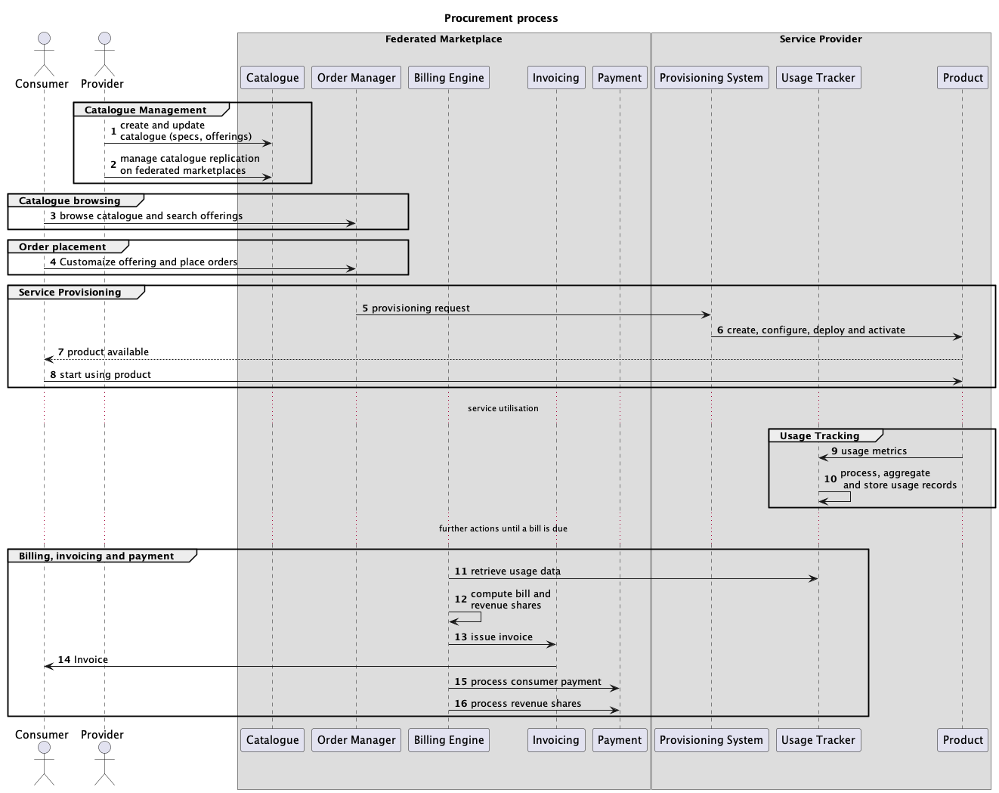

*Figure 5.1 - The procurement process*

## 5.2 Subscription Management

The Onboarding process allows new participants to join DOME. Organisations can register themselves and establish the roles they wish to play by using the DOME Trust and IAM framework. This process creates an account for the organisation that firstly needs to be verified throughout a qualification process, where any necessary information and documentation needed to validate the participant is asked to be provided. In addition, the participant is required to accept the DOME Terms and Conditions and sign the contract establishing the Revenue Sharing and the Code of Conduct. The detailed description of the on-boarding process is defined in section 3.

Once the new participant is verified, it will be recognized as a valid issuer. This means it will be authorised to issue Verifiable Credentials to their organisation members covering the roles the participant is playing. From this moment on, they can access the DOME Marketplace.

It is also possible for participants to terminate their accounts at any moment as long as there are no pending payments, ongoing complaints and/or active contracts. In this case, all the account and personal information is removed from the DOME systems.

From the point of view of the DOME Marketplace, all participant information is managed using the TM Forum APIs and thus stored as part of the DOME Persistent Layer. In particular the following APIs are used to handle participants:

- **Party Management API**: Provides a standardised mechanism for the management of parties including both Individuals and Organizations. Such parties are referenced from all TM Forum models in order to detail which parties are involved in the different TM Forum entities.

- **Party Role Management API**: Provides the API needed to manage the roles a particular party is playing, including roles of the platform itself and roles coming from an established agreement with other parties.

- **Account Management API**: Provides a standardised mechanism for the management of party accounts, including Billing, Settlement and Financial accounts.

Those entities included in the TM Forum APIs will be linked with the participant information handled by the Trust and IAM Framework (Wallet and VC). In this regard, during the first access to DOME made by an organisation LEAR, the system will automatically create the Organization profile in the Party Management API and the initial set of platform roles in the Party Role Management API using the information included in the credentials. Then, the participants will be able to update their profiles and create their accounts (Billing, Settlement, etc.) using the DOME Portal or directly through the TM Forum APIs using the proper Verifiable Credentials.

## 5.3 Catalogue Management

Both DOME and Federated Marketplaces will allow service providers to publish their catalogues of services, so that they can be discovered, browsed and acquired by potential customers. To support such a feature, DOME will rely on the TM Forum APIs for registering the different service and resource specifications, create product offerings and categorise such offers so they can be easily filtered.

This section describes how the different specifications, product offerings and categories are managed in DOME as well as how catalogues can be browsed. In addition, it is described how the different catalogues will be shared across the federated environment and how its visibility will be established.

### 5.3.1 Managing Specifications for Products, Services and Resources

The different Products that will be available and offered in the DOME Marketplace are made up of a set of Services that can be used by the customers (for example, a computing service), and a set of resources consumed or used by such services to work. Those resources are physical or non-physical components (or some combination of these) within an enterprise's infrastructure or inventory (for example a physical port assigned to a service).

In order to monetize products within the DOME Marketplace, including the provisioning of the acquired services and the allocation of all the needed resources, DOME Marketplace needs to manage the characteristics and the information of such products, services and resources. To do so, DOME Marketplace will use the TM Forum APIs. In particular, the specification models included in the Product Catalog Management API, Resource Catalog Management API and the Service Catalog Management API.

The specifications managed in DOME are:

- **Resource Specification**: It provides the generic means for implementing a particular type of Resource. In essence, a Resource Specification defines the common attributes and relationships of a set of related Resources.

- **Service Specification**: It offers characteristics to describe a type of service. Functionally, it acts as a template by which Services may be instantiated. By sharing the same specification, these services would therefore share the same set of characteristics.

- **Product Specification**: It is a detailed description of some of the attributes that will characterise Products created when a Product Offering is successfully ordered.

The following diagram depicts how a Product Specification is registered in DOME, including the Resource Specification and Service Specification that made it.

\<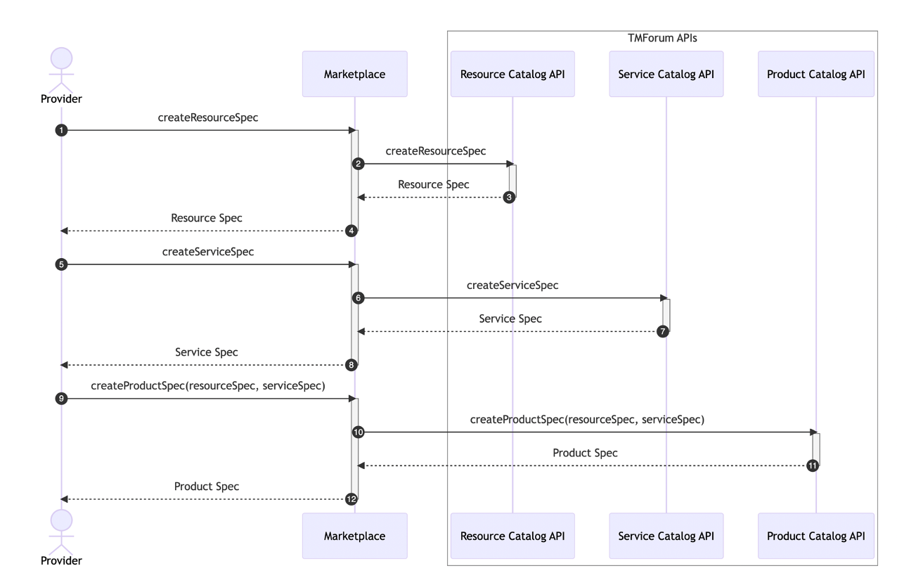

*Figure 5.2 - Managing resource, service and product specifications*

### 5.3.2 Managing Categories

Categories are used to group Service and Resource Candidates, as well as Product Offerings into logical containers. Categories can be organised in a tree-like structure to ease the browsing and selection process through filtering.

To enable effective filtering and comparison on the catalogue, the set of categories must be centrally managed. In particular, the DOME Marketplace will act as the reference source for the tree of categories, and the DOME Operator, following governance rules, will be in charge of its management.

Nevertheless, to address the need of federated marketplaces and providers to further detail their offerings using their established categorisation schemes or to address domain-specific categories, extension mechanisms are taken into account.

Within DOME, the management of categories will be grounded on concepts, recommendations and specifications from TMF620 "Product Catalog Management API".

#### 5.3.2.1 Categories Lifecycle States

Categories used to group offerings and candidates are introduced in the DOME ecosystem following a specific lifecycle, whose states are a subset of those recommended by TM Forum APIs for all managed entities.

*Figure 5.3 - Lifecycle of Categories*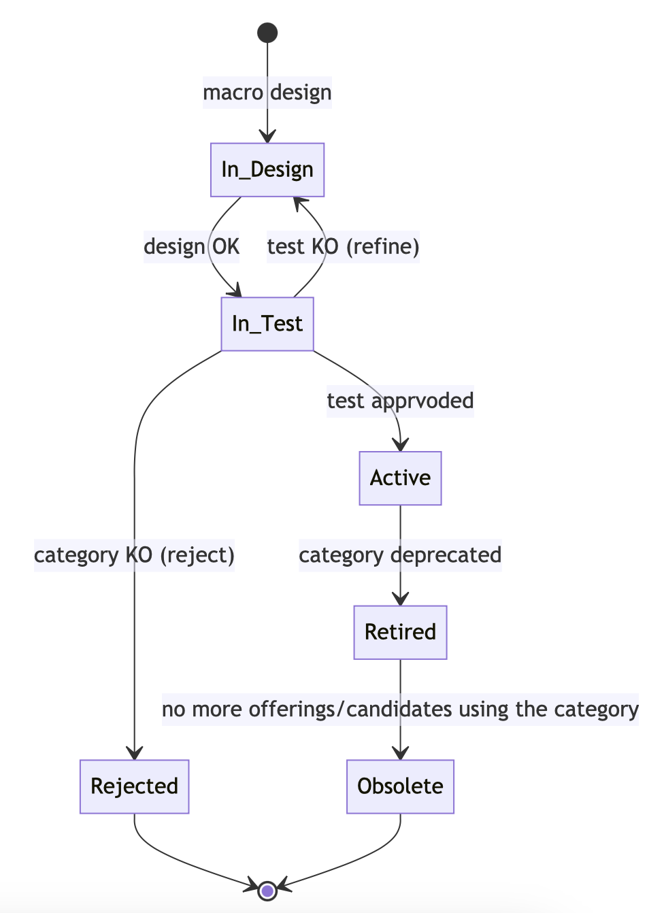

When the conception of a category element is started, its first status is “***In Design***”. The purpose of this status is to start tracking the category into the platform and allow its refinement in terms of naming and description.

As the definition is mature enough, the category is moved to the “***In Test***”, meaning that it can be attached to some pilot candidates and offerings. Marketplace functions (e.g. search, browse) leveraging these categories should ensure explicit user awareness, both when activating the function and when presenting results.

Any failure (e.g. negative feedback, poor adoption, duplication, etc.) in testing the adoption of a category, might require a further refinement (back to *‘ In Design’* status) or lead to a ***Rejection***, with no further action.

Conversely, a positive feedback in the test stage might lead to the ***‘Activation’*** of the category, meaning that it’s ready for wider and unconditioned usage within the ecosystem.

Categories that are planned to be removed will enter the ***‘Retired’*** state. This means that this category cannot be attached to any new offering/candidate but can still remain attached to older ones.

Finally, when a ‘*Retired’* category is no longer held by any offering/candidate, it can be made ***‘Obsolete’**,* meaning that it can be safely removed from the environment.

#### 5.3.2.2 Creating categories

Categories are created through the "Create Category" operation specified within Product Catalogue Management API.

Upon creation of a new category, a “Category Create Event” is issued and disseminated to the whole federation through Decentralised Persistent Layer mechanisms; interested parties are then able to retrieve the Category Resource from the DOME marketplace. Dissemination and retrieval processes are executed as described in section 4.4.2 The Data Flow.

#### 5.3.2.3 Retrieving categories

Categories can be retrieved, both from local storage and from federated marketplaces through operations enabling bulk (“List Categories”) and individual (“Retrieve Category”) retrieval, featuring filtering and attribute selection.

#### 5.3.2.4 Updating categories

Categories are updated through the "Patch Category" operation specified within Product Catalogue Management API. Categories can be updated in terms of all their attributes and sub-categories. Whenever this happens, the change is spread in the federation by issuing a “Category State Change Event”, following the same process used for the creation.

Upon update of a category, federated marketplaces / providers might need to update offerings and candidates in their catalogues accordingly (e.g. when a category is ‘retired’). This, in turn, will trigger catalogue synchronisation processes in the ecosystem.

Catalogue consumers (e.g. other federated marketplaces) should be tolerant when processing offerings and candidates that refer to categories whose lifecycle state is not active. In such a case, the reference to the non-active category should be simply ignored.

#### 5.3.2.5 Deleting categories

Categories are deleted through the "Delete Category" operation specified within Product Catalogue Management API. Whenever a category is deleted, the event is spread in the federation, by issuing a ‘Category Delete Event’, following the same process used for the creation and update.

Upon deletion of a category, federated marketplaces / providers should update offerings and candidates in their catalogues accordingly. This, in turn, will trigger catalogue synchronisation processes in the ecosystem.

Catalogue consumers (e.g. other federated marketplaces) should be tolerant when processing offerings and candidates that refer to deleted categories. In such a case, the reference to the missing category should be simply ignored.

#### 5.3.2.6 Supporting custom categories

The initial approach of adopting a unique, global taxonomy of categories has been widely accepted by initial DOME stakeholders; however, following a second round of requirement analysis, it emerged the need of federated marketplaces and providers to further detail their offerings using their established categorisation schemes or to address domain-specific categorisation. At the same time, it was also clear that giving the DOME operator the burden of managing such fine-grained and specific categories is neither an effective nor a sustainable approach for the DOME operator.

In order to support the autonomous definition and adoption of custom categories, and to clearly distinguish DOME-managed categories from custom ones, our design choice will leverage on the Product Catalogue concept from TMForum. The Product Catalogue will act as a logical container for category trees.

In practice, each federated marketplace or service provider willing to define its own categories will create a Product Catalogue including a reference to all the root categories defined in their custom tree. Similarly DOME will also define a global category tree that will be referenced from the Product Catalog created for the DOME central marketplace. With this approach, such a category tree does not need to deal with those categories that are specific to the use cases of the federated marketplaces and focus on having a global cross-sector taxonomy.

Although custom categories are fully under control of federated marketplaces and clearly distinguished by DOME-defined ones, the trees are not necessarily isolated from each other; in fact, by attaching (through reference) custom category trees below nodes in the DOME tree, federated marketplaces will actually provide domain-specific extensions to the more general category taxonomy maintained by DOME.

There is not a restriction imposed by the TMForum model on what Product Categories can be included in a Product Offering, so both DOME-defined and federated marketplace-defined Categories can be used in the Product Offering when categorising it.

Finally, this approach adds an extra filtering feature to the offering discovery process, as it allows to request only the categories that are relevant in the context of a specific scenario (using the Product Catalogue linked to the federated marketplace to filter), instead of having to navigate through the whole category tree for filtering the Product Offerings.

#### 5.3.2.7 The DOME global category tree

The initial version of the DOME global category has been drafted as a joint and collaborative work within the project consortium. By considering adopted approaches by partners on their own marketplaces, as well as by third-party public marketplaces, it was agreed to organise product categories according to three perspectives:

- a technical perspective, to characterise the product according to the technology domain it belongs to (e.g. computing, artificial intelligence, blockchain, IoT, data management, etc.)

- a business domain perspective, to categorise the product according to the industry domain(s) it addresses (e.g. healthcare, manufacturing, agriculture, etc.). The Domain Industry Taxonomy (DIT)[^5] has been selected as a reference taxonomy for this perspective.

- a third set of categories has been considered to characterise professional services (e.g. consulting, implementation, service management, etc.) typically included in catalogues as side offerings of other products.

The above sets of categories are expected to evolve over time, taking into account levels of adoption and feedback from federated marketplaces and providers. Nevertheless, careful evaluation for changes and additions will be conducted to maintain these global categories general enough to ensure broad adoption and accommodate sustainable management overhead.

### 5.3.3 Managing Offerings

DOME Marketplace will allow customers to acquire the different products and services published by service providers. To support such a feature, offer information will be handled using the Product Offering model as defined by the TM Forum Catalog Management API. A Product Offering represents an offer on products that are orderable from the different providers. It includes pricing and agreement information, the reference to the Product Specification, and other characteristics of the Product that gets created when a Product Offering is procured. In addition, it includes the references to the Resource Candidates and Service Candidates of the Service and Resource Specifications that made up the Product Specification to support the instantiation in the different inventories.

#### 5.3.3.1 Offerings lifecycle

All the different models defined as part of the TM Forum Product Catalog Management API share the same lifecycle, including the Product Offering. The following picture depicts the lifecycle of a Product Offering:

*Figure 5.4 - Lifecycle of a Product Offering*

It can be seen that the Product Offering lifecycle includes statuses not only for the commercialization phase, but also for its conception and design:

- **In study**: The concept for the new product offering is being analysed

- **In design**: The concept has been approved and the product offering is being designed

- **In test**: The offering design is ready and it is being tested

- **Active**: The design is approved and the tests are OK, the product offering is ready

- **Rejected**: The design is not approved and the tests are not ok, the product offering is rejected

- **Launched**: The product offering is available to be acquired by customers

- **Retired**: The product offering is no longer available to be acquired by customers, but customers who has already acquired it still has support

- **Obsolete**: The product offering is no longer maintained by the service provider

It is important to remark that the initial statuses of the lifecycle are intended for scenarios where the development of the Product Offering is relevant. For the particular case of the DOME Central Marketplace it is assumed that the services and resources offered are already available, so the lifecycle used will start on the Active status.

#### 5.3.3.2 Offerings management in the DOME central marketplace

The DOME Marketplace will implement the whole TM Forum Product Catalog API, allowing providers to create, update and delete Product Offering models.

Service Providers will be authorised to create new Product Offerings in the DOME Marketplace in Active state, including the product specification that is being offered and the product catalogue where the offering is being made available. Such specification and catalogue must exist in advance before the creation of the Product Offering.

While the product offering is in Active state, it is not available to be discovered and cannot be placed into a product order, so the service provider will be able to update any information, including descriptions, pricing models, categories, and so on before its commercialization. Once the status of the product offering is set as Launched, such an offering is made available in the search and browsing section of the DOME Marketplace and can be discovered and acquired by the potential customers. As the product offering references product specifications and product catalogues, both elements must also be in the Launched state before launching the product offering.

The service provider will be able to update the information of the product offering at any moment while it is in Active or Launched state. Note that even if the Product Offering has been already acquired by some customers, the conditions, including characteristics, pricing model, etc. are copied to the Product Order and then placed in the Product Inventory as described in the section 5.4.2 “Order Placement”, so updating product offering information of a Launched offering does not affect orders already placed.

Finally, the service provider will not be authorised to delete product offerings directly from the icationDOME Marketplace. To stop the commercialisation of an offering, its status must be set to Retired, so customers who have already acquired the product offering can keep using it (according to the established agreement and the offering terms and conditions), and at the same time, it cannot be acquired by new users. DOME Marketplace admins will be able to remove Product Offerings from the system.

#### 5.3.3.3 Agreements management

Registering product offerings in the DOME Marketplace allows potential customers to acquire those different services offered in it. This enables the basic customer-provider scenario where customers can place orders (as defined in section 5.4.2 “Order Placement”) and pay accordingly to the selected pricing model. Nevertheless, this scenario is not the only one that can be supported by the Marketplace using the TM Forum APIs. The Agreement Management API can be used in order to support any agreement between parties, not only purchases but also any contract or arrangement such as a service level agreement or a collaboration. Such agreements may involve different products, services and resources and can include multiple parties involved, playing different roles.

The DOME Marketplace will allow parties to register potential agreements by supporting the Agreement Specification model defined by the TM Forum Agreement API. An agreement specification defines a template that can be used when a new partnership is established, and can include any number of agreement characteristics defining the conditions of the potential agreement. These templates can be used for establishing agreements as defined in section 5.4.2.2.3.

#### 5.3.3.4 Revenue sharing policy definition

The Revenue Sharing mechanism defines how Providers and Commercial Federated Marketplaces (CFMs) contribute a predefined portion of their revenues to the DOME Operator in exchange for visibility, platform services, and operational support offered through the DOME ecosystem. This mechanism ensures that the commercial model adopted by the platform is consistently applied across all participants and remains adaptable to different business scenarios.

Revenue Sharing relies on subscription plans (such as BASIC or ADVANCED) that Providers and CFMs must acquire before selling their products in the marketplace. Each plan includes a Price Plan that specifies how fees and commissions are calculated. The core logic (percentages, thresholds, incentives, and fixed fees) is managed through a flexible configuration approach, allowing updates to be introduced in line with governance decisions or market evolution.

Once a Provider subscribes to a plan, the system automatically applies the relevant billing rules and periodically generates the associated fees. These fees are invoiced directly by the DOME Operator. The Revenue Sharing process integrates seamlessly with the platform’s transactional components like Billing, Invoicing and Payment ensuring complete alignment with the overall DOME architecture.

A dedicated dashboard (for both Providers/CFMs and the Dome Operator) enables monitoring and auditability, providing insights, revenue flows, thresholds, and amounts due.

For further details, please refer to chapter 5.4.6.

#### 5.3.3.5 Tailored offerings and offline negotiation

The Tailored Offering feature enables personalized, one-to-one commercial negotiations between a Provider and a specific Customer within the DOME Marketplace. While standard offerings can be purchased directly, many B2B scenarios require customized pricing, specific contractual terms, or adapted service configurations. The Tailored Offering process has been designed to address these needs in a controlled, traceable, and fully digital manner. The process begins when a Provider marks a product as “negotiable,” allowing the Customer to request a customized quote. The negotiation is managed entirely within the DOME environment, using integrated tools to exchange messages, share documents, clarify requirements, and refine the proposal. Throughout this phase, confidentiality and restricted visibility are ensured: each negotiation is private and accessible only to the two involved parties. Once an agreement is reached, the Provider formalizes the outcome by creating a dedicated Custom (Tailored) Offering. This customized catalog entry maintains the technical characteristics of the original product but applies the agreed pricing, contractual terms, SLAs, and any other negotiated elements. The resulting offer is visible exclusively to the specific Customer, who can complete the purchase through the standard marketplace ordering flow. At this point, all standard DOME processes (billing, payment, provisioning, invoicing, and revenue sharing) are triggered in the usual way, ensuring seamless integration with the overall transactional model.

For further details, please refer to the dedicated chapter 5.4.9.

### 5.3.4 Browsing the DOME central marketplace catalogue

The DOME Marketplace can potentially include a huge number of product offerings. In this regard, it is critical to provide proper browsing and searching capabilities in order to increase the usability, allowing potential customers to discover the offers that best fit their needs.

To do so, on the one hand, the DOME Marketplace will support categories as defined in section 5.3.2 “Managing categories”, enabling categorisation of the published product offerings. Potential customers will then be able to filter and easily discover those offerings. Categories will be created and managed by the owner and administrators of the marketplace.

On the other hand, the DOME Marketplace supports the creation of Product Catalogues, as defined by the TM Forum Product Catalog API. These product catalogues are created by the different providers and allow them to publish their offerings in such catalogues, so they can be classified according to the providers' needs.

The DOME Marketplace will allow customers to select the different published catalogues so they can browse the product offerings included in them. In addition, as the different providers can create multiple catalogues, the DOME Marketplace will allow users to search the catalogues themselves using the description information given by the catalogue provider.

### 5.3.5 Replication and visibility of catalogues in the federation

For marketplaces and service providers, one of the main benefits in joining the DOME federation is the potential it delivers in increased visibility of their cloud and edge offerings to all customers across Europe.

In fact, DOME enables federated marketplaces operators and service providers to expose selected parts of their catalogues through other market channels. This will also reduce their administrative burden as typically they would have to adhere to the rules of specific marketplaces, typically run by individual cloud IaaS/platform providers.

The low barrier for becoming visible through the federated marketplaces, linked to the shared catalogue of cloud services, will stimulate competition among marketplace providers, which ultimately will turn into better conditions from marketplaces as intermediaries and overall growth in number of end users.

For such an approach to be acceptable by marketplaces, both parties of the relationship (the source provider/marketplace and the exposing marketplace) must have full control over the process. In particular the following two principles must be respected by any viable approach:

1.  A marketplace can’t expose product offerings from another marketplace if the latter does not agree (i.e. any marketplace is free to decide on the disclosure of its offerings)

2.  A marketplace can’t force another marketplace to publish its own product offerings (i.e. any operator is free to decide what can’t be published on its own marketplace)

The approach taken by DOME is based on:

1.  A way to express replication control policies applicable to any product offering in the federated marketplace. It must be expressive enough to cover common requirements of service providers and marketplaces. Also it should be based on a standard or widely-accepted formalism so that any involved actor can easily process and understand the policy it carries. As also introduced in section 3, ODRL has been selected for such purpose.

2.  A dissemination mechanism for the above policies. While replication policies are primarily processed and enforced by product offerings owners (i.e. service providers and their reference marketplaces) who use them to disclose offerings to others, recipient marketplaces might have good reasons to be aware of the policies behind an offering: it might want to verify, on its own, that it’s really entitled to publish an offering - there might be situations where an offering reaches a marketplace even if the source marketplace/provider didn’t intend to. This can happen because of bugs, hackings, replication outside the scope of DOME, etc.  
    The mechanism for the trusted dissemination of policies consists in embedding the policies in the product offering and digitally signing the offering itself.  
    Also, in the case a publisher exposes an offering that it is not entitled to, according to the embedded policy, the source marketplace/provider can leverage on its digitally signed offering/policy to prove the violation.

3.  An access control mechanism, included in the DOME Access Node, delivering the feature out-of-the-box to all federated marketplaces. By correctly evaluating and enforcing embedded policies, the Access Node will only deliver catalogue content to entitled sink marketplaces. Also, by evaluating incoming content against included policies, any sink marketplace can be sure it’s respectful of established rules, regardless of who’s the actual originator of the received content.

Through mechanisms B and C, upon an attempt from a marketplace P to retrieve any offering from a marketplace S, the latter can enforce whatever access control policy it decides, based on requestor properties and/or other contextual information. This way, principle 1 is guaranteed for source marketplaces.

Principle 2 is fully in the control of the various (potentially) publishing marketplaces. Assuming they’ve been able to retrieve an offering from a source marketplace, they can enforce any policy they define (e.g. based on source identity, offering content, etc.) and filter out the offering from their own marketplace.

#### 5.3.5.1 Controlling Catalog Replication (i.e. Access Control policies)

In order to control how and where product offerings are replicated in the DOME ecosystem, marketplaces and product/service providers should have the means to set replication policies based on different criteria to be matched by the exposing marketplace.

At the time of writing this document, based on a survey conducted within the consortium, the following criteria have been identified as relevant to control replication:

- the identity of the exposing marketplace

- the country/zone of the exposing marketplace

- combinations of the above criteria (through and/or/not operators)

In general the replication process involves two actors and two phases:

1.  The source marketplace decides which product offering to (ideally) replicate, where and under what conditions.

2.  The sink marketplace becomes aware of such a replication wish and, if agreed, proceeds with the publication of the product offering.

From a procedural point of view, it the process should work as follows:

1.  The source marketplace creates an offering and stores it locally (i.e it stays in the local Access Node). At the same time, the source marketplace defines some replication control policies for that offering. Such policies are embedded in the offering itself which is also digitally signed by the provider.

2.  The creation of the offering will trigger blockchain notifications to all interested marketplaces who have now enough information to locate and retrieve the offering.

3.  When the sink marketplace tries to access the offering, the source marketplace will enforce the replication policies (through its own PDP/PEP) included in the offering itself. If the requestor matches the access policies, the offering is returned.

4.  To safeguard itself, the sink marketplace should double check it’s entitled to expose the offering by evaluating itself the replication policy (since it’s embedded in the offering).

5.  Finally, it’s up to the sink marketplace to decide whether to publish the offering or not according to its own acceptance criteria (see later). Further, if it agrees to publish, this should also happen in accordance with visibility policies (see below). The whole step number 5 is elaborated in the following sections.

**Involved parties**

The above process is mostly on the source marketplace side.

The DOME access node will deliver enough support to realise the above behaviour; however, marketplaces in the federation are ultimately free to implement this as it wishes (or do not implement it at all or do a naive implementation, if they decide their offerings are public to everybody). They can also rely on simpler implementation (e.g. only relying on access control, without embedding any policy in the offering) but this will reduce their capability to legally act against misuses.

The DOME central marketplace (i.e. the BAE) should implement it as we’re discussing and defining here. Also, since the support is being introduced in the BAE, any marketplace adopting such technology can benefit from such an available feature.

#### 5.3.5.2 Controlling Incoming Offerings (i.e. Acceptance Criteria)

On the other side of the catalogue replication process, the sink marketplace has always full control over the content of its exposed catalogues. Whatever the replication and visibility requests are, it is free to accept or reject any offering from other marketplaces and providers.

The DOME marketplace operator (thus, through the BAE) can set acceptance policies based on criteria to control which offerings from other providers can be exposed on the DOME marketplace.

At the time of writing this document, based on a survey conducted within the consortium, the following criteria have been identified as relevant for filtering incoming content:

- the identity of the originating marketplace

- the country/zone of the originating marketplace

- the certification (level) of the offering

- the technical/domain categories of the offering

- combinations of the above criteria (through and/or/not operators)

As introduced in the previous section, further verification on the sink side might include local evaluation of replication policies.

Note: although some of the above criteria might not make sense for the DOME marketplace (e.g. there should be no reason why DOME should prevent publication from any federated provider, or filter-out offerings in any industrial domain), we need to consider that when the BAE technology is adopted by federated marketplace, such criteria immediately become more reasonable.

**Involved parties**

Being this process entirely on the sink side, any federated marketplace can manage this as it wishes. This means that, upon receiving an ‘offering-related’ blockchain event from a source marketplace, the sink marketplace can decide to do nothing (i.e. even not implementing the feature, or ignoring the event), or publish everything they receive, or enforce any custom rule or manage it by manual processes.

The DOME central marketplace (i.e. the BAE) should implement it as we’re discussing and defining here. Also, since the support is being introduced in the BAE, any marketplace adopting such technology can benefit from such an available feature.

#### 5.3.5.3 Addressing the Customers (i.e. Visibility Policies)

In some cases, the offering owner can further address a specific customer base within the same target marketplace by establishing visibility rules that determine who can get access to the offering based on different criteria (i.e. customer properties, etc.). Also, depending on some other criteria (e.g., registered or unregistered user), a seller might want to set visibility policies on specific offering properties (e.g., price, contractual documentation, etc.)

Similar to catalogue replication, but enforcement here can only be done on the sink marketplace. This means that the the catalogue/offering content should be made available to the sink (the source can’t know in advance who will access the sink marketplace); then it’s up to the sink marketplace to 1) evaluate if the offering has to be shown or not to the customer and 2) show only allowed offering metadata.

At the time of writing this document, based on a survey conducted within the consortium, the following properties have been identified for selective disclosure:

- contractual documentation

- pricing

- name of the provider

- related services

While the criteria supporting the selective disclosure include is essentially the authentication of the customer (i.e. anonymous vs authenticated)

**Involved parties**

Any source marketplace that wants to enable selective disclosure on its own offerings, must make visibility policies available to the sink (similarly to replication policies, by enriching the offering itself, similarly to what has been said for replication policies) so that the sink marketplaces know how to behave when their customers.

On the other hand, sink marketplaces must understand the policies and must enforce them whenever a customer is accessing an offering.

With respect to the last point, it is worth considering the realisation of a reusable filtering component that, given an offering, its embedded ODRL visibility policy and contextual information (i.e. customer attributes, etc..) produces a partial view of the offering itself to be presented to the customer.

## 5.4 Service Brokerage

### 5.4.1 Overview

The previous sections of this chapter have introduced some capabilities of the DOME ecosystem that, although complying with the DOME specifications, are mostly delivered by individual marketplaces including the DOME central one.

In a basic relational scenario, the DOME central marketplace provides a trusted and comprehensive catalogue of cloud services, enriched with available certifications, price lists and communication links with the various providers. Consumers are enabled to search for cloud services and contact providers with the support of DOME, but subsequent steps in the transaction (ordering, provisioning, payment, etc.) take place on the providers’ facilities, without any involvement of the DOME marketplace.

DOME goes beyond this model and aims at delivering transaction-facilitation features. In this transactional scenario, the marketplace model evolves to incorporate brokerage services like a federation-aware order management system. Although the delivery of complex and distributed services will not be in the scope of the project, related business processes like consumption tracking, billing, invoicing and payment will be supported by DOME with the goal to ease the procurement process for consumers and seamlessly increase visibility and revenues for providers and federated marketplaces.

The remainder of this section will cover the features mentioned above, analysing the different possible scenarios in the DOME federation, reporting on major design choices both in terms of federated processes and of structure and behaviour of the DOME services delivering those features.

### 5.4.2 Order Placement

Order placement is the process of submitting an order for cloud services to a cloud marketplace. The order placement in non distributed scenarios involves the following steps:

- The customer selects the cloud services that they want to order.

- The customer provides the necessary information about the order, such as the quantity of each cloud service, the duration of the order, and the billing information.

- The customer submits the order to the cloud marketplace.

- The cloud marketplace forwards the order to the relevant cloud providers.

- The cloud providers execute the order and provide the cloud services to the customer.

The order placement process can be automated or manual. In an automated process, the customer submits the order to the cloud marketplace through a web portal or API. The cloud marketplace then automatically forwards the order to the relevant cloud service providers. In a manual process, the customer submits the order to the cloud marketplace by phone, email, or fax. The cloud marketplace then manually forwards the order to the relevant cloud providers.

We are targeting automated order placement in a federated environment leveraging the IAM and a distributed storage infrastructure (described earlier in this document). Thanks to the infrastructure underneath, actions performed locally will be automatically replicated over the federated marketplaces detaching each of them from the burden of taking care of the DOME cloud ecosystem.

#### 5.4.2.1 Federated Scenarios for order placement

Service offerings are published on marketplaces (DOME and federated marketplaces) according to their internal procedures. Federated marketplaces should advertise the existence of new offerings by creating an entry in the DPL (TMF APIs). However, not all services are eligible to be part of the DOME catalogue/ecosystem. DOME verifies service compliance against the necessary minimum certifications and, once all checks are successfully passed, publishes it in the DOME catalogue. Only services approved by DOME can be sold in the EU. Federated marketplaces must take the services in the list of those respecting a minimal set of rules.

DOME, like other federated marketplaces, can decide whether to sell the services published or simply keep them in the catalogue for customers to browse.

The DOME governance will establish how DOME will manage services that are not compliant with EU rules. Those that cannot be sold in the EU will be marked in the list to be clearly distinguished by users. The WG working on D5.1 will provide guidelines to be discussed within the ecosystem.

As mentioned earlier, the DOME central marketplace can act as a selling channel for product offerings created and published locally (by the DOME marketplace itself) and, most prominently, as a broker between consumers and federated marketplaces that decide to expose their offerings in the federation.

Since simply forwarding to a federated marketplace would make it impossible to track the sales of services offered by different marketplaces, the DOME executive board will establish appropriate ecosystem policies. This could be the case for services that cannot be sold in the EU. It could also be decided that all services in the catalogue must be sold by DOME itself or with its intermediation.

In conclusion, the DOME central marketplace can act as a selling channel for product offerings created and published locally and, most prominently, as a broker between consumers and federated marketplaces that decide to expose their offerings in the federation. The DOME ecosystem will be ruled by specific business and governance policies.

##### 5.4.2.1.1 Placing orders on DOME for offerings linked to a Federated Marketplace

When the DOME central marketplace acts as broker, two scenarios might occur when it comes to order placement.

**The relational scenario**

In the *relational scenario*, no ordering happens on the DOME central marketplace. Instead, for all published product offerings in the DOME central marketplace, the user will be redirected to the Federated Marketplace for order placement (including contractual customization, configuration of product options, etc.). From this moment on, the DOME central marketplace won’t have any further intermediation in the order processing workflow.

DOME will support the relational scenario in its basic feature set. The DOME ecosystem rules will define the utilisation scope of this mechanism.

For the sake of simplicity, the diagrams below show direct interactions between marketplaces, as this is the focus of this section. However, from a more technical perspective, every relevant interaction within a transaction (e.g. order placement, status update notification, etc.) is tracked using DOME mechanisms and notarized in the Decentralised Persistence Layer.

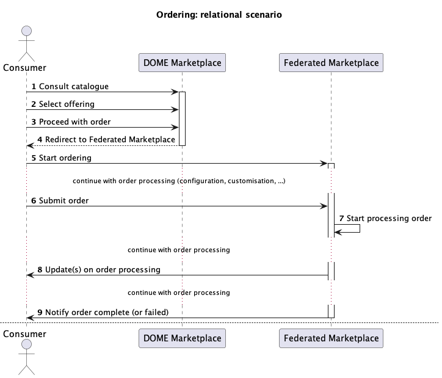

*Figure 5.5 - Ordering: relational scenario*

**The transactional scenario**

In the transactional scenario supported by DOME, service providers whose offerings have been published in the DOME marketplace can decide to exploit ordering facilities available there, leaving the burden of order management (e.g., cart management, order definition, configuration of options, contract customization and signature, billing and payment details, etc.) to the DOME central marketplace. Upon creation of the order and its dispatch, the service provider takes over the provisioning/delivery process, while notifying the relying party (i.e., the DOME marketplace) about process progress until completion.

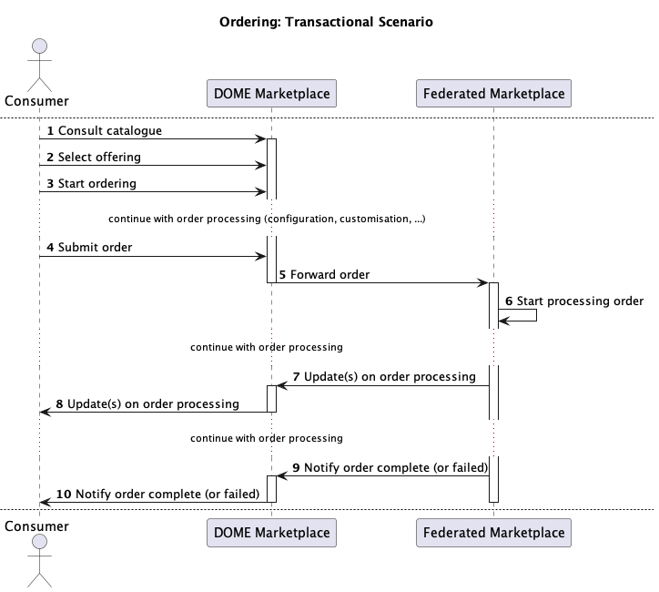

*Figure 5.6 - Ordering: transactional scenario*

It is worth noting that, in a transactional scenario, mixed behaviours will still be needed/preferred by some service providers. Depending on business choices, the service provider might choose to manage exclusively the order processing for some offerings. Also, for a given offering with complex product configuration, it might decide to let DOME manage orders for products with basic configurations and take over the process to provide the consumer with personalised user experience in the case of more advanced configurations.

##### 5.4.2.1.2 Placing orders on DOME for offerings linked to the DOME marketplace

Clearly, when the product offerings have been originally published on the DOME central marketplace, the process does not differ from the transactional scenario, for what concerns the placement of orders; in this case the DOME marketplace will play both the roles of selling and providing marketplace, as we can see in the following diagram.

*Figure 5.7 - Ordering: products that are local to the DOME marketplace*

##### 5.4.2.1.3 Placing orders on Federated Marketplaces

When orders are managed and placed by Federated Marketplaces for offerings published within the DOME federation (no matter whether in the DOME Marketplace or another Federated Marketplace), the order placement can fall into any of the three scenarios described above. Federated Marketplaces can freely decide to adopt the transactional or relational approach, depending on their technical and business choices.

#### 5.4.2.2 Placing orders on the DOME marketplace

In addition to the federated scenarios, the DOME Marketplace can be used directly for the publication of product offerings, hence product orders can be placed locally in the DOME central Marketplace.

##### 5.4.2.2.1 The product order information model

For the Management of product orders the DOME Central Marketplace will rely on the TM Forum Product Order Management API using the Product Order model. A Product Order, as defined by TM Forum, is a type of order which can be used to place an order between a Party (mainly customer) and a service provider. It is connected to a Product Offering in a Product Catalogue and, when successfully completed, leads the creation of a Product in the Product Inventory triggering the service provisioning.

The Product Order model defines the following main attributes:

- **orderDate**: Date when the order was created

- **completionDate**: Date when the order was completed

- **expectedCompletionDate**: Expected completion date amended by the provider

- **requestedCompletionDate**: Requested delivery date from the requestor perspective

- **requestedStartDate**: Order fulfilment start date wished by the customer. This is used when, for any reason, customer cannot allow seller to operationally begin the fulfilment before a date

- **cancellationDate**: Date in which the order has been cancelled (when cancelled).

- **cancellationReason**: Reason why the order is cancelled (when cancelled).

- **state**: Lifecycle status of the order

- **relatedParty**: A list of related parties. A related party defines a party or party role linked to a specific entity. It includes the customer, provider and other parties that may be involved

- **category**: Used to categorise the order from a business perspective that can be useful for the ordering management system (e.g. "enterprise", "residential", ...)

- **priority**: A way that can be used by consumers to prioritise orders in ordering management system (from 0 to 4 : 0 is the highest priority, and 4 the lowest)

- **externalId**: ID given by the consumer and only understandable by him (to facilitate his searches afterwards)

- **note**: A list of notes. Extra information about a given entity

- **notificationContact**: Contact attached to the order to send back information regarding this order.

- **agreement**: A list of references to agreements. Agreements defined in the context of the product order

- billingAccount: A reference to a billing account of the customer

- **payment**: A list of references to Payment resources, as defined in the TM Forum Payment Management API

- **productOrderItem**: Each of the parts of the Product Order, including one per Product in the product inventory to be created or managed. Each product order item includes the reference to the product offering, the chosen characteristics and pricing, and the action to be performed: add, modify, delete and noChange

It can be seen that the TM Forum model allows multiple actions to be performed by the ordering management system, defined within the product order items. In practise, the model allows customers to manage the product inventory via products orders, instantiating new products with the add action, updating an existing product instance with the modify action (updating this way the terms of the purchase), and removing the product from the inventory with the delete action (terminating the contract). Nevertheless, from the context of the DOME Marketplace only add action will be supported, ensuring that a particular product in the product inventory is linked to a single product order. This approach will simplify the ordering management process and the scenarios the Marketplace will need to handle. Updates and termination of the contacts will be managed directly by the DOME Marketplace and the Inventory Management APIs applying the needed access policies.

The TM Forum model for Product Orders defines a complete lifecycle that is depicted in the following picture.

*Figure 5.8 - Lifecycle of a Product Order*

When a new product order is submitted, the system makes an initial validation of the information that has been provided by the customer. If such information is not consistent (i.e. the product offerings do not exist or the chosen characteristics values are not valid), the order is directly placed in the Rejected state. If the information is correct, the order is placed in the Acknowledged state so it can be processed.

When the order begins to be processed, it is set to InProgress state. From such status, if extra information needs to be provided, the order is set to Pending state until provided. If such information cannot be provided the order is directly Cancelled. In addition, if the order is requested to be cancelled, it is set to Assessing Cancellation and if accepted it is Cancelled through the Pending Cancellation state. Finally, if some issue blocked the ordering process the product order is set in Held status. In case the issue cannot be fixed the product order is Cancelled.

When the order has been processed, it can be set in 3 different states depending on how the order process has finished: (1) If all the order items have been correctly processed, the order is set in Completed state. (2) If all the order items have failed to be processed the order is set in Failed state, and (3) if some of the order items have been processed the order is set in Partial state

##### 5.4.2.2.2 Configuring the product offering

The DOME Marketplace will allow customers to configure some options when placing a product order. In particular, to select the product offering price and the values of product characteristics when multiple options are available.

On the one hand, the product characteristics are defined as part of the product specification included in the product offering. Such characteristics allow them to provide custom information about the specification. In addition, the TM Forum model allows multiple values for those scenarios where customers are allowed to select one option (i.e. multiple storage sizes, bandwidth, etc). Moreover, the TM Forum model supports different pricing schemes depending on the values of the characteristics by assigning to the product offering the allowed values that can be chosen when acquiring it. With such an approach it is possible to define different offerings linked to the same product specification providing different pricing models for the different characteristics values.

On the other hand, the product offering can include multiple pricing models. In this case, the customers will be able to select the one that best fits their needs (i.e a pay-per-use model vs a recurring payment)

Those options, characteristics and pricing, are provided as part of the product order item associated with the product offering, and are used as the basis for the instantiation of the product in the product inventory once the product order is completed.

##### 5.4.2.2.3 Agreement customisation

The Product Ordering Management API, as defined in previous sections, allows customers to place orders for acquiring one or more product offerings covering the basic customer-seller relationship. This scenario can be enriched in the DOME Marketplace using the TM Forum Agreement Management API for supporting any agreement between parties.

As described in section 5.3.3.3 “Agreements management”, service providers can create Agreement Specifications to define the templates of the agreements they are willing to create. Using such specifications as the starting point, it is possible to create Agreements in the Agreement Management API. The agreement model will include the reference to the agreement specification, the list of characteristics that describe the agreement, its main goal, and the dates the current agreement will be valid.

In addition, the agreement will describe the list of engaged parties that participate and the role they will play, as well as the list of authorizations from the different representatives of each of the parties, including the status of the authorization, the signature of the representative and the date of the signature. Note that for the agreement to be valid all the signatures from the different parties must be provided.

Finally, the agreement will include the different agreement items that are subject to the relationship being established. The agreement items can include a reference to a product offering and the specific terms and conditions applied to it. When the product offering is procured and the different services and resources included have been provisioned, the agreement item will include also the reference to the product in the Product Inventory Management API that references the different service and resource instances (as described in section 5.4.3.2.3).

##### 5.4.2.2.4 Including customer and billing information

Placing product orders in the DOME Marketplace requires customers to provide the billing information to be used during the payment process. Such billing information will be managed in the DOME Marketplace by using the TM Forum Account Management API. This API provides a standardised mechanism for the management of billing and settlement accounts as well as for financial accounting either in B2B or B2B2C contexts.

Users in the DOME Marketplace will be able to create and update different Billing and Settlement accounts (if they are service providers), that can then be used when orders are placed. In particular, when submitting a new product order the customers will need to provide the billing account they want to use by using the billingAccount field described in section 5.4.2.2.1.

##### 5.4.2.2.5 Submitting the order to the Decentralised Persistence Layer

When a new product order is placed, the DOME federation ecosystem (and precisely, all the involved actors) needs to be aware of such a placement in order to properly track customer actions and process the order. In particular, the DOME federation ecosystem needs to be able to manage the payment and notify the service provider that a new product order has been placed for provisioning the services, as described in section 5.4.3 “Service Provisioning”. To do so, the DOME federation ecosystem relies on the Decentralised Persistent Layer, which will store all the entities generated during the ordering process as all the interactions will be performed with the TM Forum API exposed by the access node, as described in section 4.

### 5.4.3 Service Provisioning

A cornerstone part of the ordering process described in the previous section is the provisioning subprocess.

Once the order is complete and there's an agreement between the consumer and the provider, the latter can proceed with the provisioning of the product, i.e. setup of services and resources defined in the product specification to serve consumer needs.

#### 5.4.3.1 Provisioning scenarios in the DOME Federated environment

The entity triggering the start of the provisioning process is always the marketplace orchestrating the ordering process, upon its conclusion. Also, that's the same marketplace that keeps the consumer updated about the progress of the provisioning, until the offering is fully provisioned. From then on, the consumer can start using the product without any further intermediation of DOME entities.

Depending on the nature of the product offering (and/or of the service and resource candidates making it), the actual product might be provisioned and active before and independently of any order or provisioning request for it. However, still in this case, the provisioning stage perfectly makes sense as it should, at least, consist in granting enough access rights to the consumer, triggering the start of consumption tracking, etc.

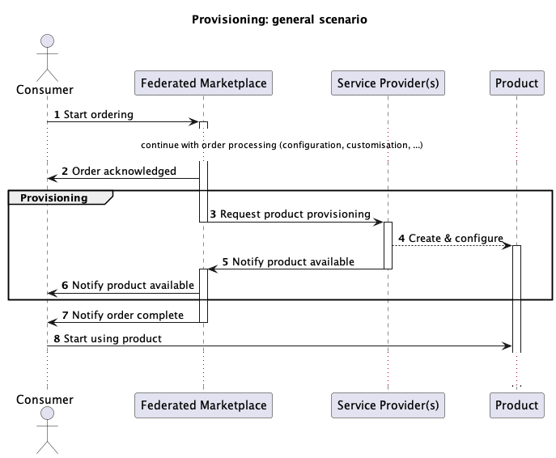

*Figure 5.9 - Provisioning: general scenario*

The scenario depicted above is quite general and can occur with slight variations, depending on the actual DOME entities playing the different roles. In the following, we’ll explore them individually.

For the sake of simplicity, the above diagram does not show actions involving the DOME Decentralised Persistence Layer.

##### 5.4.3.1.1 Federated Marketplace and Provider linked with a legacy integration

In this scenario, there’s usually a business and legacy technical link between the Marketplace and the Provider, established outside the DOME federation. In terms of provisioning, it’s the Marketplace that holds the burden to comply with DOME specifications implementing the Provisioning API, whereas the interaction between the Provider and the Marketplace is either based on a legacy API provided by the Marketplace or, the other way round, realised by absorbing the provider specific API into the Marketplace. The relevant point here is that the Provider, from a technical perspective, doesn’t have a direct interaction in the ecosystem regarding the provisioning process; it’s not the provider that receives the request from the Access Node, nor provides updates on provisioning progress. Instead, the provider updates the marketplace about progress in the provisioning in a legacy fashion. The marketplace, in turns, notifies interested parties via Events and TM Forum APIs

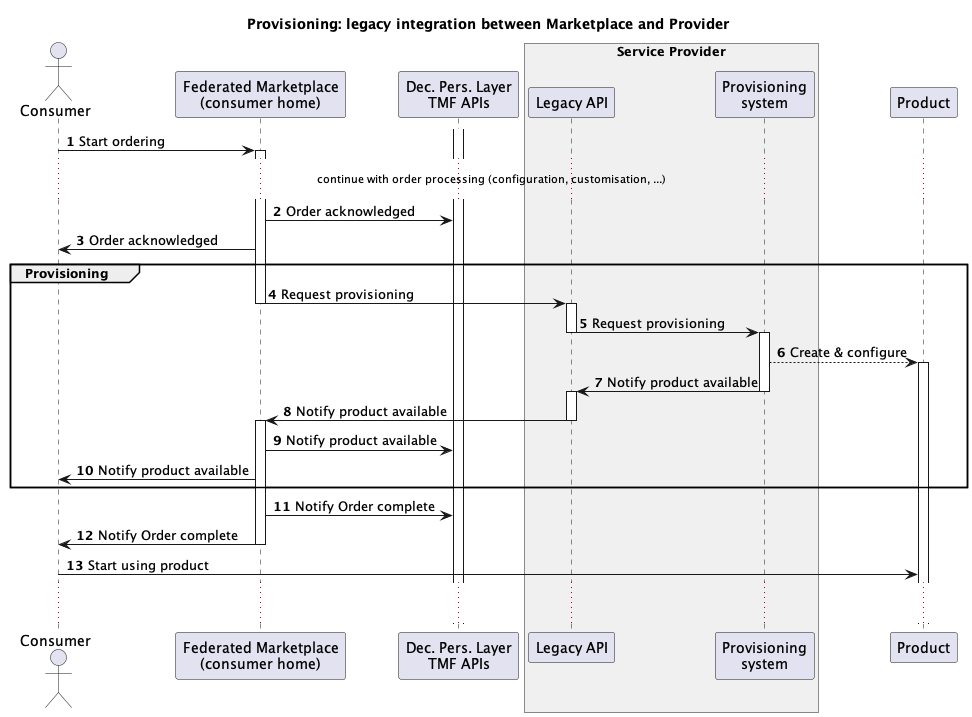

*Figure 5.10 - Provisioning: legacy integration between Marketplace and Provider*

Depending on the number of involved providers and the identity of the marketplace operator, we can find here both the ‘eCommerce’ scenario (where a Provider runs its own Marketplace) and the ‘independent marketplace’ scenario (where many providers rely on an external marketplace to sell their products).

In the following diagram we can notice that, although the interactions among entities are unchanged, the Marketplace and the Provisioning system are both under the responsibility of the Provider.

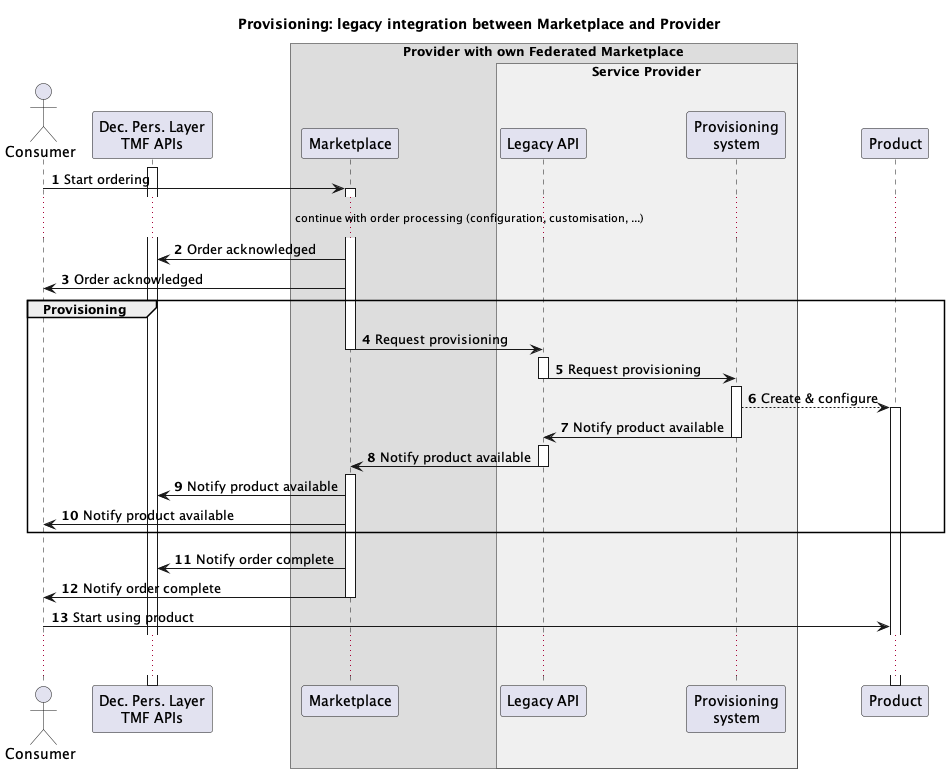

*Figure 5.11 - Provisioning: legacy integration between Marketplace and Provider*

Note: the ‘eCommerce’ scenario is also the case of those DOME providers that will be adopting the BAE with its plugin-based mechanism to expose their own offering in the Federation.

##### 5.4.3.1.2 Federated Marketplace and Provider linked through DOME 

In this scenario, the technical link between the Provider and the Federated Marketplace is based on the DOME technical specifications for the provisioning process. This setup brings clear advantages in terms of interoperability; the provider is only required to implement DOME APIs, gaining the potential to join directly any marketplace in the federation. Similarly, marketplaces grounding on stable and widely-accepted provisioning APIs will lower the barriers to providers wishing to enter into business with them.

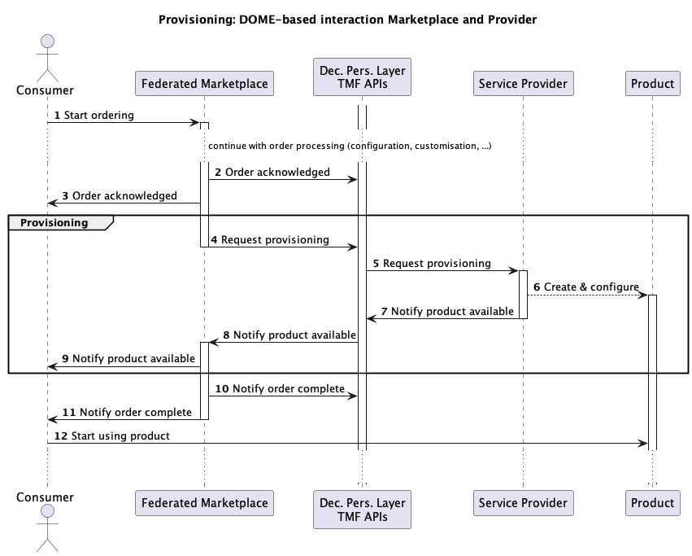

*Figure 5.12 - DOME-based interaction between marketplace and provider*

As in the previous section, the technical approach is theoretically applicable to both the ‘eCommerce’ and ‘Independent Marketplace’ scenarios.

Although this technical approach brings major benefits to the ‘Independent Marketplace’ scenario for what concerns interoperability and notarization in the DOME DPL, the ‘eCommerce’ setup can also take advantage of the adoption of standard interfaces to support diverse future scenarios.

A notable instance of this scenario is represented by the DOME Marketplace (actually one of the many Federated Marketplaces) who will allow Providers without any own/linked marketplace to publish their offering and manage orders, provisioning, tracking, etc. In order to be vendor-neutral, DOME shouldn’t support any legacy integration with providers (the case described in the previous section); instead, it should only onboard providers with DOME-compliant provisioning APIs.

##### 5.4.3.1.3 Different Selling and Providing Marketplaces 

In this scenario, the consumer finalised the order on a marketplace other than the one linked to a given product/provider. This might happen because federated marketplaces exploited DOME replication features to increase offering visibility in the federation. Depending on how the replication is configured, the consumer might. be able to discover and buy a product on the marketplace he’s more familiar with.

*Figure 5.13 - Provisioning: multiple marketplaces and legacy integration between marketplace and provider.*

It can be noticed that, apart from the interaction between the two marketplaces, the flow is the same described in the previous section.

There are a couple of variants to this scenario. It can happen that the provider exposes a DOME-compliant API for service/resource provisioning and such an endpoint is provided in the product specification, in place of that of the marketplace. In this case, the provisioning request will reach directly the Provider’s provisioning endpoint without any intermediation of the marketplace (this does not prevent the originating marketplace from being involved in other processes, i.e. ordering, revenue sharing, payment, etc. or receiving relevant notifications, i.e. step 9 in the diagram below).

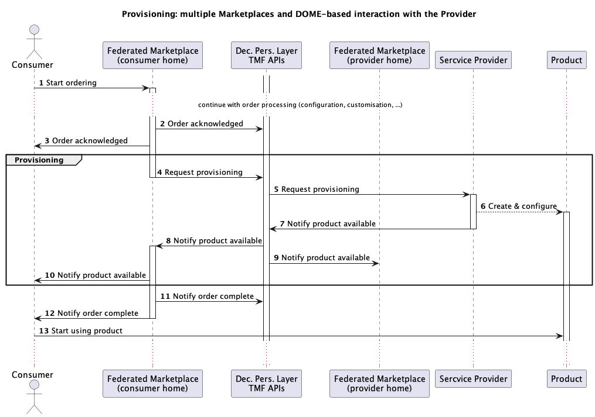

*Figure 5.14 - Multiple marketplaces and DOME-based interaction with the provider.*

Once the Provider is compliant with DOME specifications, the first scenario in this section can be revisited by introducing a DOME-aware interaction between the home marketplace and the provider.

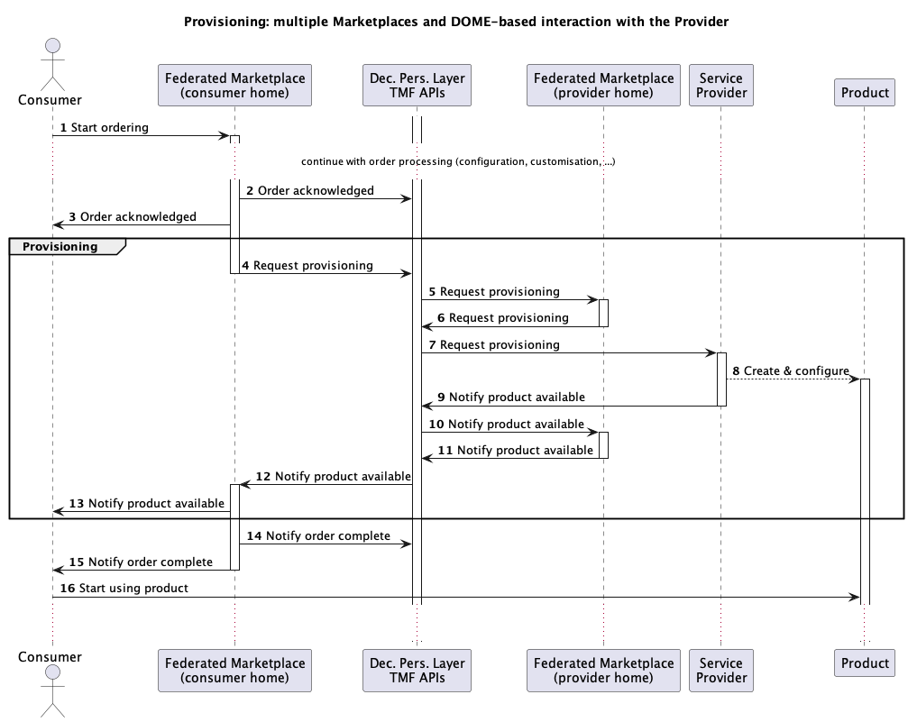

*Figure 5.15 - Multiple marketplaces and DOME-based interaction with the provider.*

#### 5.4.3.2 The Provisioning Subsystem of the DOME marketplace

To provide access to the different services and resources offered in a product offering, the DOME Marketplace will allow different mechanisms for service and resource provisioning depending on the scenario. This section covers the different options available and describes the inventory models used to store service and resource instance information in the decentralised persistence layer.

##### 5.4.3.2.1 The DOME-compliant Provisioning Subsystem

When using the DOME Marketplace or any of the federated Marketplaces not directly integrated with service provider legacy systems, placing orders will require the service provider to be notified so the provisioning process can be performed. That request will be sent through the decentralised persistent layer using the TM Forum APIs.

As can be seen in previous sections, after a new product order has been placed and acknowledged, the DOME Marketplace (or federated Marketplace) will request the different services involved to be provisioned. That request will be performed using the TM Forum Service Activation and Configuration API providing all the information required to instantiate the different services (and its attached resources) taken from the product order. The request made to such an API through the decentralised persistent layer will be taken as the notification required by the service providers to provision its services and resources.

##### 5.4.3.2.2 The Plugin-based Provisioning Subsystem

For those scenarios where service providers are willing to create their own federated Marketplace, the FIWARE BAE GE can be used as the basis of such a Marketplace. This software will be already integrated with the decentralised persistent layer through the TM Forum APIs and provides the means for integrating with legacy provisioning systems using its plugin features.

The BAE core software deals with such features that are common to any Marketplace scenario, including products and offerings management, ordering billing, etc. Nevertheless, there are multiple tasks that need to be performed during the lifecycle of a product offering that highly depends on the type of services that are being offered, including validation and provisioning. To deal with such tasks, the BAE provides a plugin-based system that allows to implement different handlers that are called during the product offering lifecycle of a specific type of service being offered. In particular, the following main handlers can be implemented:

- **On pre product spec creation**: Called by the BAE before the product specification is submitted to the TMForum Catalog API, so the specific information and permissions can be validated.

- **On post product spec creation**: Called by the BAE after the product specification has been created in the TMForum API.

- **On pre product offering creation**: Called by the BAE before a product offering is submitted to the TMForum Catalog API, so the pricing models can be validated

- **On post product offering creation**: Called by the BAE after the product offering has been created in the TMForum APIs

- **On product acquired**: Called by the BAE when a product offering has been acquired, so the service provider can provision the services

- **On product suspended**: Called by the BAE when a product must be suspended (contract termination, missing payment, and so on), so the service provider can deactivate the provisioned services.

From the point of view of DOME service providers with a legacy subsystem for service provisioning, the BAE plugin feature can be used for integrating DOME and their systems. To do that, the service providers can implement a plugin for their services, including a client for their legacy systems as part of the service provisioning handler of the plugin (on product acquired).

##### 5.4.3.2.3 The Product/Service/Resource Inventory Subsystem

As described in section 5.4.2 “Order Placement”, customers can place a product order intended to acquire one or more product offerings, selecting characteristics values and pricing models. The result of placing such an order would be the provisioning of the different services and resources that made up the acquired product. In order to manage the information of the different instances created during the provisioning process, the DOME Marketplace will rely on the TM Forum APIs. In particular, it will use the Product Inventory Management, the Service Inventory Management, and the Resource Inventory Management APIs.

During the provisioning, the service provider will need to allocate the resources that are needed for the operation of the acquired services (a virtual machine, a physical server, a network connection, and so on). Every time a new resource is deployed a new Resource entity will be created in the Resource Inventory Management API, including all the relevant information required for the operation (location, version, VM instance ID, disk size, etc). It is important to remark that it might not be required to create a new Resource in the Resource inventory every time a product offering is acquired. There might be scenarios where multiple customers use the same real resource, and thus the same Resource instance in the inventory.

Moreover, the service provider will need to instantiate the services that have been acquired when the order was placed so the customer can get access to them. The information of these service instances will be managed in DOME as Service entities within the TM Forum Service Inventory Management API. These Services can include any information relevant for the service instance as well as the reference of the Resources that it requires to operate. In the same way as resources, it is not mandatory to create a new service every time a product offering is acquired, as the same service instance can be shared by multiple customers.

Finally, when the different services and resources have been provisioned, the acquired products need to be procured to the customer. To handle such information, a Product entity is created in the Product Inventory Management API, as the last step of the provisioning process. This Product includes the references to the resources and services that made it up, as well as all the information that have been provided as part of the product order item, including the selected characteristics values, the selected pricing model, the payments that have been made, etc. Once the product has been created in the product inventory the product order can be considered completed.

### 5.4.4 Consumption and Usage Tracking

#### 5.4.4.1 Overview

Upon completion of the provisioning process, the consumer is enabled to start using the purchased product. The consumption process involves exclusively the consumer and the service provider(s); conversely the DOME platform will never take part in such a process, neither as a mediator nor as an observer.

For certain services published in the DOME ecosystem, providers may choose to embrace a transactional approach, relying on DOME facilities to support some marketplace processes. In the previous sections we've explored catalogue replication, ordering and provisioning, for which DOME can take some active role prior to service activation.

As we'll see in the following sections, DOME can also support relevant business processes at service consumption time, like billing, invoicing and payment. For such involvement to be effective and beneficial for providers, DOME must be made aware of some relevant usage information.

**Usage Tracking** is the process of collecting usage information, their processing, aggregation and structuring, and their publication to interested parties for the goal of applying the corresponding charges.

Tracking the usage of services by parties is mostly an activity under the control and responsibility of the service provider who puts in place all the needed probes to accurately track usage, and manages persistence facilities to record, aggregate and persist them for charging and audit purposes.

#### 5.4.4.2 Usage Tracking in DOME

Within the DOME ecosystem, whenever a third-party process (i.e. external to the provider) is required to exploit such usage data, it's still the service provider who retains control on what information is disclosed, its granularity, how often such disclosure is done and with which delay. Clearly, there should be enough usage data and detail to enable a proper implementation of the expected service.

From the point of view of the DOME Marketplace, usage data is managed through the TM Forum **Usage Management API** and stored as part of the DOME Persistent Layer. The Usage Management API provides standardised mechanisms for usage management such as creation, update, retrieval, import and export of a collection of usages. The API consists of:

- An information model introducing a **Usage** resource, defined as an occurrence of employing a Product, Service, or Resource for its intended purpose, which is of interest to the business and can have charges applied to it. A Usage consists of characteristics, which represent attributes of usage. The API also introduces a **Usage Specification**, which is composed of characteristics, defining all attributes known for a particular type of usage, for a given type of Product/Service/Resource

- A structure for **Notifications** about relevant events related to Usage and Usage Specifications

- A set of REST API **Operations** for the creation, retrieval, update, deletion of single Usage entities, as well as the retrieval and filtering of a collection of Usage entities.

Based on the above specifications, federated providers have the means to locally store usage data and advertise their availability to interested parties who can easily search, filter and retrieve data, according to their authorization level.

*Figure 5.16 - Usage tracking: general scenario.*

As we have already seen with Provisioning scenarios, the federated provider might not be compliant with DOME specification; rather, it relies on a legacy integration (in terms of APIs, formats, push/pull model, etc.) with its linked marketplace. In such a scenario, the party exposing the usage records to the DOME ecosystem is the Federated Marketplace acting as a broker for the Provider.

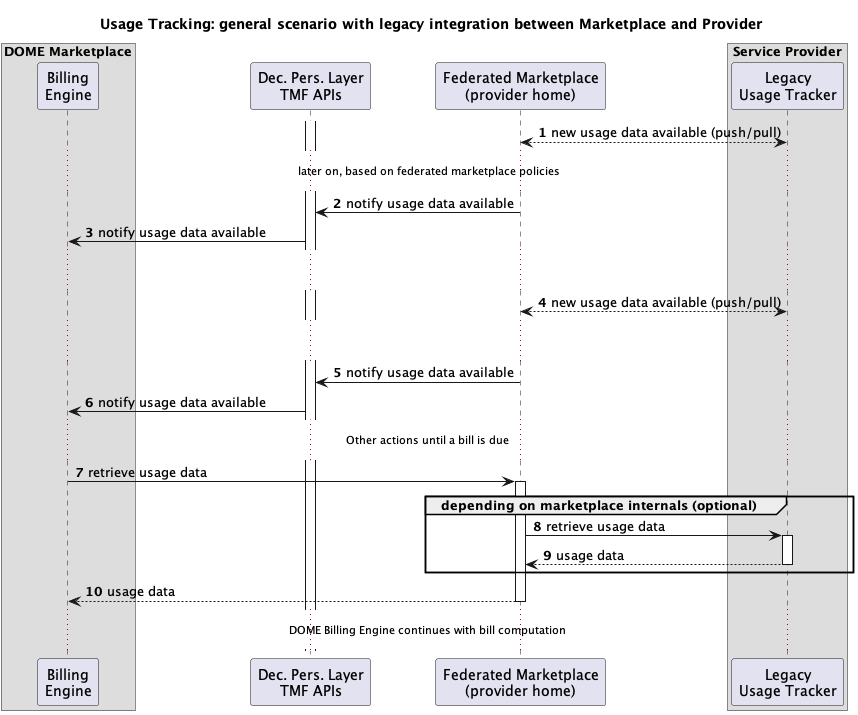

*Figure 5.17 - Usage tracking: general scenario with legacy integration between Marketplace and Provider.*

It is worth considering that, although DOME services (e.g. billing, invoicing, payment, monitoring and reporting, etc.) will be notable consumers of usage data, any marketplace willing to provide value added services can exploit the DOME technology and apply to acquire authorization and access to usage data.

### 5.4.5 Billing 

#### 5.4.5.1 Overview

Billing is the feature that deals with calculation of the amounts due by consumers for the purchased products. This calculation is based on pricing models that may include discount models and different charging modes (one-time payment, subscriptions, pay-per-use, etc.); depending on the pricing model (e.g. pay-per-use), information about product usage is also required for a correct bill calculation.

Within the DOME federated ecosystem, buyers have the opportunity to explore and purchase products from various marketplaces, each with its own unique pricing model, subscription plans, and billing mechanisms. This diversity adds layers of complexity to the billing process, requiring a robust approach and protocols to accurately calculate due amounts and present them to buyers. In addition, the federated nature of the DOME marketplace introduces additional complexities, such as cross-marketplace transactions, revenue-sharing agreements, and data privacy considerations. As a result, the processes involved in this system are different, and each of them has different levels of complexity to manage.

The purpose of this section is to provide an analysis of how to manage the billing process, as one of the cornerstone processes involved in the DOME federated ecosystem.

To better understand the nature of the billing process, it is useful to place it in the context of its related processes, namely: order placement, service provisioning, usage tracking and invoicing:

- Order Placement: it’s the trigger of the whole procurement process, which identifies the products and services sold, the marketplace providers, and a series of other useful information to feed the other related processes.

- Service Provisioning: after the completion of the order, the supplier proceeds with the supply of the product, starting the provisioning process.

- Usage Tracking: collecting, processing, aggregating and publishing enabling the application of the corresponding charges.

- Invoicing: takes into account the variables that make it possible to calculate the taxation to be applied.

Billing needs to take into account all previous processes to correctly calculate the total cost of products sold, net of taxes (e.g. the consumption of a service, its price, or the quantities sold). Also, billing and invoicing together help determine the total to be invoiced by representing two different items to be shown on the invoice.

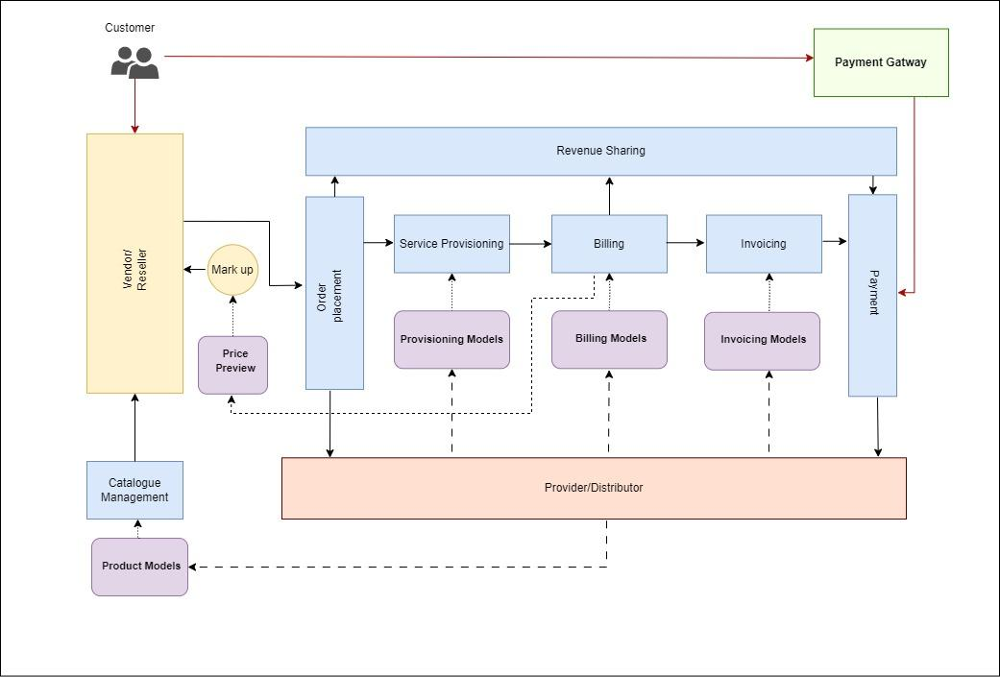

*Figure 5.18 - Billing and its related processes*

#### 5.4.5.2 Billing-related aspects of the DOME ecosystem

A distributed and multi-stakeholder environment like the DOME ecosystem leads to complex scenarios that need careful analysis. In particular, we can recognize the following aspects in the DOME ecosystem:

1.  Orders placed by customers might consist of different independent offerings, by different providers, originally exposed on different marketplaces.

2.  Billing and selling actors might differ: an offering might be purchased on a marketplace while the provisioning is done by a different marketplace/provider, which could also be in charge of the billing.

3.  Billing computation might be as simple as in the case of a flat rate, but can also be very complex and depend on many factors. In the latter case, describing the billing algorithm in a formal way to enable a third party to correctly compute a bill, might be neither easy nor desirable.

#### 5.4.5.3 Billing approaches in a federated scenario

In this section we first consider two alternative approaches to billing in a federated scenario like the DOME one. In particular, both the fully distributed and centralised approaches are analysed in terms of benefits and drawbacks.

Then, based on the limitations of both, we’ll introduce the approach chosen for billing management in the DOME federation, retaining the benefits delivered by the other approaches. This model delegates billing calculations to the source marketplace, supported by the implementation of an optional billing engine (managed by the DOME operator) and a "billing proxy" service.

##### 5.4.5.3.1 Decentralised billing 

A fully decentralised billing approach delegates bill calculations to the source marketplace, accommodating the billing requirements of the different marketplaces within the federation.

This approach makes it possible to have a flexible system capable of managing the multiplicity of cases that arise from the different pricing models, subscription plans, and billing mechanisms without having to implement a complex and therefore difficult-to-maintain centralised system.

In this scenario, the selling marketplace acts as a mere aggregator of bill(s) received by source marketplaces. In particular, whenever the computation of a bill is needed for a sold product, the selling marketplace queries the billing APIs of the involved source marketplace(s), composing them in a single bill for invoicing or preview purposes.

By leaving the computation responsibility to the source marketplace(s), this approach relieves the selling marketplace from understanding the pricing plans attached to each offerings and, consequently, from computing the corresponding costs. It’s obvious that it also doesn’t need to access and retrieve usage data to support pay-per-use scenarios.

In addition, by distributing the burden of calculating billing across different providers, you have a scalable system.

However, the exclusive adoption of the above decentralised approach implies that federated marketplaces already have and expose their own billing engine;this is not always true as it may happen that a marketplace has a public offering catalogue, but not a billing engine with external and secured APIs for external invocation. Such a requirement appears as a significant entry barrier for those small organisations (marketplaces and providers) that can’t easily afford integration of their services with federated ones.

##### 5.4.5.3.2 Centralised billing 

On the other end of the spectrum, a centralised billing scenario foresees the existence of a single entity in the whole DOME federation, providing billing capabilities for all transactions happening in the federation. Although computation can be adequately distributed and replicated to deliver scalability and fault tolerance, it is worth noticing that the delivery and management of the service is concentrated in a single actor (e.g. the DOME operator).

There are clear advantages with this approach: it is of utmost importance to establish a seamless channel for marketplaces without their billing engines to broadcast their billing models to the DOME operator. By allowing marketplaces to communicate their billing logic to the DOME operator, the federation ensures consistency and efficiency in billing processes. In addition, this approach promotes inclusivity within the federation, allowing market participants to leverage a centralised billing engine for streamlined operations. Additionally, having a centralised billing engine option improves scalability and flexibility, allowing marketplaces to adapt to ever-changing billing requirements. Ultimately, providing a centralised billing engine option allows marketplaces within the DOME federation to optimise billing operations while maintaining compatibility with broader ecosystem standards.

The centralised approach, however, also presents significant challenges: the need to efficiently stream and communicate different billing models and configurations between marketplaces and the centralised billing engine within the federated marketplace ecosystem is a significant technical challenge. Each marketplace can have its own unique billing logic, which includes various fees, discounts, and pricing rules, which must be accurately transferred to the centralised billing engine for processing.

One of the key considerations in addressing this challenge is the adoption of a standardised format for the representation of billing data. Without a common format, interoperability issues can arise, hindering seamless communication and integration between different system components. In addition, the chosen format must be able to encapsulate complex data structures while remaining lightweight and efficient for network transmission.

Implementing and maintaining such a system would involve considerable complexity and operational overhead. A centralised approach would require meeting the different billing requirements of each marketplace within the federation, requiring extensive development efforts and ongoing maintenance. The "one-size-fits-all approach", which is inherent in a centralised billing engine, may not adequately meet the unique billing requirements, regulatory compliance needs and preferences of individual marketplaces.

##### 5.4.5.3.3 Decentralised billing with a default billing engine

Considering the technical challenges as well as adoption drawbacks of both approaches described above, DOME will adopt a hybrid approach lowering the entry barriers for small organisations while at the same time ensuring enough flexibility to cover specific billing requirements.

In particular, a decentralised billing approach, complemented by a DOME-managed billing option emerged as the preferred strategy. This approach strikes a balance between scalability, flexibility, and standardisation, aligning closely with the dynamic and diverse nature of modern market environments within the federation.

As introduced earlier, every offering in DOME contains its corresponding pricing plan and must be associated with a billing engine (either directly at offering level, or by belonging to a whole catalogue, or by appearing in a given marketplace). The peculiarity of this hybrid approach resides in the fact that such a billing engine doesn’t need to be the DOME-operated one, nor must it be the one owned (if any) by the marketplace operator. It is up to the federated marketplace/provider to decide, based on the criteria we considered earlier (i.e. availability of a custom service, complexity of its integration, complexity of the pricing plan).

Certainly, this approach resembles the fully decentralised one where the selling marketplace is requested to collect and aggregate bill(s) from the source billing engine(s). To make such a task easier for federated marketplaces (including the DOME one), a dispatching and aggregating component has been introduced in the architecture of the billing subsystem.

A billing proxy will act as a dispatcher, orchestrating billing requests to one or more marketplaces, especially when a cart consists of products from multiple vendors. This decentralised approach alleviates the challenge of adapting billing engines to a myriad of scenarios arising from products offered by different vendors.

The advantages of the chosen solution are summarised here:

- Scalability and flexibility: by leveraging a distributed billing approach, DOME federation can scale seamlessly as multiple providers join, without burdening a central billing system. Each marketplace maintains autonomy over its own billing processes, improving flexibility and adaptability.

- Personalization and localization: marketplaces have the freedom to tailor their billing engines to their specific needs, ensuring localization and personalization based on their unique offerings and pricing models.

- Reduced complexity: using a billing proxy simplifies the billing process by abstracting complex interactions between marketplaces. Simplify billing calculations while maintaining transparency and accuracy. The option for centralised billing for standardised scenarios promotes consistency and ease across the federation.

#### 5.4.5.4 The autonomy of the Provider with respect to the functional choice

The choice to adopt one model rather than another is left to the provider who, during the registration phase to the federation, will be able to indicate, in addition to all the other necessary information, also the billing engine that must be used for the calculation of the bill for the products and services provided.

The indication of the billing engine chosen by the individual marketplace will be valid for all products and services belonging to its catalogue unless a different billing engine is indicated for each product.

In fact, taking into account the high rate of diversification of pricing models for products and services that may exist, not only within the federation but also within a catalogue of a single provider, it was decided to leave it to marketplaces to choose the billing engine at both catalogue and individual product level.

For example, a provider that has chosen to adopt a centralised model for its catalogue (i.e. use the DOME-operated billing engine) may need to implement more complex calculation algorithms that are difficult to standardise for a specific product. To manage cases of this type, when uploading an offer, the marketplace is left the possibility to indicate the billing engine to be invoked for that specific product offering.

This information, stored along with the product offering, will be queried by the Billing Proxy in order to identify the billing engine to which to forward the calculation request.

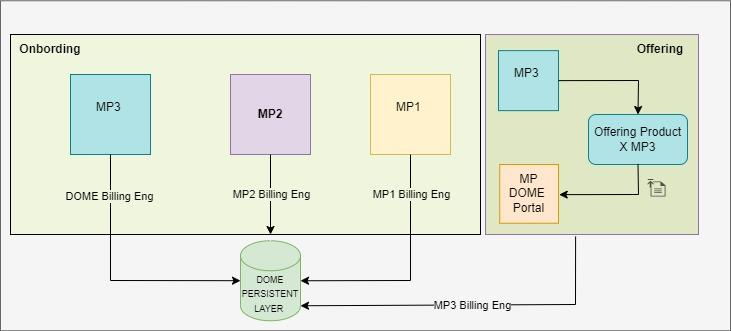

*Figure 5.19 - The selection of the authoritative billing engine*

#### 5.4.5.5 The Billing Proxy

Adopting a billing proxy is a strategic response to the multiple challenges inherent in managing billing operations in different markets.

Basically, the billing proxy acts as a centralised intermediary in charge of orchestrating billing processes, facilitating seamless communication, and ensuring consistency in billing practices. By consolidating billing coordination through a dedicated proxy, we aim to improve transparency, accuracy, and accountability in revenue distribution across participating marketplaces.

This centralised approach not only streamlines the revenue-sharing process but also minimises the potential for discrepancies and disputes, thereby fostering trust and collaboration within the federation. In addition, the billing proxy plays a critical role in elevating DOME to a central and trusted entity within the federation for subsequent services such as invoices and payments.

The billing proxy functions as a centralised entity within the federation architecture. Its primary function is to orchestrate billing calculations for transactions involving products from different marketplaces. When a buyer initiates a purchase involving products from multiple marketplaces, the billing proxy comes into play.

Hereafter, a typical workflow of the billing proxy is presented:

1.  **Identification**: the billing proxy identifies the marketplaces involved (MP1, MP2, etc.) and determines which billing engines are responsible for calculating the bills for their respective products.

2.  **Coordination**: the billing proxy communicates with the billing engines of the relevant marketplaces (e.g. MP2 and MP3) and asks them to calculate bills for products sold by each marketplace.

> Upon receipt of the request, the relevant billing engines perform billing calculation using standardised methods and algorithms. It then generates a response that contains the calculated billing amount or invoice details.

3.  **Aggregation**: once the billing proxy receives calculated bills from the respective billing engines, it aggregates the individual bills in a complete manner and format.

4.  **Presentation**: The result can be presented to the user through the marketplace interface or integrated with other billing-related processes. The bill includes the total amount due along with a breakdown of charges from each marketplace involved in the transaction.

We can observe that the above actions might be required at different stages of the procurement process, depending on the billing plan selected. For example, in a one-off, pre-paid scenario, the above process is triggered by cart submission and before payment (see figure below); in a recurrent pay-per-use scenario, the process is triggered automatically at the end of the billing period.

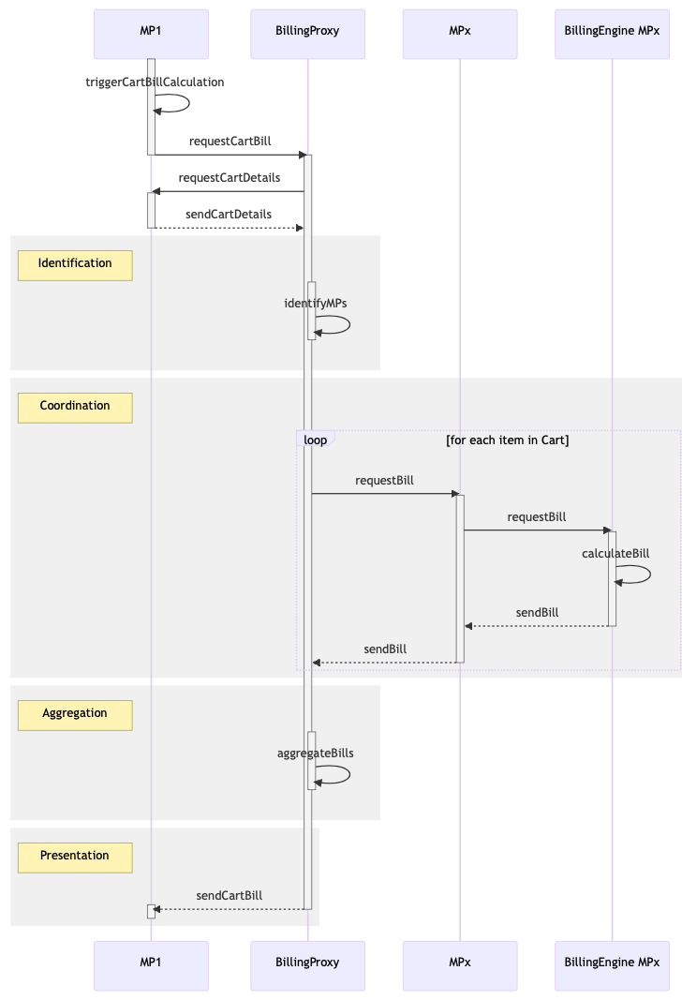

*Figure 5.20 - Billing Proxy operation in a one-off, pre-paid procurement*

##### 5.4.5.5.1 Sample scenario: pre-paid, single order including products from different marketplaces

We present here a sample billing scenario where:

1.  Three federated marketplaces (MP1, MP2, and MPDOME) have chosen to use their own billing engine, with a connector exposing data to the DOME proxy;

2.  A further marketplace (MP3) chose to rely on the default DOME Billing Engine;

3.  The customer initiates the procurement on the marketplace MP4;

4.  Products/services from the 4 different marketplaces (MP1, MP2, MP3, MPDOME) are added in a single cart (and thus in a single order).

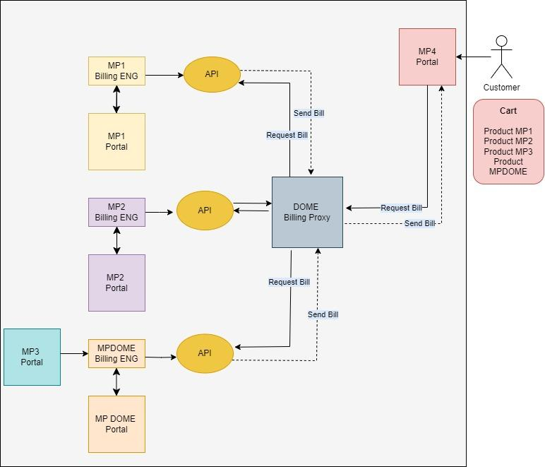

*Figure 5.21 - Communication scheme involving the Billing Proxy*

In this situation, the flow is as follows:

1.  MP4 makes a request to the Billing Proxy by providing a reference to the order including product/service references and any other attributes with the aim of obtaining the information useful for the calculation of the amount to pay.

2.  The Billing Proxy identifies the relevant Billing Engines by evaluating sequentially 1) information available at the product or service level, 2) any reference to a billing engine at catalogue level and 3) marketplace-level billing engine specified at onboarding time.

3.  Once the relevant Billing Engine(s) has been identified, the Proxy sends the calculation request.

4.  Billing Engine(s) apply the calculation algorithms, request any additional usage information, if needed for the calculation purposes, process the bill and return the results to the Proxy.

5.  The Billing Proxy aggregates responses and forwards the response to the selling marketplace (MP4).

#### 5.4.5.6 Pricing models supported by the DOME Default Billing Engine

Pricing models play a critical role in determining the cost structure and revenue generation within the DOME federated marketplace ecosystem. These templates define the rules and methodologies for calculating pricing based on various factors such as product features, usage metrics, and customer segments.

Another important role in costing is played by billing models, common ones include one-time purchases, recurring subscriptions, and usage-based billing. One-time purchases involve a one-time payment for unlimited access to a product or service, while recurring subscriptions involve regular payments at fixed intervals for continuous access. Usage-based billing charges customers based on actual service usage, such as data transfer or storage.

As part of its default billing capabilities and supported pricing schemes, the DOME default billing engine will support at least the following concepts, covering a large quota of real-life scenarios:

**Periodicity of billing**

- One-time purchase (lifetime): customers make a one-time procurement for unlimited access to a service or product for life.

- Recurring subscription: customers are billed with a fee at regular intervals (e.g., monthly or annually) for continued access to a service.

- Customisable billing period: providers will be able to set the span of the billing period (e.g. one month, etc.) as well as its start (e.g. date of start of provisioning, day of month, etc.).

**Basis for computation**

- Fixed price: customers are billed with a fixed cost for the whole offering or for some of its components;

- Pay-as-you-go: customers are billed based on actual usage of the service, such as data storage or data transfer;

**Time of billing**

- Pre-paid: the amount due for the product/service is billed at the beginning of the billing period. This usually applies to fixed-price plans.

- Post-paid: the amount due is billed at the end of the billing period. This is usually the only applicable approach in pay-per-use scenarios.

**Combinations** of the above elements can be realistically expected for the same product offering as well as within a single pricing plan:

- A single product can be offered with different pricing plans; for example through a fixed monthly price or with a pay-per-use plan. Within an order, a customer will only select one of them, depending on its own choice.

- An individual price plan can include both fixed and variable elements; it can include a fixed activation or monthly fee plus a variable component linked to the consumption of certain resources.

Support for **more complex pricing schemas** will be evaluated according to actual needs and feedback by stakeholders. Among others, the following will be considered:

- Tiered pricing: prices are associated to levels (typically between three and five) that can be, in turn, characterised by available features, by allowed consumption ranges or by enabled users. The amount of the bill will be given by the price of the level actually purchased or the level corresponding to the actual usage.

- Promotions and discounts: providers can decide to implement a series of tools that encourage the consumption of products and services, aiming not only at individual but continuous purchases. Tiered discounts, volume discounts and fixed discounts are price modifiers aiming at the above business goals.

#### 5.4.5.7 Price Preview

The introduction of a "price preview" feature is a proactive approach to improving the user experience within the DOME procurement journey. This feature allows buyers to preview the total cost of their purchase before proceeding to the actual ordering process, thus reducing uncertainty and potential disputes. The price preview feature provides users with an estimated breakdown of costs based on the products and pricing models they select.

The availability of this feature not only allows for improvement of the user experience but represents an added value from an information point of view both for the customer and for the vendor: the customer can have a forecast of what the amount of the invoice will be, while the vendor, in addition to having a plus from a strictly reputational point of view, will be able to provide a better service to its users.

Price preview delivers essentially the same function as calculating a bill; however, its key distinction lies in its ability to conduct simulations based on user-entered data and the generation of volatile bills - i.e. not actually persisted anywhere. For example, users can manually enter estimates of expected bandwidth usage or data consumption, allowing the price preview to generate accurate cost projections. This interactive feature allows buyers to customise their purchasing decisions by adjusting input parameters and observing corresponding changes in the estimated total cost. By facilitating such simulations, price preview allows users to make informed choices and anticipate their financial commitments with greater clarity and accuracy.

In practical terms, generating a price preview is pretty much similar to generating a consolidated bill, with the following considerations:

- In case of a pay-per-use scenario, usage data needs to be synthetically generated or provided by the customer. Whenever this is not possible, nor practical, the customer can be provided with a preview including only fixed components of the whole bill, reducing however the value of the preview feature.

- Reasonably, billing engine(s) possess all the required capabilities to generate a price preview. However, when it comes to legacy billing engines already in use within marketplaces, the availability of a ‘preview mode’ can’t be safely assumed. DOME should take this into consideration.

The first point above (forecast of usage data) is not being considered in this version of billing engine design, thus limiting the preview to fixed and known elements of the pricing plan.

##### 5.4.5.7.1 The price preview workflow

The computation of a price preview will follow exactly the same workflow, and is supported by the same architectural components that have been introduced for the billing process.

As with regular billing, a preview engine can be specified at offering, catalogue or marketplace levels. A DOME-operated preview engine will be made available to foster seamless onboarding of marketplaces. Similarly a preview proxy component will be in charge of orchestrate, aggregate and present price previews.

Price preview engines can be exposed as specific services with their own endpoints, as well as regular billing engines invoked in ‘preview mode’. The choice for this is left to the federated marketplace owners.

However, to maximise consistency between preview and consolidated bills, DOME mandates that the two processes, when supported, are carried out under the responsibility of the same organisation. This shouldn’t be intended at technical level (e.g. same service or API or endpoint); rather, the federated provider/marketplace is itself responsible for indicating the authoritative service for both billing and preview. Whenever one of the two is not provided, DOME won’t make the corresponding feature available.

Although very similar to the billing scenario, the remainder of this section details the preview workflow in more detail.

- As a very first step, during the onboarding, the marketplace operator can indicate whether or not it has a price preview system. This information will be stored on the DOME systems queried by the preview proxy. Additionally, specific preview endpoints can be set at catalogue or offering level.

- Whenever a preview is required, based on the standard billing scenario, the preview proxy first checks whether the source marketplace can perform the price preview calculation. If the marketplace has this feature, the preview proxy forwards the request to the marketplace's preview engine, along with the necessary offering and pricing information.

- After receiving the request from the proxy, the marketplace preview engine calculates the price preview using internal logic and data. It takes into account factors such as product prices, discounts to generate an accurate preview of the total cost. Once the calculation is complete, the marketplace preview engine returns the price preview information to the pricing proxy. If, however, the source marketplace does not support price preview calculations, no preview will be provided to the customer even in the case of trivial pricing plans.

- As with the billing scenario, the federated marketplace can select the DOME-operated preview engine as authoritative for its offerings/catalogue.

- In both scenarios, regardless of whether the calculation is performed by the marketplace preview engine or the centralised price preview service, the preview proxy aggregates the results and presents the final price preview to the buyer. This includes a detailed breakdown of the costs of each marketplace involved in the transaction, providing the buyer with transparency and clarity before proceeding with the purchase.

#### 5.4.5.7 Issuing Periodic Bills

The Billing Scheduler is an architectural component responsible for orchestrating the periodic issuance of bills for products purchased through the DOME federated marketplaces. Its primary role is to ensure that recurring charges associated with active products are identified at the appropriate time, processed by the billing subsystem components for invoice generation, and consistently recorded within the DOME Persistent Layer.

The Billing Scheduler will operate as a time-driven component, executing on a configurable recurring basis (e.g., daily). At each execution, it will perform the following high-level activities:

1.  Identifies all active products currently provisioned in the DOME ecosystem;

2.  Determines the relevant billing period(s) for each product;

3.  Triggers the billing services to generate the bills falling within the identified billing period(s);

4.  Ensures the persistence and consistency of the generated bills within the DOME Persistence Layer.

The Billing Scheduler will determine the applicable billing cycle according to the commercial configuration of the product:

- When a bill cycle specification is explicitly associated with the product offering, the Billing Scheduler will derive the billing period(s) according to the specification (i.e., **bill cycle defined at offering level**);

- When no explicit billing cycle specification is defined at offering level, the Billing Scheduler derives the applicable billing periods by analyzing the pricing components of the products (i.e., **bill cycle derived from pricing configuration**).

This approach allows the DOME ecosystem to support both standardized billing models defined at offering level and more flexible, price-driven billing configurations.

The Billing Scheduler will not perform billing calculations itself. Once identified the relevant billing period(s), it acts as an orchestration layer, delegating the actual bill generation to the billing subsystem components (i.e., Billing Proxy, Billing Engine, Invoice Engine). In particular, for each billing period in scope, the Billing Scheduler will interact with the Billing Proxy to trigger the billing processes and generate the recurring bills falling in the identified billing periods. After the bills are generated, the Billing Scheduler is responsible for persisting the resulting billing records in the DOME persistence layer.  
As part of this process, it will perform consistency and duplication checks to ensure that bills are not recorded more than once. In particular, it will verify whether a bill with equivalent business characteristics (e.g., reference billing period, amount to be charged, involved parties) has already been stored. Only bills that are determined to be new and not previously recorded are persisted. Within the overall architecture, this design supports periodic billing while allowing the billing calculation logic and persistence concerns to remain clearly separated across components.

#### Moreover, the Billing Scheduler will ensure reliable periodic billing by covering both current and past billing cycles within a configurable time window. This backward coverage will enable the identification and generation of missing bills for previous periods (due to some operational failures) while preventing duplication of already persisted billing records. Based on configurable parameters, the scheduler identifies all billing cycles that fall within a defined retrospective period (e.g., up to X previous months). This backward coverage ensures that billing periods that should have been processed in the past are still taken into account. The bills generated for past periods are persisted only if they are not already present, ensuring that previously processed billing records are not duplicated. This mechanism will guarantee the completeness of periodic billing across time and automatically recover from previously missed or partially processed bills.5.4.5.8 Conclusions

The DOME hybrid approach to billing, which combines a decentralised approach with default billing capabilities, along with the introduction of billing proxy and pricing preview capabilities, represents a strategic solution to the complex challenges of managing billing operations within the DOME federation. By enabling marketplaces to use their own billing engines while offering a default option for standard billing scenarios, we ensure flexibility, scalability, and consistency across the ecosystem. The billing proxy serves as a critical component, orchestrating billing calculations and ensuring seamless coordination between marketplaces and the centralised billing engine. Additionally, the introduction of the price preview feature improves the user experience by providing upfront cost estimates and facilitating informed purchasing decisions.

### 5.4.6 Revenue Sharing

The realization of a Revenue Sharing feature is one of the key steps in enabling a fully transactional and sustainable marketplace model in DOME. It allows the DOME Operator to define subscription plans and revenue sharing percentages for both Providers and Commercial Federated Marketplaces. **Each provider joining the federation must subscribe to a predefined plan (e.g., Basic or Advanced), which includes fixed annual fees and variable percentages based on the volume of sales. Commercial Federated Marketplaces will also be subject to revenue share rules with custom fees.**

**The Revenue Sharing Engine, acting as the core of this system, is responsible for calculating, aggregating, and issuing revenue statements**. The overall approach is designed to minimize manual configurations, enabling the Revenue Sharing Engine to operate autonomously once the logic has been defined in subscription plans and configuration files. Different billing cycles (e.g., monthly, quarterly, annually) are supported, as well as mechanisms for applying discounts and referral incentives. The specifications described below serve as the foundation for implementing the Revenue Sharing functionality. Additional refinements may be introduced over time to address business or technical needs.

#### 5.4.6.1 Functional Overview

##### 5.4.6.1.1 Revenue Sharing Model and Business Approach

The Revenue Sharing model of the DOME Marketplace refers to the mechanism through which Providers and Commercial Federated Marketplaces contribute a portion of their earnings (in the form of fixed or variable fees) to the DOME Operator, in exchange for Visibility, Infrastructures, Marketing Promotion, Training, and advanced Reporting & Analytics services. From a business and architectural point of view, the Revenue Sharing model establishes the rules and conditions under which these contributions must be calculated. It defines the commercial structure (e.g., Basic or Advanced plans), the use of tiered commissions, thresholds, incentives, or specific business policies.

The operational logic required to execute these rules is realized by the Revenue Sharing Engine, a component responsible for performing all revenue computations. Calculation parameters such as revenue-share percentages, thresholds, or incentive values, are defined by the DOME Operator and set in the system via configuration mechanisms. This approach ensures flexibility and allows the business logic to evolve without requiring code-level changes. Participation in the DOME Marketplace requires Providers and Commercial Federated Marketplaces to purchase one of the available subscription plans. Each subscription plan is linked to a Price Plan that describes the applicable revenue rules. After subscription, the plan appears in the participant’s inventory as a standard product entry and becomes subject to the billing policies defined for that plan. Corresponding fees are invoiced directly by the DOME Operator, with pre-invoices structured according to EU PEPPOL standards to ensure compliance with European e-procurement requirements.

Furthermore, to ensure consistent implementation, the Revenue Sharing Model is fully integrated with existing DOME (BAE) marketplace capabilities. The solution leverages core reusable components like Offering, Ordering, Provisioning, Billing, Invoicing, and Payment, minimising custom developments and ensuring architectural coherence across the platform.

Hereunder are reported examples of how subscription plans appear on the marketplace:

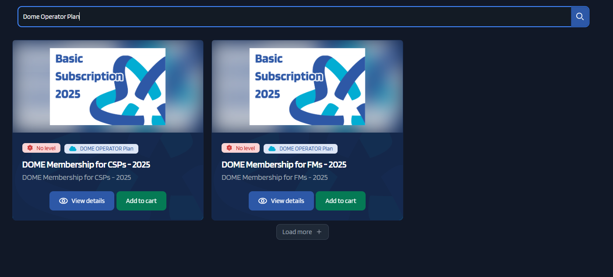

*Figure 5.22 - Revenue Sharing Subscription Plans example*

##### 5.4.6.1.2 Roles and Subscription Plans

Before detailing the mechanisms for collecting revenue within the DOME ecosystem, **it is important to clarify the distinction between the two key actors involved in the revenue model, Providers and Commercial Federated Marketplaces (FMs).**

**A Provider is any entity that offers and sells its own products or services on the DOME ecosystem.** Providers may publish directly on the DOME operated marketplace (BAE) or through their own marketplace, as long as they maintain a direct business relationship with the DOME Operator. In both cases, the provider is considered the source of the offering and is directly accountable for the associated revenue-sharing obligations.

**By contrast, Commercial Federated Marketplaces refer to third-party marketplaces that act as resellers.** These marketplaces do not publish their own offerings, but rather expose and sell offerings created by other providers. In such scenarios, the federated marketplace (the reseller) receives revenues directly from the providers behind the offerings. As a result, the DOME Operator establishes a business relationship only with the reseller, and not with the providers behind him. This approach prevents duplicate fee charges, ensuring that revenue sharing occurs only once between the DOME Operator and the reseller, while preserving existing commercial agreements between resellers and their network of providers.

This distinction is fundamental in defining how revenue shares will be collected and from whom. The following sections describe the logic for collecting subscription-based and transaction-based revenue in line with this model.

**Provider Fees**

The DOME marketplace pricing for cloud providers is based on two main components (see pictures below for further details):

● **A Fixed Annual Listing Fee** (billed after the end of the 3-month trial period)

● **A Revenue Sharing Fee** (applicable from 1st January 2026)

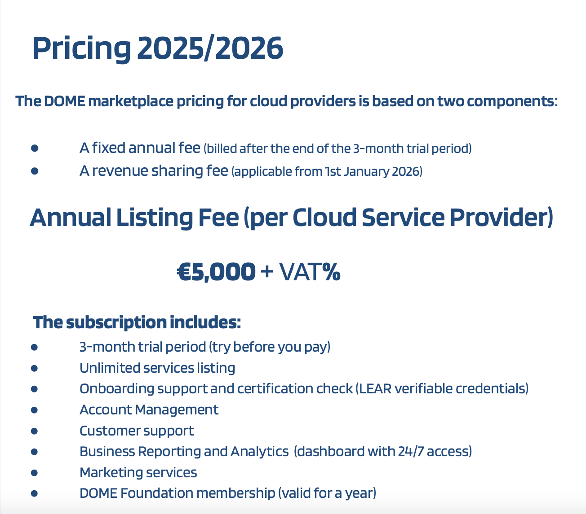

*Figure 5.23 - Fixed Annual Listing Fee*

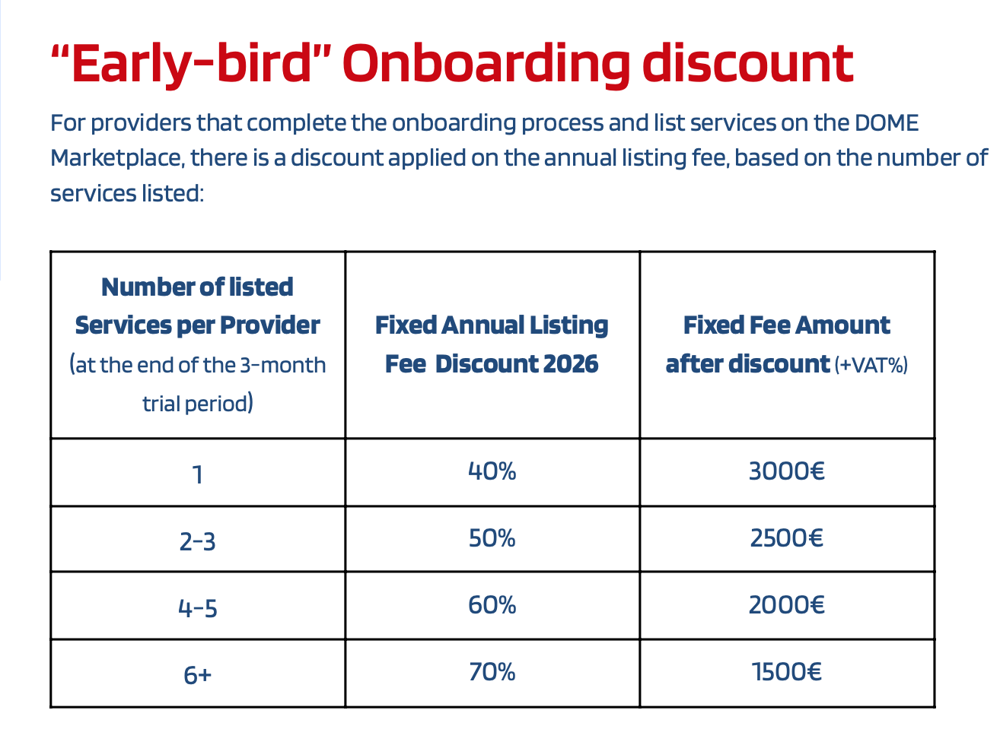

*Figure 5.24 - Onboarding Discounts*

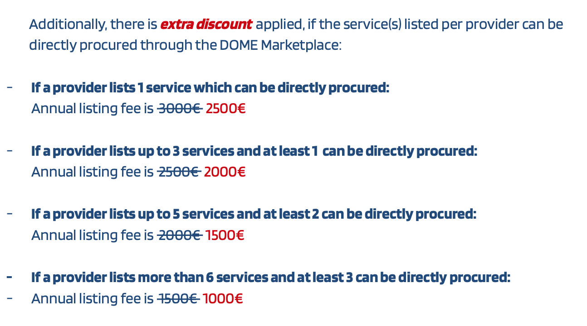

*Figure 5.25 - Additional Discounts*

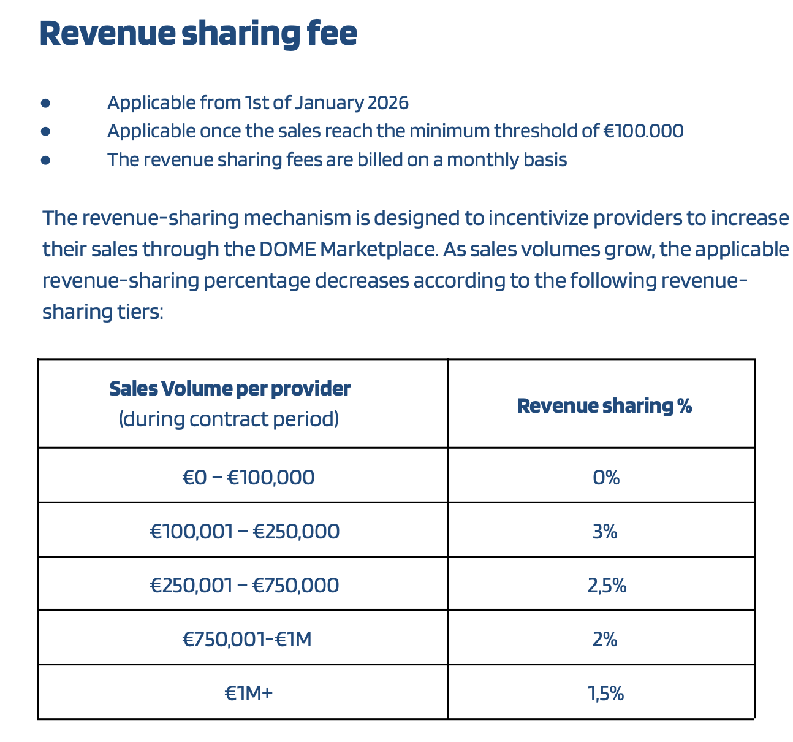

*Figure 5.26 - Revenue Fees*

**Commercial Federated Marketplaces Fees**

For Federated Marketplaces (FMs), the DOME Revenue Sharing model is intentionally designed to be simple; unlike Providers, **FMs are not subject to any fixed annual listing fee, nor variable commission tiers based on sales volume**. Instead, **DOME applies only a fixed revenue-share percentage**, typically around 50% of the FM’s resale commission, with the exact value defined through bilateral commercial agreements. This percentage is configurable within the dedicated Price Plans and can be adapted according to strategic partnerships or specific market conditions.

A key principle of this model is that DOME applies revenue sharing only once, between the FM and DOME Operator, avoiding any fee on transactions Sellers (name them Sub-Sellers) behind the FM and Buyers in the DOME ecosystem. Internal financial flows between CSPs, Sub-Sellers, and the FM are ignored by DOME, as they remain part of the FM’s commercial ecosystem.

The operational flow works as follows:

- Transactions occur between Sub-Seller (SS) and buyers through the DOME ecosystem;

- The Federated Marketplace collects revenue from its Sub-Sellers based on the resale of offerings;

- DOME monitors only the FM’s aggregated revenue related to its resale activity, without considering SS-level transactions;

- DOME applies a revenue sharing rule (e.g., 50%), as defined in the commercial agreement and configured within the Price Plan.

- DOME bills the Federated Marketplace, generating invoices according to the defined billing cycle.

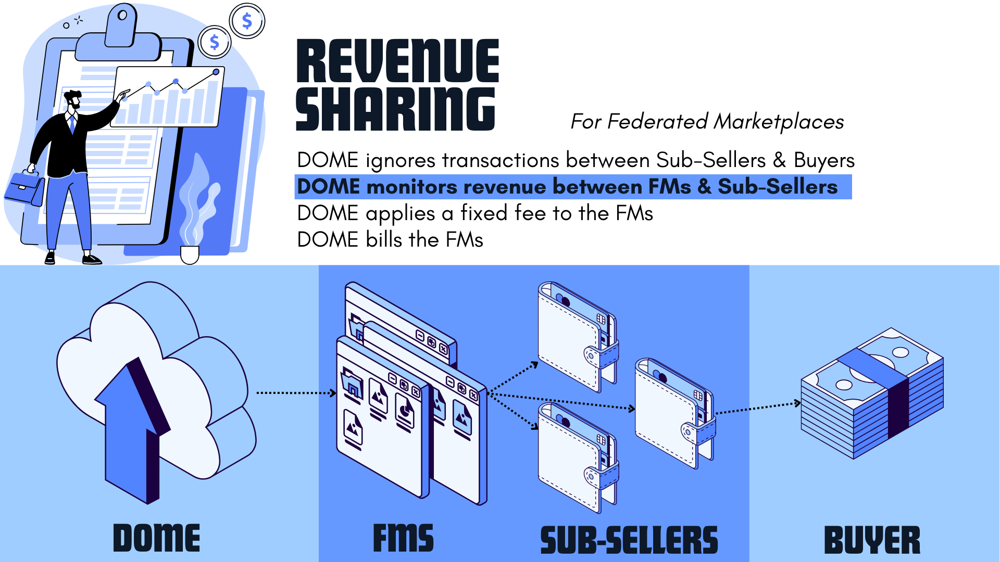

*Figure 5.27 - FMs Revenue Model*

This approach ensures full transparency, prevents double-charging across multiple seller layers, and most importantly, encourages Federated Marketplaces to adopt and promote the DOME ecosystem by avoiding complex variable fees and offering a stable, predictable revenue-sharing framework.

Further details about the DOME Revenue Sharing Policies, their business aspects and rationales can be found in project deliverable “D5.5 - DOME Business Model”

#### 5.4.6.2 System Components Architecture

##### 5.4.6.2.1 Backend Services

The Revenue Sharing Engine is the core of the Revenue Sharing component, and it is realized as an independent service exposing a single API used by the frontend dashboard. To compute revenue and generate billing information, the service integrates with several standard TM Forum APIs, including:

- **TMF632 – Organization**

- **TMF620 – Product Offering**

- **TMF637 – Product Inventory**

- **TMF678 – Customer Bill Management**

Through these APIs, the engine retrieves all the products, subscriptions, and billing data needed to apply the Revenue Sharing business logic.

The backend applies periodic calculations for each plan, managing different types of fees (initial fees, recurring fees, post-paid components) and handling all the scenarios defined in the DOME Revenue Sharing model.

**The Revenue Sharing datamodel**

The Revenue Sharing feature in DOME builds on top of two major concepts: Subscription Plan and Subscription. The first is the actual offering of the DOME Marketplace to its customers, detailing the services offered, its pricing, contractual conditions, etc. as described earlier in this section; the latter is a running commercial relationship between the DOME Foundation and Provider who becomes enabled to transact in the DOME ecosystem, according to the subscribed plan.

The DOME platform relies on the TMForum APIs and Datamodel for most of its business entities (e.g. catalogues, offerings, orders, invoices). In order to exploit existing DOME technology and services, the Revenue Sharing subsystem starts from the TMF concepts of Product Offering, Price and Specifications (TMF620) and Product (TMF637)

While most of the mentioned TMF concepts perfectly fit the Revenue Sharing model, the TMF ProductOfferingPrice (TMF620) does not appear expressive enough to describe the complex and articulate rules of the DOME Revenue Sharing policies. For this reason, even if still adopting the ProductOfferingPrice to model a plan, it actually acts as an entry point to an external (non TMF) plan descriptor.

Each plan is defined by a dedicated JSON file stored in an external repository (e.g., GitHub). This descriptor contains:

- **descriptive properties:** including a name and a description for the plan (e.g. to appear in invoices issued to subscribers), a time window within which the subscription plan can be purchased and a status for the plan (e.g. draft, launched, retired)

- **subscription duration:** specifying the duration of a single subscription.

- **billing cycle specification**: to set the frequency and start/end rules of the revenue sharing invoices, as well as expected payment deadlines.

- **pricing**: expressed in terms of a nested combination of prices and discounts, each one with its own conditions for applicability, charge periods, amounts and percentages.

This JSON descriptor is designed to be flexible, allowing quick adjustments to market needs and easy configuration of new revenue models (see picture below):

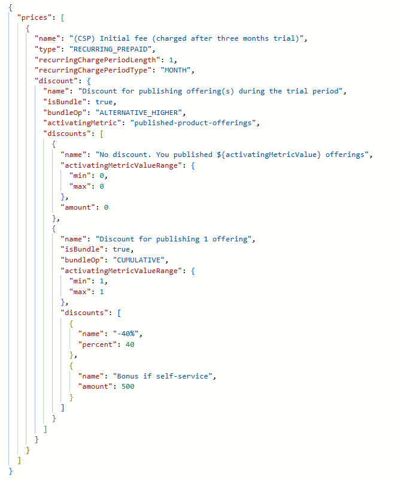 

*Figure 5.28 - JSON configuration file example*

**The Revenue Sharing computation workflow**

The overall goal of the Revenue Sharing subsystem is to ensure that all and only expected revenue sharing invoices are generated correctly and made available to relevant stakeholders (e.g. the DOME Operator, Providers and Commercial Federated Marketplaces) for further processing (e.g. invoice registration, payment, etc.).

The adopted approach is to periodically compare the expected status of revenue sharing invoices with the actual set of generated ones, applying the required actions to fill any gap.

The expected state is built by computing, for each subscribed Provider/FM and for a given period of time, the set of invoices according to the plan descriptions. On the other hand, the actual state is built by retrieving, for the same subscribers and period, the set of invoices from the DOME persistence layer. Whenever a gap is identified, the corresponding invoices are persisted.

This approach ensures robustness and resilience as it naturally recovers from missing invoice issuances caused by system downtimes.

The rest of this section provides details on the revenue share computation workflow for a given subscriber:

1.  Subscription identification

    1.  The service retrieves active Subscriptions, by querying the TMF layer for Products activated by the DOME Marketplace Operator, modelling a Subscription.

2.  Plan Identification

    1.  Following relationships among TMF entities, the corresponding subscription plan is identified (it maps to a combination of ProductOffering and ProductOfferingPrice)

    2.  The corresponding Plan JSON (containing prices and rules) is also retrieved and parsed

3.  Collection of provider’s transactions

    1.  Depending on the rules activated in the plan, a number of metrics need to be calculated. The corresponding data (e.g. transactions number and volume) is retrieved from the persistence layer.

    2.  The corresponding period is also driven by periodicity and conditions established in the plan.

4.  Compute prices and discounts

    1.  On the basis of collected data and rules described in the plan, prices and discounts are computed by following only price/discount timing, producing an intermediate internal representation (named Revenue Statement)

    2.  Then, Billing Cycle specifications are taken into account and Revenue Statements are clustered into Bills according to their charge date.

5.  Tax application

    1.  The DOME Invoicing services are used to apply taxes, as needed, to the generated Bills.

    2.  As a result, the Revenue Sharing engine now holds a proper and complete Bill.

6.  Persistence

    1.  The service verifies that the bill is not already present in the DOME persistence layer. It does so by looking at a number of relevant bill attributes (e.g. buyer, seller, date, subscription id, amounts, etc.)

    2.  If not found, the bill is stored into the persistence layer.

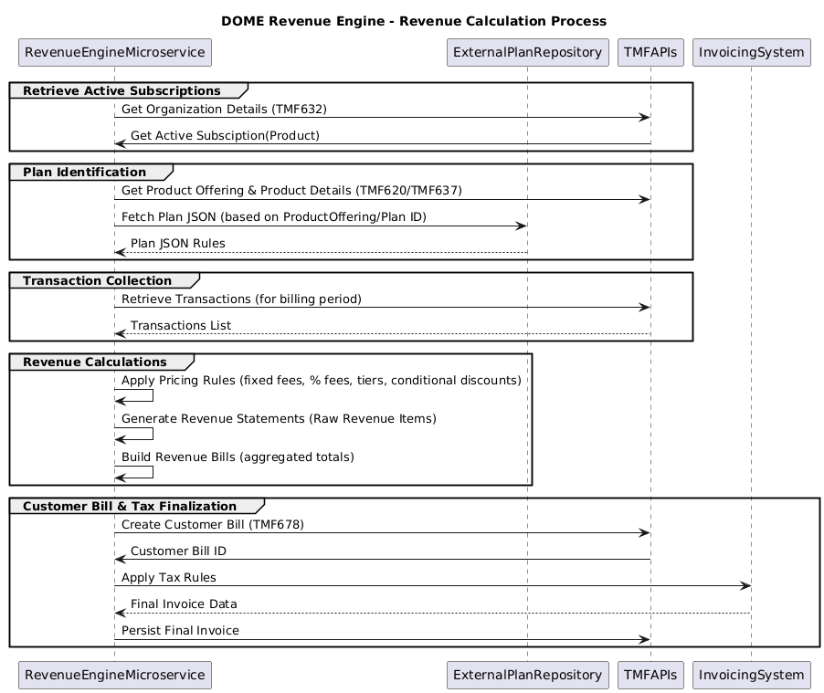

*Figure 5.29 - Revenue Engine Workflow*

##### 5.4.6.2.1 User Interface Components

The Revenue Sharing Dashboard is the main interface through which users can view the financial information calculated by the Revenue Sharing Engine. Once a user logs in, the system determines the Organization ID linked to the account and calls the dedicated API exposed by the backend. The response is provided in a tree-like Report structure, which the frontend interprets and transforms into a clear and organized dashboard. The frontend itself is not expected to perform any calculation; it should solely focus on displaying the information returned by the backend in a way that is easy to understand and suited to the type of organization using the interface.

**From the Provider’s perspective**, the dashboard offers a complete picture of their participation in the DOME revenue model. Providers can view details about their **active subscriptions**, including the duration of the contract and upcoming renewal dates. They also have access to **information about discounts or incentives** they are entitled to, such as onboarding reductions or referral-based benefits. The dashboard presents an overview of their **revenue activity**, with statistics showing **sales volumes**, applied commissions and general performance over time. In addition, Providers can see all the **billing documents generated by the Revenue Engine**, including the pre-invoices they will later download and finalize through the internal accounting procedures. In this way, the dashboard helps Providers maintain transparency and control over their financial operations within the DOME ecosystem.

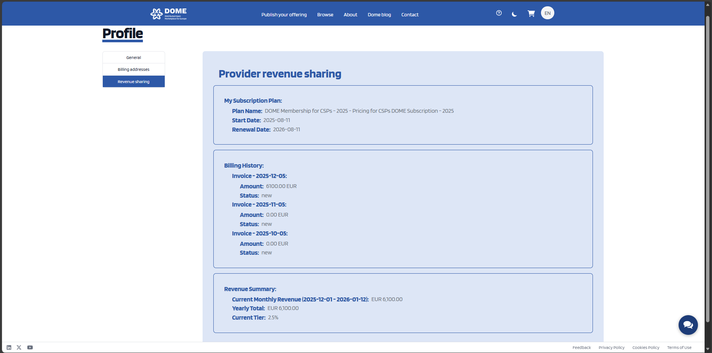

*Figure 5.30 - Revenue Sharing Providers Dashboard*

**The DOME Operator’s dashboard is meant for supervision across the entire marketplace**. The Operator can see all Providers and Federated Commercial Marketplaces, each with its own **subscription details, revenue activity, and billing history**. The dashboard allows the Operator to monitor aggregated **revenue trends**, verify the commissions collected in each period and understand how different organizations perform over time. It also provides access to all **Customer Bills and pre-invoices** generated for every Provider, giving the Operator full visibility into billing cycles and ensuring proper governance and auditability of the revenue-sharing process. This centralized view supports operational oversight and enables consistent financial management across the DOME Marketplace.

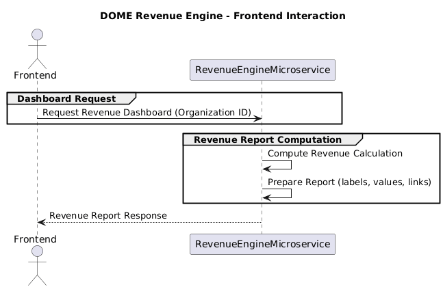

*Figure 5.31 - Revenue Engine Frontend Workflow*

### 5.4.7 Invoicing

Invoicing is a core supporting process within the DOME Marketplace and plays a key role in enabling compliant and transparent transactions across a federated ecosystem. In a context where multiple providers, marketplaces, and customers operate across different countries and legal frameworks, invoicing must support regulatory compliance while remaining flexible enough to accommodate heterogeneous business and tax models.

Within DOME, invoicing is treated as a facilitated process rather than a centrally enforced obligation. **The responsibility for issuing the final legal invoice remains with the invoicing party (typically the Provider or the Federated Marketplace)**, while DOME acts as a facilitator that supports data collection, tax calculation, standardisation, and interoperability.

#### 5.4.7.1 Rules and Regulations

To address the complexity of invoicing across multiple jurisdictions, DOME introduces a mechanism that supports invoice calculation based on data explicitly provided by the involved parties. Providers and Customers are required to supply mandatory business, tax, and billing information, including VAT applicability, VAT scheme type, country of registration, and service-related financial data. Each stakeholder remains responsible for the correctness and completeness of the information they provide. The invoicing model is designed to ensure compliance with EU regulations and it is only responsible for calculating and applying taxes and should not be intended for business verification or VAT ID validation (some preliminary steps are needed at the onboarding level in order to identify the proper legal business entities and rules).

Based on these inputs, the DOME Invoice Engine (see details in the next section) will perform invoice calculations according to applicable EU VAT rules and scenarios, including standard VAT application, exemptions, and reverse charge mechanisms where applicable. The outcome of this process is the generation of a pre-invoice. This pre-invoice is not legally binding but represents a structured, compliant, and traceable calculation that can be reused by the invoicing party. In order to fully understand how the DOME invoicing subsystem works it is important to highlight that three main scenarios are possible:

- **Intra-EU transactions**

  - Verifiable via the [<u>VIES system</u>](https://ec.europa.eu/taxation_customs/vies/#/vat-validation). To determine whether the reverse charge mechanism applies, the Onboarding Procedure must validate both the provider's and customer’s VAT numbers.

  - If both parties are taxable businesses located in different EU countries, and both have valid VAT IDs then the **Reverse Charge is applied** and **NO VAT is charged** by the provider.

  - The invoices must: Not include VAT, Mention Reverse Charge, Include both VAT IDs, Reference Article 194 of Directive 2006/112/EC

- **Local Transactions (same EU country)**

  - There is no centralized source like VIES to verify VAT status. Therefore, verification must rely on national-level checks or require self-declaration and supporting business documentation during onboarding.

  - If both businesses are located in the same EU country (e.g. Italy). The provider must charge local VAT (e.g. 22% in Italy).

  - The invoices must: Include applied VAT rate (22% for Italy), Include VAT amount, Include Total amount due (Net + VAT)

- **Extra-EU transaction**

  - Since there is no VAT ID system like VIES, the invoice subsystem must rely on self-declaration during onboarding, confirming business status and optionally asking for the upload of a tax ID or business registration certificate.

  - When an EU-based provider sells services to a business located outside the EU, no VAT is applied on the invoice. This is because exports of services are generally VAT-exempt or zero-rated in the EU. The principle is that VAT is a consumption tax and should be paid where the service is consumed. If the buyer is outside the EU, the service is not consumed within the EU, so no EU VAT is charged. This is not Reverse Charge, but rather an exemption for exports.

  - The invoices must: Not include VAT, Mention “VAT exempt – supply of services to a customer outside the EU” or “Outside the scope of EU VAT – Article 44 of Directive 2006/112/EC”.

The following table summarize the different scenarios and rules:

<table style="width:96%;">
<colgroup>
<col style="width: 23%" />
<col style="width: 12%" />
<col style="width: 23%" />
<col style="width: 36%" />
</colgroup>
<thead>
<tr>
<th style="text-align: left;"><strong>Scenario</strong></th>
<th style="text-align: left;"><strong>Apply VAT?</strong></th>
<th style="text-align: left;"><strong>Who Pays the VAT?</strong></th>
<th style="text-align: left;"><strong>Invoice Details</strong></th>
</tr>
<tr>
<th style="text-align: left;">
<strong>Cross-border within EU</strong>

<em>Italian Provider to Spanish Customer</em>
</th>
<th style="text-align: left;">No</th>
<th style="text-align: left;">Customer Self-accounts for VAT</th>
<th style="text-align: left;">
<em>“Reverse charge applies – VAT to be accounted for by the recipient”</em>

<em>Cite: “Art. 194 of Directive 2006/112/EC”</em>

<em>Include both valid VAT IDs</em>
</th>
</tr>
<tr>
<th style="text-align: left;">
<strong>Same EU Country</strong>

<em>Italian Provider to Italian Customer</em>
</th>
<th style="text-align: left;">Yes</th>
<th style="text-align: left;">Customer Pays to the Provider</th>
<th style="text-align: left;">
<em>“VAT applied at [eg. 22%] according to domestic rules.”</em>

<em>Show both VAT amount and total price</em>

<em>Include both VAT IDs</em>
</th>
</tr>
<tr>
<th style="text-align: left;">
<strong>EU to Extra-EU</strong>

<em>Italian Provider to Chinese Customer</em>
</th>
<th style="text-align: left;">No</th>
<th style="text-align: left;">
Customer

May pay local taxes
</th>
<th style="text-align: left;">
“VAT exempt – export of services to a non-EU country”

Optionally cite: <em>“Outside the scope of EU VAT – Article 44 of Directive 2006/112/EC”</em>

<em>Include VAT ID of provider only</em>
</th>
</tr>
</thead>
<tbody>
</tbody>
</table>

*Table 5.1 - Invoice VAT scenarios and rules*

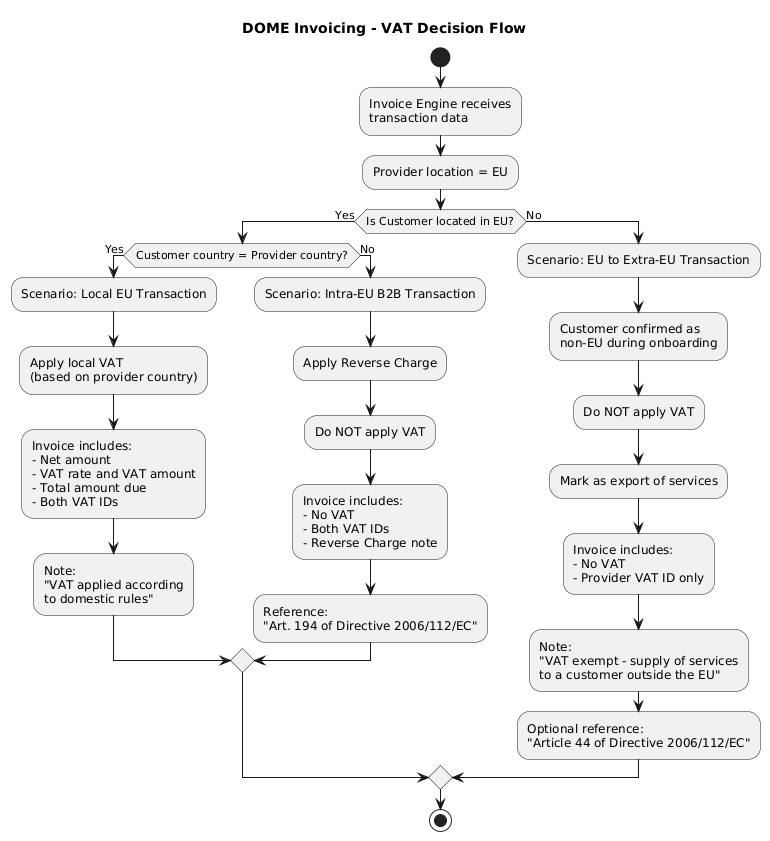

*Figure 5.32 - Invoicing VAT workflow*

As highlighted in the previous section, managing invoicing, as a general topic, could be particularly complex due to the diverse factors such as tax, laws, and regulations across EU member states, combined with the varied nature of providers, which can include public or private companies, associations, and more. Addressing such a diversity, makes the construction of a universal invoice engine exceedingly challenging. Consequently, the approach adopted by DOME is to provide a solution covering most common scenarios, facilitating the invoicing process while delegating the responsibility for data accuracy and management of corner cases to the stakeholders involved in each transaction.

As we have seen with billing management, DOME customers (i.e. CSPs and FMs) are given the freedom to adopt the standard DOME billing engine for price calculations or to remain responsible for bills calculations, using their own facilities.

A similar approach has been adopted for tax calculations. As a preferred path, it is expected that CSPs and FMs building their own bills also rely on their own invoicing systems for tax calculations. However, whenever they recognize their standard scenario falls into the DOME supported one, they can still rely on the DOME platform for tax calculations.

Summarizing, the following calculation scenarios are supported:

1.  DOME Billing + DOME Invoicing: both price and taxes are computed by the DOME platform;

2.  CSP Billing + CSP Invoicing: the CSP takes care of computing both the prices and applicable taxes;

3.  CSP Billing + DOME Invoicing: the CSP only calculates prices, expecting DOME to apply taxes according to its standard scenarios.

Note: we do not consider relevant the scenario where DOME computes the bill while taxes are calculated by CSPs; in fact, the main rationale for delegating billing to DOME is simplicity of billing rules and/or unavailability of a own billing engine. In such scenarios, the expectation of a tax calculation engine alone can be considered unrealistic.

##### Involved APIs and Persistence

As with most of the DOME services, the invoicing service gathers all necessary information for accurate invoice calculations from the DOME Persistence Layer, exploiting the **TMF 678 - Customer Bill Management** API and data model. In particular it relies on the concept of **Customer Bill**, as an aggregation of invoice items named **AppliedCustomerBillingRates**.

Customer Bills and their inner Applied Customer Billing Rates, available as an outcome of the billing process (no matter if internal to DOME or managed by the CSP), are then enriched with **TaxItems** detailing the different combinations of tax types and rates applied to the various invoice items.

Regarding the identification of the correct VAT rates in place at a given time, between the parties involved in the transaction, DOME relies on external authoritative repositories. The “**Taxes in Europe Database v4 (TEDB)**[^6]” is an EC initiative covering the main taxes in force in the EU Member States and contains information on around 650 taxes, as provided to the European Commission by the Ministries of Finance of the EU Member States.

##### The selection of authoritative engine

In a previous section, we have seen that the Billing Proxy is in charge of routing billing calculations to the authoritative engine, based on configurations at ProductOffering level. Upon bill availability, the local DOME invoicing engine is then triggered unless a prior engine (i.e. a fully fledged external billing engine) already included taxes in the bill itself. This approach leaves the CSP with the freedom to generate bills with or without taxes and have DOME to apply them without any prior configuration.

For providers or marketplaces using their own billing systems, the following figure describes the communication schema for issuing an invoice, taking into account both cases (marketplaces using their own Billing/Invoicing engine, or relying on the DOME Invoicing engine):

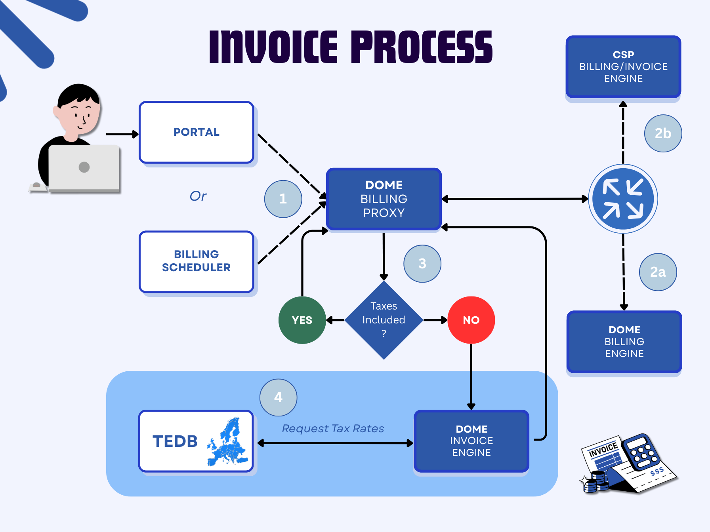

*Figure 5.33 - Invoice Process*

In the diagram above, we can recognize that the activation of the invoicing service occurs in the exact same scenarios where billing happens, that is a) triggered by a buyer when requesting a preview, prior to the actual purchase b) triggered by a buyer when proceeding with a purchase involving an up-front bill and c) triggered regularly by the Billing Scheduler for those products with a periodic billing.

##### Generating pre-invoices

In alignment with EU interoperability principles, DOME prepares pre-invoice data according to PEPPOL BIS Billing 3.0[^7] specifications and EN 16931 standards, making it available in structured formats (e.g. XML) compatible with common invoicing and accounting software. At this stage, each provider or marketplace may decide whether to rely on the DOME-generated pre-invoice as the basis for their official invoice, possibly adding further checks or additional details, or to generate the final invoice entirely using their own invoicing systems and internal processes.

### 5.4.8 Payment

This section details the payment subsystem, including payment gateway connection handling, payment instrument saving and managing clearing and settlement (in case of the centralised payment gateway account management version), including the handling of bank transfers as well.

The payment module does not process or store sensitive bank card data, so we do not need PCI DSS compliance or certification. All this data will be processed and stored by the (PCI DSS certified) payment gateways and the payment module will handle only the so-called security tokens provided by the payment gateways. Unfortunately, this has some drawbacks, like for example we do not know the expiry date of a bank card in advance.

In case of the centralised concepts (both for the bank card based payments and for the bank transfer based payments), the legal entity who will operate the payment service should have a centralised bank account, and for a limited time period this bank account will possess the money paid by the customer to the product provider. There is a need for a legal framework for this concept, and the detailed solution is under discussion with the regulatory authorities.

#### 5.4.8.1 Main technical overview

The system contains a

- web application,

- backend services,

- API which is used by TM Forum APIs / Product provider / Web application (payment frontend)

#### 5.4.8.2 Main scenarios 

##### 5.4.8.2.1 Payment with a new card, with SCA (Strong Customer Authentication)

In this scenario, the customer should enter the bank card data (bank card number, expiry date, CVC code, and sometimes the name written on the card as well) during the payment process. This scenario includes the SCA process (Strong Customer Authentication) as well, which means an additional authentication initiated from the card issuer bank. The customers will be asked to verify their identity with two factors during the payment process.

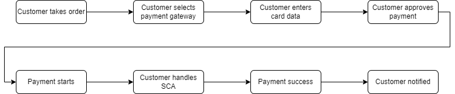

*Figure 5.34 - Put description here*

##### 5.4.8.2.2 Payment with an existing card, without SCA

In this scenario, the customer can reuse a previously stored bank card data for the actual payment process. This scenario shows a process without SCA. This means that this actual payment transaction was flagged as an Out of Scope or Exempt Transaction by the issuer bank.

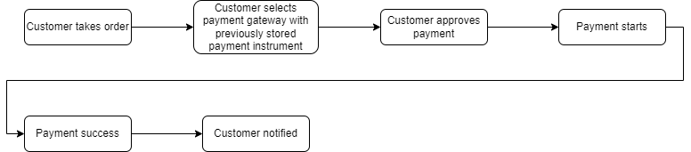

*Figure 5.35 - Put description here*

##### 5.4.8.2.3 Payment with an existing card, with SCA

In this scenario, the customer can reuse a previously stored bank card data for the actual payment process. This scenario shows a process with SCA.

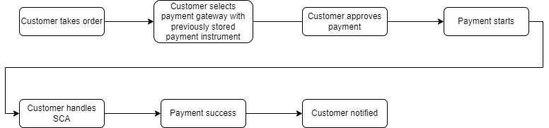

*Figure 5.36 - Put description here*

##### 5.4.8.2.4 Bank card data update during payment because of expiration

In this scenario, the customer would like to reuse a previously stored bank card data for the actual payment process, but the bank card is already expired. So the customer should choose another bank card, or update the card data. This scenario shows a process with an optional SCA.

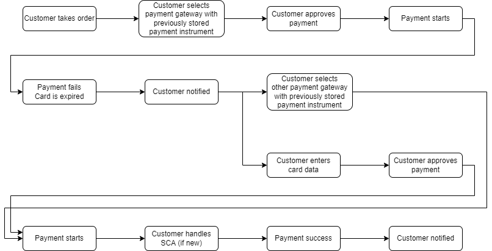

*Figure 5.37 - Put description here*

##### 5.4.8.2.5 Alternative bank card selection during payment because of insufficient funds, without SCA

In this scenario, the customer would like to reuse a previously stored bank card data for the actual payment process, but there is not enough funds on the bank account connected to the given bank card (or some limits have been reached). So the customer should choose another bank card, update the limits of the given card or make more funds available. This scenario shows a process without SCA.

*Figure 5.38 - Put description here*

#### 5.4.8.3 State diagram 

*Figure 5.39 - Put description here*

#### 

#### 

#### 5.4.8.4 Main concepts 

This subsystem is responsible for receiving the payment transaction related information:

- amount

- currency

- payment method

- country of location

- product provider information (e.g. gateway registrations)

- customer payment related information (e.g. saved payment instrument tokens)

Then starting a transaction with these parameters - transformed and specialised - to the customer’s chosen payment gateway.

There are two main concepts planned, the main difference is the connection to the payment gateways.

In the centralised concept (detailed in section 5.4.8.5) the system is responsible for registering and maintaining the connection to each payment gateways.

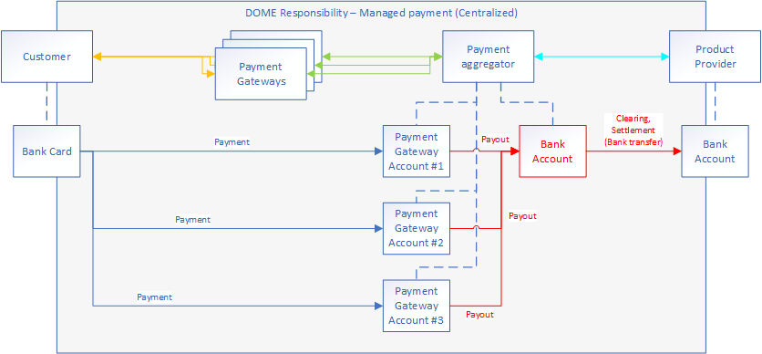

*Figure 5.40 - Put description here*

In the decentralised concept (detailed in section 5.4.8.6) each product provider must register itself to the payment gateways.

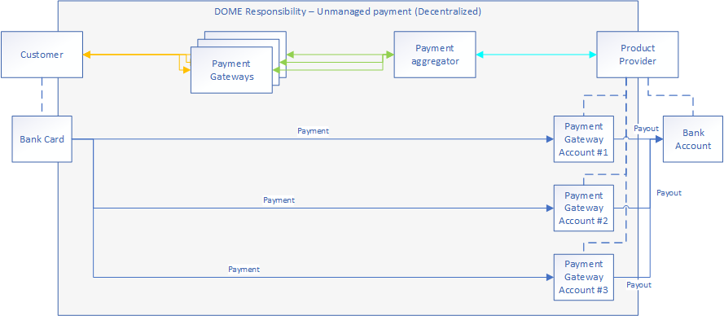

*Figure 5.41 - Put description here*

In each concept the system will support each payment gateway, and makes it easy to connect a new one.

These two approaches have their own set of advantages and disadvantages, making them suitable for different business models and objectives. Let's summarise the key differences and merits of these two payment aggregation solutions.

In the managed payment solution model (where we will use centralised payment gateway accounts), the payment aggregator takes on the responsibility of establishing and managing payment gateway accounts on behalf of product providers.

The advantages of the managed payment solution:

- Financial and legal compliance: one of the standout strengths of the managed payment solution is its ability to handle complex financial and legal aspects efficiently, the payment aggregator is equipped to navigate the regulatory landscape and ensure compliance with industry standards, reducing the burden on product providers

- Ease of onboarding: product providers can seamlessly integrate with any payment gateway without the hassle of individually creating and maintaining accounts with multiple providers, this streamlined onboarding process saves time and resources

- Flexibility for buyers: the managed payment solution offers full flexibility for buyers, allowing them to choose their preferred payment gateway, this flexibility enhances the overall customer experience and can lead to higher conversion rates

- Lower transaction costs: centralised management enables the payment aggregator to negotiate better terms with payment gateways, resulting in lower transaction costs for product providers, this cost reduction can have a significant impact on a business's bottom line

- Revenue sharing: the managed payment solution can facilitate revenue sharing through a transaction fee collection based on a DOME business model

The disadvantages of the managed payment solution:

- Financial and legal aspects: payment licence and strict company procedures and workflows will be required

In the unmanaged payment solution model, in contrast, places the responsibility of creating and managing payment gateway accounts squarely on the shoulders of the product providers. This approach offers a different set of advantages and disadvantages.

The advantages of the unmanaged payment solution:

- Reduced responsibility: DOME has significantly less responsibility in this model, as the product providers require to create and maintain their own payment gateway accounts, this approach is particularly appealing to such product providers that prefer to maintain full control over their payment processes

- Direct revenue: product providers can receive payments directly from the payment gateways, eliminating intermediaries and potentially speeding up access to funds

The disadvantages of the unmanaged payment solution:

- Account creation overhead: one of the most significant challenges of the unmanaged payment solution is the need for product providers to create accounts with multiple payment gateways, this can be a time-consuming and resource-intensive process, especially when dealing with a large number of gateways

- Limited buyer flexibility: the unmanaged model may limit the flexibility for buyers, as they may not have the option to choose their preferred payment gateway, if a given product provider lacks the support for them, this lack of choice could lead to a less optimised customer experience

- Higher transaction costs: without the negotiating power of a centralised aggregator, product providers may face higher transaction costs from individual payment gateways, over time, these costs can add up and impact profitability

- Complex revenue sharing: establishing revenue-sharing process in the unmanaged model can be more challenging, requiring three-party payments or depending on separate payment processes from the product providers side

#### 5.4.8.5 Centralised payment gateway accounts 

In the centralised payment gateway concept, this subsystem registers to each supported payment gateway. It maintains the registration, updates tokens etc. what is required for the specific payment gateway. Theoretically every transaction can be executed with this concept, because there is no limitation from the product owner side.

If a transaction begins, a customer is loaded from TM Forum API, with its transaction history and previously saved payment instrument tokens. After selecting a gateway, the transaction will pass to the gateway, and after success, this subsystem will receive the product owner’s money, which will be transferred to its bank account.

##### 5.4.8.5.1 Payout

The amount paid by the customer first arrives at the payment gateway account. There is a need for a payout process to the central bank account after that. The timing will depend on the payout schedule of the payment gateway and the payout speed from the payment gateway account to the central bank account.

The payment module will manage the bank transfer from the central bank account to the product provider bank account, as the last step of the payout process. Based on the payment request parameters, there can be multiple beneficiaries for these bank transfers, in case of product bundles.

This could be a fully automated process, or a supervised semi-automated process, depending on the configuration and the requirements of the operational team of DOME.

The revenue sharing, or the transaction fee collection can be an integrated part of this bank transfer process as well.

#### 5.4.8.6 Decentralised payment gateway accounts 

In this concept this subsystem receives the product provider’s access tokens in a secure way to create a transaction to the gateway. The product provider needs to maintain the connection and registration to each gateway he wants to use.

There is no need for payout in this version, but collecting the transaction fee (aka revenue sharing) during the payment process is not possible either, it should be managed outside of the payment module.

#### 5.4.8.7 Payment with bank transfer 

The initiation of bank transfers is outside the scope of the payment module. But in the centralised concept we need to manage the incoming bank transfers, and pairing the transfers to the unpaid invoices. Also we need to manage the payout similar to the centralised payment gateway accounts version.

#### 5.4.8.8 Interactive payments 

Interactive flows are requiring the card holders active cooperation during the process. This can mean handling SCA requests from the banks during the transaction or first time checking the payment instrument. The web application will redirect the customer or display gateway specific UI for these events.

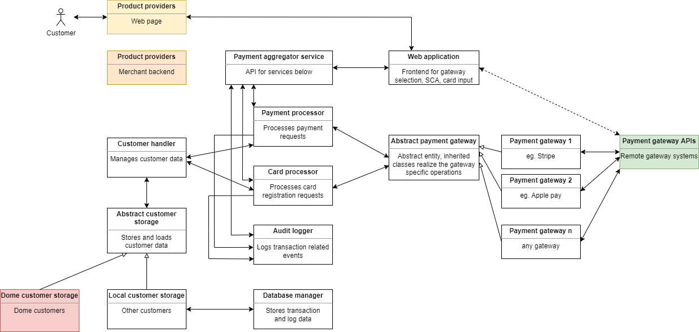

*Figure 5.42 - Put description here*

#### 5.4.8.9 Recurring / non interactive payments 

Recurring payments will require no UI, but the saved payment instrument’s token coupled to the chosen payment gateway. This token was saved intentionally during a previous payment process.  
So in normal operation, this kind of process does not require any interaction from the customer. But in case of some problems (like an expired bank card), we should notify the customer and ask for some tasks to complete (like update bank card information). The product providers should be informed via notification messages as well in case of any failure during the non-interactive payment processes (from the TM Forum APIs). These notifications should indicate if the failure is just temporary, or final. The exact process flow depends on the product provider settings (like grace period settings, for example).

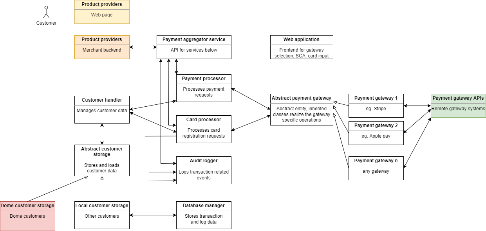

*Figure 5.43 - Put description here*

#### 5.4.8.10 Backend services 

##### 5.4.8.10.1 Payment processor 

Payment processor is responsible for receiving and validating payment data from API, and managing payment status switches. It also logs any event related to the payment. It initiates the transaction to the chosen payment gateway provider.

##### 5.4.8.10.2 Card processor 

Card processor handles payment instrument token saving, and loading the specific instrument token from the customer storage.

##### 5.4.8.10.3 Audit logger 

Logs events with timestamps.

##### 5.4.8.10.4 Customer handler 

Responsible for requesting customer data from TM Forum API or local database. Attaches payment instrument tokens to customers.

#### 5.4.8.11 Example payment flows 

##### 5.4.8.11.1 Interactive flow

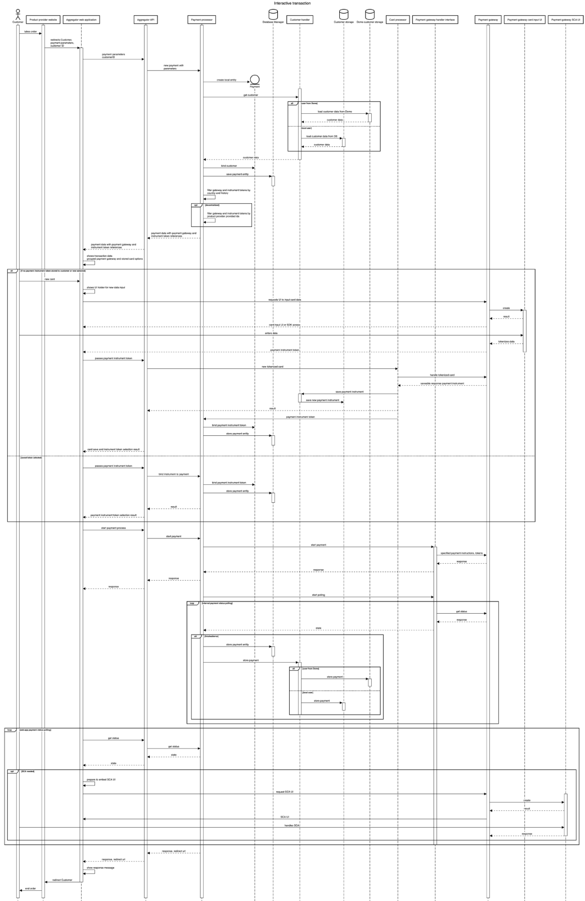

*Figure 5.44 - interactive payment flow*

##### 5.4.8.11.2 Non-interactive flow

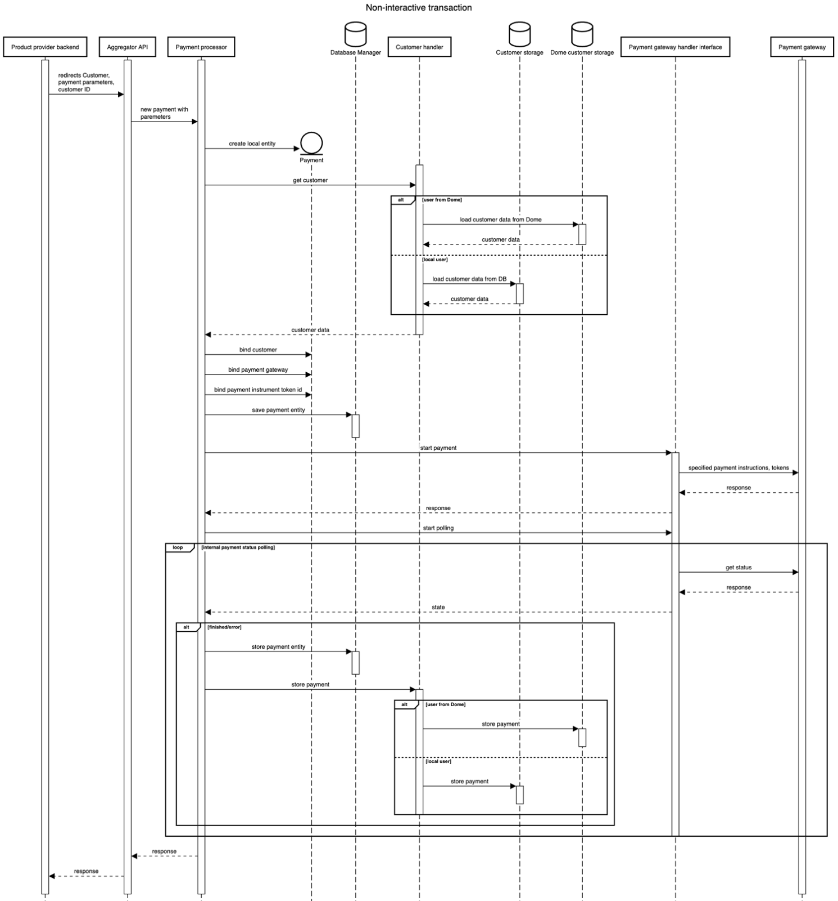

*Figure 5.45 - non-interactive payment flow*

### 5.4.9 Tailored Offerings

In the DOME Marketplace, most offerings are published with predefined price plans, enabling customers to complete a purchase immediately. However, in many B2B scenarios such as high-volume procurements, public administration tenders or nonprofit organizations, customers often require custom pricing, with contract terms or specific service conditions, making direct purchase insufficient.

To support these use cases, the DOME Marketplace introduces **Tailored Offerings, a mechanism that enables private negotiations between a Provider and a specific Customer**. Tailored Offerings are not visible on the public list of product offerings and can only be accessed by the customer involved in the negotiation. This ensures confidentiality, controlled visibility, and flexibility in managing custom commercial agreements.

Only Providers can enable the Tailored Offering mode for their products. In the designed model, the offering page will display a new “**Create Quote**” button alongside the standard “Add to Cart” option:

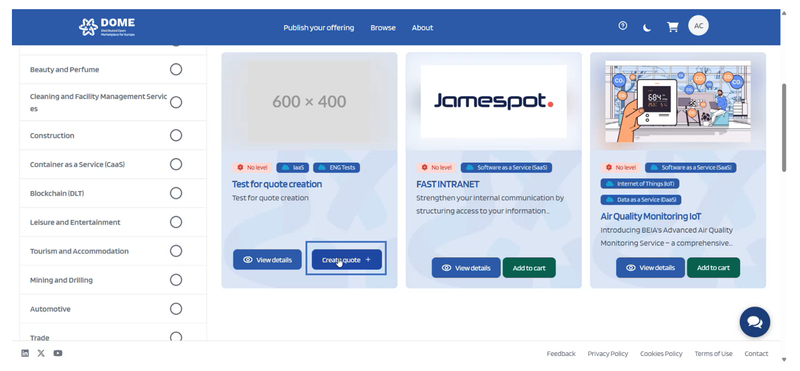

*Figure 5.46 - Tailored Offering “Create a Quote” option*

This button is intended to be visible only to authenticated Customers, since the provider must receive all necessary requester information to start the negotiation.

#### 5.4.9.1 Functional Overview

##### 5.4.9.1.1 Tailored Offering Lifecycle

The lifecycle of a Tailored Offering in the DOME Marketplace follows a clear and structured sequence designed to support private negotiations between a Provider and a specific Customer, while ensuring confidentiality, controlled visibility, and full traceability of every step. The process starts when a Provider marks an offering as negotiable, allowing customers to request a personalized quote instead of purchasing it immediately. After a customer submits their request, the negotiation takes place entirely within the DOME platform, using built-in tools to exchange messages, share PDF documents, clarify requirements, and refine the commercial proposal.

In the architectural design, once the parties reach an agreement, the workflow foresees that the Provider will finalize the deal by creating a dedicated Tailored Product Offering, visible exclusively to the specific customer involved. This customized offer keeps the technical features of the original product but applies the agreed prices and contractual conditions. The customer is then expected to complete the purchase through standard marketplace mechanisms, triggering the usual backend processes such as billing, payment, provisioning, and invoicing.

Here is the detail of how the Tailored Offerings workflow works:

**1) Marking an Offering as Negotiable**

The Provider enables the “Negotiable” option on a standard offering. When activated, a **“Create Quote”** button appears next to “Add to Cart”, signalling to customers that a customized offer can be arranged.

**2) Initiating the Negotiation Process**

The customer clicks "Create Quote" and fills in a short form and/or uploads a PFD describing their needs (expected volumes, resource demands, SLA expectations, notes). The system automatically sends a detailed notification email to the Provider, containing:

- Customer identity and contacts

- ID of the referenced offering

- Submitted quote request details

**3) Internal Negotiation (Built-in Chat)**

From this point on, all negotiation takes place within the DOME ecosystem, through a dedicated internal dashboard and chat associated with the deal. The design aims to eliminate external email exchanges and ensure full traceability of the negotiation history.

**4) Acceptance or Rejection**

The customer reviews the proposal and may accept or decline it. If no agreement is reached, either the Customer or the Provider may cancel the negotiation at any time.

**5) Creating a Tailored Offering**

Once an agreement is reached and the contractual document is signed, the Provider **clones the original offering** and generates a new **Tailored Offering**, which:

- maintains a reference to the original product

- is visible **only to the specific customer**, through access control rules

- is published only in the marketplace where the negotiation was initiated

**6) Order Placement**

In the designed process, once the Customer reviews the tailored offering, it proceeds with the purchase through the standard ordering flow. All standard components such as Billing, Payment, Provisioning, Invoicing, and Revenue Sharing, are triggered as usual.

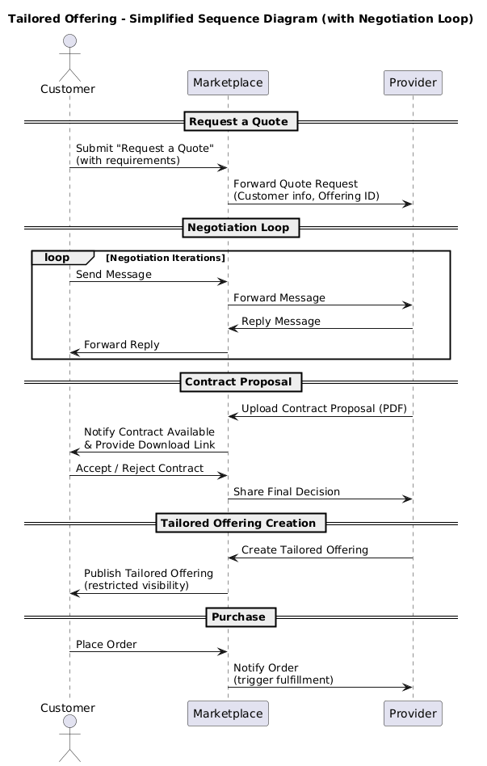

*Figure 5.47 - Tailored Offering Lifecycle Sequence Diagram*

##### 5.4.9.1.2 Custom Offering Functional View

Once the negotiation reaches an agreement and the contractual document is finalized, the process transitions into the creation of a Custom Offering. While the negotiation formally concludes when the customer accepts the proposal, the operational workflow is completed only when the Provider generates a dedicated product offering that reflects the agreed terms. This Custom (Tailored) Offering incorporates all customized elements defined during the negotiation (such as pricing conditions, contract terms, resource configurations, SLAs, and any additional components) while maintaining the technical foundation of the original offering.

A key characteristic of these offerings is the implementation of strict access control. Unlike public catalog entries, Custom Offerings are visible and purchasable exclusively by the specific Customer involved in the negotiation. This restricted visibility is enforced through the Related Party attributes within the Product Offering object, which establish an explicit association between the offering and the authorized customer’s account. This mechanism ensures confidentiality and prevents unintended disclosure of negotiated conditions within the broader marketplace.

#### 5.4.9.3 System Component Architecture

Before detailing the backend and frontend services, it is important to clarify the architectural principles that govern how Tailored Offering interactions are expected to be implemented. When a customer submits a tailored quote request, the system will invoke the TM Forum Quote API to create a dedicated quote object that establishes a direct relationship between the customer and the selected provider. This quote is instantiated with the category “tailored” and contains a reference to the originating Product Offering through the productOffering attribute embedded within the quote item. This allows the system to consistently identify which product initiated the tailored quote process.

Access control is expected to rely on user and role-based filtering rules, ensuring that each tailored quote instance is displayed only to the appropriate party. Quotes are filtered by category “tailored”, user ID and role, so that customers only see quotes they initiated, while providers view only the quotes in which they are designated as sellers. The quote object is also intended to serve as the repository for all negotiation artifacts.

The attachment attribute enables storage of files encoded in base64 and embedded directly within the quote. Only providers are allowed to upload documents, ensuring consistent handling of commercial proposals and contract drafts. Similarly, the negotiation chat is expected to be implemented through the note attribute at quote level, providing a one-to-one communication channel between customer and provider. Messages are appended to the note array to maintain full traceability, with visibility restricted to the two directly involved parties.

The communication layer is expected to support real-time persistence of chat messages, including timestamp and author tracking, while enforcing strict message-routing rules that ensure isolation between individual negotiation threads. Notifications are dispatched whenever new notes, attachments, or status changes occur. These alerts are triggered automatically, with recipient identification based on the quote’s related-party roles, and are expected to integrate with external notification APIs to support both real-time and email-based communication.

##### 5.4.9.3.1 Backend Services Architecture

The backend architecture implements microservices exposing REST APIs compliant with TM Forum Open API specifications, with a specific focus on Quote management. Core services are organized into functional domains supporting provider discovery, communication, and system administration. Tailored quote services provide API endpoints for quote retrieval, filtering by user ID and role (Customer or Seller), and client-side validation to maintain data integrity, including pagination for efficient data browsing. Quote detail retrieval exposes complete metadata, including Product Offering references, related parties, attachments, and full conversation history. The quote creation service applies validation logic such as self-request prevention, Product Offering resolution for seller identification, and organization name retrieval through Party Management API integration. Quote update services manage state transitions with lifecycle-aligned validation rules, preserving attachments and related-party relationships during updates. Attachment management services handle file uploads with base64 encoding, supporting multiple stored files per quote item, each with associated metadata such as file name, description, MIME type and size.

In the architectural design, these backend services are intended to support the complete tailored negotiation lifecycle, ensuring that all updates, attachments and interactions are consistently persisted within the quote object and exposed through standardized TM Forum interfaces. The microservice interactions are expected to apply structured validation rules during each state transition, ensuring alignment with the defined lifecycle model.

##### 5.4.9.3.2 User Interface Architecture

The Tailored Offering feature introduces three dedicated dashboards within the DOME Marketplace: one for Customers, one for Providers, and one for the DOME Operator. All dashboards involved are designed to consume standardized backend endpoints that expose quote data, lifecycle operations, attachments and chat interactions. This approach ensures consistency with the backend services, uniform handling of the negotiation lifecycle and a coherent user experience across Customer, Provider and DOME Operator interfaces.

**Customer Dashboard**

The Customer’s dashboard provides an overview of all the tailored quote requests they have opened, each displayed with its current lifecycle state (Creation, Pending, In Progress, Approved/Issued, Accepted or Cancelled). From here, customers can initiate a new negotiation by selecting “Create Quote” from an offering page. After submitting their request, including a short description of their needs and the desired completion date the quote appears in the dashboard in Pending state.

During the negotiation, the customer can:

- view all quote details

- participate in the dedicated internal chat

- adjust the requested completion date (only if the provider has not set one yet)

- download the proposal once available

- accept or reject the quote once the provider issues it

- cancel the request at any stage

The dashboard also acts as a historical archive: even after acceptance or cancellation, the customer can still access all past quotes, view attached documents and review the complete negotiation history:

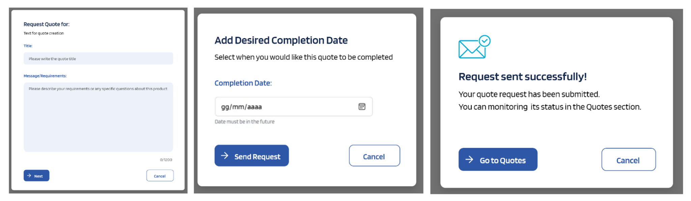

*Figure 5.48 - Tailored Offering Request for a Quote*

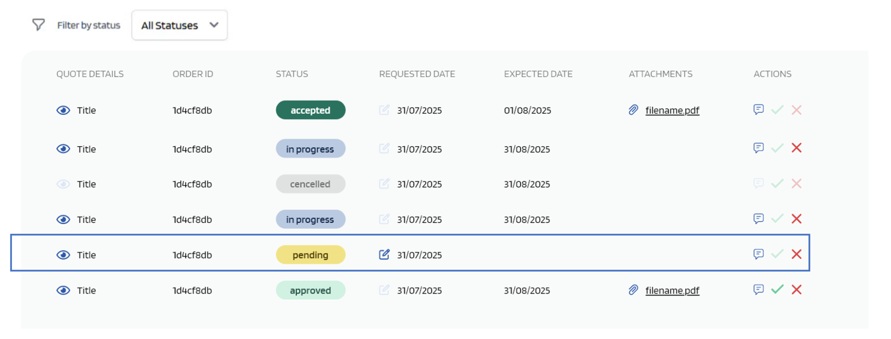

*Figure 5.49 - Tailored Offering Customer Dashboard*

**Provider Dashboard**

The Provider’s dashboard mirrors the customer’s view in structure but offers a richer set of actions, since the provider is responsible for preparing, updating and issuing the tailored proposal. Incoming requests appear in Pending state, where the provider can review customer details, analyze the requirements and begin preparing the proposal.

Depending on the lifecycle phase, providers can:

- view detailed information about the customer and the requested offering

- set the expected delivery date of the proposal

- upload or update the commercial file (typically a PDF contract or pricing document)

- communicate with the customer through the built-in chat

- approve (issue) the proposal once all required elements are provided

- reject or cancel the negotiation if an agreement cannot be reached

Once the provider sets the delivery date, the quote automatically moves into In Progress, signaling that the proposal is being prepared. When the provider uploads the contract and confirms the proposal, the quote transitions into Approved, making the commercial document available to the customer:

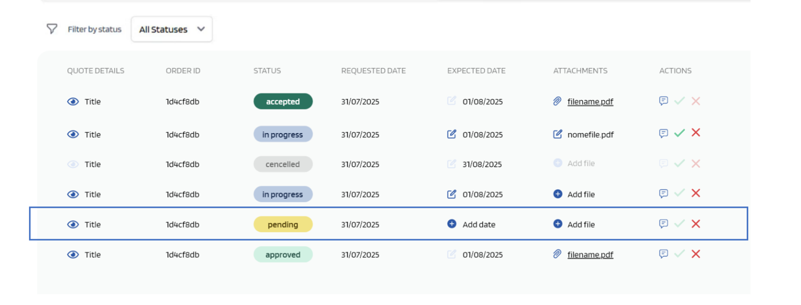

*Figure 5.50 - Tailored Offering Provider Dashboard*

**DOME Operator Dashboard**

The Dashboard for the DOME Operator provides full system visibility through a monitoring dashboard that displays tailored statuses and statistics. It will also include audit features to support compliance monitoring and reporting.

### 5.4.10 Tendering

The Tendering functionality represents a core component of the DOME marketplace architecture, designed to enable customers to create structured service requests and invite one or more qualified providers to submit competitive proposals. The primary objective is to enhance transparency, competitiveness, and decision-making efficiency in the procurement of cloud, edge, and related services.

A PDF-based model has been adopted as the standard approach for request creation. Customers upload a PDF document containing the complete service request, supplemented by metadata that includes the activation date, due date, and a brief description. To facilitate standardization, an optional template library is provided, offering guidance on structuring requests with reference sections such as Description, Service Level Agreements (SLAs), Key Performance Indicators (KPIs), and Compliance Requirements. While these templates serve as a useful aid to ensure comprehensive and well-structured requests, their use remains discretionary to preserve customer flexibility.

The Tendering functionality encompasses the following main capabilities:

- Customer dashboard for request creation and management;

- Provider invitation process with filtering criteria including Service Topology, Provider Country, and Compliance Level;

- Private one-to-one communication channels;

- Amendment and update management process;

- Offer submission and management workflows;

- Alignment with TM Forum Open APIs to ensure standardization and interoperability.

#### 5.4.10.1 Functional Overview

The tendering lifecycle is structured as a state-driven workflow that progresses through five distinct logical phases, each corresponding to specific TM Forum states and supporting well-defined actions for both customers and providers. The progression through these phases is governed by a combination of user-initiated transitions and automatic time-based triggers, ensuring a structured and transparent procurement process.

##### 5.4.10.1.1 Tendering Lifecycle

The lifecycle is designed to start with an internal preparation phase where customers define requirements and select potential providers. A notification mechanism will ensure that each invited provider is informed and can react within the defined response window. Once the provider list is finalized, the tender enters an active submission phase, during which providers can submit proposals and request clarifications. After the submission deadline, the customer evaluates received offers and selects a winner or discards all proposals. The process concludes with notification of outcomes to all participants and recording of final statistics for analysis.

The table below provides a detailed overview of the entire lifecycle, along with a sequence diagram that details the different stages and user interaction:

||
||
||
||
||
||
||

*Table 5.2 - Tendering Lifecycle*

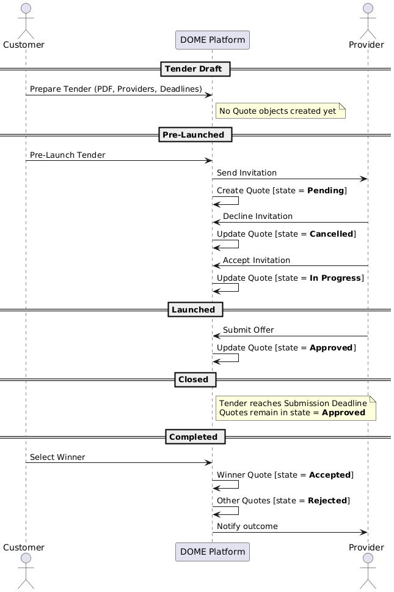

*Figure 5.51 - Tendering Lifecycle Sequence Diagram*

##### 5.4.10.1.2 Custom Offering Functional View

Upon selection of a winning provider, the Tendering process transitions into a final provisioning phase. While the tender reaches completion with the winner designation, the whole procedure formally concludes with the creation of a dedicated Custom Offering by the selected provider.​ This Custom Offering represents a structured product catalog entry derived from the winning proposal and tender specifications, encapsulating the complete service definition including technical specifications, SLAs, KPIs, pricing models, and provisioning requirements as negotiated during the tender process.​​

The distinguishing characteristic of these offerings is the implementation of restrictive access control mechanisms that fundamentally differentiate them from standard public catalog entries. Unlike publicly available offerings visible to all DOME Marketplace users, Custom Offerings use an access control capability that restricts visibility and purchasing capabilities exclusively to the specific Customer who initiated the tender. This is enforced through the Related Party attributes within the Product Offering object, which establishes an explicit binding between the offering and the authorized customer.​​

The authorized customer accesses the Custom Offering through a dedicated section within their marketplace dashboard, where they can proceed with standard marketplace procurement workflows including order placement, payment processing, and service activation.​​ This approach maintains process continuity within DOME and contributes to the use of the DOME Revenue Sharing model.

#### 5.4.10.2 Architectural Design

Upon customer submission via the "Launch" button, invitations are dispatched, and the TM Forum Quote API is invoked. At this point, an individual quote object is instantiated for each provider invited to participate in the tender. The creation of multiple quotes is orchestrated by a specific service, which calls the endpoint repeatedly for each provider. For example, if a customer invites Provider A, Provider B, and Provider C, three distinct quote objects are created:

- Quote 1 contains Customer and Provider A

- Quote 2 contains Customer and Provider B

- Quote 3 contains Customer and Provider C

The association between quotes and the tender is established through the externalId attribute of each quote object, which groups all quotes belonging to the same tendering process. To ensure proper linkage of these quotes to the same tender process, a reference is embedded within each quote object, analogous to how quotes in the Tailored Offering process reference their originating Product Offering.

This architectural approach facilitates Access Control management, as each quote instance can be independently displayed or hidden in different access nodes, providing more granular and direct access control compared to implementing complex logic within a single object.

The PDF document created by the customer during tender initialization is replicated across all instantiated quote objects using the Attachment attribute, which supports multiple file storage. Provider proposals are managed through direct upload functionality to their respective quote objects via the same attachment endpoint.

The chat functionality provides a direct and auditable communication channel between the customer and each participating provider. Each quote object instantiated for a provider includes a dedicated chat space, implemented through the note array attribute, ensuring message privacy with visibility restricted to the two involved parties. From the customer dashboard, each provider-specific entry displays a "Chat" button that initiates a one-to-one conversation. Providers access only the chat associated with their specific quote with the customer.

The system additionally supports broadcast messaging capabilities. When a customer needs to disseminate identical information to all participating providers (e.g., clarifications, deadline reminders, or requirement updates), they can activate a toggle or checkbox to propagate the message simultaneously across all quotes sharing the same externalId. Each provider receives the message within their individual chat thread, preserving the one-to-one structure while ensuring consistent content delivery to all participants. This approach prevents providers from viewing exchanges between the customer and other providers. All chat interactions are persisted within the associated quote object, ensuring traceability and alignment with existing Quote management mechanisms.

#### 5.4.10.3 System Components Architecture

The implementation of the Tendering functionality encompasses a comprehensive development strategy spanning both frontend user interfaces and backend services, designed to support the complete tender lifecycle from creation through finalization. The development approach prioritizes user experience, real-time interaction capabilities, and robust integration with TM Forum Open APIs.

##### 5.4.10.3.1 Backend Service Architecture

The backend architecture implements microservices that expose REST APIs compliant with TM Forum Open API specifications focusing on Quote management, ensuring interoperability, scalability, and maintainability. Core services are organized into functional domains supporting tender management, provider discovery, communication, and system administration.

Tender management services provide comprehensive API endpoints for tender summary aggregation, synthesizing status, deadlines, unread message counts, and offer tallies for dashboard presentation. Metadata search capabilities enable efficient tender discovery based on customer-defined criteria. Quote list retrieval and detailed metadata APIs expose tender-associated quotes to authorized users, while quote update services manage state transitions, amendment linkage, and attachment management. The quote creation service implements validation logic and persistence mechanisms, supported by a workflow engine managing provider response deadline enforcement. A deadline management service executes automatic tender closure and triggers notification workflows when temporal thresholds are reached.

Communication infrastructure implements real-time chat persistence with encryption, message routing, and broadcast toggle functionality. Message routing logic enforces visibility rules, ensuring that one-to-one communications remain isolated between the customer and individual providers, while broadcast messages are replicated across all provider-specific chat threads. Communication and alerting are implemented through the notification system integration: after creations, status changes, note additions or attachment uploads, the service delivers immediate alerts for new messages, complemented by email notifications.

The TM Forum Open API integration layer ensures standardized interaction with Quote, Party, and Document Management APIs.

##### 5.4.10.3.2 User Interface Architecture

The frontend architecture is structured around three primary user perspectives: customer management interfaces, provider interaction panels, and DOME Operator administrative dashboards. All dashboards are designed to consume standardized backend endpoints that expose tender data, lifecycle actions, attachments, chat interactions, and notification events. This ensures consistency with backend services and provides a coherent experience across Customer, Provider, and DOME Operator interfaces:

**Customer Dashboard**

The customer interface centers on a comprehensive dashboard that aggregates all tenders created by the customer, displaying critical information including tender status (open/closed), unread chat notifications, offer counts, launch dates, due dates, and current lifecycle phase. Advanced search and filtering capabilities enable customers to locate specific tenders by status, date range, tags, or budget constraints. The tender detail view provides access to participant lists, submitted offers, communication threads, attachments, and contextual actions available based on the current tender state.

The new tender creation relies on an intuitive wizard interface guiding customers through the definition of essential metadata including tender name, unique identifier, description, deadlines, classification tags, and maximum budget constraints. The provider selection interface implements a search engine and filtering panel with criteria including Compliance Level, Country, and Service Type taxonomy (IaaS, PaaS, SaaS, DaaS, IAaaS…).

As anticipated in the previous chapter, Real-time communication is facilitated through an integrated chat panel supporting both one-to-one and broadcast messaging modes with file attachment capabilities. The dashboard provides visual indicators for unread messages, ensuring timely customer awareness of provider communications.

*Figure 5.52 - Tendering Customer Dashboard*

**Provider Dashboard**

The provider interface mirrors essential customer capabilities while restricting access to provider-specific data. The provider dashboard lists all tenders to which the provider has been invited, displaying tender status, unread message counts, budget parameters, and approaching deadlines. The tender detail view operates in read-only mode for metadata, budget, dates, and customer attachments, preserving information integrity while ensuring provider visibility. Notification mechanisms alert providers to critical events including tender amendments, closures, and new customer messages.

**DOME Operator Dashboard**

The DOME Operator interface offers full system visibility through a monitoring dashboard that displays key performance indicators and tender statuses across all lifecycle stages (Draft, Pre-Launched, Launched, Closed, Completed). It will also include audit features to support compliance monitoring and reporting.

## 5.5 Indexing and Search

The Indexing and Search component provides basic and advanced features to search, index, analyse and correlate information to be retrieved, with the goal of connecting consumers with relevant and coherent services as quickly as possible. In its most basic functionalities, the DOME central Marketplace and its product catalogue should allow customers to:

- launch product searches on the marketplace portal;

- leveraging category filters (based on domain-oriented taxonomies);

- easily accessible service description and service offering pages.

Also, through the exploitation of advanced search/browsing algorithms, it is possible to design and implement more advanced features with the goal of connecting customers with relevant products in the least possible time. For example, a search algorithm which would match customer search queries with keywords from relevant product listings; even more advanced search functions may leverage additional information (such as product ratings or click-through rates) to prioritise/rank the results of search queries and improve the customer experience.

The approach applied to design the architecture of the Indexing and Search component started from the identification of all the possible requirements. Generally, the practice of search information (and related retrieval) is a process involving several elements:

- a query with information about what the user is trying to retrieve;

- an interface for the query composition and the results visualisation;

- a set of filters that reduce the amount of information, focusing the results on what is useful for the user;

- a storage area, where the information is persistent and can be retrieved.

- a set of results useful for the user.

Specifically for the context of DOME, it is necessary to consider:

- a process that manipulates queries and/or pre-process data in order to add semantic-retrieval capabilities to the system;

- a process implementing the logic needed to index anything that needs to be searched.

In addition, capabilities like sorting, filtering and ranking are very important in an environment working with a huge amount of data. For this reason, the design process must take into account all aspects. Starting from these considerations, the Indexing and Search component must implement several features needed for the search and retrieval task among which:

- search by keywords (allow customers to search and filter published offers using different parameters, including text search, catalogues, categories and offering parameters such as type, owner, characteristics or status);

- search by Natural Language request (allow customers to search and filter published offerings using requests in Natural Language).

All these functionalities must be exposed as REST services. The following picture describes the proposed solution.

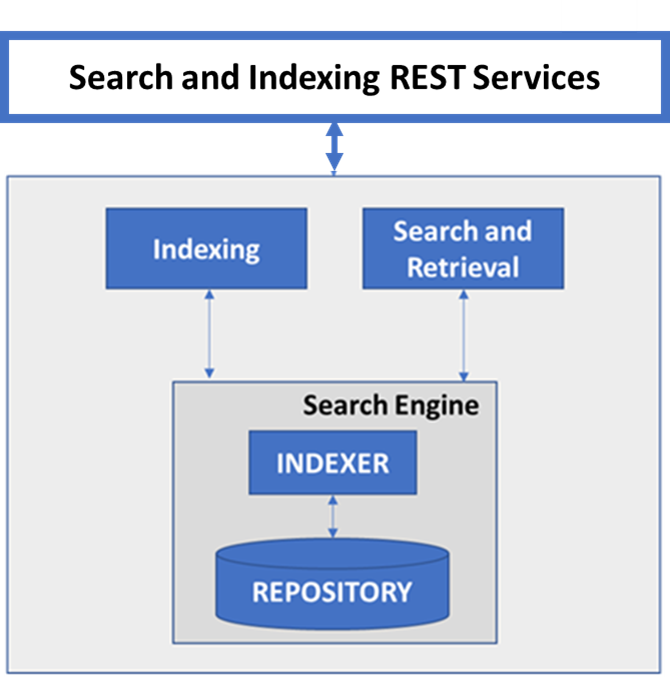

*Figure 5.53 - Search and Indexing Architecture*

The component has specialised parts implementing groups of functionalities. The API layer exposes in the form of REST services all functionalities implemented by the component. The Search and Retrieval section implements high-level APIs focused on management of queries submitted by the DOME user; functionalities for advanced search operations and results creation and presentation are also exposed. The Indexing section is specialised in strategies to index Offerings, public items and catalogues in terms of their contents. The Indexing and the Search and Retrieval subsystems will be detailed in next paragraphs.

The Indexing and Search component requires a document database able to store unstructured data such as profiles, catalogues, and large documents. The choice has been ElasticSearch, a resilient and scalable document database. Responses are very fast and it integrates a customizable indexer that reduces the effort needed to solve the indexing problem characterising the search and retrieval operations. ElasticSearch can be integrated through REST API or Transport Client in order to ensure robust communications. As said, the component communicates with the other parts of the system through set of APIs exposed as REST services: about the technological choices related to the implementation of the component, Spring Boot2 is under analysis as promising technological choice for the following features:

- It allows the creation of single package components (in form of Jar including the web server);

- There is an extension for the automatic health check;

- It allows the implementation of robust REST services in order to expose the API;

- Through Spring Cloud it is possible to easily integrate Kafka, which is a standard solution for message exchange based on publish-subscribe pattern.

Spring framework also allows the communications with service registries (like Eureka) in order to implement an architecture compliant with the micro-services philosophy.

Concerning the architectural approach and positioning in relation to the DOME Marketplace, the solution proposed in the first version of the document considered the Indexing and Search component as a subsystem of the DOME central Marketplace, behind the same access node. Although the above solution represented a value added for the DOME Marketplace, a change of direction has occurred. The adopted and implemented solution refers to the Search engine as an independent actor in the federation, with its own access node but with the same visibility and privileges as the DOME Marketplace.

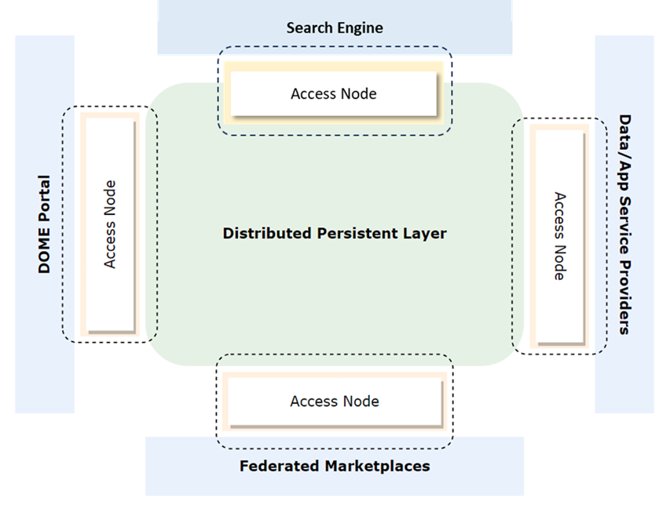

*Figure 5.54 - Search Engine: connection with the DOME Persistent Layer*

The communication channel with other entities is the DOME Distributed Persistence Layer: every time a Product Offering is created through the DOME Portal, information about it is stored in the Distributed Persistence Layer through the mechanisms provided by the TM Forum API. As described in previous chapters, part of this information is stored in the blockchain and is replicated in all nodes connected to the DOME Distributed Persistence Layer (including the Search Engine) while the rest of the information will be stored “off-chain” within the access node. Any access node is able to access information stored “off-chain” through the TM Forum API specific for the catalog management.

Thus, TM Forum APIs are a key point for the implementation of Search Engine functionalities, in particular for the Indexing mechanisms, for the following aspects:

- Product/Service/Resource management: the TM Forum API allows to manage the characteristics and the information of products, services and resources (as well as all participant information) that need to be indexed and, subsequently, searched.

- Notification through subscription mechanisms: the Search Engine is subscribed to events on the Blockchain Node and applies filters to select events of interest. When a subscribed event is triggered, the Search Engine Connector examines the corresponding transaction within the blockchain and retrieves the event through the mechanisms provided by TM Forum API.

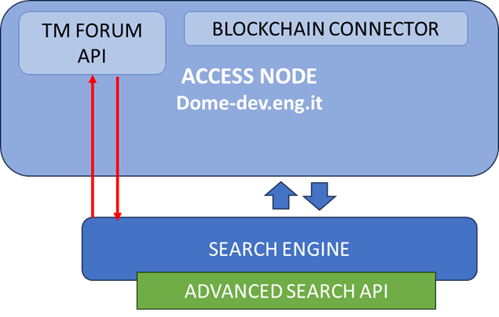

*Figure 5.55 - Search Engine: connection with the Access Node*

Search Engine relies on the DOME Central Marketplace Catalogue. Offerings and public items stored into the central marketplace will be indexed for search and retrieval purposes. Specific mechanisms to index and keep up to date catalogues and related items of the available federated marketplaces will be analysed and implemented following a decoupling approach in order to implement a unique interface independently from the nature of the services offered and the specificity of the marketplace.

### 5.5.1 Indexing subsystem

Indexing is a process of extracting index terms from a large pool of documents collection and organising them using indexing structure to facilitate fast and accurate information retrieval. The purpose of storing an index is to optimise speed and performance in finding relevant documents for a search query. Without an index, the search engine would scan every document in the corpus, which would require considerable time and computing power.

Within the DOME context, two main functions have been established:

- indexing of a new item;

- indexing of a catalogue.

These features will be detailed in the scenarios described below.

#### 5.5.1.1 Indexing a new item 

The following sequence diagram summarises the “indexing of a new item” workflow specific for the context of DOME:

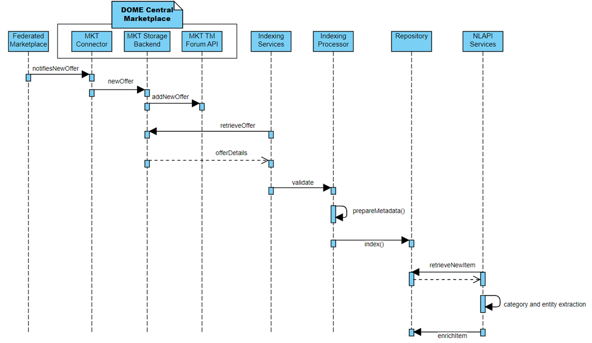

*Figure 5.56 - Indexing a new item*

The Indexing process is started/triggered every time a new item (Offerings or public Items) is created and saved in the DOME central Marketplace.

Once the new offer is validated and stored by the MKT Storage Backend, all the details related to the offer are retrieved by services that have in charge the indexing process. An automatic process validates information just retrieved and prepares the metadata schema to be processed by the indexing operation.

At this point, the indexing process is finalised through the Repository: the schema is stored and available semantic services could enrich the metadata through the category and entity extraction process.

#### 5.5.1.2 Indexing a catalogue

The indexing of a catalogue could be intended as an operation that allows to index a catalogue related to a marketplace. The following sequence diagram is specific for the DOME Marketplace shared catalogue:

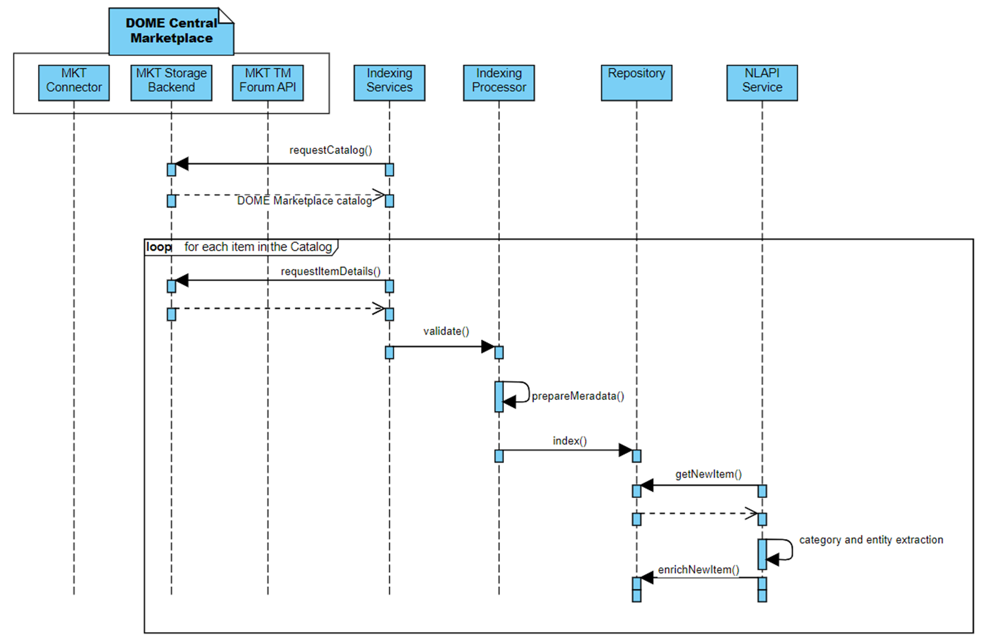

*Figure 5.57 - Indexing a catalogue*

The Indexing process starts with the request of the catalogue to the specific marketplace: for each item in the catalogue (Offerings or public Items) all the related details are retrieved by the services that have in charge the indexing process. Thus, an automatic process validates information just retrieved and prepares the metadata schema to be processed by the indexer operation.

At this point, the indexing process is finalised through the Repository: the schema is stored and available semantic services could enrich the metadata through the category and entity extraction process.

### 5.5.2 Search subsystem

The purpose of the search and retrieval functionalities is to implement a process that helps DOME users to retrieve useful offerings. The most important steps of a search process include:

- The user submits a query to the system through a graphical interface;

- The component, implementing the search and retrieval functionalities, processes the request and retrieves search results;

- The search results are presented through a graphical interface (e.g. in form of card list);

- The user selects a result that can be entities or resources for other operations (e.g. open details);

The following sequence diagram summarises the search workflow specific for the context of DOME:

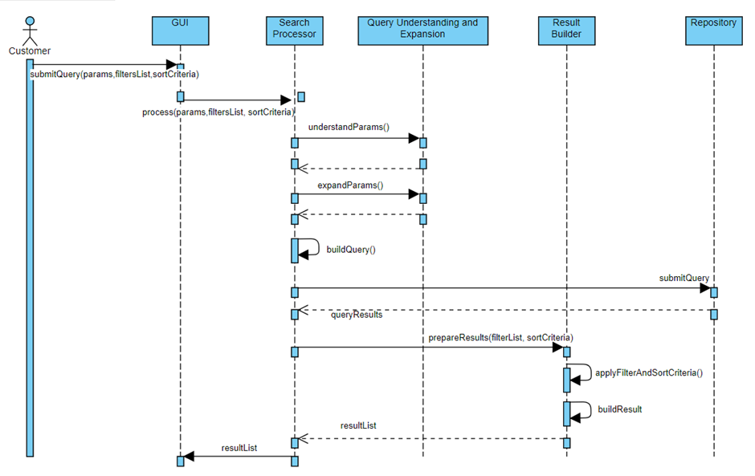

*Figure 5.58 - Search workflow*

The user submits a request to the system through a graphical interface: a request could be composed of keywords to be searched, a list of filters and a list of criteria to be used during results sorting. Furthermore, the user can submit a request in Natural Language. When the request is completed, the query is submitted.

- Assuming that users do not always formulate search queries using the best terms, the user query is pre-processed using available semantic services by extracting semantic meaning from the searcher’s keywords/NL query (Query Understanding) in order to prepare it for a semantic expansion (Query Expansion). During the query expansion stage, the user's input is expanded with additional terms (such synonyms of words, as well as semantically related words) with the aim of improving performance of retrieval operations by the production of better search results.

- At this point of the workflow, the query is expanded but can require a high computational cost to be executed. For this reason, an automatic process will optimise the query in order to speed-up the search process (Search Processor). The Search processor decomposes the complex query in multiple queries resolved through the Repository in order to retrieve results.

- All results coming from queries are merged in one single results list. Also, in order to refine the results, the search processor submits the list of results to a specialised result builder producing a more compact and precise list of results.

- The results list is the input for a first filtering process (filter by User Criteria) that takes care of users filtering options. In this way, it is possible to obtain a filtered list of results that will be finally ordered by user criteria (sorted by User Criteria).

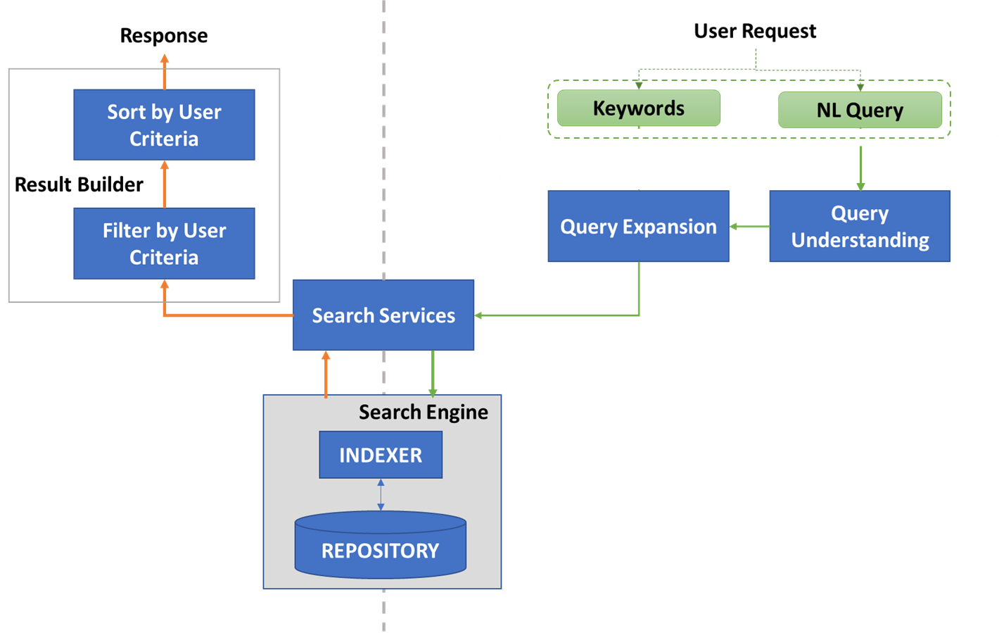

*Figure 5.59 - Search workflow*

### 5.5.3 NLAPI Services

In order to support the indexing and the searching activities, a set of functions based on NLP (Natural Language Processing) and NLU (Natural Language Understanding) have been provided \[[^8]\].

Deep linguistic intelligence makes it easy to quickly analyse text for key elements, relationships, classifications and more, making unstructured data structured. The referred functionalities are the Document Analysis and Document Classification functions.

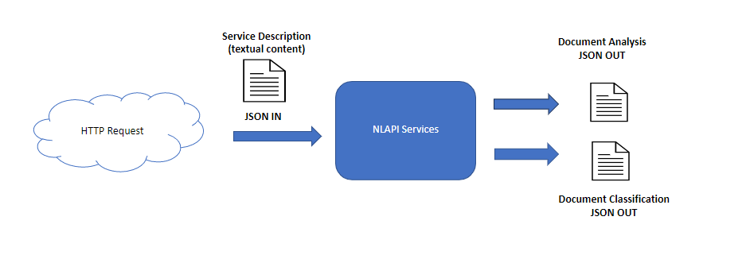

*Figure 5.60 - NLAPI Services Architecture*

#### 5.5.3.1 Document Analysis 

The Document Analysis function allows to disambiguate text and extract key elements, entities, topics, sentiment and more, making sense to unstructured data. The deep linguistic analysis combines text subdivision, part-of-speech tagging, morphological analysis, lemmatization, syntactic analysis and semantic analysis.

Given a textual content, submit it to a document parsing function based on NLP and NLU, it means carrying out a disambiguation process that allows you to have:

- Detailed syntax identifying tokens, part-of-speech tags, phrases, and sentences

- Full dependency tree

- Concept labels pinpointing the precise meaning of each term in the sentence by leveraging context.

Document Analysis Service Description

The json input request must have the structure shown in the figure below:

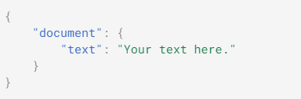

*Figure 5.61 - Document Analysis Service JSON IN*

The document analysis service processing, for the considered purpose, will carry out what is defined as Full Document Analysis. The Full Document Analysis is structured as follows:

- **Deep linguistic analysis:**

<!-- -->

- Text subdivision: Paragraphs, Sentences, Phrases, Tokens, Atoms detection

- Part-of-speech tagging: marking up each token with the corresponding Universal POS tag

- Morphological analysis: lexical and grammatical features of each token

- Lemmatization: tags tokens and atoms with their corresponding lemmas

- Syntactic analysis: parsing process that detects the universal dependency relation between each token and the sentence root token or another token

- Semantic analysis: maps tokens to the Expert.AI internal concepts storage

<!-- -->

- **Keyphrase extraction:**

  - Relevant topics

  - Main sentences

  - Main phrases

  - Main concepts

  - Main lemmas

<!-- -->

- **Named entity recognition**: which entities—persons, places, organisations, dates, addresses, etc.—are mentioned in a text and the attributes of the entity that can be inferred by semantic analysis.

<!-- -->

- **Relation extraction**: labels concepts expressed in the text with their semantic role.

Main concepts are returned as Expert.AI internal concepts storage "syncons" and enriched through knowledge linking: open data—Wikidata, DBpedia and GeoNames references—are returned. In the case of actual places, geographic coordinates are also provided. Relevant topics are chosen from the Expert.AI internal concepts storage.\[[^9]\]

Named entity recognition, relation extraction also perform knowledge linking:  Expert.AI internal concepts storage information and open data —Wikidata, DBpedia and GeoNames references — are returned for entities, relation items, text items that express sentiment corresponding to syncons of the Expert.AI internal concepts storage.

The JSON output will have the structure shown in the figure:

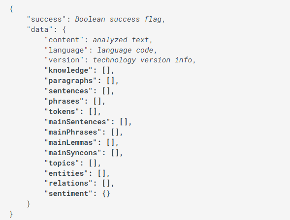

*Figure 5.62 - Document Analysis Service JSON IN*

#### 5.5.3.2 Document Classification 

The Document Classification function allows analysing text to label and identify media topics, emotional traits, geographical references and more, allowing to classify and to categorise texts. It is based on the Expert.AI internal concepts storage along with the IPTC[^10] taxonomy, to allow wider ways to classify and categorise texts. The IPTC Media Topics taxonomy is the global standard for news media.

Process a document by Document Classification based on IPTC taxonomy, it means intercepting, within the processed text, the textual sections that refer to the managed IPTC categories.

Document Classification Service Description

The json in, in the service request, must contain the text to classify; it will have the structure shown in the figure below:

*Figure 5.63 - Document Classification Service JSON IN*

Submitting a text to the classification process means to determine what the text is about, on the basis of a given taxonomy category.

The provided Categorization Service is based on the IPTC Taxonomy and the json out from it will report indications regarding the success or failure of the classification operation, the precise content of the input text, the language in which the text is written and the array of the intercepted categories, as shown in the following figure:

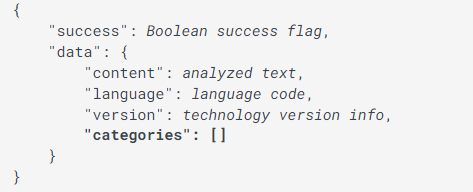

*Figure 5.64 - Document Classification Service JSON OUT*

The array categories elements will be json objects of the following type:

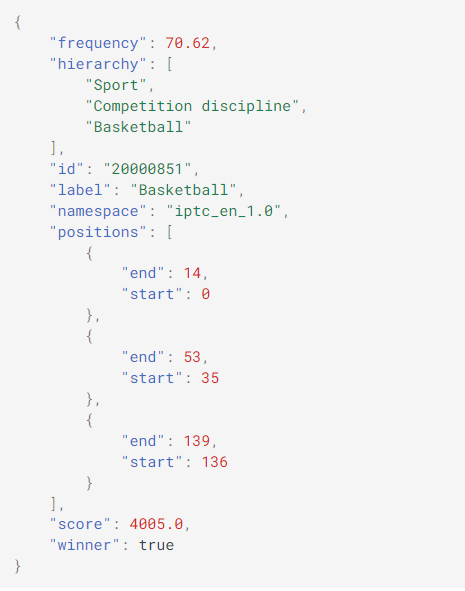

*Figure 5.65 - Document Classification Service JSON OUT Categories*

In each category json object there will mainly be the following informations:

- **Namespace**: the name of the software module containing the reference taxonomy

- **id**: category identifying code

- **label**: category description

- **hierarchy**: category membership hierarchy

- **score**: category cumulative score

- **frequency**: the percentage ratio of the category score to the sum of all categories' scores

- **winner**: a Boolean flag set to true if the category was considered particularly relevant

- **positions**: an array containing the [<u>positions</u>](https://docs.expert.ai/nlapi/latest/reference/positions/?) of the text blocks that contributed to category score.

#### 5.5.3.3 NLAPI Use Example

An example of practical use of the NLAPI functions is described below.

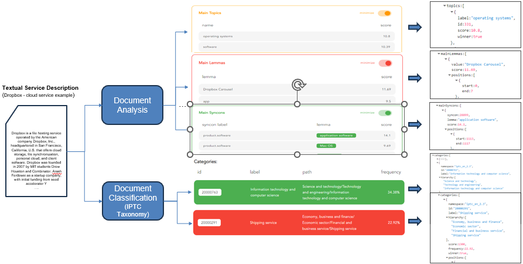

*Figure 5.66 - NLAPI Use Example*

Supposing the submission of a file hosting service textual description, in this case Dropbox\*, to the NLAPI functions described above. The Document Analysis Function will report, in the json out:

1.  main topics, coming from a recognition activity of main arguments dealt with in the document, such as "software", "computer science", "commerce", as shown in the figure below:

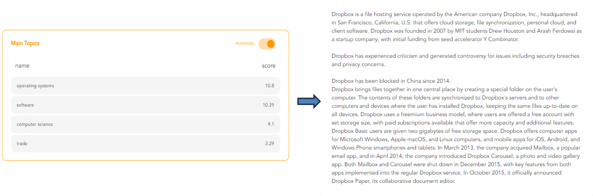

*Figure 5.67 - Dropbox Main Topics*

2.  main lemmas, that represent the key concepts mentioned within the document, such as “Dropbox Carousel”, “app”, “software”, as follow:

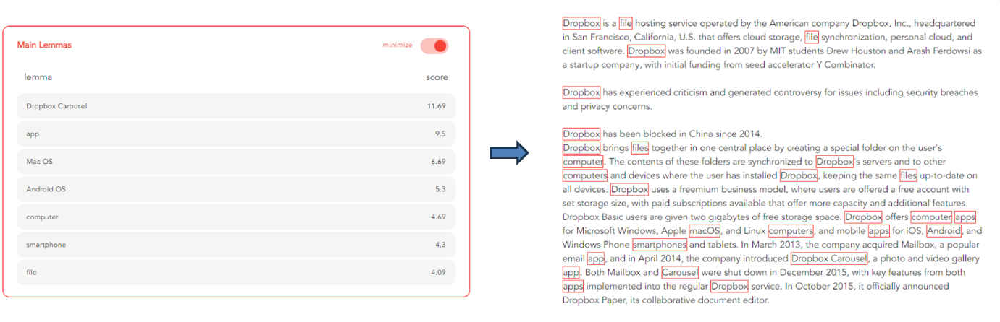

*Figure 5.68 - Dropbox Main Lemmas*

3.  main sentences, that is the sentences that bring the principal informative charge of the entire document; they are selected by exploiting sophisticated linguistic algorithms:

*Figure 5.69 - Dropbox Main Sentences*

4.  main phrases, that are mainly composed lemmas that describe advanced concepts:

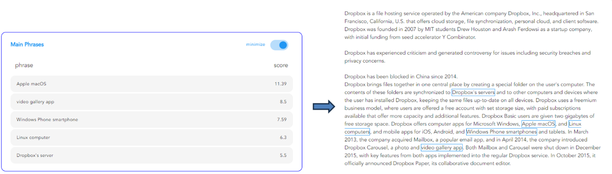

*Figure 5.70 - Dropbox Main Phrases*

5.  labels like “product.software”, “artifact.instrument” and so on, that come by exploiting the linguistic semantic network at the basis of the NLP technology:

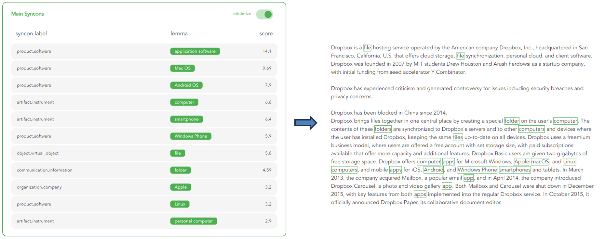

*Figure 5.71 - Dropbox Main Symcons*

6.  entities such as “Product”, “Activity/Company”, “Organization” and other property values ​​expected from the full document parsing function:

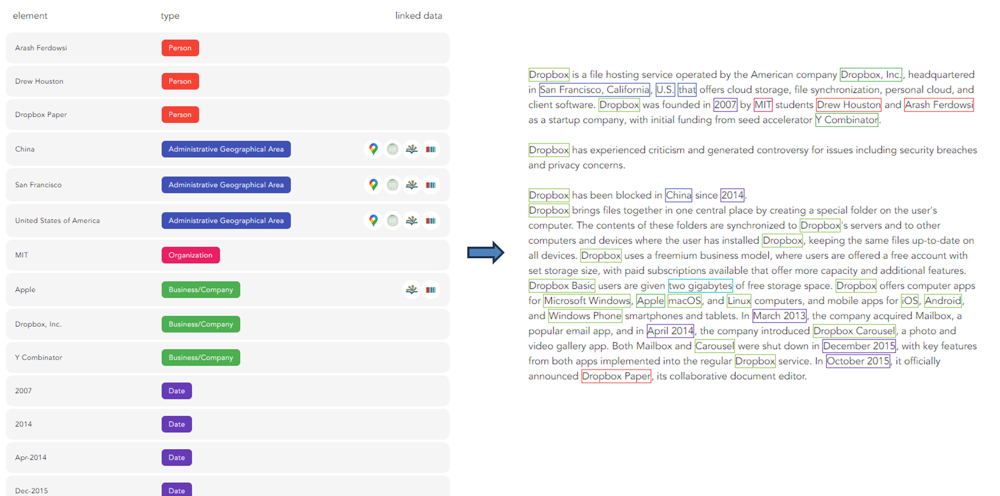

*Figure 5.72 - Dropbox Entities*

The Document Classification function will intercept main categories, such as "IT and information technology"; it represents the advanced function respect to the main topics extraction, and exploits vertical rules developed for a specific domain through a specific taxonomy:

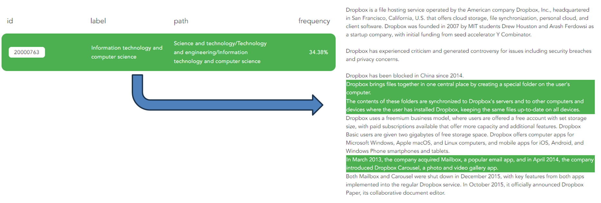

*Figure 5.73 - Dropbox IT Category*

Another example of category result, "Shipping services", is shown below:

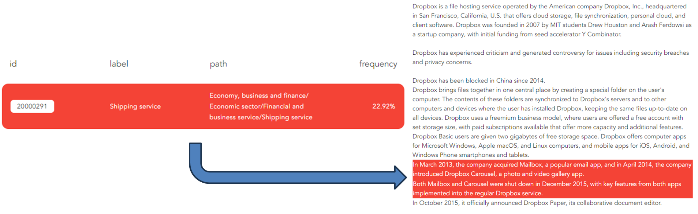

*Figure 5.74 - Dropbox IT Category*

The last described analysis has been performed by implementing linguistic rules based on the IPTC taxonomy.

## 5.6 Monitoring, Reporting and Analytics

This subsystem deals with monitoring, reporting and analytics capabilities on business-level KPIs. It is intended to be used by different DOME user types, like the service providers and consumers, federated marketplaces operators and the DOME operator. It allows the creation of datasets out of different database data sources, which are either located on the DOME infrastructure or on the federated Marketplaces infrastructure. These datasets can be further refined and analysed, and then visualised in a number of different appropriate types of graphs and charts. The visualisations can be then combined into dashboards, according to the user’s preferences. The dashboards can be also shared across users, as appropriate.

The scope of the tool’s use for the different user types is as follows:

- The DOME administrators can view visualisations related to the negotiations, purchases, conflicts, popularity of services, etc.

- The Service Providers can view visualisations relevant to their own services, on the one side related to negotiations and conversions to purchases, popularity of their services, while they can also -optionally- add their own custom metrics coming from their infrastructure related to their specific services and other providers’ related services. While it is expected that service providers will have their own monitoring solutions, the integration of data coming from different sources allows DOME to act as a central monitoring location for scattered services, and also allow them to make these metrics available to their customers.

- Service customers can view the metrics of their purchased services, coming from different service providers, but all accessible through DOME.

The main functionalities of the Monitoring, reporting and analytics tool include:

- Adding data sources and specifying datasets.

- Creating data visualisations, in a wealth of different kinds of visualisations, with customisable data queries.

- Composing data visualisations into different monitoring dashboards.

- Sharing datasets, data visualisations and monitoring dashboards with other DOME users.

- Importing and exporting through web user interface and APIs.

- Preconfigured DOME KPIs.

The application utilises the open source software Apache Superset ([<u>https://superset.apache.org/</u>](https://superset.apache.org/)). As such many features are already implemented.

### 5.6.1 Internal tool architecture

The internal architecture of the Monitoring and Analytics tool is given in the figure below.

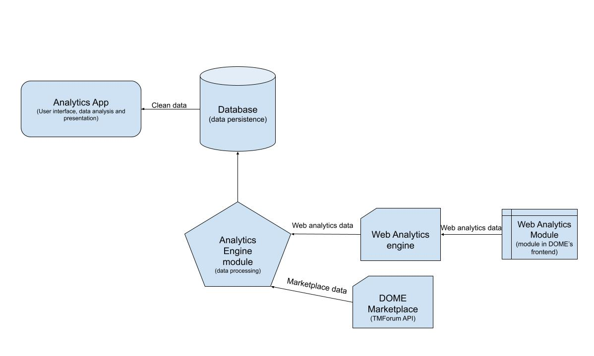

*Figure 5.75 - Internal architecture of the Monitoring and analytics tool*

The analytics engine module operates as a backend mechanism to fetch the data from multiple sources. One source is the web analytics module which is in DOME’s front-end marketplace. The other source of data is DOME’s TMForum API where the marketplace data is related to the marketplace products, service information and users. This module will then persist the data on the database.

The analytics application fetches the data from the database and handles the frontend user interface. It is responsible for user authentication and authorisation, relying on username and password authentication mechanisms. It manipulates data and produces charts.

- Database: Persist data and information collected from different data sources.

- Analytics Engine Module: Cleaning and analysing data. Information extraction. Fetches data from data sources, consolidating it and preparing it for persistent data storage, as needed by the analytics

- Web Analytics engine: Web analytics and user navigation tracking engine.

- Web Analytics Module: Sends data regarding navigation and tracking from the DOME front-end (Portal).

Monitoring dashboards access data from two locations:

1.  The DOME decentralised storage, to provide the monitoring of predefined KPIs and metrics that DOME stores according to the TMForum specification.

2.  Web tracking and statistics from web portal

At a later stage, and upon confirmation of business need another data source may be added:

3.  The federated marketplaces or providers, to provide custom-defined metrics with data that is stored on their own databases, which do not participate in the DOME data federation (are not available in the TMForum specification).

Additional SQL APIs may be used to access data stores for custom metrics.

The DOME administrator can add, modify and delete the preconfigured KPIs.

### 5.6.2 Creating the monitoring dashboards

#### 5.6.2.1 Data source

‘Data source’ refers to a data store that can be accessed via an SQL API. There are two types of data sources in DOME:

- Data source that is managed by DOME, and

- Data sources that are managed by the federated marketplaces or service providers, and which do not federate their data in the DOME data federation. Access to these data stores may be useful to customise service-specific metrics.

Only the DOME administrator is able to add a data source. The configuration for accessing the Persistence Layer storage is done only once, and does not need to be modified. The DOME administrator is able to add more data sources if needed.

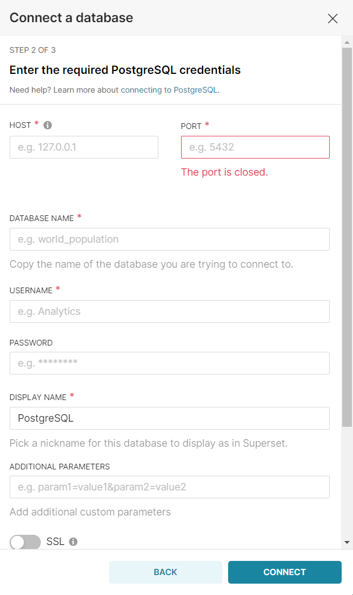

*Figure 5.76 - Adding a data source (DOME administrator only)*

The federated marketplace operator and the service provider are not able to add data sources directly on the monitoring dashboard. Instead, they can submit data store access information and suggested metrics via using the portal. The DOME administrator reviews the submitted information, and approves the addition of the data source to the monitoring dashboards. If the data source conflicts with any of the DOME terms and conditions, the addition of the data source may be rejected.

In general, data sources are already preconfigured for both the DOME administrator and users. However, the feature to easily add more data sources allows more efficient future potential extension of the data to analyse.

#### 5.6.2.2 Dataset

Data sets are defined from the data sources and specific schemas that the user has access to. The DOME operator sets up the datasets for the preconfigured KPIs. The federated marketplace operator and the service provider can also set up datasets within their own data sources.

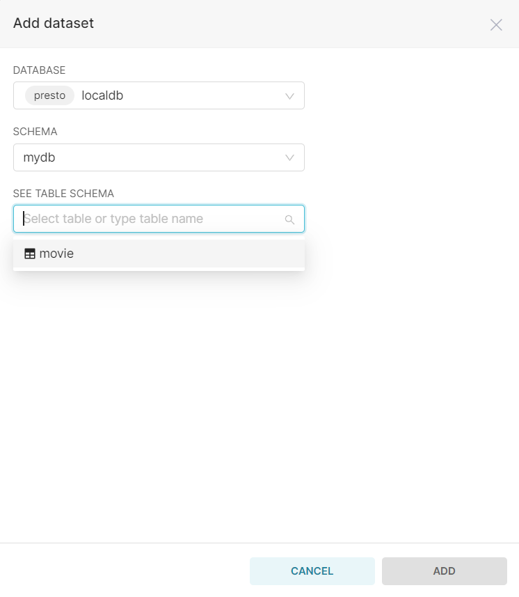

*Figure 5.77 - Adding a dataset out of a data source.*

#### 5.6.2.3 Data visualisation

The user that has access to a data set can create their own visualisations in the form of various kinds of charts, depending on the purpose of visualisation. These include: line charts, correlation, gauges, numbers, pie charts, bubble charts, heatmaps, location maps, histograms, area charts, tree charts, etc.

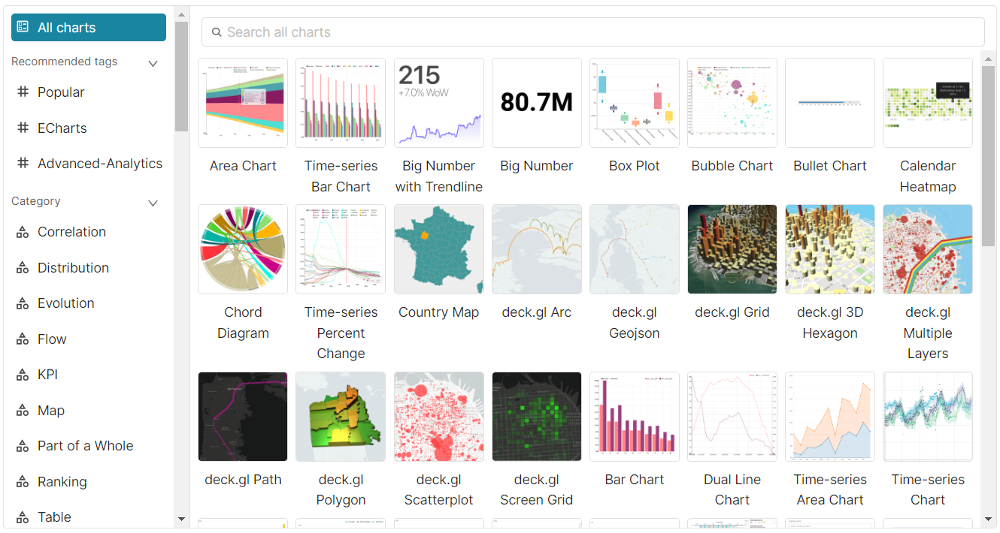

*Figure 5.78 - Examples of available data visualisation chart types.*

After selecting a data set and the chart type, the user is able to define the query for the data visualisation using graphical elements and menus, that assist the query structuring by showing the available options. The user is also able to modify the SQL query directly, for more advanced processing. The DOME administrator pre-configures the charts for the preconfigured KPIs, however users are also able to duplicate the existing charts and create their own visualisations on the preconfigured datasets.

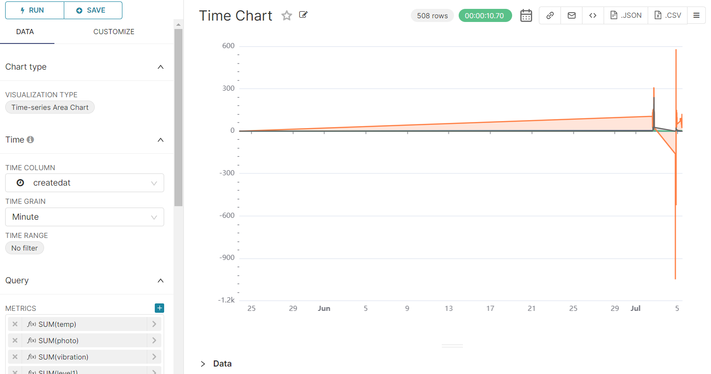

*Figure 5.79 - Configuring the data visualisation chart.*

#### 5.6.2.4 Monitoring dashboard

The user can compose the created data visualisation (graphs) into customised monitoring dashboards.

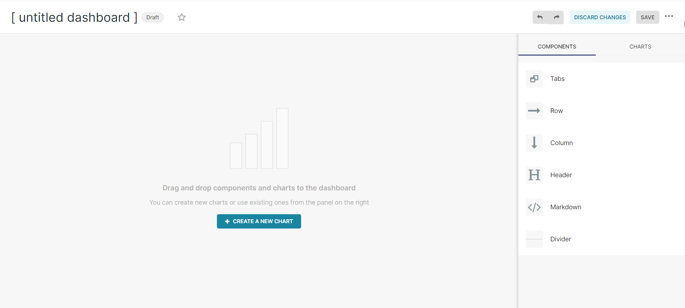

*Figure 5.80 - Creating a new monitoring dashboard.*

The users can view a list with the charts they have access to, and by drag & drop they can add the chart to their dashboard.

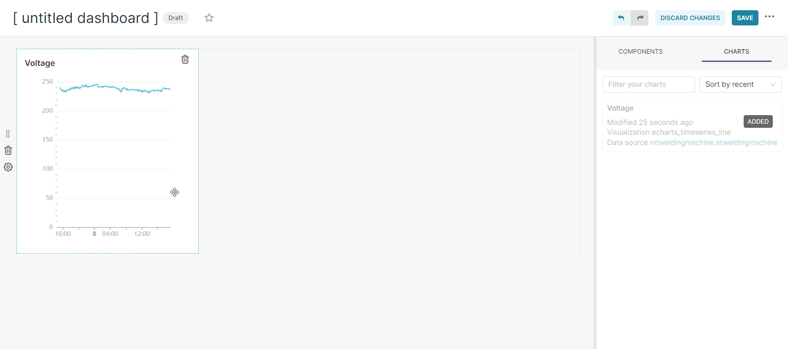

*Figure 5.81 - Adding a chart in the dashboard by drag&drop.*

The positioning and the dimensions of each chart can be modified, while it is also possible to add graphical elements like titles and markup.

*Figure 5.82 - Modifying charts in a dashboard and adding graphical elements.*

### 5.6.3 Accessing monitoring dashboards

#### 5.6.3.1 View and edit a monitoring dashboard

The user can view the list of dashboards they have access to, i.e., the dashboards they have created and the dashboards that have been shared with them.

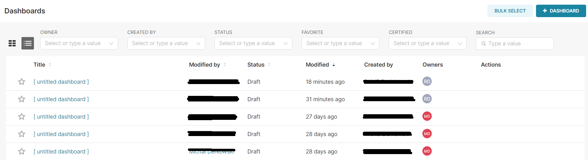

*Figure 5.83 - List of accessible dashboards.*

When opening a dashboard, it is launched in ‘view’ mode. By clicking the relevant icon, the user can directly start editing the dashboard, i.e., change the formatting, modify the charts included, add other elements, etc.

*Figure 5.84 - Start editing an existing dashboard.*

#### 5.6.3.2 Managing permissions and sharing

The tool has its own internal specialised permissions management.

The DOME administrator can specify permissions in terms of access to specific functionalities, data querying and data access to users and user groups. Permissions for accessing a limited set of functionalities can also be assigned to all the users, e.g. for demo purposes.

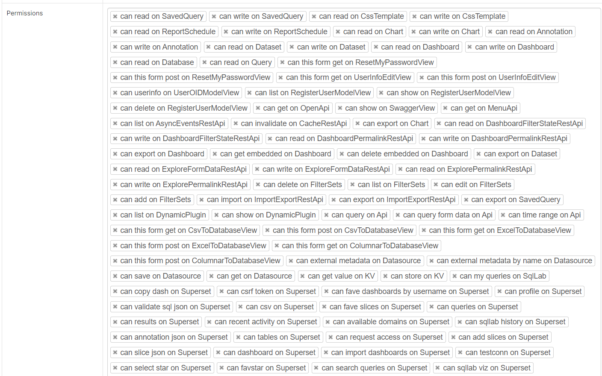

*Figure 5.85 - Part of permissions that the DOME administrator can assign to users and user groups.*

On the other hand, each user can specify access to their own datasets, charts and dashboards. In such a scenario, data visualisations can be shared across different user groups within DOME, like a service provider and a service consumer. It needs to be noted that the authorization is verified in all the steps from the dashboard to the dataset. For example, to view a dashboard that contains a chart, the user needs to have access to the dashboard, the chart and the dataset.

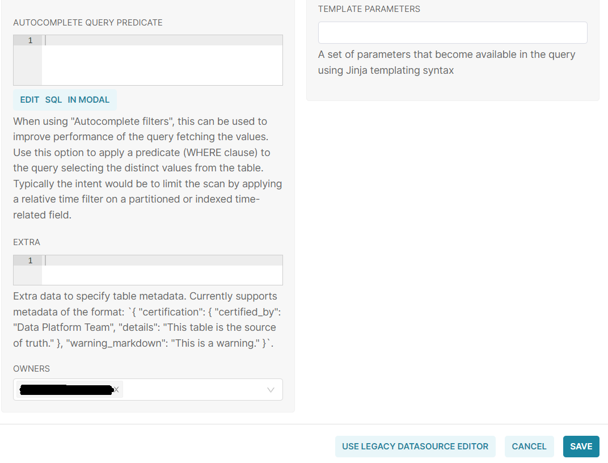

*Figure 5.86 - xxx*

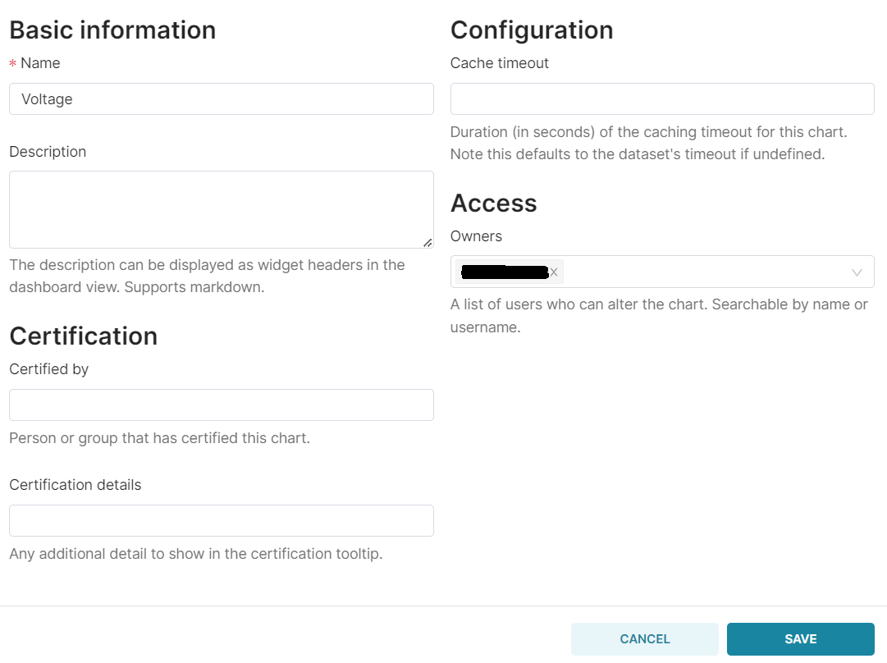

*Figure 5.87 - xxx*

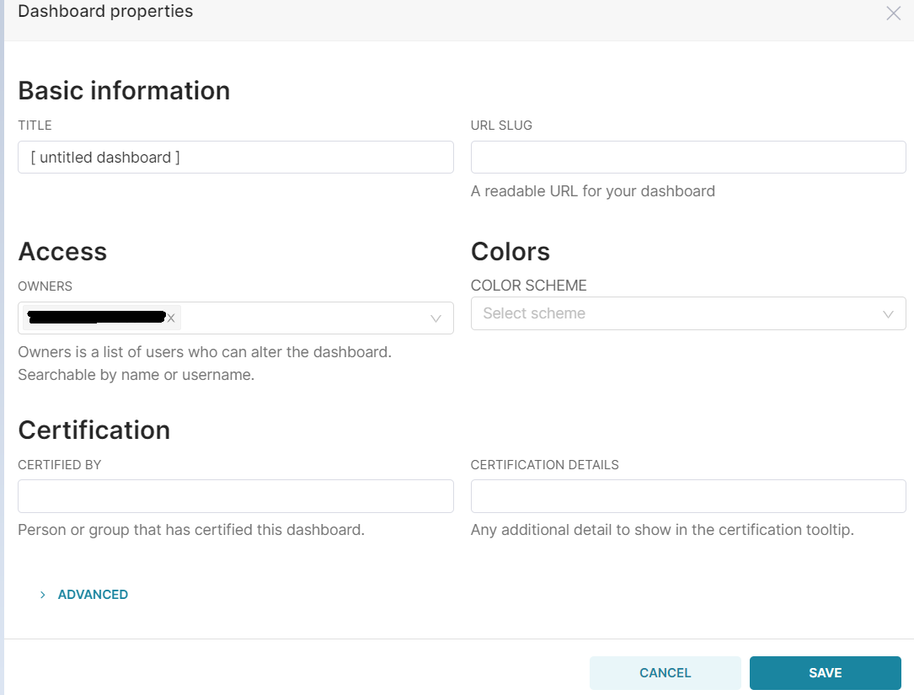

*Figure 5.88 - A user can be granted access to a dataset, chart and dashboard by adding them in the ‘OWNERS’ fields*

### 5.6.4 Importing, exporting and APIs

#### 5.6.4.1 Import and export via web UI

The web interface provides access to importing data in the form of .csv, columnar or excel files. The user must already have access and write permissions to an existing database, where the imported data will be written. The user must specify the database to be used, the table to be created and the database schema.

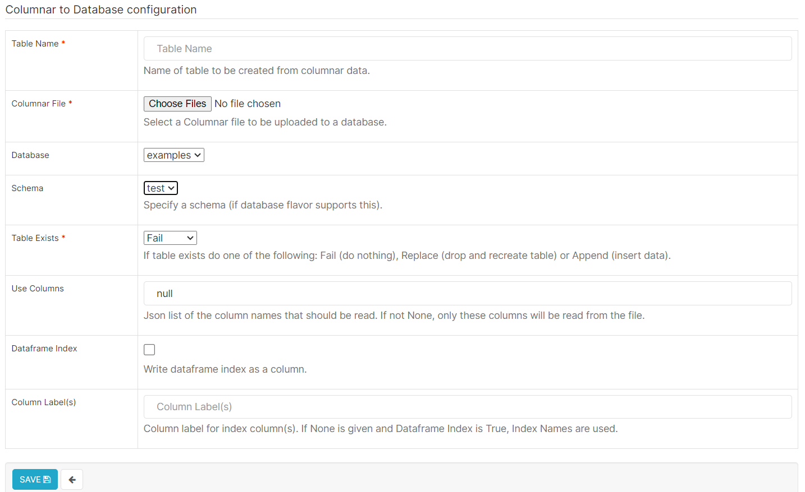

*Figure 5.89 - Importing data through .csv, excel or columnar file*

The user can also export the data of a chart through the chart editing section. The chart values can be exported into .json or .csv format. The export to image of the chart is also available.

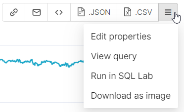

*Figure 5.90 - Export options for a chart*

#### 5.6.4.2 Monitoring dashboard-specific API

The tool has also an API for executing advanced functions. Access to this API will be provided only to authorised users or federated marketplace operators. The API follows the openAPI specification and provides a web page (‘swagger’) where all the available functions can be viewed, along with instructions on how to execute the API calls and the expected responses. Among others, the API calls allow the authorised user to import and export database, dataset, charts and dashboard configurations, as well as get list, create and delete charts, datasets, dashboards, filters and queries.

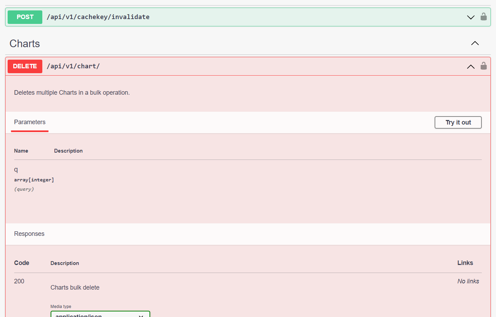

*Figure 5.91 - Web page with all the available API calls, instructions on calls and responses*

### 5.6.5 Preconfigured KPIs

The DOME admin can pre-configure metrics (KPIs) that are by default available to the different DOME user types. While these metrics can be configured via the Graphical User Interface, a set of indicative KPIs are given here for complementarity. These may be easily modified and extended during the DOME operation, according to new needs identified. Additionally, it is possible to filter the visualisations, selecting e.g. visualisations for only a specific date range, company, service, etc.

#### 5.6.5.1 All

This paragraph described the preconfigured KPIs that are available to any DOME user.

- Number of Service providers

  - Total

  - Registered directly in DOME - from federated Marketplace (and which)

- Average number of Service providers per year quarter

  - Registering in DOME

  - Added from federated Marketplace (and which)

  - Requesting verification

  - Getting verified

- Average time for service provider to get verified

  - From registration to requesting verification

  - From requesting verification to being verified

  - From registration to being verified

- Average number of Service providers per year quarter

  - Added from federated Marketplace (and which)

  - Getting verified

- Number of offered services

  - Total

  - Catalogued directly in DOME - from federated Marketplace (and which)

  - Average per Service Provider

  - Per type of service

#### 5.6.5.2 Service consumer

This paragraph describes the additional preconfigured KPIs for the service consumer.

- Complaints

  - Average time for ticket to move from open to resolved

#### 5.6.5.3 Service provider

This paragraph describes the additional preconfigured KPIs for the service provider.

- Average number of Service providers per year quarter

  - Requesting verification

- Average time for service provider to get verified

  - From registration to requesting verification

  - From requesting verification to being verified

  - From registration to being verified

- Complaints

  - Average time for conflict resolution ticket to move from open to resolved

- Number of visits to own profile and per offered service

#### 5.6.5.4 Federated marketplace provider

This paragraph describes the additional preconfigured KPIs for the federated marketplace provider.

- Average number of Service providers per year quarter

  - Registering in DOME

- Price of services

  - Total average

  - Average per service type

- Service sales

  - Number of services sold through DOME

  - Total value of specific’s marketplace services sold through DOME

  - Average value of specific’s marketplace services sold through DOME

  - Average value of specific’s marketplace services sold through DOME, per service type

- Complaints

  - Number of conflict resolution tickets for Service providers coming from the specific federated marketplaces and status

- Web portal statistics

  - Number of visitors on portal

  - Aggregation of visits to service and service providers per federated marketplace

#### 5.6.5.5 DOME operator

DOME operator views all of the above metrics of all user types, and in addition:

- Number of Service providers, and

  - Verified - non verified

  - Removed

- Average number of Service providers per year quarter

  - Registering in DOME

- Service sales

  - Number of services sold through DOME

  - Total value of services sold through DOME, per service provider directly registered in DOME and federated marketplace, and which.

  - Average value services sold through DOME, per service provider directly registered in DOME and federated marketplace, and which.

  - Average value services sold through DOME, per service type

- Number of complaints

  - Total number of conflict resolution tickets and per status

  - Number of conflict resolution tickets per service provider and status

  - Number of conflict resolution tickets for service providers coming from federated Marketplace (i.e., per federated Marketplace) and status

- Web portal statistics

  - Source of visits

  - Number of new registrations and per user type

  - Number of page visits and aggregated popularity list

  - Number of visits to specific service provider profiles and aggregated popularity list

  - Number of visits to specific services and aggregated popularity list

  - Average time spent

### 5.6.6 Analytics

Apart from the above KPIs, data processing and visualisation charts that allow the better understanding of the data and assist in business-level decision making are available within the tool. Τhese include at least:

- Traffic analysis daily (\[Filters: Time Range, Page(s)\])

  - Table with the top 5 most visited pages

  - Line chart showing changes in visits over time for each page

  - The total number of visits to the site

- Traffic analysis monthly (\[Filters: Pages, month(s) selection\])

  - Map showing total visits for each country

  - Table showing the top 5 pages on which users spend the most time (on average)

  - Pie chart showing the actions users have taken on each page of the site

  - Bar chart showing total visits and unique visitors for each page

  - Bar chart showing the exit rate for each page

  - Pie chart for the source of the visit (search engines, etc.)

  - Bar chart showing the bounce rate for each page

  - Parallel chart showing for each page the metrics: Total Visits, total actions, Average Exit rate and average bounce rate

  - Waterfall chart of the increase in visits over the selected time period

  - Bar chart of the average visits per user

- Services & Sales analysis (Filters: month selection, Brand(s), Service(s))

  - Bar chart showing for each month how many services have been added

  - Tree map showing all the services provided, divided by the categories to which they belong (PaaS\>web servers etc.)

  - Bar chart showing the services provided per company/brand

  - 2 Lines plot showing total sales and services sold for each month

  - Heatmap showing monthly sales of each brand

  - Heatmap showing monthly sales of each service

  - Bar chart showing the conversion rate for each month

  - Bar chart showing the churn rate for each month

  - Bar chart showing the new subscribers for each month

  - Waterfall chart showing the average time for every step of subscription (registering, verification and definition and pricing) and their total time

  - Lines chart showing the changes in visits for each service by month

  - Bubble chart showing a grouping (clustering) of services for the last 3 months by customers and visits

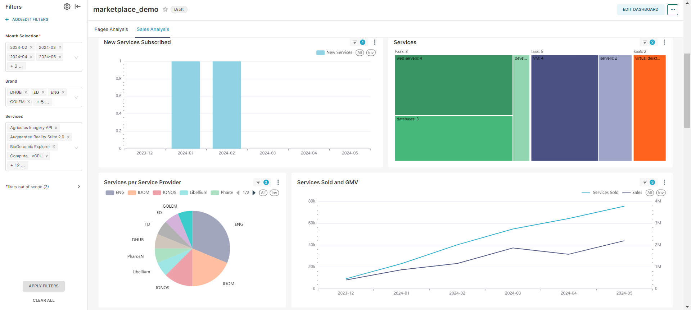 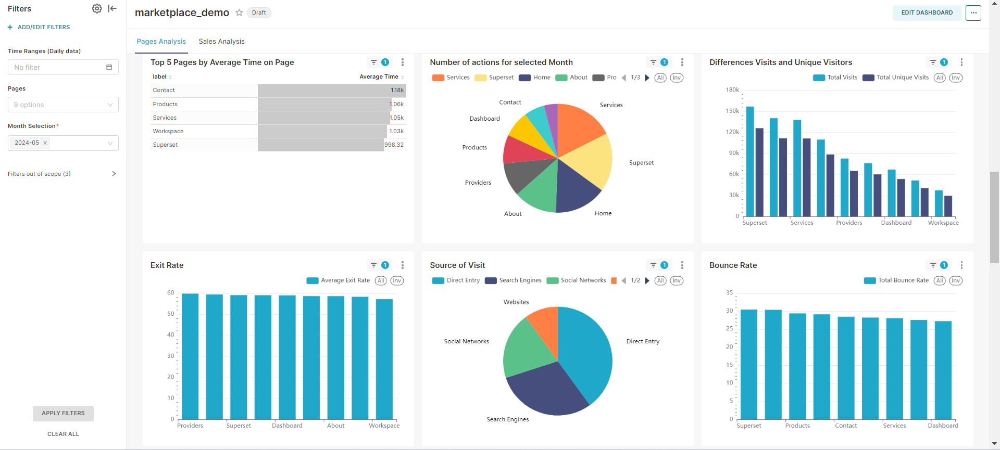

*Figure 5.92 - Indicative analytics dashboards*

## 5.7 User Support

### 5.7.1 General Concepts

#### 5.7.1.1 Focus of the customer service 

The customer service focuses on solving any kind of need the portal user may express in relation to the DOME ecosystem).

While this excludes the direct support on services provided by 3rd parties (Providers) through the DOME catalogue, in charge of the specific provider, it considers the management of requests about such a product but only to forward those questions to the right response centre.

This excludes all back office maintenance activities that will be addressed as operations procedures OPERATIONS PROCEDURES in another task of the project (ex.: Federating a new marketplace, creating new categories on the portal, integrating a new payment gateway and so on).

In terms of contents the customer service will focus on the DOME portal usage/usability.

This includes following features:

- User guide (how to perform specific actions/operations)

- Troubleshooting guide (how to address malfunctions)

- Recovery guide (how to recover from wrong operations)

The above features will be designed to cover the needs of following kind of users:

- Buyers (any categories)

- Publishers (catalogue owners)

A limited support (documental knowledge base only) will be provided to those content categories:

- Integration services (API documentation)

No support is actually expected to be provided on following contents:

- Usage and troubleshooting of Product/services procured on the catalogue (support in charge to the product owner)

#### 5.7.1.2 Roles/people involved in customer support 

As we previously said the scope of the customer support is to help the portal users (mainly buyers and sellers) in addressing any kind of issue (information query or malfunction management) related to the DOME portal.

The operational model we’re aiming to implement sees a first level team acting as primary contact point and a second level support acting as specialistic competence centre.

We’re aiming to solve at first level any kind of info request through self-service utilities (an online help system) and through an automated chatbot, able to interact in natural language and specifically trained to answer about the DOME portal. We strongly rely on the capability of the chatbot automation to satisfy the customer requests and so the usage of first level human operators will be very limited. Both the 1st level support operator and the chatbot will be trained on a common knowledge base containing all the needed information about the platform usage and functionalities.

A different approach needs to be put in place to build the 2nd level support team.

This team, during the project development time and until the DOME operator will not take care of the service, will be built aggregating all the competence centres that will contribute in the creation of the different portal modules and functionalities in order to be able to manage any kind of troubleshooting request coming from the real portal users. The 2nd level support team is committed to building and improving the platform knowledge base the 1st level will rely on.

#### 5.7.1.3 Language 

All the DOME portal contents will be provided in English, including the customer support interface.

The introduction of the capability to handle multi language contents will be later evaluated as an optional enhancement of the platform.

#### 5.7.1.4 Managed Data 

The customer service scope is the portal functionalities usage. This means that the 90% of the handled data is generic technical data describing the portal functionalities and the operation process. In some case the Customer service platform may touch some customer referred data:

1.  Business data related to the submitted orders, their billing, the kind of subscribed services and so on.

2.  Personal data mainly related to contact needs (phone number, shipment address, email contact etc.) or business/payment needs (bank/credit card accounts, legal entity name, company role, and so on).

Being not sensitive data information, there are no specific treatment requirements but as an additional customer care policy all such data will be encrypted both at rest or in transit during all the customer interactions.

The chatbot will be instructed to avoid the exploitation of any personal data just reporting the customer the link of the management function where he can find the requested information in a private protected panel.

### 5.7.2 Customer support technical platform

The customer can engage the customer support through on-line services only. Phone or email communication may be activated, upon needs, by the customer support team to provide the requested assistance but not as an entry point. The service will rely on 3 main tools that are described hereafter.

#### 5.7.2.1 Knowledge base 

A structured knowledge base will be provided as a complementary component of the portal baseline to collect all the relevant information to support the day-by-day operations of the various portal user categories. The knowledge base contents will be provided by all the project members contributing in the building of the portal functionalities.

The platform to handle the knowledge base has not been yet identified but following requirements have been already pointed:

- The platform must be freely accessible by the customers through the chatbot.

- Contents will be filtered upon the user type: Guest/Authenticated.

- The platform must be accessible by the customer support team (operators) through a web interface or the chatbot.

- The knowledge base contents reference language will be English. The capability to handle multilingual contents will be evaluated lately as an optional feature.

One of the primary criteria we are trying to address is the simplification of the knowledge base content publishing. Being an effort consuming task as much as we can simplify it as much content we will have from the contributors.

The simplest solution is the creation of a blob repository full of readable documents that can be indexed by the chatbot that will lately re-generate the text in a readable format for the user.

The Knowledge base solution should rely on a high availability platform able to ensure business continuity and data integrity.

#### 5.7.2.2 Chatbot 

An AI based chatbot will allow the customer to perform any kind of query/investigation on the knowledge base information base and to ask for support in case of issues or malfunctions.

The chatbot will act as a standard help desk operator, dealing through natural language, understanding the customer request and providing readable answers. In some cases it can interact with the portal API to gain specific information through the platform. This will be based on a proprietary Engineering DHUB tool (GPT 3.5 enabled), that is part of our managed services tools suite, vertically customised and trained to answer about the portal usage and troubleshooting.

The baseline to train the chatbot will be the Knowledge base platform. This means that adding new contents to the knowledge base will enable the capability to extend the knowledge of the chatbot.

The chatbot will provide more specific assistance to registered users and more general information to guest users visiting the website (user category weight) and will be equipped with “filtering” capabilities in order to avoid answering some specific categories of questions.

Note: being not part of the core components of the portal this is outside the scope of the open source released packages.

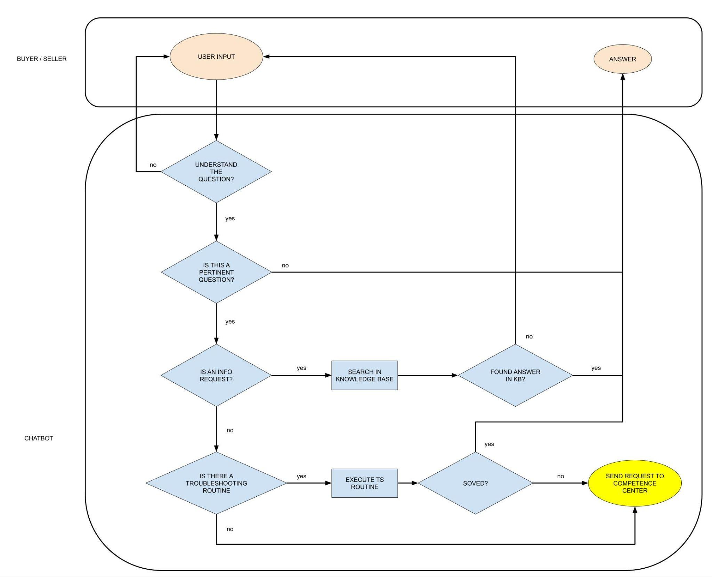

*Figure 5.93 - Request processing within the Chatbot*

This solution is designed to work without accessing any data or general information outside the DOME marketplace perimeter. This means that all data exchanged between users and the chatbot still remain in our infrastructure and there aren’t any other 3rd party tools involved in the entire data elaboration process.

The platform architecture will include following components:

- GPT chatbot engine: the conversational engine that communicates with the user and is able to understand requests and to query, as needed, the APIs of the store or the Information Retrieval engine, which will be created through fine tuning on specific vertical documentation on the subject.

- Information Retrieval Engine: it is the engine that extracts from the documents the information useful for responding to user requests

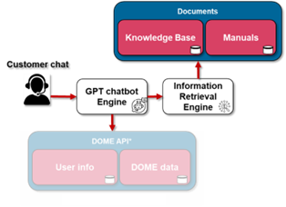

*Figure 5.94 - Overall interactions among chatbot and dome components*

- Documents: it is the database containing the information describing the vertical domain in which the chatbot must be an expert.

Note: DOME API are not part of the chatbot implementation

##### 5.7.2.2.1 Input data 

The implementation of the chatbot will rely on following inputs:

- Knowledge Base & Manuals: Documentation containing domain information that the chatbot must be familiar with

- Examples of DOME API interactions: the examples of output that the API interface can provide to the chatbot when the conversational engine decides to query the platform.

##### 5.7.2.2.2 Provided functionalities 

- Ability to understand natural language user requests

- Ability, based on user requests, to execute flows of actions (or workflows) described by the use cases identified in the analysis phase

- Ability to extract information from the document base to answer user questions

- Ability to query DOME APIs to perform useful actions to respond to user requests

#### 5.7.2.3 Troubleticketing system 

Where the chatbot will not be able to provide the correct feedback to the user, it will rely on a physical person (technical operator) that will perform the investigation on his behalf. This kind of activity is usually tracked through a troubleticketing system able to keep tracking of the request, of the provided answer and of the global performance of the support service (time to solve the issues).

The involvement of human operators may occur at 1st level (the user may ask the chatbot to talk directly with an operator) or in case of malfunctions requiring the intervention of a 2nd level competence centre.

To track the support activities an ITIL compliant troubleticketing system will be introduced as a baseline platform. This platform must ensure traceability and measurability of the activities performed by the customer support team.

Assuming the involvement of a future DOME operator as owner of the Customer support service this can be his own original troubleticketing system.

Until the appointment of the DOME operator a dedicated troubleticketing system must be provided.

The troubleticketing system must rely on a High Available platform ensuring business continuity, data preservation, and security.

While the knowledge base will handle potentially all the relevant information query raised by the customer, the trouble ticketing system has the mandatory responsibility to enable the customer requesting support for custom cases or for situations that he has not been able to address and solve through the knowledge base. In this sense the availability of a communication channel allowing the capability to simply describe in natural language the support request is a mandatory feature that we need to provide since the first release of the platform. It can be a simple web form or an email address, and later, according to the evolution of the platform, can grow up to a multi-channel communication service if needed.

Enabling a communication channel with the user is not only a matter of letting him express the request, but also to trace all the customer contact. This tracing capability enables the capability to later review those requests better understanding potential service weakness and to define a continuous improvement strategy. While a first draft version of the service, to be used in the early stages of the development, can be based on a simple input form, to have an effective and efficient collection of the user request it’s important to have the capability to classify at first contact the user request. As baseline the request must be tagged with following attributes:

- Context. The identification of the area the request is referring to (ex. Billing or catalogue browsing) allows the capability to focus a search in the knowledge base or to identify the correct competence centre deputed to support a malfunction resolution.

- Typology. The understanding of the nature of the request, so understanding if it’s an information request or a request of support for a malfunction helps in defining the correct path to address it.

- Severity. While committed to serve all the requests in the shortest time possible the Customer Service may be in the condition to decide who serves first and this is done through the definition of a severity level (blocking issues are addressed before simple information queries).

As anticipated the above classification is done at first contact and is expressed by the user. This may lead to wrong classifications. The trouble ticketing system may provide the capability for the support operator to re-classify the request upon his professional understanding in order to correctly address it.

Another relevant capability of the trouble ticketing system, while not strictly needed to provide support to the user, is the resolution classification. Having the visibility of the resolution methodology adopted for the resolution of the different cases helps the continuous improvement process. As baseline such classification must be described through the following attributes:

- Issue category. This clarifies the reason for the documented issue. It can be “wrong operation”, “product malfunction”, “bad data”,”missing information”. This list may be improved according to the service evolution.

- Fixing methodology. This clarifies how the issue has been fixed. It can be “integrated guideline”, “code fix”, “data fix”. This list can be lately being improved according with the evolution of the service.

Note: being an internal usage functionality the resolution classification will be shown in the operator dashboard but not on the User dashboard.

##### 5.7.2.3.1 Workflow management.

Any technical activity should be performed following a reference procedure. The user case resolution is not an exception to that paradigm. In this sense the possibility to pre-define management workflows that forces the first contact classification, automatically address the request to the right competence centre, and so on is a way to improve the global quality of the service and to ensure the respect of the predefined management procedures.

The workflow design should be addressed through a configuration tool, if possible codeless allowing the customer support team to adapt the different flows upon the service evolution without modifying the trouble ticketing engine.

##### 5.7.2.3.2 Self service portal

While the first request can reach the Customer Service through a multi channel service, the best way to provide visibility of the management of the request inside the customer support organisation is a web self service portal not only including the input form to enter the request, but supported by some dashboard showing the status of the request, the classification, the expected resolution time and, once done the resolution comment. This helps the customer to autonomously and continuously monitor the status of his request. The same dashboard may optionally include the capability to request for a direct update where a customer service deputy will contact the user to update him about the request status..

As a baseline we will address the web interface only. It’s possible, if requested by the users, to introduce a mobile version of the user interface in a second phase of the project.

##### 5.7.2.3.3 Operator dashboard

The operator dashboard has a web interface that allows the support operator to have visibility of the assigned requests, their classification, and the SLA applied to the single case. Through that dashboard the operator can update the use case up to his final resolution (including resolution classification) or can forward the request to another competence centre.

The same dashboard will provide some additional statistical information about the number of tickets in the queue or about the remaining time to reach the SLA threshold.

The operator dashboard will not have a mobile interface.

### 5.7.3 Service level and KPIs

#### 5.7.3.1 Service Level Agreement 

As baseline design the Customer service front-end (contact point) will be represented by the integrated chatbot that must ensure proper availability to enable the user to enter support requests + some human operator to integrate the chatbot offload.

*This will land in a first KPI of 98% of availability on a monthly basis in a 7x24 availability window.*

In some cases the 1st level support will not be able to provide the desired support and the call must be forwarded to a 2nd level support technician that can deal with the request.

*For such cases a second KPI (first contact time) has been defined: time to take care of the call = 2hr in a 8x5 availability window.*

Due to the different request typologies (from simple information query to troubleshooting processes) it’s not possible to define a fixed resolution time valid for the different categories. Due to this, we’re not going to define this kind of KPI.

### 5.7.4 Sample Use case

The chatbot will be, in the first instance, implemented to answer questions referring to marketplace documentation. More specifically: the chatbot will be used by users to get clarification on the use of the portal but also for the services that are able to deliver.

#### 5.7.4.1 Query categories 

This paragraph describes the different query categories the chatbot will address. This defines the list of algorithms the chatbot must implement to ensure proper functionality and the content typology the knowledge base must provide to instruct the chatbot. A final category named “Forbidden queries” will describe the kind of answers the chatbot will never answer to protect personal data and comply with ethical rules.

- How to – The typical case is the user guide where the user asks “how to” perform some action. The default source of information is the knowledge base that should include contents to answer such kinds of questions. The answer generally describes a user operation flow to achieve the desired result (can be a simple link to a specific procedure already described in the knowledge base).  
    
  Some samples:

<!-- -->

- How can I change my password?

<!-- -->

- How can I add some resources to a provisioned service?

- How can I change the plan of the service MongoDB? I want to pay the service flat and not yet the pay per use

- I bought a service. I don’t find instructions on how to use it. How can I perform the access?

<!-- -->

- How it works – These questions are related to knowing how the DOME portal, or some specific workflows, works.

Some sample:

- Which payment methods are allowed? Is it possible to pay without the credit card?

- How must I wait before using a service after the payment?

- Is it possible to update by billing information?

- How to write with a human? Is it possible?

<!-- -->

- I’ve an issue – Every time a user is in trouble and writes to the chatbot, in a way to get a solution or a generic way to solve/manage the issue.

Some sample:

- The instruction that tells how to access service XXX doesn't work, how can I perform the access?

- I wrote 2 times my new password in the section dedicated, but it isn’t updated

- I don’t remember the password and I can’t login, the reset password does not work and I can’t sign into DOME. What can I do?

- I lost my ssh private key for access to my VM with ip 1.2.3.4, how can I resume it?

<!-- -->

- Forbidden queries – All the questions that do not strictly concern the area of competence for the user and/or sentence that include such kind of personal data not required.  
  Some sample:

  - On which date has the service XXX been published to DOME?

  - How many users are registered to DOME?

#### 5.7.4.2 Query samples 

This paragraph provides some examples of use cases of interaction between DOME stakeholders (end user & publisher) and the DOME customer assistance (using chatbot like 1st layer of interaction and opening a ticket to the proper competence centre like 2nd layer).

The two tables included below must be completed by all Competence Centers that are involved in the Assistance. Here follow some examples of possible questions and how they are processed in the assistance workflow (Chatbot replies directly or messages are delivered to a specific competence centre).

<table>
<colgroup>
<col style="width: 22%" />
<col style="width: 10%" />
<col style="width: 10%" />
<col style="width: 11%" />
<col style="width: 10%" />
<col style="width: 10%" />
<col style="width: 11%" />
<col style="width: 11%" />
</colgroup>
<thead>
<tr>
<th rowspan="2" style="text-align: center;">Customer events</th>
<th rowspan="2" style="text-align: center;">Onstage contact action : 1st level Service Desk 
- 
Chatbot</th>
<th style="text-align: center;">Backstage contact action 
- 
Billing competence center</th>
<th style="text-align: center;">Backstage contact action 
- 
Infrastructure competence center</th>
<th style="text-align: center;">Backstage contact action 
- 
DOME competence center</th>
<th style="text-align: center;">Backstage contact action 
- 
Privacy &amp; compliance competence center</th>
<th style="text-align: center;">Backstage contact action 
- 
Account management competence center</th>
<th style="text-align: center;">Backstage contact action 
- 
Products management competence center</th>
</tr>
<tr>
<th style="text-align: left;">Support process action</th>
<th style="text-align: left;">Support process action</th>
<th style="text-align: left;">Support process action</th>
<th style="text-align: left;">Support process action</th>
<th style="text-align: left;">Support process action</th>
<th style="text-align: left;">Support process action</th>
</tr>
<tr>
<th style="text-align: center;">General info request about DOME's portal</th>
<th style="text-align: center;">Info request identified -&gt; Search in the knowledge base -&gt; creation of the answer</th>
<th style="text-align: center;"></th>
<th style="text-align: left;"></th>
<th style="text-align: left;"></th>
<th style="text-align: left;"></th>
<th style="text-align: left;"></th>
<th style="text-align: left;"></th>
</tr>
<tr>
<th style="text-align: center;">Billing % invoicing info or issue with troubleshooting routine implemented</th>
<th style="text-align: center;">Info request identified -&gt; Search in the knowledge base -&gt; creation of the answer</th>
<th style="text-align: center;">Competence center is not involved if it documents routine procedures for training the chatbot</th>
<th style="text-align: center;"></th>
<th style="text-align: left;"></th>
<th style="text-align: left;"></th>
<th style="text-align: left;"></th>
<th style="text-align: left;"></th>
</tr>
<tr>
<th style="text-align: center;">Billing &amp; invoicing issue without troubleshooting routine implemented</th>
<th style="text-align: center;">Open ticket to specific competence center</th>
<th style="text-align: center;">Competence center take in charge the ticket, fix the problem and close the ticket</th>
<th style="text-align: center;"></th>
<th style="text-align: left;"></th>
<th style="text-align: left;"></th>
<th style="text-align: left;"></th>
<th style="text-align: left;"></th>
</tr>
<tr>
<th style="text-align: center;">Infrastructure info or issue with troubleshooting routine implemented</th>
<th style="text-align: center;">Info request identified -&gt; Search in the knowledge base -&gt; creation of the answer</th>
<th style="text-align: center;"></th>
<th style="text-align: center;">Competence center is not involved if it documents routine procedures for training the chatbot</th>
<th style="text-align: center;"></th>
<th style="text-align: left;"></th>
<th style="text-align: left;"></th>
<th style="text-align: left;"></th>
</tr>
<tr>
<th style="text-align: center;">Infrastructure issue without troubleshooting routine implemented</th>
<th style="text-align: center;">Open ticket to specific competence center</th>
<th style="text-align: center;"></th>
<th style="text-align: center;">Competence center take in charge the ticket, fix the problem and close the ticket</th>
<th style="text-align: center;"></th>
<th style="text-align: left;"></th>
<th style="text-align: left;"></th>
<th style="text-align: left;"></th>
</tr>
<tr>
<th style="text-align: center;">Web portal info or issue with troubleshooting routine implemented</th>
<th style="text-align: center;">Info request identified -&gt; Search in the knowledge base -&gt; creation of the answer</th>
<th style="text-align: center;"></th>
<th style="text-align: left;"></th>
<th style="text-align: center;">Competence center is not involved if it documents routine procedures for training the chatbot</th>
<th style="text-align: center;"></th>
<th style="text-align: left;"></th>
<th style="text-align: left;"></th>
</tr>
<tr>
<th style="text-align: center;">Web portal issue without troubleshooting routine implemented</th>
<th style="text-align: center;">Open ticket to specific competence center</th>
<th style="text-align: center;"></th>
<th style="text-align: left;"></th>
<th style="text-align: center;">Competence center take in charge the ticket, fix the problem and close the ticket</th>
<th style="text-align: center;"></th>
<th style="text-align: left;"></th>
<th style="text-align: left;"></th>
</tr>
<tr>
<th style="text-align: center;">Catalog's search info or issue with troubleshooting routine implemented</th>
<th style="text-align: center;">Info request identified -&gt; Search in the knowledge base -&gt; creation of the answer</th>
<th style="text-align: center;"></th>
<th style="text-align: left;"></th>
<th style="text-align: center;">Competence center is not involved if it documents routine procedures for training the chatbot</th>
<th style="text-align: center;"></th>
<th style="text-align: left;"></th>
<th style="text-align: left;"></th>
</tr>
<tr>
<th style="text-align: center;">Catalog's search issue without troubleshooting routine implemented</th>
<th style="text-align: center;">Open ticket to specific competence center</th>
<th style="text-align: center;"></th>
<th style="text-align: left;"></th>
<th style="text-align: center;">Competence center take in charge the ticket, fix the problem and close the ticket</th>
<th style="text-align: center;"></th>
<th style="text-align: left;"></th>
<th style="text-align: left;"></th>
</tr>
<tr>
<th style="text-align: center;">Account management info or issue with troubleshooting routine implemented</th>
<th style="text-align: center;">Info request identified -&gt; Search in the knowledge base -&gt; creation of the answer</th>
<th style="text-align: center;"></th>
<th style="text-align: left;"></th>
<th style="text-align: left;"></th>
<th style="text-align: left;"></th>
<th style="text-align: center;">Competence center is not involved if it documents routine procedures for training the chatbot</th>
<th style="text-align: center;"></th>
</tr>
<tr>
<th style="text-align: center;">Account management issue without troubleshooting routine implemented</th>
<th style="text-align: center;">Open ticket to specific competence center</th>
<th style="text-align: center;"></th>
<th style="text-align: left;"></th>
<th style="text-align: left;"></th>
<th style="text-align: left;"></th>
<th style="text-align: center;">Competence center take in charge the ticket, fix the problem and close the ticket</th>
<th style="text-align: center;"></th>
</tr>
<tr>
<th style="text-align: center;">3rd party App management (provisioning/deprovisioning) info or issue with troubleshooting routine implemented</th>
<th style="text-align: center;">Info request identified -&gt; Search in the knowledge base -&gt; creation of the answer</th>
<th style="text-align: center;"></th>
<th style="text-align: left;"></th>
<th style="text-align: left;"></th>
<th style="text-align: left;"></th>
<th style="text-align: left;"></th>
<th style="text-align: center;">Competence center is not involved if it documents routine procedures for training the chatbot</th>
</tr>
<tr>
<th style="text-align: center;">3rd party App management (provisioning/deprovisioning) issue without troubleshooting routine implemented</th>
<th style="text-align: center;">Open ticket to specific competence center</th>
<th style="text-align: center;"></th>
<th style="text-align: left;"></th>
<th style="text-align: left;"></th>
<th style="text-align: left;"></th>
<th style="text-align: left;"></th>
<th style="text-align: center;">Competence center take in charge the ticket, fix the problem and close the ticket</th>
</tr>
<tr>
<th style="text-align: center;">Product management (buyer &amp; seller) info or issue with troubleshooting routine implemented</th>
<th style="text-align: center;">Info request identified -&gt; Search in the knowledge base -&gt; creation of the answer</th>
<th style="text-align: center;"></th>
<th style="text-align: left;"></th>
<th style="text-align: left;"></th>
<th style="text-align: left;"></th>
<th style="text-align: left;"></th>
<th style="text-align: center;">Competence center is not involved if it documents routine procedures for training the chatbot</th>
</tr>
<tr>
<th style="text-align: center;">Product management (buyer &amp; seller) issue without troubleshooting routine implemented</th>
<th style="text-align: center;">Open ticket to specific competence center</th>
<th style="text-align: center;"></th>
<th style="text-align: left;"></th>
<th style="text-align: left;"></th>
<th style="text-align: left;"></th>
<th style="text-align: left;"></th>
<th style="text-align: center;">Competence center take in charge the ticket, fix the problem and close the ticket</th>
</tr>
<tr>
<th style="text-align: center;">Privacy &amp; compliance info or issue with troubleshooting routine implemented</th>
<th style="text-align: center;">Info request identified -&gt; Search in the knowledge base -&gt; creation of the answer</th>
<th style="text-align: center;"></th>
<th style="text-align: left;"></th>
<th style="text-align: left;"></th>
<th style="text-align: center;">Competence center is not involved if it documents routine procedures for training the chatbot</th>
<th style="text-align: center;"></th>
<th style="text-align: left;"></th>
</tr>
<tr>
<th style="text-align: center;">Privacy &amp; compliance issue without troubleshooting routine implemented</th>
<th style="text-align: center;">Open ticket to specific competence center</th>
<th style="text-align: center;"></th>
<th style="text-align: left;"></th>
<th style="text-align: left;"></th>
<th style="text-align: center;">Competence center take in charge the ticket, fix the problem and close the ticket</th>
<th style="text-align: center;"></th>
<th style="text-align: left;"></th>
</tr>
<tr>
<th style="text-align: center;">API integration info or issue with troubleshooting routine implemented</th>
<th style="text-align: center;">Info request identified -&gt; Search in the knowledge base -&gt; creation of the answer</th>
<th style="text-align: center;"></th>
<th style="text-align: left;"></th>
<th style="text-align: center;">Competence center is not involved if it documents routine procedures for training the chatbot</th>
<th style="text-align: center;"></th>
<th style="text-align: left;"></th>
<th style="text-align: left;"></th>
</tr>
<tr>
<th style="text-align: center;">API integration issue without troubleshooting routine implemented</th>
<th style="text-align: center;">Open ticket to specific competence center</th>
<th style="text-align: center;"></th>
<th style="text-align: left;"></th>
<th style="text-align: center;">Competence center take in charge the ticket, fix the problem and close the ticket</th>
<th style="text-align: center;"></th>
<th style="text-align: left;"></th>
<th style="text-align: left;"></th>
</tr>
</thead>
<tbody>
</tbody>
</table>

<table>
<colgroup>
<col style="width: 19%" />
<col style="width: 26%" />
<col style="width: 27%" />
<col style="width: 26%" />
</colgroup>
<thead>
<tr>
<th style="text-align: left;">Category</th>
<th style="text-align: left;">Description</th>
<th style="text-align: left;">Information queries</th>
<th style="text-align: left;">Troubleshooting guide</th>
</tr>
<tr>
<th rowspan="14" style="text-align: left;">Billing &amp; Invoicing</th>
<th rowspan="14" style="text-align: left;">This category covers all billing and Invoicing-related interactions, such as viewing invoices, troubleshooting billing problems, etc.</th>
<th style="text-align: left;">General description of the Billing service</th>
<th style="text-align: left;">Incorrect invoice</th>
</tr>
<tr>
<th style="text-align: left;">Modes of calculation provided by the Billing engine</th>
<th style="text-align: left;">Debit not issued</th>
</tr>
<tr>
<th style="text-align: left;">Reference currency of the Billing engine</th>
<th style="text-align: left;">Double chargeback</th>
</tr>
<tr>
<th style="text-align: left;">Detailed cost analysis of individual services</th>
<th style="text-align: left;">Errors in individual service charges in billing data</th>
</tr>
<tr>
<th style="text-align: left;">Viewing of invoices</th>
<th style="text-align: left;">Inability to view invoices</th>
</tr>
<tr>
<th style="text-align: left;">Download copy of invoices</th>
<th style="text-align: left;">Difficulty downloading a copy of invoices</th>
</tr>
<tr>
<th style="text-align: left;">Payment methods that are accepted for billing</th>
<th style="text-align: left;">Problems encountered when adding a payment method</th>
</tr>
<tr>
<th style="text-align: left;">Adding new payment method</th>
<th style="text-align: left;">Inability to set a default payment method</th>
</tr>
<tr>
<th style="text-align: left;">Setting default payment method</th>
<th style="text-align: left;">Difficulty viewing transaction history</th>
</tr>
<tr>
<th style="text-align: left;">Viewing transaction history</th>
<th style="text-align: left;">Problems encountered with a specific transaction</th>
</tr>
<tr>
<th style="text-align: left;">Refund requests</th>
<th style="text-align: left;">Inability to request a refund</th>
</tr>
<tr>
<th style="text-align: left;">How to contact support for billing issues</th>
<th style="text-align: left;">Errors found in billing information</th>
</tr>
<tr>
<th style="text-align: left;">How to update billing information</th>
<th style="text-align: left;">Difficulty updating billing information</th>
</tr>
<tr>
<th style="text-align: left;">How to make or unsubscribe from recurring billing</th>
<th style="text-align: left;">Problems encountered with recurring billing</th>
</tr>
<tr>
<th rowspan="8" style="text-align: left;">Product management (buyer &amp; seller)</th>
<th rowspan="8" style="text-align: left;">This category covers all interactions related to the publication of a product or service on the portal.</th>
<th style="text-align: left;">Publication of a new product on the portal</th>
<th style="text-align: left;">Problems when publishing a new product</th>
</tr>
<tr>
<th style="text-align: left;">Requirements for publishing a product</th>
<th style="text-align: left;">Errors when setting the price</th>
</tr>
<tr>
<th style="text-align: left;">Setting the price for a product</th>
<th style="text-align: left;">Difficulties in adding images or descriptions</th>
</tr>
<tr>
<th style="text-align: left;">Adding images or descriptions to the product</th>
<th style="text-align: left;">Problems in tracking product sales</th>
</tr>
<tr>
<th style="text-align: left;">Tracking sales of the product</th>
<th style="text-align: left;">Difficulties in promoting the product</th>
</tr>
<tr>
<th style="text-align: left;">Promoting the product on the portal</th>
<th style="text-align: left;">Problems updating product information</th>
</tr>
<tr>
<th style="text-align: left;">Updating product information</th>
<th style="text-align: left;">Difficulties in removing a product from the portal</th>
</tr>
<tr>
<th style="text-align: left;">Removing a product from the portal</th>
<th style="text-align: left;">Problems with product visibility on the portal</th>
</tr>
<tr>
<th rowspan="8" style="text-align: left;">Account management (buyer &amp; seller)</th>
<th rowspan="8" style="text-align: left;">This category covers all interactions related to account management, such as registration, logging in, editing account details, deleting, etc.</th>
<th style="text-align: left;">Account creation</th>
<th style="text-align: left;">Problems accessing the account</th>
</tr>
<tr>
<th style="text-align: left;">Password recovery</th>
<th style="text-align: left;">Failure to receive verification email</th>
</tr>
<tr>
<th style="text-align: left;">Updating account information</th>
<th style="text-align: left;">Difficulty changing password</th>
</tr>
<tr>
<th style="text-align: left;">Adding a payment method to the account</th>
<th style="text-align: left;">Problems adding a payment method</th>
</tr>
<tr>
<th style="text-align: left;">Changing the password</th>
<th style="text-align: left;">Errors when updating account information</th>
</tr>
<tr>
<th style="text-align: left;">Setting up notifications for the account</th>
<th style="text-align: left;">Difficulties in setting up notifications</th>
</tr>
<tr>
<th style="text-align: left;">Closing the account</th>
<th style="text-align: left;">Problems in closing the account</th>
</tr>
<tr>
<th style="text-align: left;">Verifying the email address or phone number</th>
<th style="text-align: left;">Difficulties in verifying the email address or phone number</th>
</tr>
<tr>
<th rowspan="10" style="text-align: left;">Privacy &amp; Compliance</th>
<th rowspan="10" style="text-align: left;">This category covers all privacy and compliance-related interactions, such as privacy policy inquiries, reports of compliance issues, etc.</th>
<th style="text-align: left;">Portal privacy policy</th>
<th style="text-align: left;">Difficulty finding the privacy policy</th>
</tr>
<tr>
<th style="text-align: left;">Procedure for removing personal information from the portal</th>
<th style="text-align: left;">Problems in requesting removal of personal information</th>
</tr>
<tr>
<th style="text-align: left;">Reporting a privacy breach</th>
<th style="text-align: left;">Difficulties in reporting a privacy violation</th>
</tr>
<tr>
<th style="text-align: left;">Security measures taken by the portal to protect user data</th>
<th style="text-align: left;">Problems in accessing personal data on the portal</th>
</tr>
<tr>
<th style="text-align: left;">Access to personal data stored on the portal</th>
<th style="text-align: left;">Difficulties in requesting correction of personal data</th>
</tr>
<tr>
<th style="text-align: left;">Privacy laws and compliance followed by the portal</th>
<th style="text-align: left;">Problems in filing a privacy-related complaint</th>
</tr>
<tr>
<th style="text-align: left;">Request for correction of personal data</th>
<th style="text-align: left;">Difficulties in restricting the use of personal data</th>
</tr>
<tr>
<th style="text-align: left;">Filing a privacy-related complaint</th>
<th style="text-align: left;">Lack of notification of privacy policy changes</th>
</tr>
<tr>
<th style="text-align: left;">Limitation of the use of personal data</th>
<th style="text-align: left;">Problems with account privacy settings</th>
</tr>
<tr>
<th style="text-align: left;">Notification of changes to the privacy policy</th>
<th style="text-align: left;">Concerns about data security on the portal</th>
</tr>
<tr>
<th rowspan="8" style="text-align: left;">Catalog</th>
<th rowspan="8" style="text-align: left;">This category covers all interactions related to searching for products or services in the portal catalog, the correct labels of a service in the catalog categories, etc.</th>
<th style="text-align: left;">Searching for a specific product or service in the catalog</th>
<th style="text-align: left;">Problems searching the catalog</th>
</tr>
<tr>
<th style="text-align: left;">Filtering of search results in the catalog</th>
<th style="text-align: left;">Difficulty filtering search results</th>
</tr>
<tr>
<th style="text-align: left;">Sorting of search results in the catalog</th>
<th style="text-align: left;">Problems sorting search results</th>
</tr>
<tr>
<th style="text-align: left;">Viewing the details of a product in the catalog</th>
<th style="text-align: left;">Difficulty viewing the details of a product</th>
</tr>
<tr>
<th style="text-align: left;">Comparing different products in the catalog</th>
<th style="text-align: left;">Problems in comparing different products</th>
</tr>
<tr>
<th style="text-align: left;">Viewing reviews of a product in the catalog</th>
<th style="text-align: left;">Difficulty viewing reviews of a product</th>
</tr>
<tr>
<th style="text-align: left;">Viewing products similar to the one searched for</th>
<th style="text-align: left;">Problems viewing similar products</th>
</tr>
<tr>
<th style="text-align: left;">Requesting additional information about a product in the catalog</th>
<th style="text-align: left;">Difficulties in requesting additional information about a product</th>
</tr>
<tr>
<th rowspan="7" style="text-align: left;">Web portal</th>
<th rowspan="7" style="text-align: left;">This category covers general inquiries about the portal, such as its features, services offered, etc.</th>
<th style="text-align: left;">Services available on the portal</th>
<th style="text-align: left;">Portal access problems</th>
</tr>
<tr>
<th style="text-align: left;">Requirements for becoming a vendor</th>
<th style="text-align: left;">Problems loading the portal</th>
</tr>
<tr>
<th style="text-align: left;">Key portal features</th>
<th style="text-align: left;">Difficulty editing preferences</th>
</tr>
<tr>
<th style="text-align: left;">Contact with customer support</th>
<th style="text-align: left;">Problems with email notifications from the portal</th>
</tr>
<tr>
<th style="text-align: left;">Portal policies regarding returns and refunds</th>
<th style="text-align: left;">Problems with API integration</th>
</tr>
<tr>
<th style="text-align: left;">Availability of API integrations</th>
<th style="text-align: left;">Difficulty in displaying portal content correctly (also UI/UX issues)</th>
</tr>
<tr>
<th style="text-align: left;">Availability of a mobile app</th>
<th style="text-align: left;">Problems with the portal mobile app</th>
</tr>
<tr>
<th rowspan="6" style="text-align: left;">Infrastructure</th>
<th rowspan="6" style="text-align: left;">This category covers all interactions related to portal infrastructure, such as infrastructure inquiries, reports of infrastructure problems, etc.</th>
<th style="text-align: left;">Portal infrastructure specifications</th>
<th style="text-align: left;">Problems accessing the portal infrastructure</th>
</tr>
<tr>
<th style="text-align: left;">Maintenance of the portal infrastructure</th>
<th style="text-align: left;">Errors during the use of the infrastructure</th>
</tr>
<tr>
<th style="text-align: left;">Infrastructure security measures</th>
<th style="text-align: left;">Difficulties during the maintenance of the infrastructure</th>
</tr>
<tr>
<th style="text-align: left;">Reporting a problem with the infrastructure</th>
<th style="text-align: left;">Security problems with the infrastructure</th>
</tr>
<tr>
<th style="text-align: left;">Data backup and recovery policies</th>
<th style="text-align: left;">Difficulties with data backup and recovery</th>
</tr>
<tr>
<th style="text-align: left;">Information on infrastructure scalability</th>
<th style="text-align: left;">Problems with the scalability of the infrastructure</th>
</tr>
<tr>
<th rowspan="10" style="text-align: left;">API integration</th>
<th rowspan="10" style="text-align: left;">This category covers all interactions related to API integration, such as configuration, integration troubleshooting, etc.</th>
<th style="text-align: left;">Integration of the web portal with a system</th>
<th style="text-align: left;">Problems accessing the portal API</th>
</tr>
<tr>
<th style="text-align: left;">Access to the portal API</th>
<th style="text-align: left;">Errors with the portal API</th>
</tr>
<tr>
<th style="text-align: left;">Limitations of the portal API</th>
<th style="text-align: left;">Difficulties in obtaining an API key</th>
</tr>
<tr>
<th style="text-align: left;">Obtaining an API key</th>
<th style="text-align: left;">Security problems with the API</th>
</tr>
<tr>
<th style="text-align: left;">Features available through the API</th>
<th style="text-align: left;">Difficulties in monitoring the use of the API</th>
</tr>
<tr>
<th style="text-align: left;">Testing of the portal API</th>
<th style="text-align: left;">Problems with testing the portal API</th>
</tr>
<tr>
<th style="text-align: left;">Security requirements for using the API</th>
<th style="text-align: left;">Difficulties with the limitations of the portal API</th>
</tr>
<tr>
<th style="text-align: left;">Monitoring the use of the API</th>
<th style="text-align: left;">Problems in reporting a problem with the API</th>
</tr>
<tr>
<th style="text-align: left;">Reporting a problem with the API</th>
<th style="text-align: left;">Problems with web portal integration</th>
</tr>
<tr>
<th style="text-align: left;">Best practices for using the portal API.</th>
<th style="text-align: left;">Need for assistance with best practices for using the API</th>
</tr>
<tr>
<th rowspan="10" style="text-align: left;">Third-party application management (provisioning/deprovisioning)</th>
<th rowspan="10" style="text-align: left;">This category covers all interactions related to the management of third-party applications (for example other cloud ecommerce that permorf federation of their services on the DOME portal), such as installation, uninstallation, configuration, deleting, etc.</th>
<th style="text-align: left;">Adding a third-party application to the account</th>
<th style="text-align: left;">Problems in adding a third-party application</th>
</tr>
<tr>
<th style="text-align: left;">Removing a third-party application from the account</th>
<th style="text-align: left;">Difficulties in removing a third-party application</th>
</tr>
<tr>
<th style="text-align: left;">Third-party applications supported by the portal</th>
<th style="text-align: left;">Problems in configuring a third-party application</th>
</tr>
<tr>
<th style="text-align: left;">Configuring a third-party application</th>
<th style="text-align: left;">Difficulties in managing permissions for a third-party application</th>
</tr>
<tr>
<th style="text-align: left;">Managing permissions for a third-party application</th>
<th style="text-align: left;">Problems connecting a third-party application to the account</th>
</tr>
<tr>
<th style="text-align: left;">Connecting a third-party application to the account</th>
<th style="text-align: left;">Problems with compatibility with a third-party application</th>
</tr>
<tr>
<th style="text-align: left;">Troubleshooting compatibility issues with a third-party application</th>
<th style="text-align: left;">Difficulties in obtaining support for a third-party application</th>
</tr>
<tr>
<th style="text-align: left;">Obtaining support for a third-party application</th>
<th style="text-align: left;">Problems in updating a third-party application</th>
</tr>
<tr>
<th style="text-align: left;">Updating a third-party application</th>
<th style="text-align: left;">Difficulties in monitoring the usage of a third-party application</th>
</tr>
<tr>
<th style="text-align: left;">Monitoring the usage of a third-party application</th>
<th style="text-align: left;">Problems with integrating a third-party application</th>
</tr>
</thead>
<tbody>
</tbody>
</table>

## 5.8 DOME User Experience (UX) design 

​​The user experience (UX) is a critical determinant of success in online marketplaces. Recognizing this, we initiated a comprehensive redesign of the DOME Marketplace to address the outdated design and misaligned user interface. This initiative aimed to elevate the Marketplace to the high standards of leading commercial platforms and rectify existing usability flaws. The original interface overwhelmed users with a cluttered and incoherent design, diluting their experience. In response, our redesign focused on modernising both the visual and functional aspects of the Marketplace, creating a more intuitive and appealing platform tailored to the needs of European digital consumers.

### 5.8.1 Methodology

Our methodology for the UX redesign of the DOME Marketplace was robust and dynamic, incorporating proven design and development approaches to ensure a successful transformation of the platform.

**Design Thinking** - The redesign was grounded in design thinking, focusing on deeply understanding and addressing user needs. The process involved a thorough analysis of existing data to understand user experiences and identify pain points. From these insights, we defined core user issues such as ineffective content prioritisation and information overload. Our multidisciplinary team then brainstormed innovative solutions to these challenges. We developed low to high-fidelity prototypes in Figma, allowing for rapid visualisation and iteration. These prototypes underwent internal testing to ensure clarity and prevent user confusion.

**Agile Process** - We adopted an agile methodology, structuring the project into two-week sprints that allowed for adaptive and responsive design iterations. This approach facilitated continual improvement and alignment with evolving project needs and insights. Bi-weekly calls with marketing and technical teams were integral to our process. These meetings ensured immediate incorporation of stakeholder feedback, supporting overarching business and UX objectives and maintaining cross-departmental alignment. Regular interactions helped quickly address and resolve any emerging design or technical challenges, keeping the project on track.

### 5.8.2 Approach

The approach to the UX redesign of the DOME Marketplace was guided by a commitment to inclusivity, user-centricity, responsiveness, and adherence to industry standards. This section outlines the strategies and design principles that informed the redesign process, aiming to create a functional, aesthetically pleasing, and accessible platform:

**User-Centered Design**: our design process emphasised a deep understanding of user needs and behaviours, derived from secondary research and analysis of existing user data. We focused on persona development and user journey mapping to simulate various user interactions and identify key enhancements needed across the platform.

**Inclusive Design**: inclusivity was central to our approach. We ensured that the marketplace was accessible to all users, adhering to WCAG 2.1 Level AA standards and focusing on universal usability. Design elements were crafted to be intuitive and easy to navigate for people of all ages, abilities, and levels of tech-savviness.

**Mobile-First and Responsive Design**: with the increasing prevalence of mobile device usage, a mobile-first strategy was essential. This involved designing responsive layouts that adapt seamlessly to different screen sizes and optimising user interfaces specifically for mobile interactions.

**Consistency and Standards**: we prioritised consistency in the visual and functional aspects of the marketplace to enhance usability. This included maintaining uniformity in color schemes, typography, and interactive elements across the platform. Consistent interaction patterns and navigational structures were implemented to simplify the user experience and reduce learning curves.

**Accessibility Considerations**: our dedication to accessibility went beyond compliance, focusing on providing superior user experiences. Efforts included ensuring text readability through appropriate contrast, font size, and spacing, and implementing navigational aids like keyboard navigability and skip links to assist users with mobility or visual impairments.

### 5.8.3 Implementation

The implementation phase of the UX redesign adhered to established design and development protocols to transform the conceptual designs into functional prototypes. This section details the steps taken during the implementation process.

**Development Process** - Utilising the agile methodology, the development team worked in two-week sprints, allowing for flexible and responsive design adjustments based on ongoing feedback and evolving project requirements. This iterative approach ensured that each feature was refined through continuous integration and testing, crucial for maintaining the project’s momentum and alignment with the overall UX strategy.

**Figma Prototyping**

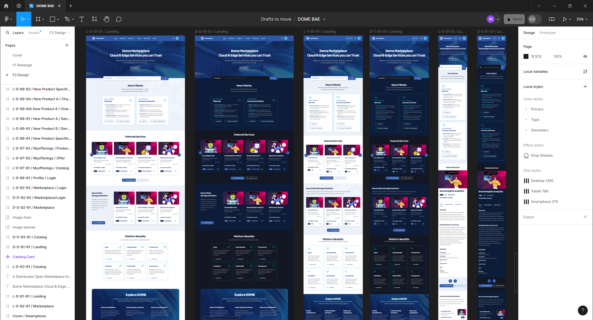

*Figure 5.95 - Figma Prototypes*

Figma played a central role in the prototyping phase, serving as the main tool for designing and iterating on the high-fidelity prototypes. Key features of Figma used included:

- **Centralized Styles and Components**: This feature ensured consistency across all designs, facilitating a unified look and feel that aligns with the brand guidelines.

- **Interactive Prototypes**: These allowed the team and stakeholders to experience and evaluate the usability and functionality of the designs in a simulated live environment.

- **Collaborative Feedback**: Figma’s collaborative tools enabled real-time feedback and annotations directly on the design files, significantly speeding up the review cycles and implementation of changes.

**Collaboration and Communication** - Throughout the implementation phase, regular communication between the UX designers, developers, and stakeholders was maintained through scheduled meetings and spontaneous discussions. This ongoing dialogue was vital for addressing technical challenges, aligning the development with the UX objectives, and ensuring that all team members were informed of the latest updates and decisions.

### 5.8.4 Improvements

The final UX redesign was driven by strategic considerations across business objectives, marketing strategies, and technical constraints, each playing a crucial role in shaping the redesign process to align with the marketplace's goals and user needs.

**Business Goals** The primary aim was to enhance user engagement and retention by improving the user interface, making it more intuitive and easier to navigate. The redesign targeted reduced user frustration and abandonment, aiming to boost user activity and loyalty. It also sought to strengthen the marketplace's position as a leader in the European digital services sector, thus driving new user acquisition and expanding market share.

**Marketing Considerations** Marketing goals focused on reinforcing the marketplace’s brand as modern, trustworthy, and European-centered. The UX redesign needed to:

- **Visual Branding**: Maintain consistency in visual identity across all touchpoints to enhance brand recognition.

- **Content Strategy**: Refine content to be clear, concise, and engaging to resonate more effectively with the target demographic.

- **Conversion Optimization**: Improve pathways to conversion, such as streamlining the checkout process, to enhance user experience and increase transactions.

**Technical Considerations** Technical feasibility was essential, with the redesign needing to integrate seamlessly with existing systems. Considerations included:

- **Compatibility**: Ensuring new designs worked with existing backend infrastructures and third-party services.

- **Performance**: Enhancing site performance to ensure quick loading times and responsive interactions.

- **Scalability**: Creating a flexible UI that could adapt to future expansions without extensive modifications.

Improvements were guided by a deep integration of the project's brand guidelines to ensure that every enhancement not only elevated the user experience but also reinforced the marketplace's brand identity. The following figures show the significant UX improvements implemented in the marketplace view and the landing page, contrasting the before and after states to illustrate the transformation:

**Marketplace/Catalog View (before)**

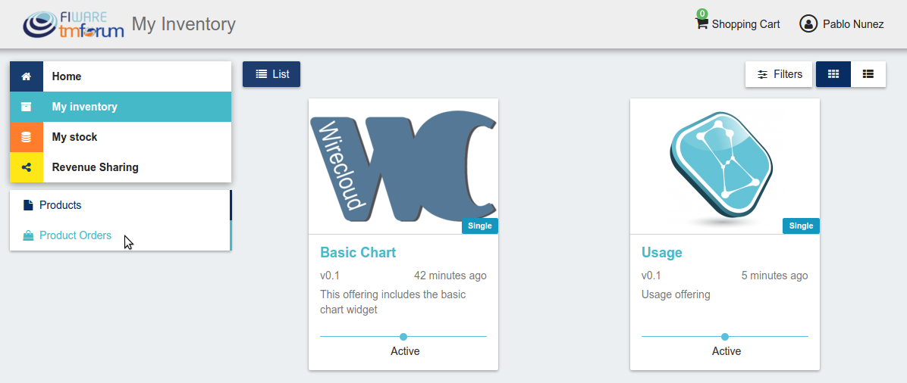

*Figure 5.96 - Marketplace/Catalog View (before)*

The original marketplace view was cluttered and lacked intuitive navigation. The color scheme was inconsistent, and the typography varied across different sections, making the interface visually unappealing and confusing for users.

**Marketplace/Catalog View (initial concepts)**

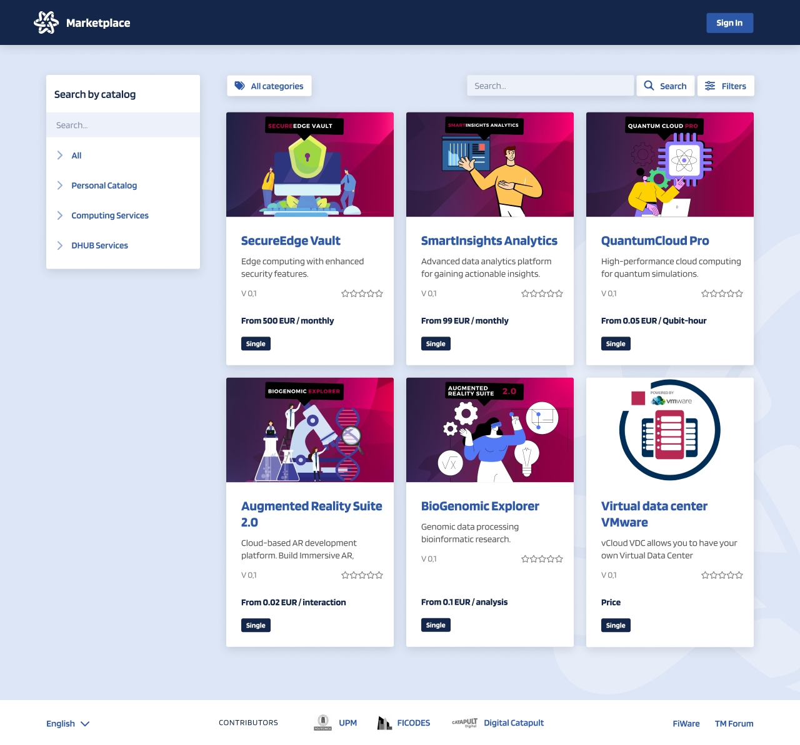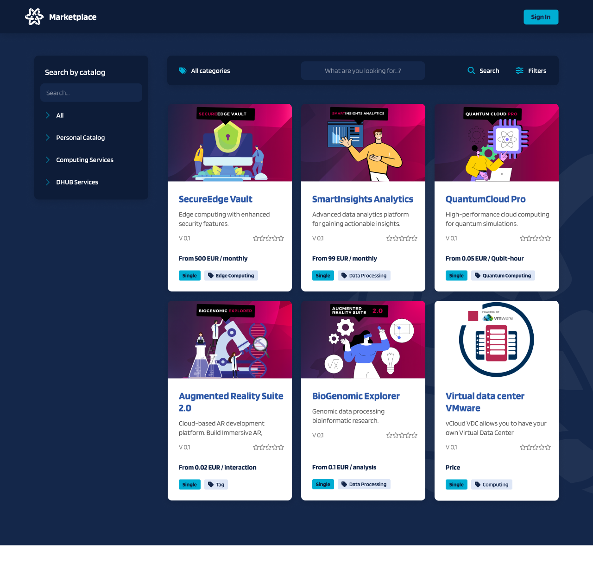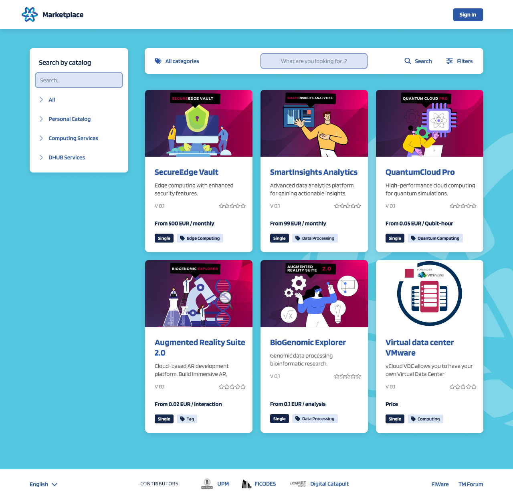

*Figure 5.97 - Maketplace/Catalog View Initial Concept*

An initial pass explored three possible redesigns for the marketplace view, exploring different avenues. These proposals were shared with the consortium to test and receive feedback before arriving at the final choice.

**Marketplace/Catalog View (final version)**

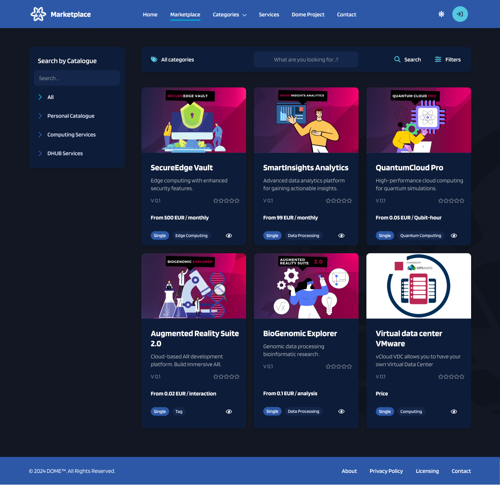

*Figure 5.98 - Marketplace/Catalog View Final Version*

With the redesign, the marketplace view was streamlined to enhance user engagement and ease of use. Following the brand guidelines:

- **Colour Scheme**: We adopted the colours specified in the brand guidelines, creating cohesive light and dark themes to suit different user preferences.

- **Typography**: Blinker and Arial were used consistently throughout the interface to improve readability and maintain visual harmony.

- **Layout**: We simplified the card-based interface, prioritizing content according to user needs and employing a grid layout that aligns with the brand’s visual identity. These changes made the marketplace more inviting and easier to navigate, directly addressing previous user pain points.

**Landing Page (before)**

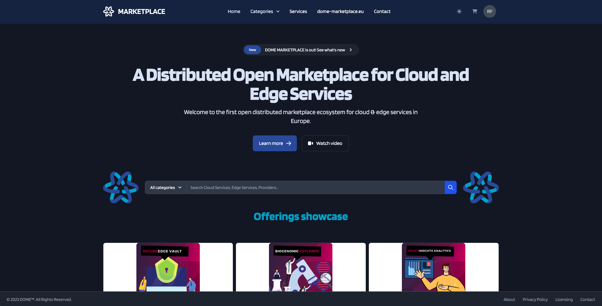

*Figure 5.99 - Landing Page (before)*

The initial landing page was overloaded with information and calls to action were cluttered with other design elements, which diluted potential user engagement and hindered the conversion process.

**Landing Page (final version)**

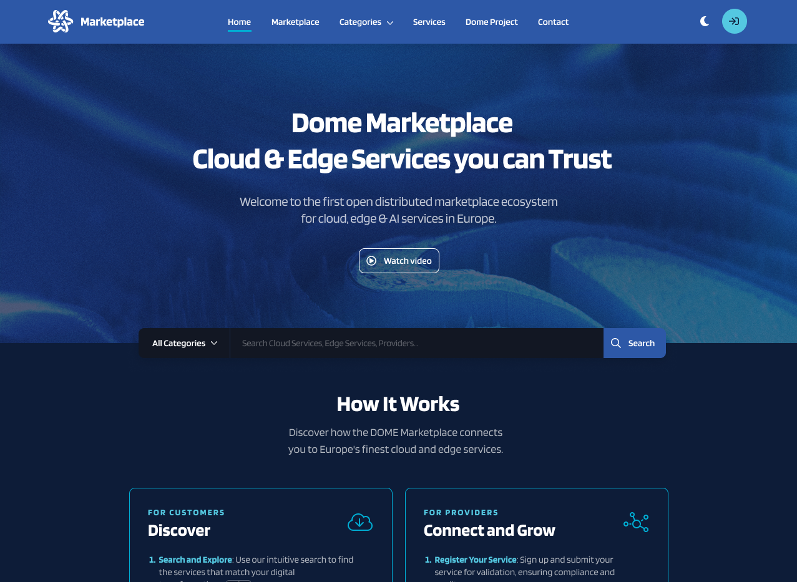

*Figure 5.100 - Landing page final version*

The redesigned landing page now leverages the brand’s graphic elements and improved image styles to better capture the essence of the marketplace. Key improvements include:

- **Visual Hierarchy**: Using the brand’s colour palette, we emphasised key sections and calls to action, guiding the user’s journey through the page.

- **Consistent Image Style**: Images now follow the brand guidelines.

- **Clear and Concise Content**: The content on the landing page was overhauled to be more concise and aligned with the brand’s voice, making use of clear, engaging language that reflects the brand’s personality. Through these UX improvements, the DOME Marketplace has significantly improved its interface's effectiveness and efficiency, resulting in a platform that not only meets but exceeds the expectations of its European digital consumer base.

The UX redesign of the DOME Marketplace modernised the look and feel of the marketplace and improved its usability and functionality, aligning it with international standards and user expectations. The redesign focused on simplifying the user interface, enhancing accessibility, and incorporating a mobile-first approach that prioritised user engagement. Key improvements included a more intuitive navigation system, a consistent and appealing visual design aligned with brand guidelines, and streamlined user pathways that facilitated easier interactions and transactions.

The implemented changes have significantly elevated the user experience, as evidenced by initial feedback from early users who reported greater satisfaction and an intuitive interaction with the platform. While comprehensive performance metrics are still being collected, the initial responses have been overwhelmingly positive, indicating a successful alignment of the UX with users' needs.

#### 5.8.4.1 Next Improvements

Next improvements also include ongoing monitoring and analysis of user interactions tracking user behaviour and gathering quantitative data on how users engage with the platform. Regular usability testing sessions could provide qualitative insights, helping us to identify areas for improvement and validate design decisions.

It is also recommended to focus on gathering feedback from a broader user base, including beta testers and early adopters, to gain a more diverse perspective on the user experience. This feedback will be crucial in refining the platform to better meet the needs of our users.

Additionally, the plan is to enhance the accessibility of the DOME Marketplace, ensuring that it complies with the latest WCAG standards and is usable by individuals with a wide range of abilities.
