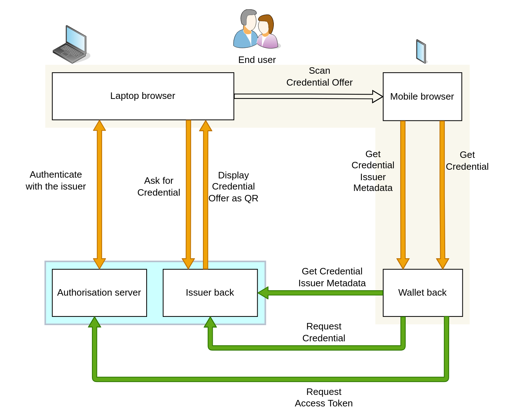

# 6 Appendix I: example of onboarding of organisations in DOME

========================================================

## 6.1 Participants

Here we introduce the actors of the reference use case we are going to have. The main actors are marked in yellow in the following diagram.

RealTruth is a Trust Service Provider operating under the eIDAS Trust Framework, which issues a certificate for seals to the company GoodAir. GoodAir is a business that provides some services using an Air Quality application operated by GoodAir.

RealTruth also provides a certificate for signatures to the COO of the GoodAir company, so the COO can use the certificate to sign documents on behalf of GoodAir (like contracts, invoices, financial reports, ...) in a way that is compliant with eIDAS.

The COO of GoodAir will issue a verifiable credential of type LEARCredential to an employee of GoodAir, signing the credential with his certificate for signatures.

### 6.1.1 SmartCityDS: an instance of a Data Space for Smart Cities

SmartCityDS is a Data Space where local governments can procure data and services from other entities that act as service providers. At the same time, the local governments can also act as data and service providers for other entities in the Data Space.

The SmartCityDS Data Space has an onboarding service that allows external entities to perform onboarding in an automated fashion by using Verifiable Credentials that have been issued by trusted entities. The complete Trust Framework used by SmartCityDS is composed from a series of Trust Frameworks, some managed internally using a governance model of SmartCityDS and some others managed externally but by trusted entities. At the root of the Trust Framework of SmartCityDS is the eIDAS Trust Framework and the pan-european recognized list of Trust Service Providers issuing the eIDAS compliant digital identities, in the form of certificates for signatures/seals.

In order to participate in SmartCityDS, every legal person requires a certificate for seals or that one of its legal representatives has a certificate for signatures (or both).

### 6.1.2 GoodAir: the company that wants to will perform the onboarding process

The new participant is a business providing an Air Quality Monitoring application as a service. The business is called GoodAir and it operates the application, which receives data from a set of sensors that may or may not be the property of GoodAir. The sensors must have received a certification to be able to operate and send data to the GoodAir application.

The company is registered in the tax agency and business registry of Spain with VAT number VATES-12345678

### 6.1.3 Jesus Ruiz COO (Chief Operating Officer) of GoodAir

The GoodAir company is small and the only person that can sign contracts on behalf of the company is the COO (Chief Operating Officer). The COO is a legal representative of the company and is registered as so in the business registry of Spain.

The COO has a certificate for electronic signatures issued by one of the TSPs in Spain enabling the COO to perform electronic qualified signatures as legal representative of GoodAir, instead of doing them manually.

The X.509 certificate of the COO has the following contents in the Subject field (the example below is derived from a real certificate but with the identifiers modified to be an example):

cn=56565656V Jesus Ruiz

serialNumber=56565656V

givenName=Jesus

sn=Ruiz

2.5.4.97=VATES-12345678

o=GoodAir

c=ES

2.5.4.13=Notary:Juan Lopez/Protocol Num:7172/Date:07-06-2021

The above set of fields bind the legal identity of the COO with the identity of the business:

- serialNumber is the unique number recognized by the Spanish Government for spanish citizens (called NIF).

- 2.5.4.97 is the [<u>official OID for</u> <u>organizationIdentifier</u>](https://oidref.com/2.5.4.97). The contents of this field in the example certificate is the unique identifier for the legal person GoodAir.

Before issuing a certificate like the above, the TSP has to perform some validations to ensure that in the official source of truth (the business registry of Spain in this case) there is already registered information that states that the COO has indeed powers to act on behalf of GoodAir as a legal representative.

### 6.1.4 RealTruth: a TSP (Trust Service Provider)

RealTruth is an EU TSP, which appears in the TL (Trusted List) maintained by the [<u>German Government</u>](https://tl.bundesnetzagentur.de/TL-DE.XML).

RealTruth is a TSP based in Germany but operates in most of the countries of the EU and so being able to provide Trust Services across many countries, including Spain.

As all TSPs in the TLs of the Member States, its entry in the TL includes one or more "Services" entries which describe the Trust Services provided by the TSP.

A TSP can have one Service issuing certificates for signatures, another service issuing certificates for seals, another service for timestamping, etc.

The regulator approves or suspends each service from a TSP individually, and the services are the root anchor for a given trust environment.

In our case, the entry for RealTruth in the TL includes a \<TSPService\> entry, and inside it the \<ServiceDigitalIdentity\> entry includes a DER-encoded certificate specifying the digital identity of the root anchor for that trust domain. The certificate for the Service has in the Subject field:

2.5.4.97 = VATDE-170173453

CN = DRV QC 11 MA CA 2017ca

OU = QC 11 Mitarbeiter CA

O = Deutsche Rentenversicherung Westfalen

C = DE

Which in the organizationIdentifier field (OID 2.5.4.97) specifies the unique organisation identifier assigned by the German regulatory authority to the TSP: VATDE-170173453.

RealTruth provides Legal Person Representative Certificates which are qualified in accordance with Regulation (EU) No. 910/2014 of the European Parliament and of the Council of 23 July 2014 on electronic identification and trust services for electronic transactions in the internal market.

The certification policies of RealTruth includes the following sentences:

The Registration Authority must verify the following information in order to authenticate the identity of the organisation:

- The data concerning the business name or corporate name of the organisation.

- The data relating to the constitution and legal status of the subscriber.

- **The data concerning the extent and validity of the powers of representation of the applicant.**

- The data concerning the tax identification code of the organisation or equivalent code used in the country to whose legislation the subscriber is subject.

The TSP (RealTruth in this case) performs the verifications against Authentic Sources.

Authentic Sources are the public or private repositories or systems recognised or required by law containing attributes about a natural or legal persons.

The Authentic Sources in scope of Annex VI of the \[eIDAS2\] legislative proposal are sources for attributes on address, age, gender, civil status, family composition, nationality, education and training qualifications titles and licences, professional qualifications titles and licences, public permits and licences, financial and company data.

Authentic Sources in scope of Annex VI are required to provide interfaces to Qualified Electronic Attestation of Attributes (QEAA) Providers to verify the authenticity of the above attributes, either directly or via designated intermediaries recognised at national level.

Authentic Sources may also issue (Q)EAA-s themselves if they meet the requirements of the eIDAS Regulation. It is up to the Member States to define terms and conditions for the provisioning of these services, but according to the minimum technical specifications, standards, and procedures applicable to the verification procedures for qualified electronic attestations of attributes.

In accordance to the policies, RealTruth made those validations when issuing the certificate to the COO, in such a way that the Relying Parties verifying the certificate can have a high level of trust in the assertion that the natural person identified in the certificate (with Spanish ID of 56565656V) is a legal representative of the GoodAir company (organizationIdentifier VATES-12345678).

### 6.1.5 John Doe: an administrative employee of GoodAir

This is an employee of the central administration department of GoodAir, who is going to be formally nominated to manage the onboarding process of GoodAir in the Data Space and some other operations in the Data Space once GoodAir is onboarded.. In particular, this employee is going to be nominated as a LEAR (Legal Entity Appointed Representative).

As its name implies, the LEAR has to be nominated by a **legal representative** of the GoodAir organisation with the necessary legal authority to commit the organisation for this type of decision. In our case, the COO of GoodAir will nominate John Doe as the LEAR of GoodAir, delegating to him the capabilities to perform onboarding in the SmartCityDS and some other associated tasks. That means that John Doe will not be empowered to perform other actions like onboarding on other Data Spaces or signing contracts or invoices on behalf of GoodAir.

To perform the nomination, the COO of GoodAir (a legal representative of GoodAir) will issue a special credential to John Doe and will sign the credential with his certificate for signatures as legal representative of GoodAir. The details are described later in this document.

## 6.2 The LEARCredential

In this example the LEARCredential will be generated using the certificate of the COO.

The credential will be generated with an application that the COO will use as VC Issuer and that allows the employee to receive the credential using his credential wallet, using OIDCVCI to achieve compliance with the EUDI Wallet ARF.

The application enables the COO to specify the information required to create the LEARCredential, specifying the employee information and the specific type of LEARCredential. In general, there may be different instances of LEARCredentials for different purposes. One employee can have more than one LEARCredential, each having a different delegation of powers for different environments.

### 6.2.1 Claims identifying the employee

These are claims identifying the subject of the credential, the person who will act as LEAR. Each Data Space can define their own depending on their specific requirements. For our example, we use the same that are used for accessing the EC portal. The claims in the credential are the digital equivalent of their analog counterparts, displayed here for illustration.

*Figure 93 -* [*Figure*](https://alastria.github.io/did-method-elsi/onboarding.html#lear-appointment-letter-1) *LEAR subject identification data*

*.*

From the above form we can derive the following claims:

{

“id": "did:key:xxxxxxxx",

"title": "Mr.",

"first_name": "John",

"last_name": "Doe",

"gender": "M",

"postal_address": "",

"email": "johndoe@goodair.com",

"telephone": "",

"fax": "",

"mobile_phone": "+34787426623"

}

Where the id field is the did:key identifier assigned to the employee when issuing the credential, for privacy reasons. This is explained in more detail below.

### 6.2.2 DID of the employee

In this example we use the did:key method for the DID of the employee, which provides a very high level of privacy and given the way the LEARCredential is generated it supports the verification of the chain of responsibility with a proper level of guarantee.

If the highest levels of assurance and legal compliance is desired and the employee has an eIDAS certificate for signatures (in this case a personal one, not one like the COO), we could use the elsi:did for identification of the employee. However, the company (GoodAir) should make sure that the employee is aware of and agrees to the possible privacy implications of doing so, given the personal details leaked from the eIDAS certificate.

Those "exposed" personal details are exactly the same as if the employee signs any "normal" document with a digital certificate, but care should be taken by GoodAir because in this case the signature would be done "on behalf of" his employer and not as an individual personal action.

Even though this is not unique to the did:elsi method, this also implies that the onboarding service has to handle those personal details in the same way as if it would be accepting any other document signed with a certificate for signatures, and ensure compliance with GDPR.

In this example we assume the usage of the did:key method for the employee to protect his privacy as much as possible.

This DID for the employee is an additional claim to the ones presented above, using the id field in the credentialSubject object. The DID corresponds to a keypair that was generated during the LEARCredential issuance process, where the private key was generated by the wallet of the employee and it was always under his control.

This private key controlled by the employee can be used to sign challenges from Relying Parties that receive the credential to prove that the person sending the credential is the same person that is identified in the credentialSubject object of the LEARCredential.

An example could be:

{

"id": "did:key:99ab5bca41bb45b78d242a46f0157b7d#key1"

}

In this example, the signatures performed with the private key can not be JAdES-compliant (\[[ETSI-JADES](https://alastria.github.io/did-method-elsi/onboarding.html#bib-etsi-jades)\]), but if the LEARCredential is attached to any other credential that is signed with this private key, then they can be traced up to the eIDAS certificate of the COO and so the chain of responsibility can be determined..

With the DID for the employee, the set of claims identifying him would be then:

{

"id": "did:key:99ab5bca41bb45b78d242a46f0157b7d",

"title": "Mr.",

"first_name": "John",

"last_name": "Doe",

"gender": "M",

"postal_address": "",

"email": "johndoe@goodair.com",

"telephone": "",

"fax": "",

"mobile_phone": "+34787426623"

}

### 

### 6.2.3 legalRepresentative

This section identifies the natural person (the COO) who is a legal representative of the legal person (GoodAir) and that is nominating the employee identified in the credential.

"legalRepresentative": {

"cn": "56565656V Jesus Ruiz",

"serialNumber": "56565656V",

"organizationIdentifier": "VATES-12345678",

"o": "GoodAir",

"c": "ES"

}

NOTE: Attributes for natural and legal persons

The attributes for natural persons and legal persons are derived from the [<u>eIDAS SAML Attribute Profile (eIDAS Technical Sub-group, 22 June 2015)</u>](https://ec.europa.eu/digital-building-blocks/wikis/download/attachments/467109280/eidas_saml_attribute_profile_v1.0_2.pdf?version=1&modificationDate=1639417533738&api=v2).

All attributes for the eIDAS minimum data sets can be derived from the [<u>ISA Core Vocabulary</u>](https://ec.europa.eu/isa2/solutions/core-vocabularies_en/) and [<u>https://joinup.ec.europa.eu/collection/semic-support-centre/specifications</u>](https://joinup.ec.europa.eu/collection/semic-support-centre/specifications).

In the case of natural persons refer to the [<u>Core Person Vocabulary</u>](https://joinup.ec.europa.eu/asset/core_person/asset_release/core-person-vocabulary) and in the case of legal persons refer to definitions for [<u>Core Business Vocabulary</u>](https://joinup.ec.europa.eu/asset/core_business/asset_release/core-business-vocabulary).

### 6.2.4 rolesAndDuties of the LEAR

The rolesAndDuties object points to an externally hosted object with the roles and duties of the LEAR. This external object can be either a machine-interpretable definition of the roles and duties in the credential, or just an external definition of the roles and duties in natural language. The ideal approach is the first option, expressing the semantics with a proper machine-readable language, because this will allow automatic access control at the granularity of the individual sentences of that expression language. The rolesAndDuties object can also have the definition embedded into it, instead of having a pointer to an external object.

For illustration, the following figure shows an external object with some of the roles and duties in our LEAR example, in natural language.

*Figure 94 -* [*<u>Figure</u>*](https://alastria.github.io/did-method-elsi/onboarding.html#lear-appointment-letter-2) *LEAR roles and duties.*

A simplistic implementation of the object inside the credential could be:

"rolesAndDuties": \[

{

"type": "LEARCredential",

"id":

"https://www.dome-project.com/lear/v1/6484994n4r9e990494"

}

\]

Where the last part of the url can correspond to the hash of the external linked document to ensure that any modification or tampering can be detected.

### 6.2.5 Assembling the pieces together

With the above values for the example, the complete LEARCredential would become something like this:

{

"@context": \[

"https://www.w3.org/2018/credentials/v1",

"https://www.dome-project.com/2022/credentials/learcredential/v1"

\],

"id": "urn:did:elsi:25159389-8dd17b796ac0",

"type": \["VerifiableCredential", "LEARCredential"\],

"issuer": {

"id": "did:elsi:VATES-12345678"

},

"issuanceDate": "2022-03-22T14:00:00Z",

"validFrom": "2022-03-22T14:00:00Z",

"expirationDate": "2023-03-22T14:00:00Z",

"credentialSubject": {

"id": "did:key:99ab5bca41bb45b78d242a46f0157b7d",

"title": "Mr.",

"first_name": "John",

"last_name": "Doe",

"gender": "M",

"postal_address": "",

"email": "johndoe@goodair.com",

"telephone": "",

"fax": "",

"mobile_phone": "+34787426623",

"legalRepresentative": {

"cn": "56565656V Jesus Ruiz",

"serialNumber": "56565656V",

"organizationIdentifier": "VATES-12345678",

"o": "GoodAir",

"c": "ES"

},

"rolesAndDuties": \[

{

"type": "LEARCredential",

"id":

"https://www.dome-project.com/lear/v1/6484994n4r9e990494"

}

\]

}

}

## 6.3 Issuing the LEARCredential

### 6.3.1 Overview

In this example we use what we call a *profile* of the \[[OIDCVCI](https://alastria.github.io/did-method-elsi/onboarding.html#bib-oidcvci)\] protocol. The standard is very flexible, and we restrict the different options available in the standard and implement a set of the options with given values that are adequate for our use case, without impacting flexibility in practice.

The following figure describes the main components that interact in the issuance of a credential in this profile.

The description of the issuance process is general enough to be used for many types of credentials, but the text includes notes describing the concrete application of the process to the case of the LEARCredential.

*Figure 95 -* [*Figure*](https://alastria.github.io/did-method-elsi/onboarding.html#iss-overview) *Overview of participants.*

**End user**

This profile is valid for both natural and juridical persons, but because we are focusing on the issuance of the LEARCredential, in the detailed examples below we assume a natural person as the user.

**Wallet**

The wallet is assumed to be a Web application with a wallet backend, maybe implemented as a PWA so it has some offline capabilities and can be installed in the device, providing a user experience similar to a native application. Private key management and most sensitive operations are performed in a backend server, operated by an entity trusted by the end user. Other profiles can support native and completely offline PWA mobile applications, for end users.

This type of wallet supports natural persons, juridical persons and natural persons who are legal entity representatives of juridical persons. For juridical persons the wallet is usually called an enterprise wallet but we will use here just the term wallet unless the distinction is required.

In this profile we assume that the wallet is not previously registered with the Issuer and that the wallet does not expose public endpoints that are called by the Issuer, even if the wallet has a backend server that could implement those endpoints. That makes the wallet implementations in this profile to be very similar in interactions to a full mobile implementation, making migration to a full mobile implementation easier.

In other words, from the point of view of the Issuer, the wallet in this profile is almost indistinguishable from a full mobile wallet.

**User Laptop**

For clarity of exposition, we assume in this profile that the End User starts the interactions with the Issuer with an internet browser (user agent) in her laptop. However, there is nothing in the interactions which limits those interactions to a laptop form factor and the End User can interact with any internet browser in any device (mobile, tablet, kiosk).

**Issuer**

In this profile we assume that the Issuer is composed of two components:

- Authorization server: the backend component implementing the existing authentication/authorization functionalities for the Issuer entity.

- Issuer backend: the main server implementing the business logic as a web application and additional backend APIs required for issuance of credentials.

The Issuer backend and the Authorization server could be implemented as a single component in a real use case, but we assume here that they are separated to make the profile more general, especially for big entities and also when using Trust Service Providers for cloud signature and credential issuance, for example.

**Authentication of End User and previous Issuer-End User relationship**

We assume that the Issuer and End User have a previous relationship and that the Issuer has performed the KYC required by regulation and needed to be able to issue Verifiable Credentials attesting some attributes about the End User. We assume that there is an existing trusted authentication mechanism (not necessarily related to Verifiable Credentials) that the End User employs to access protected resources from the Issuer. For example, the user is an employee or a customer of the Issuer, or the Issuer is a Local Administration and the End User is a citizen living in that city.

### 6.3.2 Authentication

*Figure 96 -* [*Figure*](https://alastria.github.io/did-method-elsi/onboarding.html#iss-authentication) *Issuance authentication.*

Before requesting a new credential, the End User has to authenticate with the Issuer with whatever mechanism is already implemented by the Issuer. This profile does not require that it is based on OIDC, Verifiable Credentials or any other specific mechanism.

The level of assurance (LoA) of this authentication mechanism is one of the factors that will determine the confidence that the Verifiers can have on the credentials received by them from a given Issuer.

NOTE: LEARCredential

In the case of the LEARCredential, the End User (John Doe) is an employee of GoodAir and in order to receive the credential John first has to authenticate into the company systems using whatever mechanism GoodAir uses for employee authentication.

Being a modern company, GoodAir uses Verifiable Credentials IAM but this is not a requirement for the issuance of the LEARCredential.

### 6.3.3 Credential Offer

*Figure 97 -* [*Figure*](https://alastria.github.io/did-method-elsi/onboarding.html#iss-credentialoffer) *Credential offer.*

In this profile the wallet does not have to implement the Credential Offer Endpoint described in section 4 of \[[OIDCVCI](https://alastria.github.io/did-method-elsi/onboarding.html#bib-oidcvci)\].

Instead, the Credential Issuer renders a QR code containing a reference to the Credential Offer that can be scanned by the End-User using a Wallet, as described in section 4.1 of \[[OIDCVCI](https://alastria.github.io/did-method-elsi/onboarding.html#bib-oidcvci)\].

According to the spec, the Credential Offer object is a JSON object containing the Credential Offer parameters and can be sent by value or by reference. To avoid problems with the size of the QR travelling in the URL, this profile requires that the QR contains the credential_offer_uri, which is a URL using the https scheme referencing a resource containing a JSON object with the Credential Offer parameters. The credential_offer_uri endpoint should be implemented by the Issuer backend.

#### 6.3.3.1 Credential Offer Parameters

This profile restricts the options available in section 4.1.1 of \[[OIDCVCI](https://alastria.github.io/did-method-elsi/onboarding.html#bib-oidcvci)\]. The profile defines a Credential Offer object containing the following parameters:

- credential_issuer: *REQUIRED*. The URL of the Credential Issuer that will be used by the Wallet to obtain one or more Credentials.

- credentials: *REQUIRED*. A JSON array, where every entry is a JSON string. To achieve interoperability faster, this profile defines a global Trusted Credential Schemas List where well-known credential schemas are defined, in addition to the individual credentials that each Issuer can define themselves. The string value *MUST* be one of the id values in one of the objects in the credentials_supported metadata parameter of the Trusted Credential Schemas List (described later), or one of the id values in one of the objects in the credentials_supported Credential Issuer metadata parameter provided by the Credential Issuer. When processing, the Wallet *MUST* resolve this string value to the respective object. The credentials defined in the global Trusted Credential Schema List have precedence over the ones defined by the Credential Issuer.  
  NOTE: LEARCredential  
  The only credential being offered in our case is the LEARCredential, so this is the credential schema that should be specified here. The LEARCredential is a credential known globally to the SmartCityDS ecosystem, so its schema should be published and be available in the Trusted Credential Schemas List.

- grants: *REQUIRED*. A JSON object indicating to the Wallet the Grant Type pre-authorized_code. This grant is represented by a key and an object, where the key is urn:ietf:params:oauth:grant-type:pre-authorized_code. In this profile the credential issuance flow requires initial authentication of the End User by the Credential Issuer, so the Pre-Authorized Code Flow achieves a good level of security and we do not need the more general Authorization Code Flow.  
  In other scenarios like when the wallet is a native mobile application and the user interacts with the Issuer exclusively with the mobile (without the laptop), then the Authorization Code Flow has to be used. This can be described in detail in a different profile.

The grant object contains the following values:

- pre-authorized_code: *REQUIRED*. The code representing the Credential Issuer's authorization for the Wallet to obtain Credentials of a certain type. This code *MUST* be short lived and single-use. This parameter value *MUST* be included in the subsequent Token Request with the Pre-Authorized Code Flow.

- user_pin_required: *REQUIRED*. The OIDCVCI standard says it is *RECOMMENDED*, but this profile specifies the user pin to achieve a greater level of security. This field is a boolean value specifying whether the Credential Issuer expects presentation of a user PIN along with the Token Request in a Pre-Authorized Code Flow. Default is false. This PIN is intended to bind the Pre-Authorized Code to a certain transaction in order to prevent replay of this code by an attacker that, for example, scanned the QR code while standing behind the legit user. It is *RECOMMENDED* to send a PIN via a separate channel. The PIN value *MUST* be sent in the user_pin parameter with the respective Token Request.

The following non-normative example shows a Credential Offer object where the Credential Issuer offers the issuance of one Credential ("LEARCredential"):

{

"credential_issuer": "https://credential-issuer.example.com",

"credentials": \[

"LEARCredential"

\],

"grants": {

"urn:ietf:params:oauth:grant-type:pre-authorized_code": {

"pre-authorized_code": "asju68jgtyk9ikkew",

"user_pin_required": true

}

}

}

#### 6.3.3.2 Contents of the QR code

Below is a non-normative example of the Credential Offer displayed by the Credential Issuer as a QR code when the Credential Offer is passed by reference, as required in this profile:

https:*//credential-issuer.example.com/credential-offer?*

credential_offer_uri=https%3A%2F%2Fserver%2Eexample%2Ecom%2Fcredential-offer%2F5j349k3e3n23j

Which in plain text would be:

https:*//credential-issuer.example.com/credential-offer?*

credential_offer_uri=https:*//server.example.com/credential-offer/5j349k3e3n23j*

To increase security, the Issuer *MUST* make sure that every Credential Offer URI is unique for all credential offers created. This is the purpose of the nonce (5j349k3e3n23j) at the end of the url in the example. Issuers can implement whatever mechanism they wish, as far as it is transparent to the wallet.

### 6.3.4 Credential Issuer Metadata

The Wallet backend retrieves the Credential Issuer's configuration using the Credential Issuer Identifier that was received in the Credential Offer.

A Credential Issuer is identified in this context by a case sensitive URL using the https scheme that contains scheme, host and, optionally, port number and path components, but no query or fragment components. No DID is used in this context.

Credential Issuers *MUST* make a JSON document available at the path formed by concatenating the string /.well-known/openid-credential-issuer to the Credential Issuer Identifier. If the Credential Issuer value contains a path component, any terminating / *MUST* be removed before appending /.well-known/openid-credential-issuer.

openid-credential-issuer *MUST* point to a JSON document compliant with this specification and *MUST* be returned using the application/json content type.

The retrieval of the Credential Issuer configuration is illustrated below.

*Figure 98 -* [*Figure*](https://alastria.github.io/did-method-elsi/onboarding.html#iss-issuermetadata) *Issuer metadata.*

#### 

#### 6.3.4.1 Credential Issuer Metadata Parameters

The object contained in openid-credential-issuer contains the following:

- credential_issuer: *REQUIRED*. The Credential Issuer's identifier.

- credential_endpoint: *REQUIRED*. URL of the Credential Issuer's Credential Endpoint. This URL *MUST* use the https scheme and *MAY* contain port, path and query parameter components.

- credentials_supported: *REQUIRED*. A JSON array containing a list of JSON objects, each of them representing metadata about a separate credential type that the Credential Issuer can issue. The JSON objects in the array *MUST* conform to the structure of the Section XXXX.

TODO: define a global directory of credentials supported to eliminate requirement for each individual Issuer to publish its own list.

This profile does not make use of the following parameters:

- authorization_server parameter, because it uses the pre-authorized_code Grant type.

- batch_credential_endpoint parameter. It indicates that the Credential Issuer does not support the Batch Credential Endpoint.

- display parameter.

### 6.3.5 OAuth 2.0 Authorization Server Metadata

This specification also defines a new OAuth 2.0 Authorization Server metadata \[[RFC8414](https://alastria.github.io/did-method-elsi/onboarding.html#bib-rfc8414)\] parameter to publish whether the AS that the Credential Issuer relies on for authorization, supports anonymous Token Requests with the Pre-authorized Grant Type. It is defined as follows:

- pre-authorized_grant_anonymous_access_supported: *OPTIONAL*. A JSON Boolean indicating whether the issuer accepts a Token Request with a Pre-Authorized Code but without a client id. The default is false.

### 6.3.6 Access Token

*Figure 99 -* [*Figure*](https://alastria.github.io/did-method-elsi/onboarding.html#issuance_accesstoken) *Access Token.*

The Wallet invokes the Token Endpoint implemented by the Authorization Server, which issues an Access Token and, optionally, a Refresh Token in exchange for the Pre-authorized Code that the wallet obtained in the Credential Offer.

#### 6.3.6.1 Token Request

After the wallet receives the Credential Issuer Metadata, a Token Request is made as defined in Section 4.1.3 of \[[RFC6749](https://alastria.github.io/did-method-elsi/onboarding.html#bib-rfc6749)\].

The following are the extension parameters to the Token Request used in a Pre-Authorized Code Flow as used in this profile:

- pre-authorized_code: *REQUIRED*. The code representing the authorization to obtain Credentials of a certain type.

- user_pin: *OPTIONAL*. String value containing a user PIN. This value *MUST* be present if user_pin_required was set to true in the Credential Offer. The string value *MUST* consist of maximum 8 numeric characters (the numbers 0 - 9).

In this profile the Wallet does not have to authenticate when using the Token Endpoint, because we are using the Pre-Authorized Code Grant Type, given the level of trust between the Issuer and the End User and that authentication was already performed at the beginning of the flow.

Below is a non-normative example of a Token Request:

POST /token HTTP/1.1

Host: server.example.com

Content-Type: application/x-www-form-urlencoded

grant_type=urn%3Aietf%3Aparams%3Aoauth%3Agrant-type%3Apre-authorized_code

&pre-authorized_code=SplxlOBeZQQYbYS6WxSbIA

&user_pin=493536

#### 6.3.6.2 Successful Token Response

Token Responses are made as defined in \[[RFC6749](https://alastria.github.io/did-method-elsi/onboarding.html#bib-rfc6749)\].

In addition to the response parameters defined in \[[RFC6749](https://alastria.github.io/did-method-elsi/onboarding.html#bib-rfc6749)\], the Authorization Server returns the following parameters:

- c_nonce: *REQUIRED*. JSON string containing a nonce to be used to create a proof of possession of key material when requesting a Credential. The Wallet *MUST* use this nonce value for its subsequent credential requests until the Credential Issuer provides a fresh nonce.

- c_nonce_expires_in: *REQUIRED*. JSON integer denoting the lifetime in seconds of the c_nonce.

Below is a non-normative example of a Token Response:

HTTP/1.1 200 OK

Content-Type: application/json

Cache-Control: no-store

{

"access_token": "eyJhbGciOiJSUzI1NiIsInR5cCI6Ikp..sHQ",

"token_type": "bearer",

"expires_in": 86400,

"c_nonce": "tZignsnFbp",

"c_nonce_expires_in": 86400

}

#### 6.3.6.3 Token Error Response

If the Token Request is invalid or unauthorized, the Authorization Server constructs the error response as defined in section 6.3 of \[[OIDCVCI](https://alastria.github.io/did-method-elsi/onboarding.html#bib-oidcvci)\].

### 6.3.7 Request and receive Credential

*Figure 100 -* [*Figure*](https://alastria.github.io/did-method-elsi/onboarding.html#issuance_requestcredential) *Request and receive Credential.*

The Wallet backend invokes the Credential Endpoint, which issues a Credential as approved by the End-User upon presentation of a valid Access Token representing this approval.

Communication with the Credential Endpoint *MUST* utilize TLS.

The client can request issuance of a Credential of a certain type multiple times, e.g., to associate the Credential with different public keys/Decentralized Identifiers (DIDs) or to refresh a certain Credential.

If the Access Token is valid for requesting issuance of multiple Credentials, it is at the client's discretion to decide the order in which to request issuance of multiple Credentials requested in the Authorization Request.

#### 6.3.7.1 Binding the Issued Credential to the identifier of the End-User possessing that Credential

The Issued Credential *MUST* be cryptographically bound to the identifier of the End-User who possesses the Credential. Cryptographic binding allows the Verifier to verify during the presentation of a Credential that the End-User presenting a Credential is the same End-User to whom that Credential was issued.

The Wallet has to provide proof of control alongside key material (proof that did).

#### 6.3.7.2 Credential Request

The Wallet backend makes a Credential Request to the Credential Endpoint by sending the following parameters in the entity-body of an HTTP POST request using the application/json media type.

- format: *REQUIRED*. This profile uses the Credential format identifier jwt_vc_json.

- proof: *OPTIONAL*. JSON object containing proof of possession of the key material the issued Credential shall be bound to. The specification envisions use of different types of proofs for different cryptographic schemes. The proof object *MUST* contain a proof_type claim of type JSON string denoting the concrete proof type. This type determines the further claims in the proof object and its respective processing rules. Proof types are defined in Section 7.2.1.

The proof element *MUST* incorporate a c_nonce value generated by the Credential Issuer and the Credential Issuer Identifier (audience) to allow the Credential Issuer to detect replay. The way that data is incorporated depends on the proof type. In a JWT, for example, the c_nonce is conveyed in the nonce claims whereas the audience is conveyed in the aud claim. In a Linked Data proof, for example, the c_nonce is included as the challenge element in the proof object and the Credential Issuer (the intended audience) is included as the domain element.

##### 6.3.7.2.1 Proof Type

This specification defines the following values for proof_type:

jwt: objects of this type contain a single jwt element with a JWS \[RFC7515\] as proof of possession. The JWT *MUST* contain the following elements:

- in the JOSE Header,

  - typ: *REQUIRED*. *MUST* be openid4vci-proof+jwt, which explicitly types the proof JWT as recommended in Section 3.11 of \[[RFC8725](https://alastria.github.io/did-method-elsi/onboarding.html#bib-rfc8725)\].

  - alg: *REQUIRED*. A digital signature algorithm identifier such as per IANA "JSON Web Signature and Encryption Algorithms" registry. *MUST NOT* be none or an identifier for a symmetric algorithm (MAC).

  - kid: *REQUIRED*. JOSE Header containing the key ID. The Credential will be bound to a DID, so the kid refers to a DID URL which identifies a particular key in the DID Document that the Credential will be bound to.

- in the JWT body,

  - aud: *REQUIRED* (string). The value of this claim *MUST* be the Credential Issuer URL of the Credential Issuer.

  - iat: *REQUIRED* (number). The value of this claim *MUST* be the time at which the proof was issued using the syntax defined in \[[RFC7519](https://alastria.github.io/did-method-elsi/onboarding.html#bib-rfc7519)\].

  - nonce: *REQUIRED* (string). The value type of this claim *MUST* be a string, where the value is the c_nonce provided by the Credential Issuer.

The Credential Issuer *MUST* validate that the proof is actually signed by a key identified in the JOSE Header.

Below is a non-normative example of a proof parameter (dots in the middle of jwt for display purposes only):

{

"proof_type": "jwt",

"jwt": "eyJraWQiOiJkaWQ6ZXhhb....aZKPxgihac0aW9EkL1nOzM"

}

where the JWT looks like this:

{

"typ": "openid4vci-proof+jwt",

"alg": "ES256",

"kid":"did:example:ebfeb1f712ebc6f1c276e12ec21/keys/1"

}

{

"iss": "s6BhdRkqt3",

"aud": "https://server.example.com",

"iat": 1659145924,

"nonce": "tZignsnFbp"

}

#### 6.3.7.3 Credential Response

This profile restricts Credential Response to be Synchronous and Deferred response is not used. The Credential Issuer *MUST* be able to immediately issue a requested Credential and send it to the Client.

The following claims are used in the Credential Response:

- format: *REQUIRED*. JSON string denoting the format of the issued Credential. This profile uses the format identifier jwt_vc_json.

- credential: *REQUIRED*. Contains issued Credential. *MUST* be a JSON string.

- c_nonce: *OPTIONAL*. JSON string containing a nonce to be used to create a proof of possession of key material when requesting a Credential. When received, the Wallet *MUST* use this nonce value for its subsequent credential requests until the Credential Issuer provides a fresh nonce.

- c_nonce_expires_in: *OPTIONAL*. JSON integer denoting the lifetime in seconds of the c_nonce.

Below is a non-normative example of a Credential Response:

HTTP/1.1 200 OK

Content-Type: application/json

Cache-Control: no-store

{

"format": "jwt_vc_json",

"credential" : "LUpixVCWJk0eOt4CXQe1NXK....WZwmhmn9OQp6YxX0a2L",

"c_nonce": "fGFF7UkhLa",

"c_nonce_expires_in": 86400

}

#### 6.3.7.4 Credential Error Response

When the Credential Request is invalid or unauthorized, the Credential Issuer constructs the error response as defined in section 7.3.1 of OIDCVCI.

#### 6.3.7.5 Credential Issuer Provided Nonce

Upon receiving a Credential Request, the Credential Issuer *MUST* require the Wallet to send a proof of possession of the key material it wants a Credential to be bound to. This proof *MUST* incorporate a nonce generated by the Credential Issuer. The Credential Issuer will provide the client with a nonce in an error response to any Credential Request not including such a proof or including an invalid proof.

Below is a non-normative example of a Credential Response with the Credential Issuer requesting a Wallet to provide in a subsequent Credential Request a proof that is bound to a c_nonce:

HTTP/1.1 400 Bad Request

Content-Type: application/json

Cache-Control: no-store

{

"error": "invalid_or_missing_proof",

"error_description":

"Credential Issuer requires proof to be bound to a Credential Issuer provided nonce.",

"c_nonce": "8YE9hCnyV2",

"c_nonce_expires_in": 86400

}
