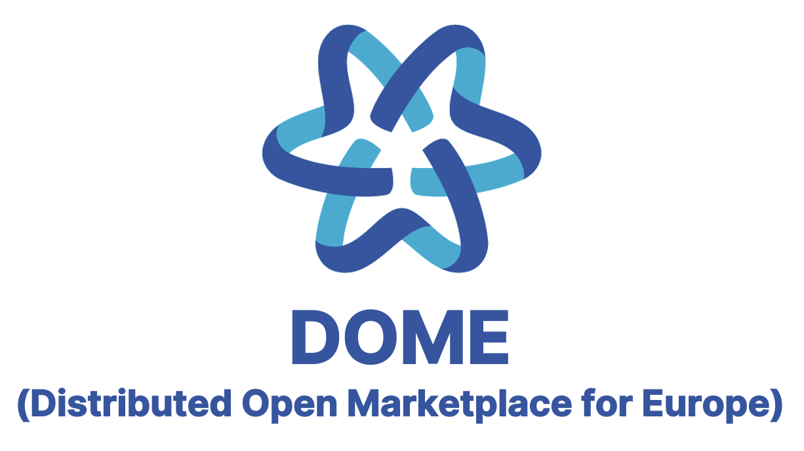

D3.7 DOME Reference Architecture and Specifications V3

**Project full title**: A Distributed Open Marketplace for Europe Cloud and Edge Services

**Contract No.**: 101084071

**Strategic Objective**: DIGITAL-2021-CLOUD-AI-01-DS-MARKETPLACE-CLOUD

**Project Document Number**: DOME-D3.7

**Project Document Date**: 21/11/2025

**Deliverable Type and Security**: R - PU

**Main editor**: ALTIA CONSULTORES, SA

**Log Table**

| **Version** | **Date** | **Change** | **Author/partner** |
|----|----|----|----|
| v1.0.0 | 21/11/2025 |  | Oriol Canadés Díez |
| v1.0.0 | 30/12/2025 | Final Review | Nicolae Goga, Mihai Butolo, Robert Florescu / BEIA |
| v1.0.1 | 17/01/2026 | Markdown version | Jesus Ruiz |

# 1 Introduction

## 1.1 Executive Summary

Cloud computing is identified as a central piece of Europe’s digital future, giving European businesses and public organisations the data processing technology required to support their digital transformation.

The European Commission thereby stepped up its efforts to support cloud uptake in Europe as part of its strategy, notably with the pledge to facilitate *the set-up of a cloud services marketplace for EU users from the private and public sector*.

DOME materialises the envisioned online marketplace, providing the means for accessing trusted services, notably cloud and edge services, building blocks deployed under the Common Services Platform and more generally any software and data processing services developed under EU programmes such as the Digital Europe Programme, Horizon 2020 or Horizon Europe.

Relying on open standards, DOME provides the finishing touch to the technical building that the Digital Europe Program is creating for boosting the development and adoption of trusted Cloud and Edge services in Europe. It provides the single point for enabling customers and service providers to meet each other in a trustful manner. DOME takes the form of a federated collection of marketplaces connected to a shared digital catalogue of cloud and edge services.

Each of the federated marketplaces are independent or connected to the offering of a given cloud provider which, in turn, can be classified as cloud IaaS providers or cloud platform providers (each of which provides a platform targeted to solve the integration of vertical data/application services from a given vertical domain, like smart cities or smart farming, or the integration of certain type of data/application services, e.g., AI services).

DOME relies on the adoption of common open standards for the description of cloud and edge services and service offerings as well as their access through a shared catalogue.

This document describes the Reference Architecture and Detailed Technical Specifications of the DOME components.

## 1.2 Intended audience

DOME partners involved in technical activities and any party willing to connect or federate services with the DOME ecosystem.

## 1.3 Structure of the document

This document is divided into 5 sections, plus 3 appendixes:

[Section 1: Introduction](#1-introduction) - provides a summary of this document

[Section 2: DOME General Overview](02_dome_general_overview.md) - describes the overall structure of the project, including different roles of users, the overall technical approach and the user journeys.

[Section 3: DOME Trust and IAM Framework](03_trust_and_iam_framework.md) - provides a description of the decentralised Trust and Identity and Access Management (IAM) framework which are implemented in DOME.

[Section 4: DOME Marketplace Persistence Layer](04_persistence_layer.md) - provides a description of the DOME Persistence Layer, focusing on the specific goals and priorities associated with its implementation, including the Shared Catalog and the Transactions Layer.

[Section 5: DOME marketplace features](05_features.md) - provides a description of the DOME marketplace, including the design of the processes involved in a federated procurement scenario and high-level architecture of the various subsystems delivering such features.

[Section 6: Appendix I: example of onboarding of organisations in DOME](06_appendix_i.md) - provides examples with detailed technical descriptions of some user journeys in DOME..

[Section 7: Appendix II: JAdES signatures of Verifiable Credentials](07_appendix_ii.md) - provides a description of the approach to digital signatures of Verifiable Credentials in DOME, to achieve high legal certainty and alignment with the EU eIDAS (and upcoming eIDAS2) regulatory framework..

[Section 8: Appendix III: remote Digital Signature Service (rDSS)](08_appendix_iii.md) - provides a description of the approach to remote/cloud digital signatures, enabling the use of advanced and qualified signatures for Verifiable Credentials and other types of documents, increasing legal certainty and making Verifiable Credentials equivalent to handwritten signed documents.

## 1.4 Related documents and resources

Following is a list of valuable links to relevant documents and resources:

- [DOME Technical Overview presentation](https://docs.google.com/presentation/d/17vEx9bIUeVIUTqsiFyVqySC81gHoFs1K/edit?usp=sharing&ouid=107618755245949253912&rtpof=true&sd=true)

- [TM Forum APIs (summary by FIWARE Foundation)](https://docs.google.com/document/d/1ePSb3OammKcsnMgHNgp5ZdH7pif4oT5gUtsBNUR1ikc/edit?usp=sharing)

- [EU Digital Identity Wallet Architecture and Reference Framework](https://digital-strategy.ec.europa.eu/en/library/european-digital-identity-wallet-architecture-and-reference-framework)

- [DSBA Technology Convergence: Discussion Document](https://data-spaces-business-alliance.eu/dsba-releases-technical-convergence-discussion-document/)

- [Digital Signature Service - DSS](https://ec.europa.eu/digital-building-blocks/wikis/display/DIGITAL/Digital+Signature+Service+-++DSS)

- [DID ETSI Legal person Semantic Identifier Method Specification (did:elsi)](https://alastria.github.io/did-method-elsi/)

